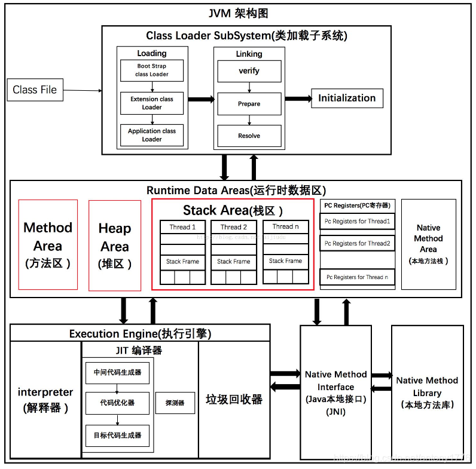

# JVM概述

## JVM组成

+ 类加载器
+ 运行时数据区域（JVM管理的内存）
+ 执行引擎
+ 本地接口

## 类的生命周期

+ 加载
+ 连接
  + 验证
  + 准备
  + 解析
+ 初始化
+ 使用
+ 卸载

# 类加载器

# 运行时数据区域

## 程序计数器（线程私有）

程序计数器是当前线程所执行字节码的行号指示器，其中存放的内容是字节码指令的地址。

**作用：**

+ 字节码解释器通过改变程序计数器来依次读取指令，从而实现代码的流程控制，如：顺序执行、选择、循环、异常处理。

+ 在多线程的情况下，程序计数器用于记录当前线程执行的位置，从而当线程被切换回来的时候能够知道该线程上次运行到哪儿了。

**程序计数器为什么不会出现内存溢出？**

程序计数器只用来存储下一条需要执行的**指令存放的地址**，并且它的大小是在线程创建时一次性完成的，不会动态扩展。

## 虚拟机栈（线程私有）

每当一个方法被调用时，JVM就会在虚拟机栈中创建一个栈帧（Stack Frame），用于存储与方法相关性信息

**栈帧的组成：**

+ 局部变量表：
  + 存放的内容：this引用（仅实例方法有），方法接收的参数，局部变量。
  + 局部变量表中的slot（槽）是**可以复用**的，一旦某个局部变量不再生效，当前槽就可以被再次使用。
  + 可以存放的数据类型：8种基本数据类型，引用类型（reference，指向对象起始地址，或者指向代表对象的句柄），returnAddress类型的变量
  + 32位之内的类型占用一个slot，64位（long和double）的类型占用两个slot
+ 操作数栈
+ 动态链接
+ 方法返回地址

## 本地方法栈（线程私有）

## 堆

### used&total&max

如果不设置任何虚拟机参数，total默认是虚拟机内存的1/64，max默认是1/4。在实际应用中需要根据需要对两个值进行设置。

在服务端程序开发时，**建议将-Xms和-Xms设置为相同值**，这样可以有效减少申请并分配内存所造成的开销，也不会出现内存过剩后堆收缩的情况。

设置的单位默认为字节（必须为1024的倍数），还可以为k或者K，m或者M，g或者G

-Xmx：max最大值。必须大于2MB

-Xms：初始的total值。必须大于1MB

## 方法区

方法区是一个虚拟概念，**每款Java虚拟机在实现上都各不相同，甚至同一款虚拟机的不同版本之间也存在不同的实现方式**。

例如：HotSpot虚拟机在JDK7中，将方法区存放于永久代空间中，而在JDK8中将方法区存放于元空间中

**方法区在不同版本JDK下的区别：**

+ JDK6：方法区存放在堆的永久代中，字符串常量池存在于方法区中
+ JDK7：方法区存放在堆的永久代中，字符串常量池在堆中但在方法区之外
+ JDK8：方法区改名为元空间，存放在直接内存中，字符串常量池在堆中

**为什么要将永久代替换为元空间？**

+ 永久代在堆中，其本身大小受堆大小的制约；元空间使用的是本地内存，受本机可用内存大小的制约。在元空间中溢出的几率比原来小
+ 在JDK8中，HotSpot虚拟机和JRockit虚拟机进行了合并，在JRockit中不存在永久代的概念

堆的大小由虚拟机参数” -XX：MaxPermSize=值“ 来控制

元空间的大小由操作系统” -XX：MaxMetaspaceSize=值“ 来控制

**注意：**

+ 既然元空间的大小是由操作系统来控制的，为什么还要给它设置最大值呢？
+ 在实际应用场景中，服务器上可能有好多个程序同时运行，如果不为程序设置一个元空间大小上限，在出现问题时可能会占用过多内存，从而影响别的程序的运行

### 类信息

### 运行时常量池

### 字符串常量池

字符串常量池：JVM 为了提升性能和减少内存消耗针对字符串（String 类）专门开辟的一块区域，主要目的是为了避免字符串的重复创建。

# 执行引擎

# 本地接口

# 直接内存（不是Java运行时内存区域）

直接内存不由JVM直接管理，它通过在Java代码中调用特定的API从操作系统分配的内存，它的分配和回收不受JVM垃圾回收器的直接控制。

通过“  -XX：MaxDirectMemorySize=值  ” 手动设置直接内存的大小。如果不设置，JVM会自动选择最大分配的大小。

# Java垃圾回收机制

**内存泄漏：**程序中已得到分配的内存得不到有效释放

**内存溢出：**程序运行过程中，尝试分配的内存超过了系统可用的最大内存

Java中为了简化对象的释放，引入了自动的垃圾回收（Garbage Collection）机制，通过垃圾回收器来对不再使用的对象完成自动的回收。

**不同垃圾回收方案的优缺点：**

+ **自动垃圾回收**
  + 优点：降低程序员实现难度，降低对象回收bug的可能性
  + 缺点：程序员无法控制垃圾回收的时机
+ **手动垃圾回收**
  + 优点：回收及时性高
  + 缺点：编写不当容易出现悬空指针、重复释放、内存泄漏等问题

**为什么垃圾回收机制只考虑堆和方法区？**

+ 线程私有的部分会随着线程的创建而创建，线程的销毁而销毁。
+ 栈帧会在方法执行结束后自动弹出栈

## 方法区的回收

方法区的垃圾回收主要关注于卸载类及回收常量池中的常量。

**判定条件：**

+ （自己没有用）在堆中不存在任何该类的实例对象以及子类对象
+ （别人没有用）该类对应的java.lang.Class对象没有在任何地方被引用
+ （不会再加载）加载该类的类加载器已经被回收

## 堆的回收

**如何判断堆上的对象是否可以被回收?**

+ 引用计数法：为每个对象维护一个引用计数器，对象被引用时+1，取消引用时-1
  + 优点：实现简单
  + 缺点：每次引用和取消引用都要维护计数器，影响系统性能；循环引用（A引用B，B引用A）时无法回收对象
+ 可达性分析法：