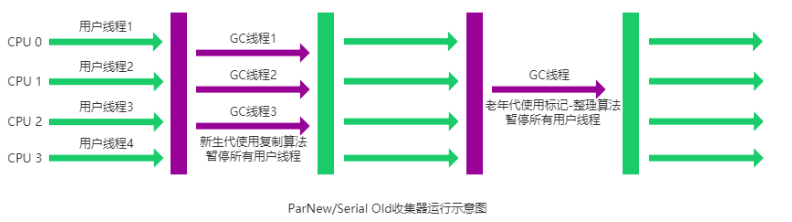

# JVM概述

**JVM组成**

+ 类加载子系统
+ 运行时数据区域（JVM管理的内存）
+ 执行引擎
+ 本地接口


## 类加载子系统

**类的生命周期**


**加载阶段：**

+ 获取类的二进制字节流。
+ 将字节流所代表的静态存储结构转换为方法区的运行时数据结构（InstanceKlass对象）。
+ 在堆区生成一个代表该类的Class对象，作为方法区这些数据的访问入口。（从JDK8开始，静态数据会放在堆区里。JDK8之前的版本是放在方法区中的。）


**验证阶段：**

验证是连接阶段的第一步，这一阶段的目的是**确保 Class 文件的字节流中包含的信息符合《Java 虚拟机规范》的全部约束要求**，保证这些信息被当作代码运行后不会危害虚拟机自身的安全。

验证阶段包括：文件格式验证，元数据验证，字节码验证，符号引用验证

不过，验证阶段也不是必须要执行的阶段，可以手动关闭大部分的验证措施，使用 -Xverify:none


**准备阶段：**为类变量分配内存并设置类变量初始值

准确地说是为静态变量赋默认值，但是如果静态变量是常量的话，会直接给它进行赋值。

比如说public static int value会被赋初值0，但是public static final int value = 111会被赋初值111。


**解析阶段：**将常量池内的符号引用替换为直接引用的过程

直接引用不再使用编号，而是使用内存中的地址进行具体的数据访问


**初始化阶段**： 

初始化阶段是执行初始化方法 <clinit> ()方法的过程，是类加载的最后一步，这一步 JVM 才开始真正执行类中定义的 Java 程序代码(字节码)。


触发类初始化的时机：

+ 访问一个类的静态变量或者静态方法。注意final修饰的并且等号右边是常量的不会触发初始化，只有在赋值的内容需要执行指令才能得到结果时才会触发初始化
+ 调用Class.forName()。不一定会触发，有一个initial的参数，如果指定为false就不会触发
+ 实例化对象。
+ 执行Main方法的当前类
+ 初始化子类时，如果父类没初始化，会先触发父类的初始化。但是访问父类的静态变量时，只初始化父类


**卸载阶段：**

卸载类需要满足 3 个要求:

1. 该类的所有的实例对象都已被 GC，也就是说堆不存在该类的实例对象。
2. 该类没有在其他任何地方被引用
3. 该类的类加载器的实例已被 GC

在 JVM 生命周期内，由 jvm 自带的类加载器加载的类是不会被卸载的。但是由我们自定义的类加载器加载的类是可能被卸载的。

------------------

## 运行时数据区域

+ 程序计数器（线程私有）
+ 虚拟机栈（线程私有）
+ 本地方法栈（线程私有）
+ 堆（线程公有）
+ 方法区（线程公有）


<font size=5>**程序计数器（线程私有）**</font>

程序计数器是当前线程所执行字节码的行号指示器，其中存放的内容是字节码指令的地址。


**作用：**

+ 字节码解释器通过改变程序计数器来依次读取指令，从而**实现代码的流程控制**，如：顺序执行、选择、循环、异常处理。

+ 在多线程的情况下，程序计数器用于记录当前线程执行的位置，从而当线程被切换回来的时候能够知道该线程上次运行到哪儿了。【执行中断的时候可以保存位置】


**程序计数器为什么不会出现内存溢出？**

程序计数器只用来存储下一条需要执行的**指令存放的地址**，并且它的大小是在线程创建时一次性完成的，不会动态扩展。

------------------

<font size=5>**虚拟机栈（线程私有）**</font>

每当一个方法被调用时，JVM就会在虚拟机栈中创建一个栈帧（Stack Frame），用于存储与方法相关性信息


**栈帧的组成：**

+ 局部变量表：
  + 存放的内容：this引用（仅实例方法有），方法接收的参数，局部变量。
  + 局部变量表中的slot（槽）是**可以复用**的，一旦某个局部变量不再生效，当前槽就可以被再次使用。
  + 可以存放的数据类型：8种基本数据类型，引用类型（reference，指向对象起始地址，或者指向代表对象的句柄），returnAddress类型的变量
  + 32位之内的类型占用一个slot，64位（long和double）的类型占用两个slot
+ 操作数栈：用于存放方法执行过程中产生的中间计算结果。
+ 动态链接：将程序代码中引用的符号（例如函数、变量等）与其在内存中的实际地址进行关联的过程
+ 方法返回地址

----------------

<font size=5>**本地方法栈（线程私有）**</font>

和虚拟机栈所发挥的作用非常相似，虚拟机栈为虚拟机执行 Java 方法 （也就是字节码）服务，而**本地方法栈则为虚拟机使用到的 Native 方法服务**。在 HotSpot 虚拟机中和 Java 虚拟机栈合二为一。

--------------------

<font size=5>**堆（线程共享）**</font>

此内存区域的唯一目的就是存放对象实例，几乎所有的对象实例以及数组都在这里分配内存。【之所以说是几乎所有，是因为从JDK1.7开始，Java会默认开启逃逸分析，如果某些方法中的对象引用没有被返回或者未被外面使用，可能会直接在栈上分配内存】


JDK7之前的堆结构：

+ 新生代（Young Generation）
+ 老年代（Old Generation）
+ 永久代（Permanent Generation）


JDK8之后的堆结构：【回收器是Parallel Scavenge，Parallel Old】

+ 新生代（Young Generation）
+ 老年代（Old Generation）

永久代被元空间（Metaspace）取代，并且被移入本地内存中


JDK9之后的堆结构：【回收器是g1】

+ garbage-first heap


------------------

<font size=5>**方法区（线程共享）**</font>

方法区是一个虚拟概念，**每款Java虚拟机在实现上都各不相同，甚至同一款虚拟机的不同版本之间也存在不同的实现方式**。当虚拟机需要使用一个类的时候，会读取并解析Class文件以获取相关信息，然后将信息存入方法区。【也就是说类的信息会进入方法区，类的实例存储在堆区，不管是自己创建的类还是外部类库中的类都是这样】

例如：HotSpot虚拟机在JDK7中，将方法区存放于永久代空间中，而在JDK8中将方法区存放于元空间中


**方法区在不同版本JDK下的区别：**

+ JDK6：方法区存放在堆的永久代中，字符串常量池存在于方法区中
+ JDK7：方法区存放在堆的永久代中，字符串常量池在堆中但在方法区之外
+ JDK8：方法区改名为元空间，存放在直接内存中，字符串常量池在堆中


**为什么要将永久代替换为元空间？**

+ 永久代在堆中，其本身大小受堆大小的制约；元空间使用的是本地内存，受本机可用内存大小的制约。在元空间中溢出的几率比原来小
+ 永久代的垃圾回收机制一般使用老年代的垃圾回收方式，不够灵活。元空间设计了一套适合方法区的垃圾回收机制。
+ 在JDK8中，HotSpot虚拟机和JRockit虚拟机进行了合并，在JRockit中不存在永久代的概念


堆的大小由虚拟机参数” -XX：MaxPermSize=值“ 来控制

元空间的大小由操作系统” -XX：MaxMetaspaceSize=值“ 来控制

**注意：**

+ 既然元空间的大小是由操作系统来控制的，为什么还要给它设置最大值呢？
+ 在实际应用场景中，服务器上可能有好多个程序同时运行，如果不为程序设置一个元空间大小上限，在出现问题时可能会占用过多内存，从而影响别的程序的运行


**运行时常量池**

Class 文件中除了有类的版本、字段、方法、接口等描述信息外，还有用于存放编译期生成的各种字面量（Literal）和符号引用（Symbolic Reference）的 **常量池表(Constant Pool Table)** 。


**字符串常量池**

JVM 为了提升性能和减少内存消耗针对字符串（String 类）专门开辟的一块区域，主要目的是为了避免字符串的重复创建。

需要特别注意的是，JDK1.7之前，方法区是用永久代实现的，此时字符串常量池存在于永久代中。JDK1.7时，字符串常量池和静态变量被移出永久代，存放在堆里。JDK1.8开始，永久代也被彻底取消，方法区通过直接内存中的元空间实现。


**为什么要把字符串常量池移入堆中？**

+ **垃圾回收优化**：字符串常量池的回收逻辑和对象的回收逻辑类似，和方法区的回收逻辑区别比较大。将字符串常量池移到堆中可以使用堆的垃圾回收器对其进行管理

+ **让方法区大小更可控**：一般项目中会给方法区设置一个比较小的上限，字符串常量池在方法区中的话可能会导致方法区空间大小不可控

+ **intern方法的优化**：JDK6中，intern()方法会把第一次遇到的字符串实例复制到永久代的字符串常量池中。JDK7之后将字符串常量池从方法区中分离出来直接保存在堆上，就不用进行复制的操作了，只需要在字符串常量池中保存这个字符串对象的地址就可以。

  

## 执行引擎


## 本地接口


## 直接内存（不是Java运行时内存区域）

直接内存不由JVM直接管理，它通过在Java代码中调用特定的API从操作系统分配的内存，它的分配和回收不受JVM垃圾回收器的直接控制。

通过“  -XX：MaxDirectMemorySize=值  ” 手动设置直接内存的大小。如果不设置，JVM会自动选择最大分配的大小。


# 类文件结构


+ 魔数：每个 Class 文件的头 4 个字节称为魔数（Magic Number）,它的值是“CAFE BABE”（咖啡宝贝！）。它的唯一作用是**确定这个文件是否为一个能被虚拟机接收的 Class 文件**
+ class文件版本号：包括次版本号和主版本号
+ 常量池数量和常量池：
  + 常量池的数量是 `constant_pool_count-1`（常量池计数器是从 1 开始计数的，将第 0 项常量空出来是有特殊考虑的，索引值为 0 代表“不引用任何一个常量池项”）。
  + 常量池主要存放两大常量：字面量和符号引用。包括类和接口的全限定名，字段的名称和描述符，方法的名称和描述符 
+ 访问标志：用于识别类或者接口的访问信息，比如说这个Class是类还是接口，是否为pubilc或者abstract类型，是否为final等等。
+ 本类索引和父类索引：类索引用于确定这个Class的全限定名，父类索引用于确定这个类的父类的全限定名
+ 接口数量和接口索引：该Class实现了的接口的数量和名称
+ 字段数量和字段表：该Class声明的变量数量和名称，包括静态变量和实例变量，但是不包括方法体中的局部变量
+ 方法数量和方法表：该Class声明的方法数量和名称
+ 属性数量和属性表：字段表，方法表中都可以携带自己的属性表集合，以用于描述某些场景专有的信息。任何人实现的编译器都可以向属性表中写 入自己定义的属性信息，Java 虚拟机运行时会忽略掉它不认识的属性。


# 类加载器

类加载器的主要作用就是加载 Java 类的字节码（ `.class` 文件）到 JVM 中（在内存中生成一个代表该类的 `Class` 对象。

ClassLoader是一个抽象类，给定类的二进制名称，类加载器会尝试定位或生成构成类定义的数据。典型的策略是将名称转换为文件名，然后从文件系统中读取该名称的“类文件”。

每个 Java 类都有一个引用指向加载它的类加载器。不过，数组类不是通过 类加载器创建的，而是 JVM 在需要的时候自动创建的，数组类通过`getClassLoader()`方法获取 类加载器的时候和该数组的元素类型的类加载器是一致的。


JVM 启动的时候，并不会一次性加载所有的类，而是根据需要去动态加载。类加载器的内部有一个Vector<Class<?>> classes容器，用于存放该类加载器加载过的类。


**重要的类加载器:**

1. 启动类加载器（BootstrapClassLoader），由C++实现，所以其父加载器是null。
2. 扩展类加载器（ExtensionClassLoader），其父加载器是启动类加载器。JDK9后引入了模块化的思想，将其更名为平台类加载器
3. 应用程序类加载器（AppClassLoader），也叫系统类加载器，是面向用户的加载器，负责加载当前应用classpath下所有jar包和类。其父加载器是扩展类加载器。

值得特别注意的是，类加载器之间的父子关系不是以继承关系来实现的，而是以组合的方式来实现的


**双亲委派机制：**

ClassLoader类使用委托模型来搜索类和资源。每个ClassLoader实例都有一个相关的父类加载器。需要查找类或资源时，ClassLoader实例会在试图亲自查找类或资源之前，将搜索类或资源的任务委托给其父类加载器。

总结起来就是一句话：自底向上查找判断类是否被加载，自顶向下尝试加载类。


```java
protected Class<?> loadClass(String name, boolean resolve)
        throws ClassNotFoundException
    {
        synchronized (getClassLoadingLock(name)) {
            // First, check if the class has already been loaded
            Class<?> c = findLoadedClass(name);
            if (c == null) {
                long t0 = System.nanoTime();
                try {
                    if (parent != null) {
                        c = parent.loadClass(name, false);
                    } else {
                        c = findBootstrapClassOrNull(name);
                    }
                } catch (ClassNotFoundException e) {
                    // ClassNotFoundException thrown if class not found
                    // from the non-null parent class loader
                }

                if (c == null) {
                    // If still not found, then invoke findClass in order
                    // to find the class.
                    long t1 = System.nanoTime();
                    c = findClass(name);

                    // this is the defining class loader; record the stats
                    sun.misc.PerfCounter.getParentDelegationTime().addTime(t1 - t0);
                    sun.misc.PerfCounter.getFindClassTime().addElapsedTimeFrom(t1);
                    sun.misc.PerfCounter.getFindClasses().increment();
                }
            }
            if (resolve) {
                resolveClass(c);
            }
            return c;
        }
    }
```


**双亲委派机制的好处：**

+ 避免类的重复加载：当加载器想要加载一个类时，会先去确认上级加载器是否加载过该类，从而避免已被加载过的类被再次加载
+ 保护核心类库：防止恶意代码通过自定义类加载器替换核心类库中的类。Java虚拟机会预先加载核心类库，由于启动类加载器是由本地代码编写的，难以被篡改，所以加载核心类库的过程可以被视为是安全的。当自定义类加载器想要篡改核心类库的内容时，会发现启动类加载器已经加载过了【实际上也就是避免了类的重复加载】


**打破双亲委派机制的方法：**

+ 直接改写loadClass方法：更改类加载的流程，从而实现对双亲委派机制的打破
+ 使用线程上下文类加载器（ThreadContextClassLoader）：将类加载器保存在线程私有的数据里，在需要的时候取出来使用（借助Java.lang.Thread中的getContextClassLoader()和setContextClassLoader来获取和设置线程的上下文类加载器，如果没有设置的话，线程会继承其父线程的上下文类加载器）


**自定义类加载器：**

当前有一个.class文件在启动类加载器，扩展类加载器，以及应用程序类加载器都扫描不到的路径上，就可以手动实现一个自定义类加载器把它加载进来。

要点在于这个类加载器需要继承ClassLoader抽象类，然后重写findClass方法（不打破双亲委派机制的情况下），在方法里主要是将文件转化成字节数组，然后调用defineClass方法传入类的名称，字节数组，及要读取的长度。在使用这个类加载器的时候调用loadClass方法即可实现类的加载。


# Java垃圾回收机制

**内存泄漏：**程序中已得到分配的内存得不到有效释放

**内存溢出：**程序运行过程中，尝试分配的内存超过了系统可用的最大内存

Java中为了简化对象的释放，引入了自动的垃圾回收（Garbage Collection）机制，通过垃圾回收器来对不再使用的对象完成自动的回收。


**不同垃圾回收方案的优缺点：**

+ **自动垃圾回收**
  + 优点：降低程序员实现难度，降低对象回收bug的可能性
  + 缺点：程序员无法控制垃圾回收的时机
+ **手动垃圾回收**
  + 优点：回收及时性高
  + 缺点：编写不当容易出现悬空指针、重复释放、内存泄漏等问题


**为什么垃圾回收机制只考虑堆和方法区？**

+ 线程私有的部分会随着线程的创建而创建，线程的销毁而销毁。
+ 栈帧会在方法执行结束后自动弹出栈


## 方法区的回收

方法区的垃圾回收主要关注于卸载类及回收常量池中的常量。

**判定条件：**

+ <font color="red">（自己没有用）</font>在堆中不存在任何该类的实例对象以及子类对象
+ <font color="red">（别人没有用）</font>该类对应的java.lang.Class对象没有在任何地方被引用
+ <font color="red">（不会再加载）</font>加载该类的类加载器已经被回收


## 堆的回收

**死亡对象判断方法**

+ 引用计数法：为每个对象维护一个引用计数器，对象被引用时+1，取消引用时-1
  + 优点：实现简单
  + 缺点：每次引用和取消引用都要维护计数器，影响系统性能；**循环引用**（A引用B，B引用A）时无法回收对象
+ 可达性分析算法：以GC Root对象为根进行搜索，如果一个对象和GC Root之间没有任何引用链相连，就证明该对象不可用，需要被回收


**哪些对象可以被称作GC Root对象？**【不完整】

+ 线程Thread对象。Thread对象中保存了对线程虚拟机栈的引用，虚拟机栈中的栈帧里的局部变量表中又保存了对对象的引用。
+ 系统类加载器加载的java.lang.Class对象。它们可以以静态字段的方式持有对其他对象的引用。
+ 本地接口（JNI，java native interface）调用时使用的全局对象
+ 监视器对象


**五种对象引用方法**

**强引用：**

 Java 中最普通、最常见的引用类型之一。当一个对象被强引用引用时，垃圾回收器不会回收这个对象，即使系统内存不足时也不会回收。只有当所有对该对象的强引用都被解除时，该对象才会成为不可达对象，才会被垃圾回收器回收。


**软引用：SoftReference**

用于在内存紧张时允许垃圾回收器回收对象，通常用于实现对内存敏感的缓存。如果软引用的对象是强可达（被强引用）的，该软引用对象也不会被回收

可以和ReferenceQueue搭配使用。当软引用指向的对象被回收时，SoftReference对象会被放入队列，方便对其进行后续的操作（比如说回收SoftReference对象）

自己的理解：如果堆中存在一个对象，当它被强引用引用时，若内存不足且该引用没有被释放，jvm会报OutOfMemoryError。但是如果这个对象是被软引用引用的，当内存不足时，jvm会释放这个对象，可能就不会报错了。

```Java
//创建一个软引用。referent是软引用指向的对象
public SoftReference(T referent)

//创建一个软引用，并且将其注册到指定的引用队列中
public SoftReference(T referent, ReferenceQueue<? super T> q)
    
//返回该引用所引用的对象，如果对象被回收了就返回null
public T get()
```


**弱引用：WeakReference**

只要对象没有被强引用引用，即使堆内存充足，垃圾回收器也会回收被弱引用引用的对象。

当垃圾回收器进行垃圾回收时，如果**内存不足**才会回收软引用对象。但**无论内存是否足够**，都会回收弱引用引用的对象。

主要在ThreadLocal中使用，平时开发不怎么用。其实现和软引用基本一致。


**虚引用：PhantomReference**

当一个对象只被虚引用所引用时，它随时都可能被垃圾回收器回收，不会影响对象的生存时间。主要用于**跟踪对象被垃圾回收的情况**

通过虚引用对象是无法获得虚引用指向的对象的（它的get方法返回值是个null），它唯一的作用就是当对象被垃圾回收器回收时可以接收到相应的通知


**终结器引用：FinalReference**

终结器引用主要用于管理对象的终结器（Finalizer），确保对象在被垃圾回收器**回收之前能够执行终结器方法**进行资源清理。通常不由用户代码直接创建或使用。

-----------------

**垃圾回收器算法**

+ **标记-清除算法**：标记存活对象，将没有标记的对象直接清除
  + 优点：简单容易实现
  + 缺点：会产生内存碎片
+ **复制算法**：将内存区域划分成活动区和空闲区，垃圾回收时将存活对象全部移入空闲区。
  + 优点：简单容易实现，不会有内存碎片
  + 缺点：浪费内存，不适合大对象
+ **标记-整理算法**：标记所有存活对象，将存活对象全部移动到一端
  + 优点：解决内存碎片问题
  + 缺点：移动对象开销大，在标记和整理阶段会有较长的STW（stop the world）
+ **分代GC算法**：将堆内存划分为新生代和老年代两个区域。新生代用于存放新创建的对象，而老年代用于存放存活时间较长的对象。
  + 优点：根据不同区域的特点采用不同的垃圾回收策略，这样可以更有效地回收垃圾对象，提高了垃圾回收的效率
  + 缺点： 分代垃圾回收算法会为每个区域分配额外的空间来完成垃圾回收操作，这样可能会导致一定程度的内存浪费。

-------------------

<font size=5>**垃圾回收器：**</font>

**JDK默认垃圾回收器**：

+ JDK8： Parallel Scavenge，Parallel Old
+ JDK9 ~ JDK21: G1


**Serial垃圾回收器：**

用于年轻代，使用的是复制算法

在进行垃圾回收时，只会使用一个线程，并且会暂停所有工作线程（Stop The World）。

特点：简单而高效。由于是单线程，无需考虑线程并发的问题。单CPU下性能较好，多CPU下堆如果偏大会让用户线程长时间等待。适用于对吞吐量要求不高、堆空间较小的简单应用。


**ParNew垃圾回收器：**

用于年轻代，使用的是复制算法

是 Serial 垃圾回收器的多线程版本，主要用于并行收集新生代的垃圾对象。在JDK8及之前的版本中，和CMS搭配使用

特点：多CPU下停顿时间较短，吞吐量和停顿时间不如G1，JDK9之后不建议使用




**Parallel Scavenge垃圾回收器：**

用于年轻代，使用的是复制算法

允许手动设置最大暂停时间和吞吐量，但是Oracle官方建议不要设置堆内存最大值，因为垃圾回收器会自动调整内存大小

特点：吞吐量高，手动可控。但是不能保证单次停顿时间。比较适合于不需要和用户进行交互的后台任务和容易产生大量的对象


-----------------

**Serial Old垃圾回收器：**

用于老年代，使用的是标记整理算法

Serial的老年代版本。单线程收集器，也会Stop The World，所以同样更适用于小型应用和只有单个处理器的环境。通常和Serial垃圾回收器搭配使用，或者在CMS特殊情况下使用

特点：单CPU条件下性能不错，多CPU下吞吐量不佳


**CMS垃圾回收器**

Concurrent Mark Sweep（并发标记清除）

用于老年代，使用的是标记清除算法

只在初始阶段和重新标记阶段暂停用户线程，比较耗时的标记阶段和用户线程并发执行

+ **初始标记：** 暂停所有的其他线程，并记录下直接与 GC root 相连的对象，速度很快 ；

+ **并发标记：** 同时开启 GC 和用户线程，用一个闭包结构去记录可达对象。但在这个阶段结束，这个闭包结构并不能保证包含当前所有的可达对象。因为用户线程可能会不断的更新引用域，所以 GC 线程无法保证可达性分析的实时性。所以这个算法里会跟踪记录这些发生引用更新的地方。

+ **重新标记：** 重新标记阶段就是为了修正并发标记期间因为用户程序继续运行而导致标记产生变动的那一部分对象的标记记录，这个阶段的停顿时间一般会比初始标记阶段的时间稍长，远远比并发标记阶段时间短

+ **并发清除：** 开启用户线程，同时 GC 线程开始对未标记的区域做清扫。

  

特点：停顿时间较短，吞吐量不错。但是会存在内存碎片【因为是标记清除算法】和浮动垃圾【并发清理过程当中产生的垃圾需要等下一次清理才能清除】。如果浮动垃圾太多，老年代空间不足以分配对象，CMS就会退化成Serial Old单线程回收老年代


**Parallel Old垃圾回收器：**

用于老年代，使用的是标记整理算法

Parallel Scavenge的老年代版本。

特点：并发收集，多CPU下效率比较高，但是暂停时间会比较长


**G1垃圾回收器（JDK8之前还不够成熟）**

**区域划分**：G1垃圾回收器不再显式地区分YoungGen和OldGen，而是将堆划分成多个大小相等的region（区域大小可以手动设置，但必须是2的整数次幂，取值范围为1M~32M），区域大小通常由堆空间大小/2048获得。但是仍然保留了Eden，Survivor等概念。【逻辑上分代，物理上不分代，region会扮演eden，survivor，old，humongous空间的角色，收集器对不同角色的region采用不同的处理策略】


**回收方式**：

+ 年轻代回收（Young GC）：
  + **触发时机**：新创建的对象会被分配到region并被标记为Eden，当JVM无法将新对象分配到Eden区的时候会触发Young GC。
  
    注意，新创建对象的大小超过1.5个region时会直接放入老年代，被称作**Humongous区**。
  
  + 【步骤一：初始标记】G1标记所有与GC roots直接连接的对象，形成一个初始标记集合，此时用户线程会出现短暂的停顿。
  
  + 【步骤二：选择region】G1根据配置的最大暂停时间**选择某些区域**
  
    选择策略：G1会记录回收一个区域的平均耗时，然后根据配置的最大暂停时间计算本次回收的区域数量。也就是**不对整个堆进行回收**，而是选择部分region进行回收
  
  + 【步骤三：并发标记】此时允许用户线程运行，同时G1会并发地标记出所有可达的对象
  
  + 【步骤四：最终标记】对用户线程作短暂的暂停，用于处理步骤三中遗留的记录
  
  + 【步骤五：清理阶段】清理垃圾对象，并且将Eden或Survivor中存活的对象复制到新的Survivor区中，根据其年龄确定将其赋值为Survivor区还是Old区
+ 混合回收（Mixed GC）：
  
  + 总堆占有率到达阈值（可设置，默认为45%）时触发MixedGC，回收**所有年轻代对象**和部分**老年代对象**以及**大对象**。对老年代的回收会选择存活度最低的区域来进行回收。回收流程和YoungGC差不多，只不过回收的对象增加了老年代对象和大对象。
+ Full GC
  
  + 当清理过程中发现没有足够的空Region存放转移的对象，会出现Full GC，单线程执行标记整理算法（Serial Old），此时会导致用户线程的暂停


**ZGC垃圾回收器：**

HotSpot虚拟机的一部分，是一种可扩展低延迟垃圾回收器，其设计目标是尽可能降低垃圾回收带来的停顿时间，它的STW时间不会超过一毫秒，特别适合低延迟的应用，支持几百兆到16TB的堆大小，堆大小堆延迟时间几乎没有影响


# 面试题

## 什么是JVM？

+ JVM的定义

+ JVM的组成：类加载子系统，运行时数据区，执行引擎，本地接口

+ JVM的作用：解释和运行，内存管理，即时编译

  

## 了解过字节码文件的组成吗？

+ 字节码文件是什么
+ 组成：魔数，小版本号，大版本号，【常量池数量，常量池】，访问标记，当前类类名，父类类名，【接口数量，接口】，【字段数量，字段】，【方法数量，方法】，【属性数量，属性】
+ 结尾：工作中一般不查看，但是在对代码性能进行调优时可能要研究，如果要查看，就用javap -v命令查看，或者使用jclasslib插件查看


## 什么是运行时数据区？

+ 什么是运行时数据区：是JVM管理的xxxxxx
+ 运行时数据区的组成：分成线程共享的部分和线程不共享的部分
+ 运行时数据区各部分的功能


## 那些区域会出现内存溢出？

内存溢出指的是内存中某一块区域的使用量超过了允许使用的最大值，使用时因空间不足报错，虚拟机会抛出指定错误

+ 栈内存溢出：如果栈大小设置为不可动态调整，则会StackOverFlowError；如果可以动态调整，则会抛出OutOfMemoryError
+ 堆内存溢出：抛出OutOfMemoryError
+ 方法区溢出：元空间溢出或者永久代溢出，抛出OutOfMemoryError
+ 直接内存溢出：申请的直接内存空间大小超过最大值，抛出OutOfMemoryError


## JVM在JDK6-8之间在内存区域上有什么不同？

+ 方法区的调整：JDK7及之前的版本将方法区存放在堆中的永久代，JDK8及之后的版本将方法区存放在元空间
+ 字符串常量池的调整：JDK7之前，字符串常量池是运行时常量池的一部分，都存在于永久代中；JDK7字符串常量池被从方法区拿到了堆中；JDK8之后永久代被元空间替代，字符串常量池还在堆中
+ 这么调整的原因：
  + 方法区的调整：提高内存上限，优化垃圾回收策略
  + 字符串常量池的调整：优化垃圾回收策略，让方法区大小更可控，intern方法的优化，


## 类的生命周期有哪些？

+ 加载，连接（验证，准备，解析），初始化，使用，卸载
+ 每个阶段主要完成什么工作


## 什么是类加载器？

+ 类加载器的作用
+ 常见的三个类加载器及它们的作用，三个类加载器的层级结构
+ 自定义类加载器。继承ClassLoader抽象类，重写findClass方法，在findClass方法末尾需要调用一下defineClass方法


## 如何打破双亲委派机制？

+ 加载器之间的层级关系
+ 双亲委派机制的内容
+ 双亲委派机制的作用
+ 打破双亲委派机制的方法：重写loadClass方法；使用上下文类加载器保存加载器


## Tomcat的自定义类加载器了解吗？

以tomcat9为例


## 如何判断堆上的对象有没有被引用


## 有哪些垃圾回收算法

+ 标记清除，标记整理，复制，分代GC
+ 标记清除
  + 容易出现内存碎片
  + 分配速度慢：基于链表维护空闲内存区域，需要挨个查找
+ 标记整理
  + 不会出现内存碎片
  + 需要移动对象，整理效率不高
+ 复制
  + 不会出现内存碎片
  + 只能使用一半的内存空间
  + 需要进行对象的移动，比较耗时
+ 分代GC【只要进行了年轻代，老年代的划分，然后使用不同的回收算法，就是分代GC】
  + 可以调整年轻代和老年代的比例以适应不同应用程序的要求
  + 年轻代老年代使用不同垃圾回收算法，比较灵活
  + 基本上只需要minor gc，full gc次数较少，垃圾回收引起的停顿时间较短


## 有哪些常用的垃圾回收器

+ Serial+Serial Old
+ ParNew+CMS：
+ Parallel Scavenge+Parallel Old：关注系统吞吐量
+ G1


## 常见的JVM参数

+ **栈内存参数**
  + -Xss：栈内存大小。如果不设置的话系统会自动分配。
+ **堆内存参数**：根据最大并发量估计服务器的配置，再根据服务器配置计算最大堆内存。Xms和Xmx可以在一开始就设置成一样的，这样可以避免运行过程中动态扩容
  + -Xmx：最大堆内存大小
  + -Xms：初始堆内存大小
  + -Xmn：年轻代大小。尽量设置得大一点，让对象可以尽可能存放在年轻代，不要进入老年代。G1垃圾回收器不要设置在这个值，垃圾回收器会动态调整
+ **元空间内存参数**：元空间在内存空间里，是可以无限制扩容的，如果不设置上限值，元空间内存泄漏的时候会导致内存不可控，影响性能。一般会根据测试情况设置最大值，设置为256M左右。
  + -XX：MaxMetaspaceSize：最大元空间大小。
+ **日志参数**
  + JDK8之前： 
    + -XX：+PrintGCDetails  ： 启用垃圾回收详细日志，+表示启用，-表示禁用
    + -XX：+PrintGCDateStamps：打印垃圾回收时间添加时间戳信息
    + -Xloggc：指定文件路径
  + JDK9及之后：
    + -Xlog：gc*：file=文件路径
+ 堆内存快照参数
  + -XX：+HeapDumpOnOutOfMemoryError：发生OutOfMemoryError时自动生成hprof内存快照
  + -XX：HeapDumpPath= <path>：指定hprof文件的输出路径


------------

G1垃圾回收器：

+ -XX：+UseG1GC    ：打开G1的开关，JDK9之后就默认使用G1了，无需手动打开
+ -XX：G1HeapRegionSize    ：设置Region的大小
+ -XX：G1NewSizePercent   ：年轻代初始空间大小
+ -XX：G1MaxNewSizePercent    ：年轻代最大空间大小
+ -XX：MaxGCPauseMillis   ： 最大暂停时间的毫秒值


-XX：+DisableExplicitGC：禁止代码中使用System.gc()


