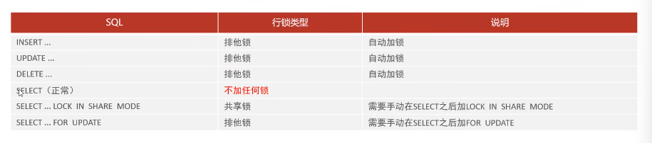

# 基础

## 启动与停止

1. msconfig。在服务里找到mySQL，选择启动/停止
2. 启动：net start mysql80      停止：net stop mysql80


连接到mysql：cmd。 mysql -u root -p


## SQL

SQL分类：


----------------------------------------

### DDL：数据定义语言

#### 操作数据库

查询所有数据库：show databases;

查询当前数据库：select database();

创建：create database [if not exists] 数据库名 [default charset  字符集] [collate 排序规则]；

删除：drop database [if exists] 数据库名；

使用：use 数据库名;


#### 操作表结构

查询当前数据库所有表：show tables;

查询表结构：desc 表名；

查询指定表的建表语句：show create table 表名；

创建：

​		create table 表名（

​					字段1 字段1类型[comment 字段1注释],

​					字段2 字段2类型[comment 字段2注释],

​					字段3 字段3类型[comment 字段3注释]

​	 	）[表注释]；

​	tip:建表的时候需要留意数据是否是定长，数据的类型，数据的长度，数据是否有符号等，根据具体要求选择数据类型。

##### 数据类型

日期类型

1. date：YYYY-MM-DD
2. time：HH：MM：SS
3. year：YYYY
4. datatime：有效时间到9999年
5. timestamp：有效时间到2038年

##### 修改

添加字段：alter table 表名 add 字段名 类型（长度）\[comment 注释\][约束];

修改数据类型: alter table 表名 modify 字段名 新数据类型（长度）;

修改字段名和字段类型：alter table 表名 change 旧字段名 新字段名 类型（长度）\[comment 注释\][约束];

删除字段： alter table 表名 drop 字段名；

修改表名：alter table 表名 rename to 新表名；

##### 删除

删除表：drop table [if exists] 表名；

删除指定表，并重新创建该表：truncate table 表名；（删除表数据，但保留表结构）

-----------------------------------------------------------------------------------------------------------------------------------------------------------------

### DML：数据操作语言

 #### 添加数据

给指定字段添加数据： insert into 表名 （字段名1，字段名2，...）values (值1，值2，...)

给全部字段添加数据：insert into 表名 values（值1，值2，...）

批量添加数据：insert into 表名（字段名1，字段名2，...）values （值1，值2，...）（值1，值2，...）;

​						   insert into 表名   values （值1，值2，...）（值1，值2，...）


+ 插入数据时，指定的字段顺序需要与值的顺序一一对应

+ 字符串和日期型数据包含在引号中

+ 插入数据应该在字段要求范围之内


#### 修改数据

修改数据：update 表名 set 字段名=值1, 字段名2=值2，...[where 条件]；

删除数据：delete from 表名 [where 条件]; 

​	delete 语句的条件可以有，也可以没有，如果没有条件，则会删除整张表的所有数据

​	delete语句不能删除某一个字段的值

--------------------

### DQL：数据查询语言

#### **基本查询**

查询多个字段：select 字段1[as 别名1]，字段2[as 别名2]，字段3[as 别名3]...from 表名；

去除重复记录查询：select distinct 字段列表 from 表名；


#### **条件查询**

select 字段列表 from 表名 where 条件列表;


#### **聚合函数**

所有的null值是不参与聚合函数运算的


select 聚合函数（字段列表） from 表名;


#### **分组查询**

```SQL
select 字段列表 from 表名 [where 条件] group by 分组字段名 [having 分组后过滤条件];
```

执行顺序：where > 聚合函数 > having

注意：分组之后，查询的字段一般为聚合函数字段和分组字段，查询其他字段无任何意义


#### **排序查询**

```SQL
select 字段列表 from 表名 order by 字段1 排序方式，字段2 排序方式;
```

排序方式：ASC（升序，默认值），DESC（降序）

如果有多个字段，只有当前面的字段相同时，才会根据第二个字段排序


#### **分页查询**

```SQL
select 字段列表 from 表名 limit 起始索引,查询记录数;
```

注意：

+ 起始索引从0开始
+ 在MySQL中分页查询是用limit的，其他数据库中不一定
+ 如果查询的是第一页数据，起始索引可以省略


#### DQL执行顺序

1. from：确认要查询的数据表
2. where：筛选满足条件的行
3. group by：分组
4. having：分组后过滤
5. select：选择要返回的列
6. distinct：去重
7. order by：排序
8. limit：限制行数


### DCL：数据控制语言

用来管理数据库用户，控制数据库的访问权限

#### 管理用户用户

```sql
/*查询用户*/
use mysql
select * from user

/*创建用户*/
/*主机名如果用%通配符表示的话，创建的用户可以在任意主机上访问该数据库*/
create user '用户名'@'主机名' identified by '密码'

/*修改用户密码*/
alter user '用户名'@'主机名' identified with mysql_native_password by '新密码'

/*删除用户*/
drop user '用户名'@'主机名';
```


#### 权限控制


```SQL
/*查询权限*/
show grants for '用户名'@'主机名'

/*授予权限*/
grant 权限列表 on 数据库名.表名 to '用户名'@'主机名'

/*撤销权限*/
revoke 权限列表 on 数据库名.表名 to '用户名'@'主机名'
```


## 函数

**字符串函数**


**数值函数**


**日期函数**


**流程函数**


## 约束

作用于表中字段上的规则

+ 非空约束：not null
+ 唯一约束：unique
+ 主键约束：primary key
+ 默认约束：default
+ 检查约束（8.0.16版本之后）：check
+ 外键约束：foreign key。让两张表之间建立连接，从而保证数据的一致性和完整性。有外键的是子表，被关联的是父表

```sql
-- 添加外键
alter table emp add constraint fk_emp_dept_id foreign key (dept_id) references dept(id);


--删除外键
alter table emp drop foreign key fk_emp_dept_id
```


**外键约束的 删除、更新行为：**

+ no action ：父表删除/更新记录时，首先检查记录是否对应外键，如果有就不允许删除/更新 （与restrict一致）（默认行为）
+ restrict ：父表删除/更新记录时，首先检查记录是否对应外键，如果有就不允许删除/更新 （与no action一致）（默认行为）
+ cascade：父表删除/更新记录时，首先检查记录是否对应外键，如果有就对子表内容也进行更新
+ set null ： 父表删除/更新记录时，首先检查记录是否对应外键，如果有就将子表中该外键设置为null
+ set default ：父表有变更时，子表将外键列设置成一个默认值

```sql
alter table emp add constraint fk_emp_dept_id foreign key (dept_id) references dept(id) on update cascade
on delete cascade;
```


##多表查询

### 多表关系

**一对一：**

在任意一方加入外键，关联对方的主键，并将外键设置为unique

**一对多：**

在" 多 "的一方创建外键，指向” 一 “的一方的主键

**多对多：**

建立一张中间表，中间表中至少包含两个外键，分别关联双方的主键


### 多表查询

**内连接：**

```sql
--隐式内连接
--select 字段列表 from 表1,表2 where 条件
select * from emp, dept where emp.dept_id = dept.id


--显式内连接
--select 字段列表 from 表1 [inner] join 表2 on 连接条件
select * from emp inner joiin dept on emp.dept_id = dept.id;
```

**外连接**

```sql
--左外连接
--包含表1全部的数据，以及表1和表2交集的数据
select e.*, d.name from emp e left out join dept d on e.dept_id = d.id


--右外连接
--包含表2全部的数据，以及表1和表2交集的数据
select e.*, d.name from emp e right out join dept d on e.dept_id = d.id
```


**子连接**


## 事务

事务是一组操作的集合，是一个不可分割的工作单位。MySQL的事务默认是自动提交的，也就是说当执行一条DML语句时，MySQL会立刻隐式地提交事务


### 四大特性（ACID）

**原子性（Atomicity）**：事务是数据库操作的最小单元，要么全部执行成功，要么全部失败回滚，不存在部分执行的情况。

**一致性（Consistency）**：事务在执行前后数据库的完整性约束保持不变。这意味着事务执行后数据库从一个一致的状态转换到另一个一致的状态。例如，如果某个银行账户的余额不能为负值，那么任何转账事务执行后，账户的余额不能为负值。

**隔离性（Isolation）**：多个事务可以并发执行，但它们的执行不会相互干扰。

**持久性（Durability）**：一旦事务提交，其所做的修改将永久保存在数据库中，即使系统发生故障也不会丢失。


AID是手段，C是目的。即事务的原子性、一致性、隔离性是为了保证数据的一致性

# 索引

## 索引概述

索引是一种用于**快速查询和检索数据**的数据结构，其本质可以看成是一种排序好的数据结构。

索引底层数据结构存在很多种类型，常见的索引结构有: B 树， B+树 和 Hash、红黑树。

**优点：**

+ 使用索引可以大大加快 数据的检索速度（大大减少检索的数据量）
+ 通过创建唯一性索引，可以保证数据库表中每一行数据的唯一性。

**缺点：**

+ 创建索引和维护索引需要耗费许多时间。当对表中的数据进行增删改的时候，如果数据有索引，那么索引也需要动态的修改，会降低 SQL 执行效率。
+ 索引需要使用物理文件存储，也会耗费一定空间。


## 索引底层数据结构

**Hash索引**

在MySQL中，支持hash索引的是Memory引擎，InnoDB中具有自适应hash功能，hash索引是存储引擎根据B+树索引在指定条件下自动构建的

**特点：**

1. 哈希索引只能用于对等比较（=,in），**不支持范围查询**（因为哈希值分布不连续，相邻的键值在哈希表中可能不会处于相邻的位置）
2. 无法利用索引进行排序操作
3. 查询效率高，通常只要一次检索就可以（前提是没有哈希冲突，无需从链表中继续寻找元素）

**设计哈希函数：**

+ 取模法。将输入的键值除以一个固定的素数，将余数作为哈希值
+ 乘法哈希法。选择一个0~1之间的浮点数和键值相乘，然后取乘积的小数部分
+ 折叠法。将键分成好几部分，对这些部分进行加和/异或操作，最后取结果的一部分作为哈希值

--------------------------------

**二叉查找树（BST）：**

二叉查找树（Binary Search Tree）是一种基于二叉树的数据结构。其根节点左子树的值均小于根节点的值，右子树的值均大于根节点的值。

**缺点**：

+ 二叉查找树的效率非常依赖于树的平衡性。当二叉查找树不平衡时，查找效率会降低。最坏情况下树会退化成线性链表，时间复杂度为O（n）

-------------------------

**平衡二叉树（AVL）：**

基于BST优化而来，在插入数据后会进行动态调整，以此来保证特定的平衡条件。其特点是任何节点的左右子树高度差不超过1。

**缺点**：

+ 每个节点只保存一个数据，这意味着每次磁盘IO只能读取一个节点的数据，如果要查询的数据分布在多个节点上就需要进行多次磁盘IO，比较耗时。
+ 实现复杂。需要额外的开销来维护平衡性
+ 不适用于大型数据集。在大型数据集中，树的高度仍然会很高，此时进行调整的时间复杂度就会比较高

------------------

**红黑树：**

也是一种平衡二叉树，但是其平衡条件与普通的平衡二叉树不太一样。它不追求严格的平衡，而是大致的平衡，因此其查询效率稍有下降

它具有以下特点：

+ 每个节点非红即黑；
+ 根节点总是黑色的；
+ 每个叶子节点都是黑色的空节点（NIL 节点）；
+ 如果节点是红色的，则它的子节点必须是黑色的（反之不一定）；
+ 从根节点到叶节点或空子节点的每条路径，必须包含相同数目的黑色节点（即相同的黑色高度）。

**缺点：**

+ 不适用于并发条件。在高并发写的情况下，频繁的插入和删除操作会导致树的频繁调整
+ 不适用于大型数据集。在大型数据集中，树的高度仍然会很高，此时进行调整的时间复杂度就会比较高


-------------------------

**B树**：

B树是一种自平衡的多路搜索树


------------------------------

**B+树**

B树的一种变体。


**B树和B+树的区别：**

+ B树无论是叶子结点还是非叶子结点都会保存数据，这会导致一页之中存储的键值减少，所以指针就跟着减少。同样保存大量数据的情况下，**B树的高度更高**，这会导致性能下降。


## 索引分类

**按应用维度分：**

+ 主键索引


**按存储方式分：**

+ 聚集索引：索引结构和数据一起存放的索引。
+ 非聚集索引：索引结构和数据分开存放的索引。二级索引(辅助索引)就属于非聚集索引。


**索引相关语法：**

+ 创建索引

  ```sql
  create [unique|fulltext] index index_name on table_name (index_col_name,...)
  ```

+ 查看索引

  ```sql
  show index from table_name
  ```

+ 删除索引

  ```sql
  drop index index_name on table_name
  ```

  


## 索引使用规则

**最左前缀法则：**

如果索引了多列（联合索引），则要遵守最左前缀法则。该法则是指查询从索引的最左列开始，并且不跳过索引中的列，如果跳过某一列，索引将会部分（从跳过的列开始，包括后面的列）失效。


**索引失效情况的情况：**

+ 在索引上进行函数操作
+ 在索引上出现了隐式类型转换。比如说存储的是char，但是查询的时候填写的字段值没有加上单引号，就会出现隐式类型转换，此时索引就失效了
+ 当在索引上出现了头部模糊匹配，即通配符在头部。’%工程‘这种情况会失效，’软件%‘这种情况就不会失效。
+ 查询条件用or连接，但其中一个条件没有建立索引。
+ 数据量过大。当被查询的数据很多时，MySQL评估使用索引会比全表扫描更慢，就不会使用索引
+ 数据分布不均匀。例如一个字段的大部分值都是null，而查询的值也是null时，mySQL就会放弃使用索引。


**索引失效情况2：**

# SQL优化

## SQL性能分析

+ 查看SQL执行频率

  ```sql
  --Com后面是七个下划线
  show [session|global] status like 'Com_______'
  ```

+ 慢查询日志：记录了所有执行时间超过指定参数的所有SQL语句的日志。MySQL中默认没有开启，需要在配置文件中配置

  ```sql
  -- 在/etc/my.cnf文件中进行如下操作
  -- 开启慢日志查询开关
  slow_query_log = 1
  -- 将慢日志的时间设置为2秒
  long_query_time = 2
  ```

+ profile

  ```sql
  -- 查看是否支持profile
  select @@have_profiling
  
  -- 开启profiling开关
  set profiling = 1
  
  -- 查看每一条sql的耗时情况
  show profiles
  
  -- 查看指定query_id的SQL语句各个阶段的耗时情况
  show profile from query query_id
  
  -- 查看指定query_id的SQL语句CPU的使用情况
  show profile cpu for query query_id
  ```

+ explain：通过 **查询优化器** 对语句进行分析，找出最优的查询方案，并显示对应的信息。【explain的输出中涉及大量字段，需要仔细看看】

  ```sql
  explain select 字段列表 from 表名 where 条件
  ```

  

# 锁

MySQL中的锁是一种用于**管理并发访问的机制**，它可以确保数据库的数据在被多个用户同时访问或修改时保持一致性。


## 全局锁

全局锁（Global Lock）是一种用于限制整个数据库实例的访问权限的锁机制。通常在执行一些需要对整个数据库实例进行操作的维护任务（例如：备份，导出数据）之前加上。

在持有全局锁期间，其他用户**可以继续读**取表中的数据，但**不能进行修改**操作。

```sql
-- 加锁
flush tables with read lock;

-- 解锁
unlock tables;
```


## 表级锁

**表锁**

```sql
-- 加锁
lock tables 表名... read/write

-- 释放锁
unlock tables
```

+ 表共享读锁（read lock)：它允许所有会话读表中的数据，但阻止所有会话（包括其自身）对表进行写操作。【如果让会话本身可以修改数据，那么修改前后，其他会话读取到的数据就不一样了，影响了数据的一致性】
+ 表独占写锁 （write lock）：它不允许其他会话读写表中的数据，但其自身可以读，也可以写。


**元数据锁（meta data lock, MDL）**

也称为表结构锁或表结构元数据锁，是数据库中一种用于保护表结构的锁机制。它用于确保对表结构（如表的定义、表的状态等）的操作在并发环境下的一致性和完整性

在 MySQL 中，**元数据锁是隐式获取的**，不需要用户手动获取或释放。它们会在执行对表结构的修改操作时自动加锁，直到操作完成为止。


**意向锁**

意向锁（Intention Lock）是一种用于协调不同级别锁请求的辅助锁。它并**不直接锁定数据**，而是表明一个事务想要在某个资源上获取何种级别的锁。

+ 意向共享锁（Intention Share Lock，IS）：允许其他事务获取共享锁，但阻止其他事务获取排他锁。
+ 意向排他锁（Intention Exclusive Lock，IX）：阻止其他事务获取任何类型的表锁。【意向锁不会与行级的共享/排他锁互斥】


## 行级锁

行级锁（Row-level Lock）是数据库中一种细粒度的锁，用于锁定数据表中的单个数据行。与表级锁相比，行级锁的粒度更小，它只会锁定需要修改或访问的具体数据行，而不是整个数据表。应用在InnoDB存储引擎中，MyISAM中没有行级锁。

关于行级锁的博客：https://segmentfault.com/a/1190000040129107


**行锁（Record Lock）** ：锁定单个行记录，防止其他事务对此行进行update和delete。在RC和RR隔离级别下都支持。

【加共享锁和不加共享锁的区别：当别的事务想要对数据进行修改时，如果不加共享锁就不会发生冲突，而加了共享锁就会发生冲突】

+ 共享锁（S）：允许一个事务去读一行，阻止其他事务获取相同数据集的排他锁
+ 排他锁（X）：允许获取排他锁的事务更新数据，阻止其他事务获得相同数据集的共享锁和排他锁。



**注意**：

+ 针对唯一索引进行检索，对已存在的记录进行等值匹配时，InnoDB会自动优化为行锁
+ InnoDB是针对索引加的锁，如果不通过索引条件检索数据，InnoDB就会对表中所有记录上锁，从而**升级为表锁**。

--------------------------------------------

**间隙锁（Gap Lock）**：锁定索引记录间隙，确保索引间隙不变，防止其他事务在这个间隙进行insert。在RR隔离级别下支持

**临键锁（Next-Key Lock）**：行锁和间隙锁组合，同时锁住数据和数据的间隙。在RR隔离级别下支持


**注意：**

+ 在主键索引上进行等值查询，数据存在时，会向表添加意向锁，同时对数据添加行锁

+ 在主键索引上进行等值查询，数据不存在时，会向表添加意向锁，同时添加间隙锁

  例：表中有id=0，5，10，15，20的记录，这个时候select id=11的记录，此时会需要添加临键锁（10，15]（临键锁都是前开后闭），由于是等值查询，不需要id=15的数据，所以next-key lock会退化成间隙锁gap lock，最后区间为（10，15）

+ 在主键索引上进行范围查询时，会向表添加意向锁，然后根据查询范围添加gap lock或者next-key lock

  例：表中有id=0，5，10，15，20的记录，这个时候select id>=10 and id<12的记录，对于id=10会添加行锁，对于id<12会添加gap lock。最后锁住的区间为[10,15）

+ 在普通索引上进行等值查询时，会向后找到第一个不满足要求的记录，然后锁上该记录之前的所有值

+ 间隙锁的唯一目的是防止其他事务插入间隙。间隙锁可以共存，一个事务采用的间隙不会阻止另一个事务在同一间隙上采用间隙锁。


# InnoDB引擎

