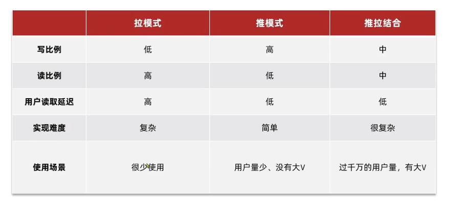

# 登录

## 基于Session实现

+ 生成短信验证码
  + 对用户手机号的合法性进行校验

  + 生成验证码

  + 将验证码保存在Session中

  + 将验证码发送给用户
  
    
  
+ 短信验证码登录与注册

  + 对用户手机号的合法性进行校验
  + 查询验证码和Session中存储的验证码是否一致
  + 根据手机号从数据库中查询用户，判断用户是否存在以决定是否需要创建新用户
  + 将用户信息保存到Session
  + <font color=red>不需要给用户返回SessionID！！！Tomcat服务器会自动实现</font>

  

+ 校验登录状态

  + 从用户的请求头中获取cookie，从cookie中获取SessionId
  + 判断是否能根据SessionId从Session中获取到用户
  + 将存在的用户保存到本地缓存（ThreadLocal）中
  + 将获取到的用户信息返回给用户


**基于Session的方法存在的问题：**

+ Session共享问题：在集群中，不同的服务器节点有自己的内存空间和状态，来自同一客户端的请求可能会分配到不同节点。
  + 如果不同服务器节点之间没有实现session同步，那么用户状态就丢失了。
  + 如果不同服务器节点之间实现了session同步，那么就需要考虑数据一致性问题，多个节点存储同样数据带来的内存浪费问题，同步数据所带来的额外性能开销问题，以及同步过程中增加的安全风险


## 基于Redis实现

+ 生成短信验证码

  + 对用户手机号的合法性进行校验

  + 生成验证码

  + 将验证码保存在Redis中（以手机号为key，验证码为value）

  + 将验证码发送给用户

    

+ 短信验证码登录与注册

  + 对用户手机号的合法性进行校验

  + 从Redis中查询手机号对应的验证码和用户发来的验证码是否匹配

  + 判断手机号是否存在以决定是否需要创建新用户

  + 将用户信息保存到Redis（以随机token为key，用户信息为value（hash类型））

    【为什么要用随机token？因为这个token是登录凭证，用户的请求头中会携带这个token，如果用手机号的话会出现**隐私泄漏的风险**】

  + 将token发送给用户

  

+ 校验登录状态（这块最后由登录拦截器实现）

  + 从用户请求头中获取Token
  + 以Token为key从Redis中获取用户数据
  + 判断用户是否存在
  + 将存在的用户保存到ThreadLocal中

  

<font size=4>**和Session方案的区别：**</font>

+ 生成验证码后将验证码保存到Redis而不是Session，保存内容的Key为手机号，value为验证码
+ 保存用户到Redis时key为随机token，value为用户信息，并且需要将token返回给前端（sessionID不需要返回，tomcat服务器会自动维护）
+ 校验登录状态时，前端携带token作为key，并且从redis中获取用户信息


## 功能优化

### 数据传输对象模式

+ 将数据返回给前端页面时使用DTO类简化数据传输，隐藏敏感信息，同时减少传输的数据量
+ 使用BeanUtil.copyProperties静态方法批量拷贝数据


### 登录校验拦截器

**基本实现**

+ 将登录校验拦截器注册到Web框架中的拦截器链中，由于不是所有的请求路径都需要拦截（有的页面即使不登陆也可以访问），所以要将这些路径在注册时用.excludePathPatterns排除在外
+ 创建拦截器（继承于HandlerInterceptor类），对preHandle功能和afterCompletion进行重写
+ 对于preHandle方法，需要每次获取请求头中的token
  + 判断token是否为空，不为空就根据token去Redis中查找用户
  + 查找到用户后将用户信息从Redis存储的格式转换成UserDTO格式
  + 将UserDTO存储到ThreadLocal
  + 刷新Redis中token的有效期
+ 对于afterCompletion方法
  + 从UserHolder中移除user


**优化实现**

如果只用一层拦截器，那么如果用户登录后一直访问不登录就可以访问的页面时，就不会触发拦截器中的preHandle方法，相应的token有效期就不会被刷新，所以需要将一层拦截器结构改成**链式拦截器结构**

+ 在拦截器配置表中用order设置两个拦截器的优先级
  + 拦截器1，拦截一切路径，用于刷新token有效期
  + 拦截器2，拦截需要登录的路径，用于登录拦截
+ 拦截器1中通过首先通过请求头中的"authorization"字段获取token
  + 如果token不存在，说明用户没登陆过，直接放行。
  + 如果token存在，则根据token获取Redis中的用户属性。
    + 如果用户不存在，直接放行。
    + 如果用户存在，则保存用户信息到ThreadLocal并刷新token过期时间。
+ 拦截器2，查看ThreadLocal中是否存在用户，不存在则拦截，存在则放行。


# 商户查询缓存

## 基础实现

+ 根据商铺id，从Redis中查询商铺缓存
  + 若命中，直接返回商铺信息
  + 若未命中，根据id查询数据库，判断商铺是否存在
    + 如果商铺存在，则将商铺数据写入Redis，并返回商铺信息
    + 如果商铺不存在，返回404
    
    

## 功能优化

基础实现中存在一些问题：

1. 缓存堆积。数据一直存在缓存中，没有设置过期时间。
2. 数据一致性。如果用户每次都命中了缓存，就不会查询数据库，数据库中的内容发生改变时，用户无法获取到最新的数据。除此之外还涉及数据库和缓存数据更新的顺序问题


### 缓存更新

+ 从数据库中查询到数据写入缓存时添加一个过期时间（作为兜底方案）
+ 每次对数据库进行更新操作时，更新数据库，再删除缓存中的数据。等下次执行了查询操作再将更新后的数据写入缓存。
+ 将更新数据库和删除缓存作为一个Transactional


### 解决缓存穿透

**布隆过滤器**适用于需要预先过滤大量无效请求的场景，在用户规模大并且存在大量高并发请求的情况效果会更好。实现复杂。

**缓存空对象**适用于用户规模比较小的业务场景，实现简单。

**增强基础格式校验：**在查询缓存前对用户提供的信息先进行基础格式校验，是一种主动预防缓存穿透的机制


在本项目中使用了<font color=red>缓存空对象+基础格式校验</font>的解决方案

- 根据商铺id，从Redis中查询商铺缓存
  - 若命中，<font color=red>判断是否为空值</font>
    - 若是空值则结束操作
    - 若不是空值，则返回商铺信息
  - 若未命中，根据id查询数据库，判断商铺是否存在
    - 如果商铺存在，则将商铺数据写入Redis，并返回商铺信息
    - 如果商铺不存在，<font color=red>则将空值写入Redis</font>


### 解决缓存雪崩

**给不同key设置不同的过期时间：**


### 解决缓存击穿

**基于互斥锁**的解决方案解决实现起来比较简单，但是请求比较多的时候就会出现大量请求排队等待的情况，影响系统的吞吐量。更适用于**对数据一致性要求较高**，且**并发度不高的场景**，能够确保数据的可靠性和一致性。【一些**变动比较频繁**的数据可以用这种方案来维护】

**基于逻辑过期**的解决方案更适用于对并发度要求较高，且对数据一致性要求不严格的场景，能够提高系统的性能和可扩展性。【**变动不是很频繁**的数据可以用这种方案来维护】


**基于互斥锁解决**

+ 根据商铺id，从Redis中查询商铺缓存

  + 若命中，则直接返回商铺数据
  + 若未命中，则尝试获取互斥锁

+ 若获取互斥锁失败，则休眠一段时间后再次尝试查询Redis中的商铺缓存

+ 若获取互斥锁成功，则根据id获取商铺数据.

  + 如果数据不存在，就返回错误，将空对象写入缓存
  + 如果数据存在，就将对象写入缓存，并返回对象
  + 释放锁

  

**基于逻辑过期解决**

+ 根据商铺id，从Redis中查询商铺缓存

  + 若未命中，则返回空（由于key设置了逻辑过期字段，没有设置TTL，如果缓存中没有就说明数据库里也没有）

  + 若命中，判断缓存是否过期

    + 未过期则返回商铺信息
    + 过期则尝试获取互斥锁

  + 若未成功获取互斥锁，则直接返回商铺信息

  + 若成功获取互斥锁，则开启独立线程完成查询和写入Redis的操作，由独立线程释放锁，其自身返回缓存中的商铺信息
  
    
  


# 创建订单

## 全局唯一id

从分布式系统角度考虑：全局唯一id可以在分布式系统中保证其唯一性。因为分布式系统中如果有多个服务节点同时处理用户下单操作，而每个节点都在自己本地生成订单编号，就容易出现订单编号冲突。

全局唯一ID的生成策略：UUID，Redis自增，雪花算法，数据库自增。

+ UUID：基于时间戳和计算机MAC地址生成，有128位，生成的ID是无序的。
+ 雪花算法：基于时间戳，机器ID，以及序列号生成，有64位。需要维护机器id，对时钟依赖比较高。


**设计全局唯一id格式：**

+ 本方案的id格式设计为（1位符号位，31位时间戳，32位序列号）
+ 31位时间戳可以表示2的31次方秒，大致相当于68年，所以短时间内认为其不会重复

+ 序列号基于Redis的String类型int编码方式的incr命令生成。
+ 注意序列号的key。如果仅仅将业务前缀作为key，然后进行自增长的话，之后所有的订单生成都会对这个key的值+1。由于int值的长度上限是64位，而方案中设计的序列号为32位，随着时间的推移，int中的值可能超过2的32次方，此时序列号的低32位会出现重复。为了确保其唯一性，最好在key中添加当前日期的字符串。一来方便根据日期进行管理，二来可以有效防止key对应的int数值超过2的32次方，出现重复的现象。


**生成全局唯一id**：

+ 设计全局唯一id格式
+ 获取当前时间，和设置的起始时间作差，求出时间间隔
+ 基于自增长key生成序列号。
+ 将时间戳和序列号拼接后返回


## 基础实现

+ 创建订单
+ 调用全局唯一id生成器，生成id后填入订单
+ 设置订单的其他信息
+ 将订单保存到数据库


# 秒杀下单

## 基础实现

**实现秒杀下单：**

+ 提交优惠券id，查询优惠券信息
+ 判断秒杀是否开始
  + 未开始，返回错误信息
+ 已开始，则判断秒杀是否结束
  + 已结束，则返回错误信息
+ 未结束，则获取当前用户的id，根据用户id去订单表中查询是否存在订单【可能出现并发问题】
  + 如果存在，说明购买过了，返回错误信息
+ 如果不存在，查询库存
  + 库存不足，返回错误信息
+ 库存充足，扣减库存 【可能出现并发问题，导致超卖】
+ 创建订单【可能出现并发问题，导致一人多单】


## 功能优化

### 悲观锁和乐观锁

**悲观锁：**认为共享资源每次被访问的时候就会出现问题(比如共享数据被修改)，所以每次在获取资源操作的时候都会上锁，这样其他线程想拿到这个资源就会阻塞直到锁被上一个持有者释放。也就是说，**共享资源每次只给一个线程使用，其它线程阻塞，用完后再把资源转让给其它线程**


**乐观锁：**认为线程安全问题不一定会发生，所以在数据访问前不加锁，在线程对数据作更新时**判断**是否有其他线程对数据进行了修改。如果没有修改，说明是安全的，此时更新数据。如果数据被修改，说明发生了安全问题，此时进行重试或抛出异常【存在成功率低的问题】

**乐观锁解决思路：**

+ version方案：用修改数据时使用的版本号和读取数据时的版本号进行比较，两值相等才会更新。
+ CAS（Compare and swap)：用一个预期值和要更新的变量值进行比较，两值相等才会进行更新。


### 分布式锁

满足分布式系统或集群模式下**多进程可见**或者互斥的锁


### 解决超卖问题

由于真实的业务场景是高并发的，而不同线程的执行又是异步的，所以在用户A判断库存并删减库存创建订单的间隙，如果有用户B判断库存，就会认为仍然存在库存，从而导致超卖。

为了解决超卖问题，需要引入乐观锁，确保用户修改库存数据时的库存和查询时的库存一致（以库存量作为version）。如果作严格的限制，失败率会很高，所以对stock可以只做范围限制，不做精准限制。

**导致超卖的根本原因**在于，查询库存和修改库存并不是原子操作，在这两个操作间隙如果库存值发生变化，线程并不知道，就导致库存值错误。

基于CAS的乐观锁相当于用数据库的机制**将查询库存和修改库存变成了一个原子操作**。

会导致超卖的语句：select stock from xx where id = xx，判断stock，set stock = stock - 1 where id=xx

基于version加乐观锁：set stock = stock - 1 where id=xx ans stock=xx

基于CAS加乐观锁：set stock = stock - 1 where id=xx and stock > 0


+ 提交优惠券id，查询优惠券信息
+ 判断秒杀是否开始
  + 未开始，返回错误信息
+ 已开始，则判断秒杀是否结束
  + 已结束，则返回错误信息
+ 未结束，则获取当前用户的id，根据用户id去订单表中查询是否存在订单【可能出现并发问题】
  + 如果存在，说明购买过了，返回错误信息
+ 如果不存在订单，<font color=red>**则尝试扣减库存，并为扣减库存操作设置允许where stock>0**</font> 
+ 创建订单【可能出现并发问题，导致一人多单】


### 实现一人一单

创建一百个带有相同JWT令牌的线程进行压力测试，发现会出现一个人下多次单。

这是因为虽然是不同的线程，但是在拦截器中设计的逻辑是，根据JWT令牌去缓存中获取令牌对应的用户信息，所以只要JWT令牌一样，返回的用户信息也是一样的，获取到的用户ID就也是一样的。在通过用户id查询对应的订单记录时，多个线程就会出现并发问题。当线程B在线程A下单之前查询了订单信息，没有查到对应的订单，就也会进行下单操作。

**导致一人多单的根本原因**在于，查询订单和创建订单并不是原子操作，在这两个操作间隙如果订单数量发生变化，线程并不知道，就导致创建多单的情况。

因此需要**将查询订单和创建订单变成一个原子操作**，又因为这两个操作之间还有很多其他操作，所以无法用一条数据库语句去合并，只能考虑使用锁。

在单体模式下，使用synchronized加锁，加锁的时候要特别注意加锁的范围，而且必须要在事务提交之后再释放锁

在集群模式下，在不同虚拟机下的多个线程下单时，还是会出现并发问题。因为来自不同JVM的线程拥有不同的锁监视器，所以会出现锁失效，为此需要使用分布式锁。


**单体模式下解决方案：**

+ 提交优惠券id，查询优惠券信息

+ 判断秒杀是否开始

  + 未开始，返回错误信息

+ 已开始，则判断秒杀是否结束

  + 已结束，则返回错误信息

+ 未结束，则获取当前用户的id，根据用户id去订单表中查询是否存在订单

  + 如果存在，说明购买过了，返回错误信息

+ 如果不存在订单，则尝试扣减库存，并为扣减库存操作设置允许where stock>0

+ <font color=red>**获取用户id的toString().intern()作为锁，获取代理对象，通过代理对象创建订单**</font>

  

**集群模式下解决方案：**【和单体模式其实是一样的，只不过将synchronized换成了自己实现的分布式锁，所以需要自己管理锁的创建与释放】

+ 提交优惠券id，查询优惠券信息
+ 判断秒杀是否开始
  + 未开始，返回错误信息
+ 已开始，则判断秒杀是否结束
  + 已结束，则返回错误信息
+ 未结束，则获取当前用户的id，根据用户id去订单表中查询是否存在订单
  + 如果存在，说明购买过了，返回错误信息
+ 如果不存在订单，则尝试扣减库存，并为扣减库存操作设置允许where stock>0
+ <font color=red>**创建分布式锁，尝试获取锁并设置等待时间**</font>
  + <font color=red>**如果获取失败则返回错误信息或重试**</font>
  + <font color=red>**如果成功，则获取用户id的toString().intern()作为锁，获取代理对象，通过代理对象创建订单。**</font>
  + <font color=red>**在finally中释放锁**</font>


# 达人探店

一个用户只能点赞一次，再次点赞就应该显示点赞取消。所以需要实现以下的业务逻辑。之所以要用Zset而不是set，是因为需要为点赞的用户实现一个排行榜功能（按点赞的时间毫秒值顺序显示点赞用户）


## **判断用户是否点赞**

+ 获取当前用户
  + 如果用户没有登录，直接返回
  + 如果用户已经登录了，则获取用户Id
+ 根据用户Id判断当前用户是否点赞
  + 如果没有点赞，就在数据库中将点赞数+1，并且给Zset中的用户Id添加当前时间毫秒值作为score
  + 如果点赞了，就在数据库中将点赞数-1，并且从Zset中移除用户对应的Id


## **查询博文的点赞**

+ 查询点赞的用户set
  + 如果set是null或者set是空，就返回空列表
  + 如果set不为空，就从Set中获取所有的用户id组成的列表
+ 根据用户的id列表查询用户实体类的列表
+ 将实体类的列表返回给前端

注意：在根据用户id列表查询用户实体类列表时，如果直接使用listByIds返回的列表会按照id升序排列，而我们实际上需要根据店在哪的时间毫秒值进行排列，所以需要使用query进行自定义查询。

```java
List<UserDTO> userDTOS = userService.query()
                .in("id", ids).last("ORDER BY FIELD(id," + idStr + ")").list()
                .stream()
                .map(user -> BeanUtil.copyProperties(user, UserDTO.class))
                .collect(Collectors.toList());
```


# 好友关注

## **查询是否关注**

+ 获取当前用户id
+ 查询当前用户是否关注了xx用户
+ 如果关注了就返回true


## **关注和取关**

+ 获取当前用户id
+ 判断到底是关注还是取关
  + 如果状态是未关注，就新增一条关注数据。将被关注的用户id放入缓存
  + 如果状态是已关注，就从数据据库中删除对应的数据。将被关注的用户id移出缓存


## **查询共同关注**

+ 获取当前用户的Id
+ 获取目标用户的Id
+ 从Redis中查询这两个Id对应的关注列表的Set
+ 求这两个Set的交集
  + 如果交集为空，直接返回空
  + 如果交集不为空
+ 将map解析为id的列表
+ 根据id列表查询用户列表
+ 返回用户列表


**关注推送**

+ 

----------------

<font size=5>**Feed流**</font>

feed流即持续更新并呈现给用户内容的信息流，是将用户主动订阅的若干消息源组合在一起形成内容聚合器，帮助用户持续地获取最新的订阅源内容。


**Feed流分类**

+ Timeline：不做内容筛选，简单地按照内容发布时间排序。
+ 智能排序：利用智能算法屏蔽违规的，用户不感兴趣的内容。推送用户感兴趣的信息。


**Feed流的实现模式：**

+ 拉模式（读扩散）:

  用户发布数据时将数据存入自己的发件箱，当其他用户需要读取时再主动将数据拉取到自己的收件箱里

+ 推模式（写扩散）：

  用户发布数据时直接将数据推送到其他用户的收件箱里

+ 推拉结合：

  对活跃用户采用推模式，非活跃用户采用拉模式




## 基于Feed流实现推送

基于Feed流实现。

+ 获取当前登录用户
+ 为blog设置用户的id
+ 保存blog
  + 如果保存失败，返回错误信息
  + 如果保存成功，则获取关注了当前用户的所有follow
+ 从follow里获取粉丝的Id
+ 以粉丝的id为key，推送的内容为value，时间毫秒值为score。将数据存入redis


## 滚动分页

滚动分页本次查询的命令和上一次查询的命令有关，所以查询过后需要返回的内容还应该包括【本次查询的推送的最小时间戳】以及【偏移量】

+ 获取当前用户
+ 从Redis中根据用户ID找到用户的收件箱
+ 从收件箱中获取TypedTuple，再从TypedTuple中获取value【BlogId】，以及所有TypedTuple中最小的score【时间戳】，顺便获取score和最小时间戳相同的元素个数
+ 根据id查询【记得要加orderBy保证返回值的有序性】
+ 将结果封装成DTO类


# 附近商铺

<font size=5>**GEO**</font>

Geolocation的简称，代表地理坐标，在Redis3.2中加入了对GEO的支持，允许存储地理坐标信息，帮助实现经纬度检索。


## 附近商家搜索


# 用户签到


# UV统计

