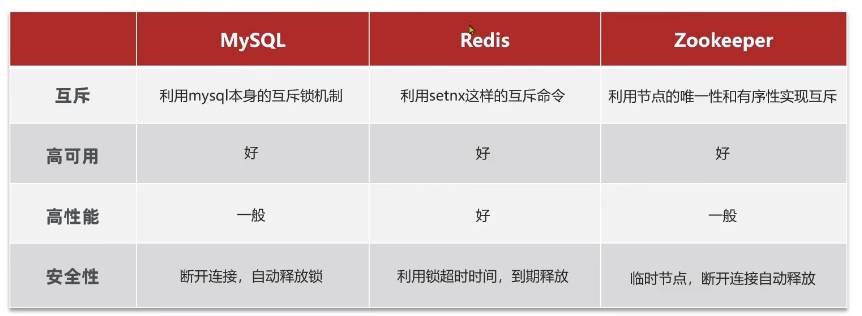
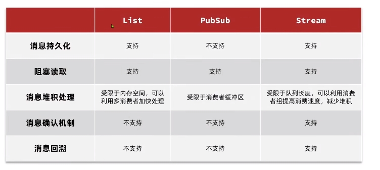

# Redis概览

Redis（Remote Dictionary Server），远程词典服务器，是一种NoSQL（Not only SQL）、基于内存的数据库

**特征：**

+ 数据结构丰富：支持字符串、哈希表、集合等数据结构
+ 高性能：将数据存储在内存中，实现了多路复用，读写速度非常快
+ 高扩展性：支持集群模式（主从集群和分片集群），可以通过添加节点来水平扩展系统的容量和性能
+ 持久化：定期将内存中的数据保存到磁盘，确保数据的安全性
+ 多语言支持：方便开发者在各种编程语言中使用


# Redis命令

## Redis数据结构

Redis是一个key-value的数据库，key一般是String类型，value的值多种多样，可以是String，Hash，List，Set，SortedSet等


## 通用命令

+ KEYS：返回与pattern匹配的所有keys。 **不建议在生产环境中使用**，在单线程的情况下会影响性能。支持glob-style模式

  ```
  KEYS pattern
  ```

  + `h?llo` matches `hello`, `hallo` and `hxllo`

  + `h*llo` matches `hllo` and `heeeello`

  + `h[ae]llo` matches `hello` and `hallo,` but not `hillo`

  + `h[^e]llo` matches `hallo`, `hbllo`, ... but not `hello`

  + `h[a-b]llo` matches `hallo` and `hbllo`

    

+ DEL：删除指定的键。如果键不存在，则会被忽略。

  ```
  DEL key [key ...]
  ```

  

+ EXISTS：返回键是否存在。

  ```
  EXISTS key [key ...]
  ```

  如果参数中多次提到同一个存在的key，它将被计算多次。例如：如果存在 **somekey**，**EXISTS somekey somekey** 将返回 2

  

+ EXPIRE：设置key超时。超时后，key将被自动删除。只有删除或覆盖key的命令（包括 DEL、SET、GETSET 和所有 *STORE 命令）才会清除超时

  ```
  EXPIRE key seconds [NX | XX | GT | LT]
  ```

  

+ TTL：返回key的剩余生存时间，单位秒。如果key不存在，命令返回 -2。如果key存在但没有相关过期，命令返回-1。

  ```
  TTL key
  ```

  

## String类型常见命令

Redis的String类型可存储字节序列，包括文本、序列化对象和二进制数组。因此，字符串是能与 Redis 键关联的最简单的值类型，最大空间不能超过512M。字符串通常用于缓存，但也支持其他功能。

+ SET：设置 key 为字符串值。如果 key 已有值，无论其类型如何，都会被覆盖。SET 操作成功后，以前与 key 相关的任何生存时间都将被丢弃。

  ```
  SET key value [NX | XX] [GET] [EX seconds | PX milliseconds |
    EXAT unix-time-seconds | PXAT unix-time-milliseconds | KEEPTTL]
  ```

  + NX -- 仅在密钥不存在的情况下设置密钥。
  + XX -- 仅设置已经存在的密钥。
  + GET -- 返回键值处存储的旧字符串，如果键值不存在，则返回 nil。如果键值不是字符串，会返回错误并中止 SET。
  + EX seconds-- 设置指定的过期时间，单位为秒（正整数）。
  + PX milliseconds-- 设置指定的过期时间，以毫秒为单位（正整数）。
  + EXAT timestamp-seconds -- 以秒为单位（正整数）设置指定的密钥过期时间（Unix 时间）。
  + PXAT timestamp-milliseconds -- 设置密钥过期的指定 Unix 时间，单位为毫秒（正整数）。
  + KEEPTTL -- 保留与密钥相关的有效时间。
    

+ MSET：将给定的键设置为各自的值。

  ```
  MSET key value [key value ...]
  ```

  

+ GET：获取 key 的value。如果键不存在，则返回特殊值 nil。如果 key 存储的值不是字符串，则会返回错误，因为 GET 只能处理字符串值。

  ```
  GET key
  ```

  

+ MGET：返回所有指定键的值。对于每个不包含字符串值或不存在的键，都会返回特殊值 nil。

  ```
  MGET key [key ...]
  ```

  

+ INCR：将存储在key上的数字递增 1。如果键不存在，则在**执行操作前**将其设置为 0。如果键值类型错误或包含无法表示为整数的字符串，将返回错误信息。此操作仅限于 64 位有符号整数。

  ```
  INCR key
  ```

  

+ INCRBY：按increment递增key存储的数字，increment可以为负数。其余同incr。

  ```
  INCRBY key increment
  ```

  

+ INCRBYFLOAT：按increment递增key处存储的浮点数字符串，increment可以为负数。如果键不存在，则在执行操作前将其设置为 0。

  ```
  INCRBYFLOAT key increment
  ```

  

+ SETNX：从 Redis 2.6.12 版开始，该命令已被弃用。如果键不存在，则设置键以保存字符串值。在这种情况下，它等于 SET。如果 key 已有值，则不执行任何操作。SETNX 是 "SET if Not eXists "的缩写。

  ```
  SETNX key value
  ```

  

+ SETEX：从 Redis 2.6.12 版开始，该命令已被视为弃用。给key提供value并设置有效期

  ```
  SETEX key seconds value
  ```


## Hash类型

Redis Hash是一种记录类型，其结构是field-value的集合。可以用Hash来表示基本对象和存储计数器分组等。

+ HSET：添加或修改hash类型key的field的value。这条命令会覆盖哈希值中存在的指定字段的值。如果key不存在，则会创建一个新的key。

  ```
  HSET key field value [field value ...]
  ```

  

+ HMSET：从 Redis 4.0.0 版本开始，该命令已被弃用。批量添加或修改hash类型key的field的value

  ```
  HMSET key field value [field value ...]
  ```

  

+ HGET：返回key存储的哈希值中与field相关的value。

  ```
  HGET key field
  ```

  

+ HMGET：批量返回key存储的哈希值中与field相关的value。对于hash中不存在的field的value，都会返回一个 nil 值。

  ```
  HMGET key field [field ...]
  ```

  

+ HGETALL：返回存储在 key 处的hash的所有field和value。

  ```
  HGETALL key
  ```

  

+ HKEYS：返回存储在 key 的所有filed。

  ```
  HKEYS key
  ```

  

+ HVALS：返回key的所有value。

  ````
  HVALS key
  ````

  

+ HINCRBY：按increment递增存储在 key 的哈希值中的filed的value。如果 key 不存在，则会创建一个新的key。如果filed，则在执行操作前将其值设置为 0。

  ```
  HINCRBY key field increment
  ```

  

+ HSETNX：为存储在 key 的哈希值中的field设置值，前提是field不存在。如果 key 不存在，则会创建一个新的key。如果filed已经存在，则此操作无效。

  ```
  HSETNX key field value
  ```

  

## List类型

Redis中的List和Java中的LinkedList类似，可以看作一个双向链表结构，既可以支持正向检索，也支持反向检索。常用于实现堆栈和队列，即存储一个有序数据。

**特点：**

+ 有序
+ 元素可以重复
+ 插入和删除快
+ 查询速度一般


+ LPUSH：将所有指定值插入存储在 key 处的**列表头部**。如果 key 不存在，则在执行推送操作前将其创建为空列表。如果 key 保存的值不是list，则会返回错误信息。

  ```
  LPUSH key element [element ...]
  ```

  

+ RPUSH：将所有指定值插入存储在 key 处的**列表尾部**。如果 key 不存在，则在执行推送操作前将其创建为空列表。如果 key 保存的值不是 list，则会返回错误信息。

  ```
  RPUSH key element [element ...]
  ```

  

+ LPOP：删除并返回存储在 key 处的列表的第一个元素。默认情况下，该命令从列表开头取出一个元素。如果提供了可选的 count 参数，则根据列表的长度，返回至多count个元素（如果列表长度小于count，就只返回count个值），如果列表为空，返回nil

  

+ ```
  LPOP key [count]
  ```

  

+ RPOP：删除并返回存储在 key 处的列表的最后一个元素。默认情况下，该命令从列表末尾弹出一个元素。如果提供了可选的 count 参数，则根据列表的长度，返回至多count个元素（如果列表长度小于count，就只返回count个值），如果列表为空，返回nil

  ```
  RPOP key [count]
  ```

  

+ LRANGE：返回存储在 key 处从索引start到stop的指定元素。索引从0开始。

  ```
  LRANGE key start stop
  ```

  

+ BLPOP：BLPOP 是一种阻塞列表弹出原语。它是 LPOP 的阻塞版本，因为当没有元素从任何给定列表中弹出时，它会阻塞连接。从第一个非空列表的头部弹出一个元素，并按照给定键的顺序进行检查。

  ```
  BLPOP key [key ...] timeout
  ```

  

+ BRPOP：BRPOP 是一种阻塞列表弹出原语。它是 RPOP 的阻塞版本，因为当没有元素从任何给定列表中弹出时，它会阻塞连接。从第一个非空列表的头部弹出一个元素，并按照给定键的顺序进行检查。

  ```
  BRPOP key [key ...] timeout
  ```

  

  


## Set类型

Redis中的Set是由字符串组成的集合，其中的字符串是唯一且无序的。查找速度很快，支持交集、并集、差集等功能。

+ SADD：将指定的成员添加到存储在 key 处的集合中。已是此集合成员的指定成员将被忽略。如果 key 不存在，则会在添加指定成员前创建一个新集合。如果存储在 key 处的值不是一个集合，则会返回错误信息。

  ```
  SADD key member [member ...]
  ```

+ SREM：从存储在 key 处的集合中移除指定的成员。不属于此集合的指定成员将被忽略。如果 key 不存在，则将其视为空集，此命令返回 0。如果 key 处存储的值不是一个集合，则会返回错误信息。

  ```
  SREM key member [member ...]
  ```

+ SISMEMBER：返回成员是否是存储在 key 中的集合的成员。

  ```
  SISMEMBER key member
  ```

+ SCARD：返回set中元素的个数

  ```
  SCARD key
  ```

+ SMEMBERS：获取set中所有的元素

  ```
  SMEMBERS key
  ```

+ SINTER：返回所有给定集合的交集

  ```
  SINTER key [key ...]
  ```

+ SDIFF：返回第一个集合与所有连续集合的差集

  ```
  SDIFF key [key ...]
  ```

+ SUNION：返回所有给定集合的并集

  ```
  SUNION key [key ...]
  ```


## SortedSet类型

Redis的SortedSet是一个可排序的set集合，其中每个元素都带有一个score属性，可以基于score属性对元素排序。底层的实现是一个跳表（SkipList）加一个hash表。具有可排序、元素、查询速度快的特点，常被用来实现排行榜这样的功能。

+ ZADD：添加一对或多对score-member到key所对应的sortedSet

  ```
  ZADD key [NX | XX] [GT | LT] [CH] [INCR] score member [score member
    ...]
  ```

  + **XX**: 只更新已存在的元素。不要添加新元素。
  + **NX**: 只添加新元素。不更新已存在的元素。
  + **LT**: 对于已存在的元素，只有当新score小于当前score时才更新该元素
  + **GT**:  对于已存在的元素，只有当新score大于当前score时才更新该元素
  + **CH**: 将返回值从新增元素数修改为更改元素的总数（更改的元素是指**新添加的元素**和**分值已更新的已有元素**。因此，命令行中指定的元素如果得分与过去相同，则不计算在内）注意：通常 `ZADD` 的返回值只计算新增元素的数量。
  + **INCR**: 指定该选项时，ZADD 的作用与 ZINCRBY 类似。在这种模式下，只能指定一对score-element。

+ ZREM：从存储在 key 处的排序集合中删除指定的成员。不存在的成员将被忽略。如果 key 存在，但不包含排序集合，则会返回错误信息。

  ```
  ZREM key member [member ...]
  ```

+ ZSCORE：返回key所代表的sortedSet中member的score

  ```
  ZSCORE key member
  ```

+ ZRANK：返回key所代表的sortedSet中member的排名。score从低到高进行排序，序号从0开始。withscore参数会在返回值中添加该元素的score

  ```
  ZRANK key member [WITHSCORE]
  ```

+ ZCARD：获取sortedSet中元素的个数

  ```
  ZCARD key
  ```

+ ZCOUNT：返回score在min到max之间的元素的个数

  ```
  ZCOUNT key min max
  ```

+ ZINCRBY：让sortedSet中的member自增，增量为increment。如果member不存在于sortedSet中，则以increment作为其得分。如果 key 不存在，则会创建一个以member为唯一成员的新的sorted set。

  ```
  ZINCRBY key increment member
  ```

+ ZRANGE：获取在start和stop之间的元素

  ```
  ZRANGE key start stop [BYSCORE | BYLEX] [REV] [LIMIT offset count]
    [WITHSCORES]
  ```

  + **BYSCORE**：表示根据Score排序
  + **BYLEX**：表示根据字典序排序
  + **REV**: 反转排序，从高到低排序。score相同时采用反向词典排序
  + **LIMIT offset count**：类似于 SQL 中的 SELECT LIMIT offset, count
  + **WITHSCORES**：在命令回复中补充返回元素的分数

   

# Redis的Java客户端

+ Jedis：学习成本低，线程不安全
+ lettuce：基于Netty实现，支持同步异步和响应式编程，线程安全。支持Redis的哨兵模式，集群模式和管道模式
+ Redisson：基于Redis实现的分布式Java数据结构集合。包含了诸如Map，Queue，Lock，Semaphore等强大的功能


## Jedis

### 使用步骤

1. 引入依赖
2. 建立连接
3. 使用Jedis，方法名与Redis一致
4. 释放连接


### Jedis线程连接池

```Java
public class JedisConnectionFactory{
    private static final JedisPool jedisPool;
    
    static{
        //配置连接池
        JedisPoolConfig jedisPoolConfig = new JedisPoolConfig();
        jedisPoolConfig.setMaxTotal(8);
        jedisPoolConfig.setMaxIdle(8);
        jedisPoolConfig.setMinIdle(0);
        jedisPoolConfig.setMaxWaitMillis(200);
        //创建连接池对象
        jedisPool = new JedisPool(jedisPoolConfig,"host","port",1000,"password");
    }
    //获取Jedis对象
    public static Jedis getJedis(){
        return jedisPool.getResource();
    }
}
```


## Spring Data Redis

### 简介

SpringData是Spring中数据操作的模块，包括对各种数据库的继承，其中对Redis的集成模块就叫做SpringDataRedis

+ 提供了对不同Redis客户端的整合（Jedis，Lettuce）
+ 提供了RedisTemplate统一API来操作Redis
+ 支持Redis的发布订阅模型
+ 支持Redis哨兵和Redis集群
+ 支持基于Lettuce的响应式编程
+ 支持基于JDK，JSON，字符串，Spring对象的数据序列化和反序列化
+ 支持Redis的JDKCollection实现


SpringDataRedis中提供了RedisTemplate工具类，其中封装了各种对Redis的操作，并且将不同数据类型的操作API封装到了不同的类型中 


| API                         | 返回值类型      | 说明                      |
| --------------------------- | --------------- | ------------------------- |
| redisTemplate.opsForValue() | valueOperations | 操作**String**类型数据    |
| redisTemplate.opsForHash()  | HashOperations  | 操作**Hash**类型数据      |
| redisTemplate.opsForList()  | ListOperations  | 操作**List**类型数据      |
| redisTemplate.opsForSet()   | SetOperations   | 操作**Set**类型数据       |
| redisTemplate.opsForZSet()  | ZSetOperations  | 操作**SortedSet**类型数据 |
| redisTemplate               | s               | 通用命令                  |


### 使用步骤

1. 引入依赖

   ```xml
   <dependency>
   	<groupId>org.springframework.boot</groupId>
   	<artifactId>spring-boot-starter-data-redis</artifactId>
   </dependency>
   ```

   

2. 配置文件


# 黑马点评实战

## 短信登录

### 基于Session实现登录

**发送短信验证码：**

+ 用户提交手机号
+ 校验手机号
  + 手机号满足格式要求，则生成验证码
  + 手机号不满足格式要求，则要求用户重新提交手机号
+ 生成验证码
+ 将验证码保存到session
+ 发送验证码


**短信验证码登录与注册：**

+ 用户提交手机号和验证码
+ 校验验证码
  + 手机号与验证码匹配
  + 手机号与验证码不匹配则要求用户重新提交
+ 根据手机号查询用户是否存在
  + 用户存在，则保存用户到session
  + 用户不存在，则创建新用户，并将用户保存到数据库后再将其保存到session


**校验登录状态：**

+ 用户携带cookie发起请求
+ 从session中获取用户
+ 判断用户是否存在
  + 用户不存在，则对其进行拦截
  + 用户存在，则将用户保存到ThreadLocal中
+ 放行


###  基于Redis实现登录

**session共享问题：**当在不同服务器间切换请求时会导致数据丢失的问题，因为它们不共享session存储空间。

**解决方案：**Redis可以实现不同服务器之间的数据共享，同时还是内存存储（读写速度很快）


**和Session方案的区别：**

+ 生成验证码后将验证码保存到Redis而不是Session，保存内容的Key为手机号，value为验证码
+ 保存用户到Redis时key为随机token，value为用户信息，并且将token返回给前端。
+ 校验登录状态时，前端携带token作为key，并且从redis中获取用户信息


**注意事项：**

+ 选择合适的数据结构，key，存储粒度
+ 生成code阶段：将code存储到Redis时需要设置过期时间，避免数据堆积
+ 登录校验阶段：
  + 利用hutool工具中的BeanUtil下的copyProperties方法隐藏user中的部分信息，将其转换成UserDTO对象（信息更少的对象）
  + 利用BeanUtil下的beanToMap方法获取userMap，将其存入Redis中并设置用户过期时间
+ 拦截器：
  + 设计两层拦截器，在拦截器配置表中用order设置两个拦截器的优先级
    + 拦截器1，拦截一切路径，用于刷新token有效期
    + 拦截器2，拦截需要登录的路径，如果不存在就拦截，存在就不拦截
  + 拦截器1中通过首先通过请求头中的"authorization"字段获取token，如果token不存在，说明用户没登陆过，直接放行。如果token存在，则根据token获取Redis中的用户属性。如果用户不存在，直接放行。如果用户存在，则需要用BeanUtil下 fillBeanWithMap方法构造出一个UserDTO对象，保存用户信息并刷新登录过期时间。
  + 拦截器2，查看ThreadLocal中是否存在用户，不存在则拦截，存在则放行。


## 商户查询缓存

**缓存：**数据交换的缓冲区，读写性能较高

**缓存的作用：**

+ 优点
  + 降低后端负载（减少对后端发起请求的次数）
  + 提高读写效率，降低读写时间（减少对慢速存储的使用）
+ 缺点
  + 需要维护数据的一致性
  + 代码维护成本（缓存雪崩，容错机制等需要额外的代码）
  + 运维成本

### 缓存相关概念

####缓存更新策略

|          |                           内存淘汰                           |                           超时剔除                           |                 主动更新                 |
| -------- | :----------------------------------------------------------: | :----------------------------------------------------------: | :--------------------------------------: |
| 说明     | 不用自己维护，利用Redis的内存淘汰机制，当内存不足时由Redis自动淘汰部分数据。<br />下次查询时更新缓存。 | 给缓存数据添加TTL，到期后自动删除缓存。<br />下次查询时更新缓存 | 编写业务逻辑，在修改数据库的同时更新缓存 |
| 一致性   |                              差                              |                             一般                             |                    好                    |
| 维护成本 |                              无                              |                              低                              |                    高                    |

**业务场景：**

+ 低一致性需求：使用内存淘汰机制。例如店铺类型缓存。
+ 高一致性需求：主动更新，并以超时剔除作为兜底方案。例如店铺详情查询缓存。


**主动更新策略**

+ **Cache Aside Pattern**：旁路缓存模式。由缓存的调用者在更新数据库的同时更新缓存。
  + 删除缓存还是更新缓存？
    + 删除缓存更新数据库时令缓存失效，查询时再更新；
    + 更新缓存每次更数据库都更新缓存，无效写比较多；
  + 如何保证缓存与数据库的操作同时成功或失败？
    + 单体系统，将缓存与数据库放在一个事务中；
    + 分布式系统，利用TCC等分布式事务方案
  + 先操作缓存还是先操作数据库？
+ **Read/Write Through Pattern**：缓存与数据库整合为一个服务，由该服务来维护一致性，调用者只需要调用该服务即可，无需关心缓存一致性问题。
+ **Write Behind Caching Pattern**：调用者只操作缓存，由其他线程**异步**地将缓存数据持久化到数据库


#### 缓存穿透

当用户或攻击者查询**缓存和数据库中都不存在的数据**时，这种请求会“穿透”缓存层直接请求数据库。由于这些请求的数据在缓存中不存在，每次查询都会落到数据库上，导致数据库压力增大，严重时甚至可能导致数据库服务不稳定或崩溃。


**不良影响：**

+ 数据库压力增加：大量无效请求会直接发送到数据库，增加数据库负载
+ 系统性能下降：缓存未能发挥作用，系统整体响应时间会增加
+ 安全风险：被恶意用户利用，通过大量请求不存在的数据来对系统进行攻击，消耗系统资源。


**解决方法：**没有一种万能的方案，要根据具体的场景和需求对策略进行组合

+ **加强用户权限校验**

+ **做好热点参数的限流**

+ **缓存空对象：**当数据库发现数据不存在时，依然将这个“不存在”的结果作为一个特殊的空对象缓存起来，并设置一个较短的过期时间。这样，再次查询相同的不存在的数据时，可以直接从缓存获取到这个空结果，避免对数据库的访问。

  + 优点：实现简单，维护方便
  + 缺点：造成Redis内存消耗，可能造成短期的不一致；

+ **布隆过滤**：在客户端和缓存之间添加一层布隆过滤器，通过将所有可能查询的数据的标识(如ID）预先加载到布隆过滤器，查询请求首先经过布隆过滤器，如果判断数据明显不存在，就可以直接返回，不再查询数据库。

  + 优点：内存占用少，没有多余的key
  + 缺点：实现复杂，存在误判的可能

  

#### 缓存雪崩

**多个数据同时失效**

在同一时间内，大量的缓存数据几乎**同时失效过期**，导致所有的请求都直接落到数据库上，从而引起数据库访问压力骤增，造成数据库过载甚至宕机，进而影响整个系统的稳定性和可用性的现象。


**解决方法：**

+ 给不同的key设计不同的过期时间（针对key同一时段大量失效）
+ 利用Redis集群提高服务可用性（针对Redis宕机）
+ 当检测到缓存雪崩发生或即将发生时，启动限流措施，减少对数据库的访问压力。
+ 给业务添加多级缓存，比如本地缓存和分布式缓存相结合。即使分布式缓存出现问题，本地缓存仍然可以提供服务，从而降低缓存雪崩的风险。


#### 缓存击穿

**一个数据失效**

一个**被高并发访问**并且**缓存重建业务比较复杂**的数据突然失效，此时若有大量并发请求同时到达，在缓存重建之前每个请求都需要去查询数据库获取数据，这会导致大量的请求直接落到数据库上，引起数据库压力飙升，甚至可能导致数据库宕机。


**解决方案：**

+ **互斥锁（强调一致性）**：在缓存失效时，使用互斥锁来保证只有一个线程去加载数据到缓存。其他线程等待该线程加载完毕后再从缓存中获取数据，避免多个线程同时访问数据库。
  + 优点：
    + 没有额外内存消耗
    + 能保存缓存和数据库的一致性
    + 实现简单
  + 缺点：
    + 使用互斥锁导致大量线程阻塞等待锁的释放，影响系统的吞吐量和响应时间
    + 可能有死锁风险
+ **逻辑过期（强调可用性）**：在缓存中设置一个逻辑过期时间（比实际过期时间要早一段时间）而非TTL，当线程读取到数据发现逻辑过期时，触发新的线程获取互斥锁实现数据查询和缓存写入，自身返回旧数据。在此过程中如果有新的线程获取数据发现过期时，会去获取互斥锁，倘若互斥锁获取失败，同样返回旧数据。
  + 优点：
    + 线程无需等待
  + 缺点：
    + 有额外的内存消耗（增加了过期实现字段）
    + 无法确保数据一致性
    + 实现复杂


### 添加Redis缓存

**方案一：不使用缓存，用户直接与数据库进行交互**

--------------

**方案二：添加缓存**

**添加Redis缓存的流程：**

+ 在客户端和数据库之间添加Redis作为中间层
+ 客户端先向Redis缓存发起请求
  + 若命中，直接获取数据
  + 若未命中，向数据库发起请求并获取数据。将数据写入Redis缓存。

**根据id查询商铺缓存的流程：**

+ 提交商铺id，从Redis中查询商铺缓存
  + 若命中，直接返回商铺信息
  + 若未命中，根据id查询数据库，判断商铺是否存在
    + 如果商铺存在，则将商铺数据写入Redis，并返回商铺信息
    + 如果商铺不存在，返回404

-----------------

**方案三：基于缓存空对象解决缓存穿透问题**

**根据id查询商铺缓存的流程：**

- 提交商铺id，从Redis中查询商铺缓存
  - 若命中，<font color=red>判断是否为空值</font>
    - 若是空值则结束操作
    - 若不是空值，则返回商铺信息
  - 若未命中，根据id查询数据库，判断商铺是否存在
    - 如果商铺存在，则将商铺数据写入Redis，并返回商铺信息
    - 如果商铺不存在，<font color=red>则将空值写入Redis</font>

---------------------

**方案四：基于互斥锁解决缓存击穿问题**

**基于互斥锁解决缓存击穿问题**：

+ 提交商铺id，从Redis中查询商铺缓存
  + 若命中，则返回商铺数据
  + 若未命中，则尝试获取互斥锁
+ 若获取互斥锁成功，则根据id获取商铺数据，将数据写入Redis，释放锁后返回数据
+ 若获取互斥锁失败，则休眠一段时间后再次尝试查询Redis中的商铺缓存

-----------------------

**方案五：基于逻辑过期解决缓存击穿问题**

+ 提交商铺id，从Redis中查询商铺缓存

  + 若未命中，则返回空（由于key设置了逻辑过期字段，所以不设置TTL，如果缓存中没有就说明数据库里也没有）

  + 若命中，判断缓存是否过期

    + 未过期则返回商铺信息
    + 过期则尝试获取互斥锁

  + 若成功获取互斥锁，则开启独立线程完成查询和写入Redis的操作，由独立线程释放锁，其自身返回缓存中的商铺信息

  + 若未成功获取互斥锁，则直接返回商铺信息

    

    

## 优惠券秒杀

### 全局ID生成器

全局id是一种在分布式系统中生成唯一标识符的方法。

**为什么需要全局id**：假设分布式系统中有多个服务节点同时处理用户下单操作，每个节点都在自己的本地生成了订单编号而不使用全局id，那么就可能出现不同节点生成的订单编号冲突的问题，还会导致跨系统数据关联变得困难。


**满足特性：**

+ 唯一性：当前业务内唯一的id，不会出现冲突
+ 高可用：确保任何时候都能生成正确的id
+ 高性能：生成id速度要够快，不能影响其他业务的速度
+ 递增性：整体具有逐渐变大的速度
+ 安全性：区别于数据库的自增，规律性不能太明显


**id的一个方案**

+ 符号位：1bit,永远为0
+ 时间戳：31bit,可以使用69年
+ 序列号：32bit,支持每秒生成2^32个id


### 悲观锁和乐观锁

**悲观锁：**认为共享资源每次被访问的时候就会出现问题(比如共享数据被修改)，所以每次在获取资源操作的时候都会上锁，这样其他线程想拿到这个资源就会阻塞直到锁被上一个持有者释放。也就是说，**共享资源每次只给一个线程使用，其它线程阻塞，用完后再把资源转让给其它线程**


**乐观锁：**认为线程安全问题不一定会发生，所以在数据访问前不加锁，在线程对数据作更新时**判断**是否有其他线程对数据进行了修改。如果没有修改，说明是安全的，此时更新数据。如果数据被修改，说明发生了安全问题，此时进行重试或抛出异常

**乐观锁解决思路：**

+ version方案
+ CAS（ Compare and set)


### 实现秒杀下单

+ 提交优惠券id，查询优惠券信息
+ 判断秒杀是否开始
  + 未开始，返回错误信息
  + 已开始，判断库存是否充足
    + 库存不足，则返回错误信息
    + 库存充足，扣减库存，创建订单，返回订单id


### 解决超卖问题


### 实现一人一单

+ 提交优惠券id

+ 查询优惠券信息

+ 判断秒杀是否开始

  + 否，返回异常结果
  + 是，判断库存是否充足

+ 若库存不充足则返回错误结果；若库存充足，则根据优惠券id和用户id查询订单

+ 判断订单是否存在

  + 是，返回异常结果
  + 否，扣减库存

  

### 秒杀优化

**优化思路：**

在优惠券秒杀的整个业务流程当中，因为有多次写数据库的操作，如果串行执行流程的话会导致业务执行速度降低。所以考虑将串行的业务交给不同的线程处理，同时提高对秒杀资格判断的效率。


##  分布式锁

**概念：**满足分布式系统或集群模式下**多进程可见**或者互斥的锁


在单机环境下，synchronized关键字可以保证线程之间的互斥访问，因为它是基于java中的内置锁实现的。但是在分布式系统中，多个节点之间无法直接共享内置锁，所以需要引入分布式锁




### 基于Redis实现的分布式锁

**基本实现：**

+ 获取锁

  + 为set命令设置nx参数确保互斥

+ 释放锁

  + 手动释放
  + 超时释放：防止出现因为服务宕机导致的锁无法释放

  

tips：在编写java代码上锁时，setIfAbsent方法返回的值是包装类Boolean类型的，所以在返回时要注意可能会出现自动拆箱所导致的空指针异常。因此在返回结果是最好写成以下形式

```Java
Boolean.TRUE.equals(success) //success是setIfAbsent返回的结果
```

---------------------------------------------------------------

**存在的问题1**：锁的误删

以上的实现方法存在一个问题。由于引入了锁的过期机制，所以假设线程1获取锁成功后出现了阻塞，且阻塞时间超过了锁的过期时间时，锁就被自动释放了。倘若此时线程2获取了锁，并正在执行业务，而线程1苏醒了，线程1就会误删线程2的锁

**优化1**：

当线程获取锁之前需要**存入自己的标识**，需要释放锁之前先**检查锁标识是否是自己**的，只有当前锁标识属于自己时才允许删除。

在存入线程标识时要存入UUID+ThreadID。在集群模式下，每个JVM会维护自己的递增的ThreadID序列，所以容易出现冲突的现象。所以在分布式的情况下，最好将UUID+ThreadId作为标识，降低冲突的概率

----------------------------------------------------------------------------------------

**存在的问题2**：判断和释放的非原子性

以上的实现方法仍然存在一个问题。由于判断锁标识的操作和释放锁的操作不是原子性的。所以当线程1判断完锁的标识并通过之后，倘若突然被阻塞，并且在被阻塞期间出现了锁的过期，此时线程2获取了锁并执行业务时，线程1也会误删线程2的锁。

**优化2：**

使用Lua脚本来**确保判断锁标识和释放锁操作的原子性**。

------------------------------------------------------

**存在的问题3：**

通过以上方法实现的分布式锁存在以下问题：

+ 不可重入：方法1执行时获取锁，再调用方法2。方法2执行业务若也需要锁，就会出现无法获取锁的情况。即出现死锁
+ 不可重试：获取锁操作只尝试一次就返回false了，没有重试机制
+ 超时释放：如何选取合适的过期时间。
+ 主从一致性：客户端从主节点获取了锁，但是在锁同步给从节点时出现了宕机，那么这个锁就丢失了，但客户端会认为这个锁已经成功获取了


### Redisson分布式锁

**Redisson入门：**

Redisson 是一个基于 Redis 的 Java 驻内存数据网格（In-Memory Data Grid）和**分布式锁服务的框架**。


**使用步骤：**

1. 引入依赖

2. 配置Redisson客户端

   ```Java
   public class RedisConfig{
       @Bean
       public RedissonClient redissonClient(){
           Config config = new Config();
           config.useSingleServer().setAddress("redis://xxx.xxx.xxx.xxx:xxxx").setOassword("1231321");
           return Redisson.create(config);
       }
   }
   ```

3. 使用redissonClient对象调用方法使用redisson

---------------------------

**实现可重入：**

+ 获取锁时判断当前锁是否为自己持有，并且要判断自己是本线程中第几个获得锁的
+ 释放锁时要判断当前锁是否为自己持有，并且要判断可重入次数是否为0


**实现可重试**：

+ 当线程获取锁失败后，会使用最大等待时间减去获取锁所消耗的时间，通过判断剩余时间是否大于零来判断是否需要重试
+ 通过subscribe订阅获取锁的线程释放的通知，如果在等待期间最大等待时间耗尽了，就会调用unsubscribe方法取消订阅，并且返回获取锁失败的结果
+ 如果在最大等待时间之内等到了通知，就更新最大等待时间，并且重新尝试获取锁


**解决超时释放：**

+ 默认锁的超时释放时间leaseTime为30秒，也可以根据自己的需要进行设置

+ 当线程获取锁之后，Redisson会启动一个Timeout定时任务来监控锁的有效期
+ 任务设置的delay时间是internalLockleaseTime/3（如果没有手动设置，那就是看门狗时间/3，也就是10秒），delay时间到时调用更新有效期的方法
+ 更新完有效期后再次调用定时任务，以此来重置锁的有效期
+ 在锁释放的时候取消定时任务


**解决主从一致性：**  

+ 取消Redis结点的主从机制，将其变成相互独立的可读写Redis 结点
+ 获取锁时从所有Redis Node中获取锁，只有从每个结点都获取锁成功了才视为获取结点成功


## 基于Redis的消息队列

**什么是消息队列：**是一种传递消息的通信机制。它通常由一个队列（消息代理）和一组发送者（生产者）和接收者（消费者）组成。


**消息队列和jvm阻塞队列的区别：**

+ 作用范围：
  + 消息队列通常用于**不同系统、应用程序或者不同模块**之间的消息传递
  + 阻塞队列通常是在**同一个 Java 虚拟机中不同线程**之间进行数据传递和共享
+ 持久化
  + 一些消息队列提供了消息持久化和消息传递保证的功能，以**确保消息不会丢失**，即使在发送者或接收者发生故障时也能保持一致性。
  + JVM 中的阻塞队列通常**只是内存中的数据结构**，不提供消息持久化和传递保证的功能。JVM宕机就失效了


### 基于List结构模拟

【Redis中的list】Redis中的list数据结构是一个双向列表，可以利用lpush和rpop或者rpush和lpop来实现队列。

【阻塞队列】由于rpop和lpop会在队列中没有数据时返回null，所以需要brpop和blpop来实现阻塞效果

**优点：**

+ 利用Redis存储，不受限于JVM内存上限
+ 基于Redis的持久化机制，数据安全性有保障

**缺点**：

+ 无法避免消息丢失。消费者拿到消息后如果出现异常无法处理消息，这个消息就丢失了。
+ 只支持单消费者。一条消息没办法被很多消费者使用


### 基于PubSub模拟

【支持多消费者】Redis中的Pub/Sub是一种发布-订阅模式（Publish/Subscribe），用于实现消息的发布和订阅功能。在这种模式中，消息的发布者（Publisher）**将消息发布到一个或多个频道**（Channel），而订阅者（Subscriber）则订阅这些频道以接收消息。

```
#订阅一个或多个频道
subscribe channel [channel]...

#向频道发送消息
publish channel msg

#订阅与pattern格式匹配的所有频道
psubscribe pattern [pattern]
```


**优点：**

+ 支持多生产多消费。

**缺点：**

+ 不支持数据持久化。消费者只能接收到自它订阅之后发布的消息，而**不会接收历史消息**。
+ 无法避免消息丢失。生产者发送消息时，如果消费者没有处于连接状态，那么生产者发送的消息就丢失了
+ 消息堆积有上限，超出时数据丢失。订阅者处理速度不足时，后续消息可能会在订阅者处缓存，缓存大小有效，超出时数据就丢失了


### 基于Stream模拟

Stream 是Redis5.0引入的一种用于处理时间序列数据的数据结构，它提供了一种有序、可持久化、自动修剪的数据流。在 Redis 中，Stream 主要用于实现日志、消息队列等场景。


**命令：**

+ XADD：
+ XREAD


**优点：**

+ 消息可回溯
+ 消息可以被多个消费者读取
+ 可以阻塞读取

**缺点：**

+ 有消息漏读的风险

------------------------

**消费者组模式：**是 Redis Stream 中用于管理消费者的一种机制。通过将消费者组绑定到 Stream 中，可以实现消息的多播和负载均衡，从而更有效地处理消息。

+ **消息分流：**消费者组将消息分发给组中的不同消费者，确保每个消息只会被组中的一个消费者处理。确保消息不会被重复处理，同时也保证了消息的顺序性。
+ **消息标识：**消费者会维护一个标识，记录最后一个被处理的消息，哪怕消费者宕机重启，还是会从标识之后读取消息
+ **消息确认：**消费者获取消息后，消息处于pending状态并将其存入pending-list。处理完成后消费者通过XACK来标记消息为已处理，并将其从pending-list中移除


**命令：**

+ XGROUP CREATE
+ XGROUP DESTORY
+ XGROUP CREATCONSUMER
+ XGROUP DELCONSUMER
+ XREADGROUP
+ XACK 


**优点：**

+ 消息可回溯
+ 消息可以被多个消费者**争抢**
+ 可以阻塞读取
+ 消息没有漏读风险
+ 有消息确认机制，保证消息至少被消费一次

**缺点：**

+ 有消息漏读的风险

