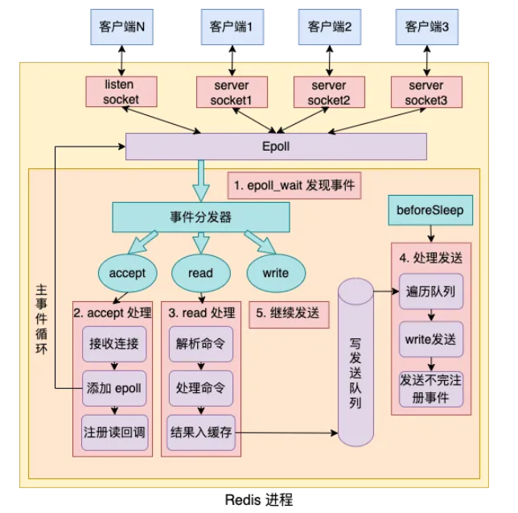
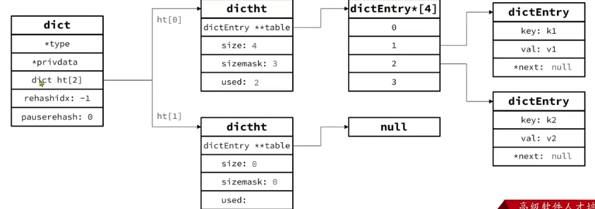
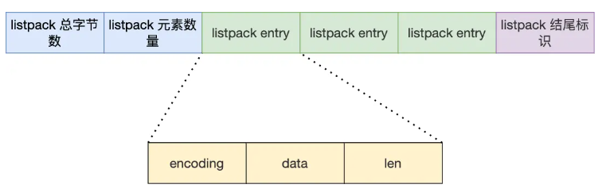

# Redis概览

Redis（Remote Dictionary Server），远程词典服务器，是一种NoSQL（Not only SQL）、基于内存的数据库

**特征：**

+ 数据结构丰富：支持字符串、哈希表、集合等数据结构
+ 高性能：将数据存储在内存中，实现了多路复用，读写速度非常快
+ 高扩展性：支持集群模式（主从集群和分片集群），可以通过添加节点来水平扩展系统的容量和性能
+ 持久化：定期将内存中的数据保存到磁盘，确保数据的安全性
+ 多语言支持：方便开发者在各种编程语言中使用


**Redis为什么这么快？**

+ **Redis是基于内存读写的**：（存储在RAM上，所以数据断电后会丢失）
+ **Redis（的命令处理部分）是基于单线程模型的**：Redis 在任何给定时间只会处理一个请求，**避免了多线程之间的竞争和同步问题**。单线程模型简化了内部逻辑，**减少了锁和上下文切换的开销**，提高了处理速度。<font size=4 color=red>Redis6.0开始在网络模型中引入了多线程，但核心业务部分还是单线程的</font>
+ **Redis实现了IO多路复用**：Redis通过事件循环（event loop）实现对多个socket的监听
+ **Redis有丰富的数据结构**


# Redis网络模型

## IO模型

<font size = 5>**阻塞IO**</font>

在进行输入/输出操作时会阻塞调用该操作的线程或进程，直到操作完成或达到某个条件。

**优点**：

+ 简单易用

**缺点**：

+ 导致线程或进程因为等待 I/O 操作而处于空闲状态，无法执行其他任务，从而降低了系统的并发性和吞吐量


---------------------

<font size = 5>**非阻塞IO**</font>

当线程或进程发起read调用时，如果数据尚未准备好或者没有就绪，线程或进程不会被阻塞，而是不断进行系统调用，轮询数据是否已经准备好。在此过程中，CPU会一直空转。


----------------------------

<font size = 5>**IO多路复用**</font>

利用一个进程同时监听多个文件描述符（FD，File Descriptor），系统发现某个FD处于可读或者可写状态时，就会通知用户应用。监听FD的方式有很多种，常见的有：

+ select：只会通知用户进程有FD就绪，需要用户进程逐个遍历FD来确认。
+ poll：只会通知用户进程有FD就绪，需要用户进程逐个遍历FD来确认。
+ epoll：epoll 是 Linux 特有的高性能 I/O 多路复用机制，它在通知用户进程FD就绪的同时，会把已经就绪的FD写入用户空间


-------------------

<font size = 5>**信号驱动IO**</font>

应用程序会通过系统调用（如sigaction）**注册一个信号处理函数**，并在发起IO操作后**继续执行其他任务**，当数据就绪后，内核会发送一个信号通知应用程序，然后应用程序调用注册的信号处理函数来处理完成的IO操作。**数据拷贝阶段用户进程仍然需要等待**。

**优点**：

+ 在系统进程准备数据的过程中用户进程无需阻塞等待

**缺点**：

+ 基于信号量实现，当有大量IO操作的时候，存储在信号队列中的信号量得不到及时处理可能会溢出
+ 需要在用户空间和内核空间之间进行频繁的信号交互


-------------------

<font size = 5>**异步IO**</font>

异步IO在整个过程中都是非阻塞的，用户进程调用完异步IO之后会去处理其他任务，内核等待数据就绪并将数据拷贝完成后才会递交信号，通知用户进程。

**优点：**

+ 高吞吐量：异步 I/O 可以在数据准备时处理其他任务，从而提高了系统的吞吐量和处理能力。


**缺点：**

+ 实现复杂。由于用户进程发起系统调用后可以继续处理任务，所以需要提前做好对**并发访问的限流**，否则会给内核带来巨大压力。实现的代码过于复杂
+ 如果没有做好限流工作，内核中积累的任务过多，可能会因为内存占用过多出现崩溃


## Redis的单线程与多线程

**Redis单线程**：指的是「接收客户端请求->解析请求 ->进行数据读写等操作->发送数据给客户端」这个过程是由一个线程（主线程）来完成的


**Redis多线程**：

+ 2.6版本：会启动 2 个后台线程，分别处理关闭文件、AOF 刷盘这两个任务；
+ 4.0版本之后：新增了一个新的后台线程，用来异步释放 Redis 内存，也就是 lazyfree 线程。
+ 6.0版本之后，又新增了三个线程用于分摊主线程网络IO的压力




**初始化**

调用epollcreate()创建一个epoll对象，调用socket()创建一个服务端的socket

调用bind()绑定端口，调用listen()监听socket

调用epoll_ctl()将该socket注册到epoll。


**事件循环**

+ 调用处理发送队列函数，如果有任务就用write函数将缓存区里的数据发送出去。然后调用epoll_wait函数等待事件
  + 如果是连接事件，调用accept获取已连接的socket，用epoll_ctl将其注册到epoll中，注册读事件处理函数
  + 如果是读事件，调用read获取客户端的数据，解析命令，处理命令，将要返回的结果添加进发送队列，将执行结果写入发送
  + 如果是写事件，调用write将缓存区里的数据发送出去，如果没有发送完就注册写事件处理函数


------------

**Redis采用单线程为什么还那么快**：

+ **采用了IO多路复用**。允许内核中同时存在多个监听 Socket 和已连接 Socket。内核会一直监听这些 Socket 上的连接请求或数据请求。一旦有请求到达，就会交给 Redis 线程处理，这就实现了一个 Redis 线程处理多个 IO 流的效果，减少了阻塞带来的等待时间。

+ **大部分操作都在内存中完成**。基于内存的读写本来就很快，所以Redis的性能瓶颈主要是在于网络延迟而不是CPU，使用多线程不会带来巨大的性能提升

+ **单线程可以有效避免多线程带来的问题**。使用多线程会导致比较多的**上下文切换**，从而带来大量开销。同时多线程还会面临**线程安全**问题，就需要引入锁等安全机制，实现复杂度升高，性能也受影响

  

-----------------

**Redis6.0之前为什么使用单线程**

使用单线程可以避免多线程并发带来的问题：比如说线程切换的开销、加锁、死锁等问题。


**Redis6.0之后为什么要引入多线程**

Redis 的性能瓶颈有时会出现在网络 I/O 的处理上。

所以为了提高网络 I/O 的并行度，Redis 6.0 对于网络 I/O 采用多线程来处理。**但是对于命令的执行，Redis 仍然使用单线程来处理**


Redis 6.0 版本之后，Redis 在启动的时候，默认情况下会**额外创建 6 个线程**（*这里的线程数不包括主线程*）：

- Redis-server ： Redis的主线程，主要负责执行命令；
- bio_close_file、bio_aof_fsync、bio_lazy_free：三个后台线程，分别异步处理关闭文件任务、AOF刷盘任务、释放内存任务；
- io_thd_1、io_thd_2、io_thd_3：三个 I/O 线程，io-threads 默认是 4 ，所以会启动 3（4-1）个 I/O 多线程，用来分担 Redis 网络 I/O 的压力。


# Redis数据结构


## SDS（简单动态字符串）

**获取长度的时间复杂度**

SDS获取字符串长度的时间复杂度是O（1）

在C语言中，获取字符串长度是需要遍历的，所以时间复杂度是O（n），但SDS直接用len属性记录了字符串长度，所以获取长度的时间复杂度是O（1）


**二进制安全**

SDS不以空字符串来判断字符串是否结束，而是以len属性表示的长度来判断字符串是否结束，所以支持存储任何二进制数据。

C语言是判断空字符（'\0'）去判断一个字符的长度的，但是有很多数据结构经常会穿插空字符在中间，比如图片，音频，视频，压缩文件的二进制数据。这些空字符会被C语言误认为是字符串结尾。


**动态扩展**

**空间预分配**：当需要对SDS空间进行扩展的时候，程序不仅会为SDS分配修改所需要的空间，还会为SDS分配额外未使用的空间。

如果拼接后新字符串的长度小于1M，则申请的新空间为扩展后的字符串长度的两倍+1（alloc只会显示为字符串长度的两倍）

如果拼接后新字符串的长度大于1M，则申请的新空间为扩展后的字符串长度+1M+1（alloc只会显示为字符串长度+1M）

**惰性空间释放**：当需要缩短SDS保存的字符串时，程序并不立即使用内存重分配来回收缩短后多出来的字节，而是使用free属性将这些字节的数量记录起来，并等待将来使用。


## IntSet

```c
typedef struct intset{
	uint32_t encoding; /*编码方式，支持16位，32位，64位*/
	uint32_t length; /*元素个数*/
	int8_t contents[]; /*整数数组，实际元素大小取决于encoding方式*/
}
```


整数集合会有一个升级规则，就是当我们将一个新元素加入到整数集合里面，如果新元素的类型比整数集合现有所有元素的类型都要长时，整数集合需要先进行升级。也就是按新元素的类型扩展 contents 数组的空间大小，然后才能将新元素加入到整数集合里。这样可以很好地节约内存空间。

不支持降级操作！！！！


## Dict

由三部分组成，分别是哈希表（DictHashTable），哈希节点（DictEntry），字典（Dict）

```c++
typedef struct dictht {
    dictEntry **table; //指向entry数组的指针
    unsigned long size; //哈希表大小
    unsigned long sizemask; //哈希表大小掩码，值为size-1
    unsigned long used;//entry个数，是可能超过哈希表大小的
} dictht;
```

```c++
typedef struct dictEntry {
    void *key;
    union {
        void *val;
        uint64_t u64;
        int64_t s64;
        double d;
    } v;
    struct dictEntry *next;//下一个entry的指针
} dictEntry;
```

Redis会根据key计算出hash值，然后利用h&sizemask计算元素存储到的位置（和sizemask进行与运算与对哈希表长度求余是一个效果）

```c++
typedef struct dict {
    dictType *type;
    void *privdata;
    dictht ht[2]; //一个Dict中包含两个哈希表，一般只用一个，另一个用于rehash
    long rehashidx;
    int16_t pauserehash;
}dict;
```




**rehash：**

哈希表中发生了冲突的话，一般是用链式哈希来解决的。如果链表太长，查找效率也会受到影响，为此引入了rehash操作。

触发条件和负载因子有关。当负载因子大于等于1时，如果redis没有在执行bgsave和bgrewriteaof，就进行rehash。当负载因子大于等于5时，无论redis在干什么，都强制rehash。

- 给「哈希表 2」 分配空间，一般会比「哈希表 1」 大一倍（两倍的意思）；
- 将「哈希表 1 」的数据迁移到「哈希表 2」 中；
- 迁移完成后，「哈希表 1 」的空间会被释放，并把「哈希表 2」 设置为「哈希表 1」，为下次 rehash 做准备。

如果哈希表中的数据太多的话，在将数据迁移到哈希表2时就会出现大量的数据拷贝，从而阻塞redis。为了解决这个问题，又引入了渐进式rehash


**渐进式rehash：**

- 在 rehash 进行期间，每次哈希表元素进行新增、删除、查找或者更新操作时，Redis 除了会执行对应的操作之外，还会顺序将「哈希表 1 」中索引位置上的所有 key-value 迁移到「哈希表 2」 上；
- 随着处理客户端发起的哈希表操作请求数量越多，最终在某个时间点会把「哈希表 1 」的所有 key-value 迁移到「哈希表 2」，从而完成 rehash 操作。

在渐进式rehash中，如果要查找一个值，会先去哈希表1中查找，没找到就去哈希表2中查找。如果要插入一个值就会直接插入到哈希表2中

## List

```C++
typedef struct listNode{
    struct listNode *prev;
    struct listNode *next;
    void *value;
}listNode
    
typedef struct list{
    listNode *head;
    listNode *tail;
    //节点值复制函数
    void *(*dup)(void *ptr);
    //节点值释放函数
    void (*free)(void *ptr);
    //节点值比较函数
    int (*match)(void *ptr, void *key);
    //链表节点数量
    unsigned long len;
        
}list;
```

优点：在头尾进行节点的操作都比较方便，获取节点数量也比较方便。

缺点：不是连续的存储空间，不能很好地利用CPU的缓存。需要额外存储指针，内存开销比较大。


## ZipList

其逻辑结构类似于一种双端链表，可以在任意一端进行压入、弹出的操作，并且操作的时间复杂度是O（1）。**和双端链表相比，因为是连续的空间，它可以更好地利用CPU缓存**。

但实际物理结构是一些连续的内存块，不存在指针，所以可以减少占用的内存。因为一个指针的长度取决于内存地址的长度，一般一个指针需要占用8个字节，如果需要实现一个双端链表，就需要占用16个字节用于存储指针，开销太大。 

相应的，Ziplist也存在一些问题，由于它的物理结构是连续的内存块，当申请的内存空间比较大时，申请过程就会比较麻烦，所以一般只能申请到一些比较小的连续空间。因此ZipList中往往只能存储少量的数据。


**ziplist结构：**

+ zlbytes：uint32_t, 4字节，记录总字节数
+ zltail：uint32_t, 4字节，尾节点的起始位置距离起始节点起始位置的偏移量
+ zllen：uint16_t, 2字节，记录压缩链表包含的节点数
+ entry：列表节点，数量不一定
+ zlend：uint8_t, 1字节，特殊值0xff，用于标记压缩链表末端

zlbytes，zltail，zllen的长度都是固定的，所以可以很快就获得第一个entry的起始地址，又由于zllen记录了最后一个entry的偏移量，所以也能很快地获取最后一个entry的起始地址。


**entry结构：**

+ previous_entry_length：前一个节点的长度，占1个或5个字节。如果前一个节点长度小于254个字节，则用1字节空间保存prevlen。如果前一个节点长度大于等于254字节，则用5字节的空间来保存长度。【指示向前偏移多少可以找到上一个entry】
+ encoding：编码属性，记录content的**数据类型**及**长度**，占用1个或2个或5个字节。【指示向后偏移多少可以找到下一个entry】
  + 如果是1个字节，则以00开头表示数据类型，记录的字符串大小最大是2^6-1，也就是63个字节。如果以11开头就表示content是整数
  + 如果是2个字节，则以01开头表示数据类型，记录的字符串大小最大是2^14-1，也就是16383字节
  + 如果是5个字节，则以10000000开头表示数据类型，记录的字符串大小最大是2^32-1，也就是4294967295字节
+ contents：负责保存节点的数据，可以是字符串或整数


**ZipList的连锁更新：**

ZipList存在一个致命的问题，由于ziplist的entry中，需要记录前一个节点的长度，如果多个连续的entry的长度都在entry容纳长度的边缘时（比如253字节），如果此时在队首插入了一个新的长度超过边界的entry（比如254字节），则下一个字节就需要用更多的字节数表示前一个entry的长度，又因为连续多个entry的长度都在边缘，所以会导致多个entry都需要更新previous_entry_length的长度，从而需要多次连续的空间扩展操作。这个就叫做Ziplist的连锁更新。


## QuickList

ZipList可以节约内存，但是申请的内存必须是连续的内存空间，如果内存占用较多，申请内存的效率就会很低。当要存储大量数据，超出了ZipList最佳的上限时，一个自然而然的想法就是对ZipList进行分片存储，为了**更好地管理和寻找多个ZipList**，Redis在3.2版本引入了QuickList


QuickList是一种用于管理ZipList的结构，它的每一个Node指向一个ZipList，并且Node和Node之间组成了一个双端链表。同时，QuickList可以对ZipList进行压缩（可以指定不compress的数量，如果为1，就表示头尾两个节点指向的ZipList都不进行压缩，以此类推）。同时QuickList还可以控制一个ZipList中最多可以拥有的Entry个数，或者最多可以占用的内存大小。

通过QuickList可以对ZipList进行分片，避免申请大段的连续存储空间


## SkipList

ZipList和QuickList存取链表首尾的元素比较容易，但是获取中间的元素就需要挨个遍历，效率比较低，这也是逻辑上是链表的数据结构的一个弊端。

SkipList是一个双向链表，但是它在链表的基础上提升了搜索效率，具体做法是在前向指针中引入了层级结构，每个节点的前向指针不再是一个仅仅指向下一节点的指针，而是一个指针数组，具有多层结构，层数是1到32之间的值。不同层的指针到下一节点的跨度不同，层级越高跨度越大。

跳表level相邻两层的节点数量最理想的是2：1，这样在查找时就是logn的时间复杂度，但这也会造成在插入删除节点的时候需要维护复杂的节点层级信息。为了解决这一点，redis在创建跳表节点的时候会生成一个[0,1]的随机数，如果随机数小于0.25，层数就增加一层，继续生成第二个随机数，一直到生成的随机数大于0.25为止。层高的最大限制是64

```c++
typedef struct zskiplist {
	struct zskiplistNode *header,*tail;
	unsigned long length;
	int level;
} zskiplist;

typedef struct zskiplistNode {
    sds ele;
    double score;
    struct zskiplistNode *backward;
    struct zskiplistLevel {
        struct zskiplistNode *forward;
    	unsigned long span;
    } level[];
} zskiplistNode;
```


## ListPack

quicklist 虽然通过控制 quicklist Node 结构里的压缩列表的大小或者元素个数，来减少连锁更新带来的性能影响，但是并没有完全解决连锁更新的问题。所以设计了ListPack来解决Ziplist的这个问题。

ListPack保留了ZipList中的一些优秀设计。主要区别在于，删掉了记录最后一个entry的偏移量的字段，还改变了entry里的结构。ZipList里的entry记录了上一个entry的长度，编码，以及数据。ListPack记录了编码，数据，以及encoding+data的总长度。

这意味着本entry的大小不再受上一个entry影响了，从而避免了ziplist的连锁更新问题。




## RedisObject

```c++
typedef struct redisObject {
	unsigned type:4; //对象的类型，string,hash,list,set,zset
	unsigned encoding:4; //编码方式，共有11种编码方法
	unsigned lru:LRU_BITS; // 记录当前redis对象最近一次被访问的时间
	int refcount; // 引用计数器
	void *ptr;//指向存放实际数据的空间
} robj;
```


# Redis数据类型

## String

**底层数据结构：**int，SDS

**三种编码类型**

+ int：存储的字符串是整数值，并且大小在8个字节（64bit）的范围之内，就会直接以二进制形式保存在redisObject的ptr属性中。5.0中疑似是调用createStringObjectFromLongLong创建的

+ embstr：如果长度小于等于obj_encoding_embastr_size_limit，就会创建EmbeddedStringObject。这个过程只会调用一次内存分配函数，分配连续的内存空间保存redisObject和SDS

+ raw：如果长度大于obj_encoding_embastr_size_limit，就会创建createRawStringObject。这个过程会调用两次内存分配函数，

  obj_encoding_embastr_size_limit在Redis2.0时是32字节，Redis3.0-4.0是39字节，**Redis5.0是44字节**（加上len，alloc等占用的空间，刚好能和12字节的RedisObject凑成64字节，相当于一页的大小，不会产生碎片。


## Hash

Hash结构需要实现键值存储，根据键来获取值，并且键必须唯一

**底层数据结构：**

+ 历史版本：ZipList，HashTable

  默认采用ZipList类型。插入元素时，判断entry大小是否满足条件，不满足就需要进行数据类型转换。如果满足，执行插入操作，检查元素数量，如果数量不满足同样进行数据类型转换。（元素个数小于hash-max-ziplist-entries，任意entry大小小于hash-max-ziplist-value）

+ Redis7.0：ListPack，HashTable

  默认采用ListPack类型。其余操作和上文相同。


## List

擅长在队首和队尾插入或者删除数据。

基于LinkedList的实现方式可以从双端访问，但是存储指针需要额外的空间，内存碎片较多。

基于ZipList的实现方式内存占用低，但是需要连续的内存空间，存储上限低。

**底层数据结构：**

+ 历史版本：ZipList，LinkedList（元素数量小于512且元素大小小于64Byte时采用ZipList，超过则采用LinkedList）【因为ZipList是逻辑上的链表，实际上是一块连续的存储空间，如果元素太多的话就需要大块的连续存储空间，申请起来比较麻烦】
+ Redis3.2之后：QuickList（LinkedList+ZipList）【一定程度上缓解了ZipList需要申请大段空间的缺陷】
+ Redis5.0之后：ListPack（5.0引入，7.0彻底取代）


## Set

需要满足：元素唯一，获取元素快的特点

**底层数据结构：**

+ 历史版本：Intset，HashTable（当存储的数据都是整数，并且元素数量不超过set-max-intset-entries时，采用IntSet编码，否则采用HT编码）
+ Redis7.0之后：Intset，ListPack，HashTable（当存储的数据都是整数，并且元素数量不超过set-max-intset-entries时，采用IntSet编码，否则查看元素数量是否超过set_max_listpack_entries，若不超过则采用ListPack编码，否则采用HT编码）


## ZSet

根据score进行排序，保证member唯一但是score可以重复，可以根据member查score

需要满足：键值存储，键唯一，可排序的特点

**底层数据结构：**

+ 历史版本：ZipList,  SkipList，HashTable（Dict）

  如果元素数量都小于zset_max_ziplist_entries，每个元素都小于zset_max_ziplist_value就采用ZipList

  否则就采用SkipList+HashTable【编码写的SkipList】

+ Redis7.0之后：ListPack，SkipList，HashTable（Dict）

  如果元素个数不超过zset_max_listpack_entries，元素大小小于zset_max_listpack_value就采用ListPack

  否则就采用SkipList+HashTable【编码写的SkipList】


**为什么Zset的实现要用跳表不用平衡树（AVL，红黑树）：**

+ 跳表从**内存上**看灵活一点。平衡树每个节点包含 2 个指针（分别指向左右子树），而跳表每个节点包含的指针数目平均为 1/(1-p)，具体取决于参数 p 的大小。如果像 Redis里的实现一样，取 p=1/4，那么平均每个节点包含 1.33 个指针，比平衡树更有优势。
+ 在做**范围查找**的时候，跳表比平衡树操作要简单。在平衡树上找到指定范围的最小值后还需要进行中序遍历继续查找其他值（除非像b+树一样做了特殊改造），而跳表上就不需要。
+ 从**算法实现难度**上来比较，跳表比平衡树要简单得多。发生节点的删除或者操作时，平衡树可能会出现调整，逻辑复杂。跳表只需要修改几个指针就可以。


## BitMap

底层是String类型

常见的操作有：

+ setbit offset value
+ getbit key offset
+ bitcount key start end
+ bitop [operations] [result] [key1] ... [keyn]  【对key1...keyn进行operation操作，结果存到result里】
+ bitpos [key] [value]   【返回第一个出现value的位置】

offset表示偏移量，value只能为0或者1，bitcount用于统计值为1的个数。

在bitMap和bitMap之间可以进行灵活的位运算，在统计状态的交并集时比较有优势。


## HyperLogLog

主要用于计算基数，也就是一个集合中不重复的元素个数。HyperLogLog的统计是基于概率完成的，不是非常准确。


全部操作就三个：

+ pfadd key element [element...]
+ pfcount key [key ...]
+ pfmerge destkey sourcekey [sourcekey]


## GEO

底层基于Zset（Sorted Set）实现，

常见的操作有：

+ geoadd key longitude latitude member [longitude latitude member]
+ geopos key member [member ...]
+ geodist key member1 member2 [m|km|ft|mi]
+ georadius key longitude latitude radis m|km|ft|mi [WITHCOORD] [WITHDIST] [WITHHASH] [COUNT count] [ASC|DESC] [STORE key] [STOREDIST key]
+ georadiusbymember key member radius m|km|ft|mi [WITHCOORD] [WITHDIST] [WITHHASH] [COUNT count] [ASC|DESC] [STORE key] [STOREDIST key]


## Stream

用于完美地实现消息队列，它支持消息的持久化、支持自动生成全局唯一 ID、支持 ack 确认消息的模式、支持消费组模式等，让消息队列更加的稳定和可靠。

通过xadd向队列中添加消息，xread从队列中读取消息（支持设置阻塞时间）

和list相比特有的功能：

+ 用xgroup创建消费组，创建完成后可以用xreadgroup命令让消费组里的消费者都读取消息。消息队列中的消息只能被同一消费组里的消费者消费一次，但可以被不同消费组的消费者读取
+ stream会自动使用pending list留存消费组里每个消费者读取的消息，直到消费者使用xack通知stream消息已经处理完成。所以即使消费者执行到一半突然掉线，也依然可以用xpending命令查看已读取但未确认的消息


**Stream和专业的消息队列相比有哪些缺陷？**

+ Redis Stream消息会丢失
  + Redis生产者不会丢失信息
  + Redis消费者不会丢失信息（通过pending list实现）
  + 但是Redis存储消息的中间件会丢失消息（AOF刷盘是异步的，主从复制也是异步的，消息积压后被后台线程清理）

+ Redis会出现消息积压
  + 由于Redis是基于内存实现的，当Stream过长的时候，旧消息可能会被清理，从而导致消息的丢失。但是RabbitMQ，Kafka等专业的消息队列会将消息存储在磁盘上，不会丢失消息。


总的来说，如果业务比较简单，对数据丢失不敏感，消息积压的概率比较小的情况下，将Redis当作队列是可以的。但是一旦业务并发量比较高，对数据丢失的敏感度比较高，旧不建议使用Redis作为消息队列了。


# Redis命令

## 通用命令

+ KEYS：返回与pattern匹配的所有keys。 **不建议在生产环境中使用**，在单线程的情况下会影响性能。支持glob-style模式

  ```
  KEYS pattern
  ```

  + `h?llo` matches `hello`, `hallo` and `hxllo`

  + `h*llo` matches `hllo` and `heeeello`

  + `h[ae]llo` matches `hello` and `hallo,` but not `hillo`

  + `h[^e]llo` matches `hallo`, `hbllo`, ... but not `hello`

  + `h[a-b]llo` matches `hallo` and `hbllo`

    

+ DEL：删除指定的键。如果键不存在，则会被忽略。

  ```
  DEL key [key ...]
  ```

  

+ EXISTS：返回键是否存在。

  ```
  EXISTS key [key ...]
  ```

  如果参数中多次提到同一个存在的key，它将被计算多次。例如：如果存在 **somekey**，**EXISTS somekey somekey** 将返回 2

  

+ EXPIRE：设置key超时。超时后，key将被自动删除。只有删除或覆盖key的命令（包括 DEL、SET、GETSET 和所有 *STORE 命令）才会清除超时

  ```
  EXPIRE key seconds [NX | XX | GT | LT]
  ```

  

+ TTL：返回key的剩余生存时间，单位秒。如果key不存在，命令返回 -2。如果key存在但没有相关过期，命令返回-1。

  ```
  TTL key
  ```

  

## String类型

Redis的String类型可存储字节序列，包括文本、序列化对象和二进制数组。因此，字符串是能与 Redis 键关联的最简单的值类型，最大空间不能超过512M。字符串通常用于缓存，但也支持其他功能。

+ SET：设置 key 为字符串值。如果 key 已有值，无论其类型如何，都会被覆盖。SET 操作成功后，以前与 key 相关的任何生存时间都将被丢弃。

  ```
  SET key value [NX | XX] [GET] [EX seconds | PX milliseconds |
    EXAT unix-time-seconds | PXAT unix-time-milliseconds | KEEPTTL]
  ```

  + NX -- 仅在密钥不存在的情况下设置密钥。
  + XX -- 仅设置已经存在的密钥。
  + GET -- 返回键值处存储的旧字符串，如果键值不存在，则返回 nil。如果键值不是字符串，会返回错误并中止 SET。
  + EX seconds-- 设置指定的过期时间，单位为秒（正整数）。
  + PX milliseconds-- 设置指定的过期时间，以毫秒为单位（正整数）。
  + EXAT timestamp-seconds -- 以秒为单位（正整数）设置指定的密钥过期时间（Unix 时间）。
  + PXAT timestamp-milliseconds -- 设置密钥过期的指定 Unix 时间，单位为毫秒（正整数）。
  + KEEPTTL -- 保留与密钥相关的有效时间。
    

+ MSET：将给定的键设置为各自的值。

  ```
  MSET key value [key value ...]
  ```

  

+ GET：获取 key 的value。如果键不存在，则返回特殊值 nil。如果 key 存储的值不是字符串，则会返回错误，因为 GET 只能处理字符串值。

  ```
  GET key
  ```

  

+ MGET：返回所有指定键的值。对于每个不包含字符串值或不存在的键，都会返回特殊值 nil。

  ```
  MGET key [key ...]
  ```

  

+ INCR：将存储在key上的数字递增 1。如果键不存在，则在**执行操作前**将其设置为 0。如果键值类型错误或包含无法表示为整数的字符串，将返回错误信息。此操作仅限于 64 位有符号整数。

  ```
  INCR key
  ```

  

+ INCRBY：按increment递增key存储的数字，increment可以为负数。其余同incr。

  ```
  INCRBY key increment
  ```

  

+ INCRBYFLOAT：按increment递增key处存储的浮点数字符串，increment可以为负数。如果键不存在，则在执行操作前将其设置为 0。

  ```
  INCRBYFLOAT key increment
  ```

  

+ SETNX：从 Redis 2.6.12 版开始，该命令已被弃用。如果键不存在，则设置键以保存字符串值。在这种情况下，它等于 SET。如果 key 已有值，则不执行任何操作。SETNX 是 "SET if Not eXists "的缩写。

  ```
  SETNX key value
  ```

  

+ SETEX：从 Redis 2.6.12 版开始，该命令已被视为弃用。给key提供value并设置有效期

  ```
  SETEX key seconds value
  ```


## Hash类型

Redis Hash是一种记录类型，其结构是field-value的集合。可以用Hash来表示基本对象和存储计数器分组等。

+ HSET：添加或修改hash类型key的field的value。这条命令会覆盖哈希值中存在的指定字段的值。如果key不存在，则会创建一个新的key。

  ```
  HSET key field value [field value ...]
  ```

  

+ HMSET：从 Redis 4.0.0 版本开始，该命令已被弃用。批量添加或修改hash类型key的field的value

  ```
  HMSET key field value [field value ...]
  ```

  

+ HGET：返回key存储的哈希值中与field相关的value。

  ```
  HGET key field
  ```

  

+ HMGET：批量返回key存储的哈希值中与field相关的value。对于hash中不存在的field的value，都会返回一个 nil 值。

  ```
  HMGET key field [field ...]
  ```

  

+ HGETALL：返回存储在 key 处的hash的所有field和value。

  ```
  HGETALL key
  ```

  

+ HKEYS：返回存储在 key 的所有filed。

  ```
  HKEYS key
  ```

  

+ HVALS：返回key的所有value。

  ````
  HVALS key
  ````

  

+ HINCRBY：按increment递增存储在 key 的哈希值中的filed的value。如果 key 不存在，则会创建一个新的key。如果filed，则在执行操作前将其值设置为 0。

  ```
  HINCRBY key field increment
  ```

  

+ HSETNX：为存储在 key 的哈希值中的field设置值，前提是field不存在。如果 key 不存在，则会创建一个新的key。如果filed已经存在，则此操作无效。

  ```
  HSETNX key field value
  ```

  

## List类型

Redis中的List类型是基于Linked List实现的，可以看作一个双向链表结构，既可以支持正向检索，也支持反向检索。常用于实现堆栈和队列，即存储一个有序数据。

**特点：**

+ 有序
+ 元素可以重复
+ 插入和删除快
+ 查询速度一般


+ LPUSH：将所有指定值插入存储在 key 处的**列表头部**。如果 key 不存在，则在执行推送操作前将其创建为空列表。如果 key 保存的值不是list，则会返回错误信息。

  ```
  LPUSH key element [element ...]
  ```

  

+ RPUSH：将所有指定值插入存储在 key 处的**列表尾部**。如果 key 不存在，则在执行推送操作前将其创建为空列表。如果 key 保存的值不是 list，则会返回错误信息。

  ```
  RPUSH key element [element ...]
  ```

  

+ LPOP：删除并返回存储在 key 处的列表的第一个元素。默认情况下，该命令从列表开头取出一个元素。如果提供了可选的 count 参数，则根据列表的长度，返回至多count个元素（如果列表长度小于count，就只返回count个值），如果列表为空，返回nil

  

+ ```
  LPOP key [count]
  ```

  

+ RPOP：删除并返回存储在 key 处的列表的最后一个元素。默认情况下，该命令从列表末尾弹出一个元素。如果提供了可选的 count 参数，则根据列表的长度，返回至多count个元素（如果列表长度小于count，就只返回count个值），如果列表为空，返回nil

  ```
  RPOP key [count]
  ```

  

+ LRANGE：返回存储在 key 处从索引start到stop的指定元素。索引从0开始。

  ```
  LRANGE key start stop
  ```

  

+ BLPOP：BLPOP 是一种阻塞列表弹出原语。它是 LPOP 的阻塞版本，因为当没有元素从任何给定列表中弹出时，它会阻塞连接。从第一个非空列表的头部弹出一个元素，并按照给定键的顺序进行检查。

  ```
  BLPOP key [key ...] timeout
  ```

  

+ BRPOP：BRPOP 是一种阻塞列表弹出原语。它是 RPOP 的阻塞版本，因为当没有元素从任何给定列表中弹出时，它会阻塞连接。从第一个非空列表的头部弹出一个元素，并按照给定键的顺序进行检查。

  ```
  BRPOP key [key ...] timeout
  ```

  

  


## Set类型

Redis中的Set是由字符串组成的集合，其中的字符串是唯一且无序的。查找速度很快，支持交集、并集、差集等功能。

+ SADD：将指定的成员添加到存储在 key 处的集合中。已是此集合成员的指定成员将被忽略。如果 key 不存在，则会在添加指定成员前创建一个新集合。如果存储在 key 处的值不是一个集合，则会返回错误信息。

  ```
  SADD key member [member ...]
  ```

+ SREM：从存储在 key 处的集合中移除指定的成员。不属于此集合的指定成员将被忽略。如果 key 不存在，则将其视为空集，此命令返回 0。如果 key 处存储的值不是一个集合，则会返回错误信息。

  ```
  SREM key member [member ...]
  ```

+ SISMEMBER：返回成员是否是存储在 key 中的集合的成员。

  ```
  SISMEMBER key member
  ```

+ SCARD：返回set中元素的个数

  ```
  SCARD key
  ```

+ SMEMBERS：获取set中所有的元素

  ```
  SMEMBERS key
  ```

+ SINTER：返回所有给定集合的交集

  ```
  SINTER key [key ...]
  ```

+ SDIFF：返回第一个集合与所有连续集合的差集

  ```
  SDIFF key [key ...]
  ```

+ SUNION：返回所有给定集合的并集

  ```
  SUNION key [key ...]
  ```


## SortedSet类型

Redis的SortedSet是一个可排序的set集合，其中每个元素都带有一个score属性，可以基于score属性对元素排序。底层的实现是一个跳表（SkipList）加一个hash表。具有可排序、元素、查询速度快的特点，常被用来实现排行榜这样的功能。

+ ZADD：添加一对或多对score-member到key所对应的sortedSet

  ```
  ZADD key [NX | XX] [GT | LT] [CH] [INCR] score member [score member
    ...]
  ```

  + **XX**: 只更新已存在的元素。不要添加新元素。
  + **NX**: 只添加新元素。不更新已存在的元素。
  + **LT**: 对于已存在的元素，只有当新score小于当前score时才更新该元素
  + **GT**:  对于已存在的元素，只有当新score大于当前score时才更新该元素
  + **CH**: 将返回值从新增元素数修改为更改元素的总数（更改的元素是指**新添加的元素**和**分值已更新的已有元素**。因此，命令行中指定的元素如果得分与过去相同，则不计算在内）注意：通常 `ZADD` 的返回值只计算新增元素的数量。
  + **INCR**: 指定该选项时，ZADD 的作用与 ZINCRBY 类似。在这种模式下，只能指定一对score-element。

+ ZREM：从存储在 key 处的排序集合中删除指定的成员。不存在的成员将被忽略。如果 key 存在，但不包含排序集合，则会返回错误信息。

  ```
  ZREM key member [member ...]
  ```

+ ZSCORE：返回key所代表的sortedSet中member的score

  ```
  ZSCORE key member
  ```

+ ZRANK：返回key所代表的sortedSet中member的排名。score从低到高进行排序，序号从0开始。withscore参数会在返回值中添加该元素的score

  ```
  ZRANK key member [WITHSCORE]
  ```

+ ZCARD：获取sortedSet中元素的个数

  ```
  ZCARD key
  ```

+ ZCOUNT：返回score在min到max之间的元素的个数

  ```
  ZCOUNT key min max
  ```

+ ZINCRBY：让sortedSet中的member自增，增量为increment。如果member不存在于sortedSet中，则以increment作为其得分。如果 key 不存在，则会创建一个以member为唯一成员的新的sorted set。

  ```
  ZINCRBY key increment member
  ```

+ ZRANGE：获取在start和stop之间的元素

  ```
  ZRANGE key start stop [BYSCORE | BYLEX] [REV] [LIMIT offset count]
    [WITHSCORES]
  ```

  + **BYSCORE**：表示根据Score排序
  + **BYLEX**：表示根据字典序排序
  + **REV**: 反转排序，从高到低排序。score相同时采用反向词典排序
  + **LIMIT offset count**：类似于 SQL 中的 SELECT LIMIT offset, count
  + **WITHSCORES**：在命令回复中补充返回元素的分数

   

# Redis的Java客户端

+ Jedis：学习成本低，线程不安全
+ lettuce：基于Netty实现，支持同步异步和响应式编程，线程安全。支持Redis的哨兵模式，集群模式和管道模式
+ Redisson：基于Redis实现的分布式Java数据结构集合。包含了诸如Map，Queue，Lock，Semaphore等强大的功能


## Jedis

### 使用步骤

1. 引入依赖
2. 建立连接
3. 使用Jedis，方法名与Redis一致
4. 释放连接


### Jedis线程连接池

```Java
public class JedisConnectionFactory{
    private static final JedisPool jedisPool;
    
    static{
        //配置连接池
        JedisPoolConfig jedisPoolConfig = new JedisPoolConfig();
        jedisPoolConfig.setMaxTotal(8);
        jedisPoolConfig.setMaxIdle(8);
        jedisPoolConfig.setMinIdle(0);
        jedisPoolConfig.setMaxWaitMillis(200);
        //创建连接池对象
        jedisPool = new JedisPool(jedisPoolConfig,"host","port",1000,"password");
    }
    //获取Jedis对象
    public static Jedis getJedis(){
        return jedisPool.getResource();
    }
}
```


## Spring Data Redis

### 简介

SpringData是Spring中数据操作的模块，包括对各种数据库的继承，其中对Redis的集成模块就叫做SpringDataRedis

+ 提供了对不同Redis客户端的整合（Jedis，Lettuce）
+ 提供了RedisTemplate统一API来操作Redis
+ 支持Redis的发布订阅模型
+ 支持Redis哨兵和Redis集群
+ 支持基于Lettuce的响应式编程
+ 支持基于JDK，JSON，字符串，Spring对象的数据序列化和反序列化
+ 支持Redis的JDKCollection实现


SpringDataRedis中提供了RedisTemplate工具类，其中封装了各种对Redis的操作，并且将不同数据类型的操作API封装到了不同的类型中 


| API                         | 返回值类型      | 说明                      |
| --------------------------- | --------------- | ------------------------- |
| redisTemplate.opsForValue() | valueOperations | 操作**String**类型数据    |
| redisTemplate.opsForHash()  | HashOperations  | 操作**Hash**类型数据      |
| redisTemplate.opsForList()  | ListOperations  | 操作**List**类型数据      |
| redisTemplate.opsForSet()   | SetOperations   | 操作**Set**类型数据       |
| redisTemplate.opsForZSet()  | ZSetOperations  | 操作**SortedSet**类型数据 |
| redisTemplate               | s               | 通用命令                  |


### 使用步骤

1. 引入依赖

   ```xml
   <dependency>
   	<groupId>org.springframework.boot</groupId>
   	<artifactId>spring-boot-starter-data-redis</artifactId>
   </dependency>
   ```

   

2. 配置文件


# 数据一致性

|          |                           内存淘汰                           |                   超时剔除                    |         主动更新         |
| -------- | :----------------------------------------------------------: | :-------------------------------------------: | :----------------------: |
| 说明     | 不用自己维护，利用Redis的内存淘汰机制，当内存不足时由Redis自动淘汰部分数据。 | 给缓存数据添加TTL，到期后自动删除缓存。<br /> |       编写业务功能       |
| 更新时机 |                      下次查询时更新缓存                      |              下次查询时更新缓存               | 修改数据库的同时更新缓存 |
| 一致性   |                              差                              |                     一般                      |            好            |
| 维护成本 |                              无                              |                      低                       |            高            |


**业务场景：**

+ 低一致性需求：使用内存淘汰机制。例如店铺类型缓存。
+ 高一致性需求：主动更新，并以超时剔除作为兜底方案。例如店铺详情查询缓存。


## 内存淘汰策略

+ 不进行数据淘汰：**noeviction**（Redis3.0之后，默认的内存淘汰策略），当运行内存超过最大设置内存时，不淘汰任何数据，这时如果有新的数据写入，会报错通知禁止写入。但是如果没有数据写入的话，只是单纯的查询或者删除操作的话，还是可以正常工作。
+ 进行数据淘汰
  + 在设置了过期时间的数据中进行淘汰
    + **volatile-random**：随机淘汰设置了过期时间的任意键值；
    + **volatile-ttl**：优先淘汰更早过期的键值。
    + **volatile-lru**（Redis3.0 之前，默认的内存淘汰策略）：淘汰所有设置了过期时间的键值中，最久未使用的键值；
    + **volatile-lfu**（Redis 4.0 后新增的内存淘汰策略）：淘汰所有设置了过期时间的键值中，最少使用的键值；
  + 在所有数据范围进行淘汰
    + **allkeys-random**：随机淘汰任意键值;
    + **allkeys-lru**：淘汰整个键值中最久未使用的键值；
    + **allkeys-lfu**（Redis 4.0 后新增的内存淘汰策略）：淘汰整个键值中最少使用的键值。

注意：

redis中的lru不是严格意义上的lru！因为维护起来太麻烦了，实际上是给redis object添加一个字段用于记录最后的访问时间。要淘汰的时候随机选若干个值，在这若干个值中选取最久没被使用的哪个。

redis中的lfu是通过数据访问次数来淘汰的，会维护一个字段用于记录数据访问频次，注意**是频次不是次数**！它会随着时间推移而衰减，如果上一次访问时间和这一次访问时间差距很大，衰减值就越大。


## 删除策略

<font size=5>**定时删除**</font>

在设置 key 的过期时间时，同时创建一个定时事件，当时间到达时，由事件处理器自动执行 key 的删除操作。

**优点：**

+ 保证key会被及时删除

**缺点：**

+ 在过期的key比较多的情况下，会占用CPU大量时间。在内存不紧张但是CPU 时间紧张的情况下，会对系统吞吐量造成影响


<font size=5>**惰性删除**</font>

不主动删除过期键，每次从数据库访问 key 时，都检测 key 是否过期，如果过期则删除该 key。

**优点：**

+ 每次访问时，才会检查 key 是否过期，所以此策略只会使用很少的系统资源

**缺点：**

+ 如果一个key过期了，但又长时间没被访问，就会一直存储在内存中浪费内存。


<font size=5>**定期删除**</font>

每隔一段时间「随机」从数据库中取出一定数量的 key 进行检查，并删除其中的过期key。

**优点：**

+ 减少执行删除操作的时长和频率，来减少删除操作对 CPU 的影响，同时也能删除一部分过期的数据减少了过期键对空间的无效占用。

**缺点：**

+ 内存清理方面没有定时删除好，占用的系统资源没有惰性删除少
+ 难以确定执行删除操作的频率。如果执行太频繁，效果和定时操作差不多。如果执行太少，和惰性删除差不多。


-----------------------------

<font color=red size=5>**Redis中采用：惰性删除+定期删除**</font>

在Redis中存在一个名叫expires的dict结构，里面保存的数据以键值对的形式存在，key保存的是指针，指向设置了过期时间的redis object，value中保存了该object的过期时间。


惰性删除：

Redis 在访问或者修改 key 之前，都会调用 expireIfNeeded 函数对其进行检查，检查 key 是否过期

- 如果过期，则删除该 key，至于选择异步删除，还是选择同步删除，根据 `lazyfree_lazy_expire` 参数配置决定（Redis 4.0版本开始提供参数），然后返回 null ；
- 如果没有过期，不做任何处理，然后返回正常的键值对给客户端；


定期删除：

每隔10秒从expires字典中抽取20个key判断是否过期，并且删除过期的key。如果过期的key数量超过25%，就再抽取20个检查，一直到删除的时间达到所设置的阈值。


## 缓存读写策略

+ **Cache Aside Pattern**：旁路缓存模式。由缓存的调用者在更新数据库的同时更新缓存。

  + 读策略：若缓存存在则直接返回缓存。若缓存不存在，则读数据写回缓存并返回。
  + 写策略：更新数据库后更新/删除缓存。

+ **Read/Write Through Pattern**：

  + Read Through：若缓存存在则直接返回缓存。若缓存不存在，则读数据写回缓存并返回。
  + Write Through：若缓存存在，则将数据写入缓存并同步到数据库。若缓存不存在，直接写数据库。

+ **Write Behind Pattern**（又叫Write Back）：

  + 读策略：若缓存存在则直接返回缓存。若缓存不存在，则读数据写回缓存并返回。

  + 写策略：只写回缓存，不直接更新数据库。其他线程**异步**地将缓存数据持久化到数据库。

    异步就意味着应用程序线程无需等待数据被写入数据库的过程，但是存在一致性风险（缓存宕机，未来得及写入数据库的数据就丢失了）


# 缓存

## 缓存相关概念

**缓存：**数据交换的缓冲区，读写性能较高

**缓存的作用：**

+ 优点
  + 降低后端负载（减少对后端发起请求的次数）
  + 提高读写效率，降低读写时间（减少对慢速存储的使用）
+ 缺点
  + 需要维护数据的一致性
  + 代码维护成本（缓存雪崩，容错机制等需要额外的代码）
  + 运维成本


## 缓存穿透

【缓存和数据库都不存在数据】当用户或攻击者查询**缓存和数据库中都不存在的数据**时，这种请求会“穿透”缓存层直接请求数据库。由于这些请求的数据在缓存中不存在，每次查询都会落到数据库上，导致数据库压力增大，严重时甚至可能导致数据库服务不稳定或崩溃。


**不良影响：**

+ 数据库压力增加：大量无效请求会直接发送到数据库，增加数据库负载
+ 系统性能下降：缓存未能发挥作用，系统整体响应时间会增加
+ 安全风险：被恶意用户利用，通过大量请求不存在的数据来对系统进行攻击，消耗系统资源。


**解决方法：**没有一种万能的方案，要根据具体的场景和需求对策略进行组合

+ **加强用户权限校验**

+ **做好热点参数的限流**

+ **增加id的复杂度**：避免被猜到id规律，从而被输入一些用户自己编的id

+ **增强基础格式校验**：在查询缓存前对用户提供的信息先进行基础格式校验，是一种主动预防缓存穿透的机制

+ **缓存空对象：**当数据库发现数据不存在时，依然将这个“不存在”的结果作为一个特殊的空对象缓存起来，并设置一个较短的过期时间。这样，再次查询相同的不存在的数据时，可以直接从缓存获取到这个空结果，避免对数据库的访问。

  + 优点：实现简单，维护方便
  + 缺点：造成Redis内存消耗，可能造成短期的不一致；

+ **布隆过滤**：在客户端和缓存之间添加一层布隆过滤器，通过将所有可能查询的数据的标识(如ID）预先加载到布隆过滤器，查询请求首先经过布隆过滤器，如果判断数据明显不存在，就可以直接返回，不再查询数据库。

  + 优点：内存占用少，没有多余的key
  + 缺点：实现复杂，存在误判的可能

  

## 缓存雪崩

【缓存不存在数据，数据库存在数据】在同一时间内，**大量的缓存数据**几乎**同时失效过期**，或者**Redis故障宕机**了，导致所有的请求都直接落到数据库上，从而引起数据库访问压力骤增，造成数据库过载甚至宕机，进而影响整个系统的稳定性和可用性的现象。


**解决方法：**

+ 大量缓存数据同时失效
  + 给不同的key设计不同的过期时间
  + 不给key设置过期时间，但是内存紧张的时候数据可能会被清理。

+ Redis故障宕机
  + 利用Redis集群提高服务可用性
  + 启动服务熔断机制，暂停对缓存服务的访问，直接返回错误。
  + 启动限流措施，只将少部分请求发送到数据库，其他直接在入口处直接拒绝服务
+ 给业务添加多级缓存，比如本地缓存和分布式缓存相结合。即使分布式缓存出现问题，本地缓存仍然可以提供服务，从而降低缓存雪崩的风险。


## 缓存击穿

【缓存不存在数据，数据库存在数据但该缓存很重要】一个**被高并发访问**并且**缓存重建业务比较复杂**的数据突然失效，此时若有大量并发请求同时到达，在缓存重建之前每个请求都需要去查询数据库获取数据，这会导致大量的请求直接落到数据库上，引起数据库压力飙升，甚至可能导致数据库宕机。


**解决方案：**

+ **互斥锁（强调一致性）**：在缓存失效时，使用互斥锁来保证只有一个线程去加载数据到缓存。其他线程等待该线程加载完毕后再从缓存中获取数据，避免多个线程同时访问数据库。
  
  + 优点：
    + 没有额外内存消耗（不需要和逻辑过期方案一样，写入key的逻辑过期时间）
    + 能保存缓存和数据库的一致性
    + 实现简单
  + 缺点：
    + 使用互斥锁导致大量线程阻塞等待锁的释放，影响系统的吞吐量和响应时间
    + 可能有死锁风险
    
  
+ **逻辑过期（强调可用性）**：在缓存中设置一个逻辑过期时间（比实际过期时间要早一段时间）而非TTL，当线程读取到数据发现逻辑过期时，**触发新的线程**获取互斥锁实现数据查询和缓存写入，自身返回旧数据。在此过程中如果有新的线程获取数据发现过期时，会去获取互斥锁，倘若互斥锁获取失败，同样返回旧数据。
  
  + 优点：
    + 线程无需等待
  + 缺点：
    + 有额外的内存消耗（增加了过期实现字段）
    + 无法确保数据一致性
    + 实现复杂


#  基于Redis的分布式锁

**概念：**满足分布式系统或集群模式下**多进程可见**或者互斥的锁


在单机环境下，synchronized关键字可以保证线程之间的互斥访问，因为它是基于java中的内置锁实现的。但是在分布式系统中，多个节点之间无法直接共享内置锁，所以需要引入分布式锁


## Redisson

Redisson 是一个基于Redis的Java客户端和分布式系统工具库。里面提供了分布式锁、分布式集合、分布式对象等功能组件

**使用步骤：**

1. 引入依赖

2. 配置Redisson客户端

   ```Java
   public class RedisConfig{
       @Bean
       public RedissonClient redissonClient(){
           Config config = new Config();
           config.useSingleServer().setAddress("redis://xxx.xxx.xxx.xxx:xxxx").setOassword("1231321");
           return Redisson.create(config);
       }
   }
   ```

3. 使用redissonClient对象调用方法使用redisson

---------------------------

**实现可重入：**

+ 获取锁时判断当前锁是否为自己持有，并且要判断自己是本线程中第几个获得锁的
+ 释放锁时要判断当前锁是否为自己持有，并且要判断可重入次数是否为0


**实现可重试**：【总的来说就是第一次获取失败后，就会在持有锁的线程释放后再进行重试，而不是持续重试】

+ 当线程获取锁失败后，会使用最大等待时间减去获取锁所消耗的时间，判断剩余时间是否大于零。如果剩余时间小于零，就直接返回错误信息
+ 如果剩余时间大于0，说明还有剩余时间，就通过subscribe订阅获取锁的线程释放的通知
+ 如果在等待期间最大等待时间的剩余时间耗尽了，就会调用unsubscribe方法取消订阅，并且返回获取锁失败的结果
+ 如果在剩余时间之内等到了通知，就更新剩余时间。如果剩余时间小于等于零，返回获取失败的信息
+ 如果剩余时间大于零，重新尝试获取锁


**解决超时释放：**【总的来说就是通过设置定时任务不断刷新有效期】

+ 默认锁的超时释放时间leaseTime为30秒，也可以根据自己的需要进行设置

+ 当线程获取锁之后，Redisson会启动一个Timeout定时任务来监控锁的有效期
+ 任务设置的delay时间是internalLockleaseTime/3（如果没有手动设置，那就是看门狗时间/3，也就是10秒），delay时间到时调用更新有效期的方法
+ 更新完有效期后再次调用定时任务，以此来重置锁的有效期
+ 在锁释放的时候取消定时任务


**解决主从一致性：**【使用Redis集群或者哨兵模式，而不是Redis主从结构】

+ Redis集群中有多个主节点，要求每次获取锁的时候，只有从每个结点都获取锁成功了才视为获取结点成功


# 基于Redis的消息队列

**什么是消息队列：**是一种传递消息的通信机制。它通常由一个队列（消息代理）和一组发送者（生产者）和接收者（消费者）组成。


**消息队列和jvm阻塞队列的区别：**

+ 作用范围：
  + 消息队列通常用于**不同系统、应用程序或者不同模块**之间的消息传递
  + 阻塞队列通常是在**同一个 Java 虚拟机中不同线程**之间进行数据传递和共享
+ 持久化
  + 一些消息队列提供了消息持久化和消息传递保证的功能，以**确保消息不会丢失**，即使在发送者或接收者发生故障时也能保持一致性。
  + JVM 中的阻塞队列通常**只是内存中的数据结构**，不提供消息持久化和传递保证的功能。JVM宕机就失效了


## 基于List结构模拟

【Redis中的list】Redis中的list数据结构是一个双向列表，可以利用lpush和rpop或者rpush和lpop来实现队列。

【阻塞队列】由于rpop和lpop会在队列中没有数据时返回null，所以需要brpop和blpop来实现阻塞效果

**优点：**

+ 利用Redis存储，不受限于JVM内存上限
+ 基于Redis的持久化机制，数据安全性有保障

**缺点**：

+ 无法避免消息丢失。消费者拿到消息后如果出现异常无法处理消息，这个消息就丢失了。
+ 只支持单消费者。一条消息没办法被很多消费者使用


## 基于PubSub模拟

【支持多消费者】Redis中的Pub/Sub是一种发布-订阅模式（Publish/Subscribe），用于实现消息的发布和订阅功能。在这种模式中，消息的发布者（Publisher）**将消息发布到一个或多个频道**（Channel），而订阅者（Subscriber）则订阅这些频道以接收消息。

```
#订阅一个或多个频道
subscribe channel [channel]...

#向频道发送消息
publish channel msg

#订阅与pattern格式匹配的所有频道
psubscribe pattern [pattern]
```


**优点：**

+ 支持多生产多消费。

**缺点：**

+ 不支持数据持久化。消费者只能接收到自它订阅之后发布的消息，而**不会接收历史消息**。
+ 无法避免消息丢失。生产者发送消息时，如果消费者没有处于连接状态，那么生产者发送的消息就丢失了
+ 消息堆积有上限，超出时数据丢失。订阅者处理速度不足时，后续消息可能会在订阅者处缓存，缓存大小有效，超出时数据就丢失了


## 基于Stream模拟

Stream 是Redis5.0引入的一种用于处理时间序列数据的数据结构，它提供了一种有序、可持久化、自动修剪的数据流。在 Redis 中，Stream 主要用于实现日志、消息队列等场景。


**命令：**

+ XADD：
+ XREAD


**优点：**

+ 消息可回溯
+ 消息可以被多个消费者读取
+ 可以阻塞读取

**缺点：**

+ 有消息漏读的风险

------------------------

**消费者组模式：**是 Redis Stream 中用于管理消费者的一种机制。通过将消费者组绑定到 Stream 中，可以实现消息的多播和负载均衡，从而更有效地处理消息。

+ **消息分流：**消费者组将消息分发给组中的不同消费者，确保每个消息只会被组中的一个消费者处理。确保消息不会被重复处理，同时也保证了消息的顺序性。
+ **消息标识：**消费者会维护一个标识，记录最后一个被处理的消息，哪怕消费者宕机重启，还是会从标识之后读取消息
+ **消息确认：**消费者获取消息后，消息处于pending状态并将其存入pending-list。处理完成后消费者通过XACK来标记消息为已处理，并将其从pending-list中移除


**命令：**

+ XGROUP CREATE
+ XGROUP DESTORY
+ XGROUP CREATCONSUMER
+ XGROUP DELCONSUMER
+ XREADGROUP
+ XACK 


**优点：**

+ 消息可回溯
+ 消息可以被多个消费者**争抢**
+ 可以阻塞读取
+ 消息没有漏读风险
+ 有消息确认机制，保证消息至少被消费一次

**缺点：**

+ 有消息漏读的风险


# Redis持久化

## RDB持久化

RDB（Redis Database Backup)，也叫Redis数据快照，是Redis默认的持久化机制。RDB会将Redis内存中的数据**以快照的形式保存到硬盘上**。

当启用了RDB持久化功能后，进程会定期将内存中的数据写入磁盘。在redis.conf中可以对执行RDB的频率，RDB导出的文件名，是否对数据进行压缩（压缩数据占用CPU，不压缩占用磁盘空间）进行配置


**save&bgsave**

+ save：同步保存操作，会阻塞 Redis 主线程；
+ bgsave： fork 出一个子进程，子进程执行，不会阻塞 Redis 主线程，默认选项。


**bgsave基本流程**

+ 主进程只能操作虚拟内存，操作系统维护虚拟内存和物理内存之间的映射表。也就是说主进程实际上拥有的是页表。
+ 主进程fork出子进程时，会将页表拷贝给子进程，由子进程通过页表读取数据，并将数据写入RDB文件
+ 由于这个主进程和子进程的操作是异步的，为了避免在子进程读数据时主进程修改数据造成子进程的脏读，folk会将数据标记成read-only，如果主进程需要修改数据，就需要先拷贝一份数据再进行写操作。


**RDB的缺点**

+ fork子进程，写RDB文件，压缩数据都比较耗时
+ RDB的执行频率不好设置，时间设置太长容易造成数据丢失，设置太短对进程压力太大


## AOF持久化

AOF（Append Only File）持久化是 Redis 中一种持久化数据的机制。与RDB持久化相比，AOF持久化**记录**的是Redis服务器接收到的每个**写操作指令**，而不是存储数据快照。


**AOF执行流程：**

+ **每执行一条**会更改 Redis 中的数据的命令，Redis 就会将该命令写入到 **AOF 缓冲区 server.aof_buf** 中
+ 调用系统调用的write函数将AOF缓冲区中的数据**写入系统缓冲区**中
+ 调用系统调用的fsync函数强制刷新系统缓冲区，将数据**写入磁盘**
+ 随着AOF文件的增大，根据适当的bgrewriteaof策略对AOF文件进行重写以达到压缩的目的

注意：**只有同步到磁盘中才算持久化保存了，否则依然存在数据丢失的风险**，比如说：系统内核缓存区的数据还未同步，磁盘机器就宕机了，那这部分数据就算丢失了。


**为什么先执行命令再将命令写入AOF缓冲区而不是反过来呢？**

+ 避免额外检查开销。命令执行正确了再写，如果出现错误就不用写了。【如果执行正确后突然宕机，没来得及写AOF，那么操作就丢失了】

+ 不会阻塞**当前**写命令的执行。【但是会阻塞下一个写命令的执行】

  


AOF默认是关闭的，可以在redis.conf文件中手动开启AOF，设置AOF文件的名称，以及设置fsync策略：


**为什么不让主线程只负责将内容写到aof缓冲区，后续写入内核缓冲区和刷盘的操作都由另外一个线程控制？这样不是更快吗？**

chy认为：如果主线程写缓冲区，另外一个线程读缓冲区，又会出现线程并发的问题，会把这个过程复杂化了，所以干脆让主线程直接负责把内容写到内核缓冲区，只让子线程负责执行刷盘的操作。这样子线程相当于只要调用一个系统调用函数，而不用对什么东西进行读写操作，实现起来简单很多。


**AOF重写：bgrewriteaof**

+ 使用bgrewriteaof命令在后台**启动一个子进程**执行重写功能，对AOF文件进行压缩，以减小文件大小并提高性能【用子进程而不是子线程是因为，子线程会和主线程共享存储空间，这样又会出现并发读写的问题。而父子进程虽然是共享存储空间的，却是以只读的方式共享】
+ 可以在redis.conf文件中配置触发重写AOF的时机，可以设置AOF文件体积大小到达多大时触发重写，以及AOF文件比上次文件增长超过多少百分比时触发重写


AOF重写不是把AOF文件再从磁盘里读回内存，然后重写完再写回去的，这显然很不科学。AOF重写是检测AOF文件的大小，如果到达阈值了，直接在内存中获取当前数据的状态，写成AOF文件，然后再持节化出去覆盖原AOF文件。

这样做有两个好处，一个是不用将原来的AOF文件拷贝回内存进行操作了，比较节约时间。第二个是避免了对原文件造成污染，万一重写失败了，磁盘里还有一个AOF文件可以用于数据恢复。

------------------

<font color=red>**RDB和AOF对比**</font>


可以发现RDB和AOF各有各的优势，所以又出现了一种RDB和AOF混合的持久化机制，不过这个机制只会工作在**AOF重写过程中**。通过混合模式写出的AOF文件，前半部分是RDB数据，后半部分是AOF数据。这样加载的时候前半段是RDB，速度就比较快，后半段是AOF，记录了RDB过程中主线程的操作命令，避免数据丢失。


**Redis大Key对持久化有什么影响：**

+ AOF如果用了Always的刷盘策略，写磁盘的操作会由主线程完成，大key会阻塞主线程
+ RDB的save会阻塞主线程更久。
+ AOF的重写和RDB的bgsave都涉及fork子进程的过程，这个过程要拷贝页表，如果是大key，页表就比较长，拷贝比较耗时。发生写时复制时也会比较耗时，也会比较占内存。


# 分布式缓存

**为什么需要分布式Redis（单点 Redis 的缺点）：**

+ 单点故障：单点 Redis 部署容易成为系统的单点故障。如果该节点发生故障，整个系统的可用性会受到影响，导致服务中断或性能下降。
+ 水平扩展困难：单点 Redis 部署在**处理大量数据**或**高并发请求**时，可能会遇到性能瓶颈。而要实现水平扩展，需要使用分布式架构或集群方案，这在一开始就应该考虑。
+ 容量限制：单点 Redis 实例的**存储容量受到硬件资源的限制**。当数据量增长时，可能会达到内存容量的上限，导致性能下降或服务不可用。
+ 故障恢复：由于是单点Redis，一旦它宕机，则服务就不可用了，需要一种自动的故障恢复手段


## Redis主从

**Replication Id & offset**

+ Replication Id：数据集的标记，id一致就说明是同一个数据集。每个master有唯一的id，slave继承master的replid
+ offset：偏移量，用于标记拷贝进度，随着记录在repl_baklog中数据的增多而增大。slave完成同步后会记录当前同步的offset，如果slave的offset比master小，说明数据需要更新

------------------------------------

**执行全量同步的时机**

- 主从第一次同步
- repl backlog buffer的大小有上限。当从节点宕机时间太久时，repl backlog buffer中未被同步的数据被新数据覆盖，无法根据offset进行增量同步，只能进行全量同步


**主从第一次同步**

+ 第一阶段
  + 从：携带replid和offset建立连接，请求**增量同步**
  + 主：判断replid是否一致，如果不一致就说明是第一次来，**拒绝增量同步**，开启全量同步。返回自己的replid和offset
  + 从：保存数据版本信息
+ 第二阶段
  + 主：执行bgsave生成RDB文件并发送。从RDB开始一直到从服务器加载完RDB文件这段时间为止，所有的写操作命令都会被写入replication buffer中
  + 从：清空本地数据，加载RDB文件
+ 第三阶段
  + 主：发送replication buffer中的命令
  + 从：执行接收到的命令，保持与master之间的同步


-------------------------

**执行增量同步的时机**

+ slave节点断开连接后又恢复，并且在repl backlog buffer中可以找到offset


**增量同步：**

+ 第一阶段
  + 从：携带replid和offset建立连接，请求**增量同步**
  + 主：判断replid是否一致，如果一致就说明不是第一次来，回复continue
+ 第二阶段
  + 主：从repl backlog buffer中获取offset之后的数据，发送offset后的命令
  + 从：执行命令，实现同步

---------------------

**优化主从集群性能**

+ 提高全量同步性能：

  + 在master中配置repl-diskless-sync yes，启用无磁盘复制，直接将数据发送到网络中
  + 减少redis单节点上的内存占用，减少RDB传输的数据量

+ 减少全量同步：

  + 适当提高repl backlog buffer的大小
  + 发现slave宕机后尽快实现故障恢复

+ 改变结构：

  + 如果slave太多，就采用主-从-从的链式结构，减轻master的压力

  

## Redis哨兵

Redis Sentinel（哨兵）是Redis的高可用性解决方案之一，哨兵本身也是一个集群。主要有以下功能：

+ **监控**：基于**心跳机制**监测Redis集群中的各个节点的健康状态，它会定期向主从节点发送PING命令。
  + 主观下线：如果sentinel发现节点没在规定时间内响应，则认为该实例主观下限
  + 客观下线：超过指定数量（quorum，可自行设置）的sentinel都认为该节点主观下线了，则认为该节点客观下线了
+ **自动故障恢复**：master故障后，sentinel会将一个slave提升为master，选举策略如下：
  + 判断slave和master断开时长，如果超过指定值就排除该slave节点
  + 判断slave的slave-priority，越小优先级越高，如果是0就不参与选举
  + 判断slave节点的offset，越大优先级越高
  + 判断slave节点的运行id，越小优先级越高
+ **通知**：sentinel充当RedisClient的服务发现来源，当集群发生故障转移时，将最新的消息推送给RedisClient


**故障转移步骤：**

+ sentinel给备选的slave节点发送slaveof no one，让其成为master
+ sentinel向所有slave广播新的master的地址
+ sentinel修改故障老master的配置文件，让他成为slave

----------------------

**RedisTemplate的哨兵模式**

1. 在pom文件中引入redis的starter依赖
2. 在配置文件application.yml中指定**sentinel的master和nodes**
3. 配置主从读写分离（写找主，读找从）


## Redis分片集群

**为什么有了主从结构还需要分片集群**

+ **高并发写**：主从结构只有一个master负责写，其余slave负责读，无法应对高并发写的场景
+ **单节点容量限制**：主从结构只是实现了数据备份，并没有突破单个节点的容量限制。加上为了使RDB的过程中拷贝的数据尽可能少，会对单个节点的内存大小进行控制，进一步影响了单节点容量。


**分片集群的特征**

+ 集群中有多个master，每个master保存不同的数据
+ 每个master都可以有多个slave节点
+ master之间通过ping检测彼此之间的健康状态，不需要哨兵

---------------------------

**散列插槽**

散列插槽（Hash Slot）是一种将数据均匀分布到多个节点上的机制。

+ 在 Redis 分片集群中，预先定义了（ 0~16383）16384 个散列插槽

+ 当客户端向Redis 集群发送写入请求时，Redis 集群会根据**key的有效部分**计算它的散列值，并确定它所属的散列插槽。
+ 根据插槽编号将数据存储在负责管理该插槽的节点上。
+ 当客户端向Redis集群发送读请求时，Redis集群同样会根据key计算出插槽编号，如果插槽不在客户端当前连接的节点上，会进行**重定向**

-----------------------

**集群伸缩**

Redis 集群的伸缩功能指的是能够动态地增加或减少集群中的节点数量，从而实现对数据库容量和性能的动态调整。

在集群伸缩的过程中会涉及**插槽的重新分配**和**数据的迁移**

```
add-node new_host:new_port existing_host:existing_port
--cluster-slave
--cluster-master-id
```

----------------

**故障转移**

+ 自动故障转移：redis内部协调，让某个slave被选举成为master
+ 手动故障转移：使用cluster failover命令手动让集群中的某个master宕机，让指定的slave成为master【主从结构中无法手动切换】
  + slave：告知master节点，让它拒绝任何客户端请求
  + master：返回当前数据offset给slave
  + slave：等待offset与master的offset同步
  + 故障转移
  + slave：把自己标记为master，广播故障转移的结果
  + master：收到广播，开始处理客户端的读请求

---------------

**RedisTemplate的哨兵模式**

1. 在pom文件中引入redis的starter依赖
2. 在配置文件application.yml中指定**cluster的nodes**
3. 配置主从读写分离


# 多级缓存

多级缓存是一种缓存架构模式，通过在系统中引入多个不同级别的缓存层来提高缓存系统的性能、可扩展性和灵活性。


**传统缓存的问题**

+ 请求需要经过Tomcat处理，Tomcat的性能成为整个系统的瓶颈
+ Redis缓存失效时会对数据库产生冲击


**多级缓存的组成**

+ 本地缓存层
  + 优点：读取本地内存没有网络开销，速度更快
  + 缺点：存储容量小；无法在tomcat服务器之间共享；服务器宕机后数据丢失
+ 分布式缓存层
  + 优点：存储容量大；可在集群间共享；可靠性更强
  + 缺点：需要单独向分布式缓存发起请求，有网络开销
+ 辅助缓存层


## 本地缓存

本地缓存是指在应用程序内部的缓存系统，用于临时存储和快速访问数据。具有以下特点：

+ **存储位置：**通常位于应用程序的**进程内存**（通常是JVM的堆内存）中
+ **作用范围：**限定于单个进程内部，不同进程之间无法共享缓存数据
+ **生命周期：**通常是临时存储的，一旦应用程序终止，缓存数据会失效
+ **访问速度：**因为位于内存中，所以访问速度极快
+ **常用工具：**Caffeine, Guava Cache, Ehcache


**Lua**


## 缓存同步


