<<<<<<< HEAD
# Java基本知识

## JDK和JRE

JDK（Java Develoment Kit）：Java开发工具包

+ JRE（Java Runtime Enviroment）：Java的运行环境

  + JVM（Java Virtual Machine）：Java虚拟机，真正运行Java程序的地方

  + 核心类库：Java自己写好的程序，给程序员自己的程序调用的

+ 开发工具


1. 写好的程序test.java通过javac被编译成test.class
2. test.class被java送入JVM运行
3. JVM通过调用核心类库里的程序运行用户提供的程序


## Java跨平台的工作原理

不同平台有不同的JVM虚拟机，JAVA程序通过javac编译成Class文件后就可以在不同的虚拟机上运行


## IDEA快捷键

main/psvm，sout...:快捷输入相关代码

Ctrl + D：复制当前数据到下一行

Ctrl + Y：删除所在行，建议用Ctrl + X

Ctrl + ALT + L：格式化代码

ALT + SHIFT + 上，ALT + SHIFT + 下：上下移动当前代码


## Java内存分配

+ 方法区域
+ 栈：方法运行时进入的内存，变量也存储在这里
+ 堆：new出来的东西


# 面向对象

## 对象和类

**类：具备某些共同特征的实体的集合**


在一个类中可以包含以下类型的变量：

+ 局部变量：在方法、构造方法、或是语句块中定义的变量。方法结束后变量自动销毁。

+ 成员变量：在类中，但在方法外的变量。**在创建对象是被实例化**。
+ 类变量：在类中，但在方法外的变量，必须被生命为static类型。


每个类都有构造方法，可以有多个，如果没有显示提供，Java编译器会提供一个默认的构造方法。在创建对象时至少要调用一个构造方法，且构造方法必须与类同名。


**创建对象**

1. 声明：声明一个对象，包括其名称和类型
2. 实例化：用关键字new创建一个对象
3. 初始化：用new创建对象时调用构造方法初始化对象

```
public class Puppy{
   public Puppy(String name){
      System.out.println("小狗的名字是 : " + name ); 
   }
   public static void main(String[] args){
      // 下面的语句将创建一个Puppy对象
      Puppy myPuppy = new Puppy( "tommy" );
   }
}
```


**访问实例变量和方法**

```
/* 实例化对象 */
Object referenceVariable = new Constructor();
/* 访问类中的变量 */
referenceVariable.variableName;
/* 访问类中的方法 */
referenceVariable.methodName();
```


**源文件声明规则**

1. 一个源文件中只能有一个 public 类，且名称应与public 类的类名保持一致

2. 一个源文件可以有多个非 public 类

3. 如果一个类定义在某个包中，那么 package 语句应该在源文件的首行

4. 如果源文件包含 import 语句，那么应该放在 package 语句和类定义之间。如果没有 package 语句，那么 import 语句应该在源文件中最前面。

5. import 语句和 package 语句对源文件中定义的所有类都有效。在同一源文件中，不能给不同的类不同的包声明。

   ```
   #文件名 MyClass.java
   
   package com.example.mypackage;
   
   import java.util.List;
   
   public class MyClass{
   
   }
   
   class MyOtherClass1{
   
   }
   
   class MyOtherClass2{
   
   }
   ```

   

**this**

this就是一个对象，用在方法中来拿到当前对象。

用来解决对象的成员变量与方法内部变量名称一致所导致的访问冲突问题


## Java基本数据类型

<font size=5>**内置数据类型（6+1+1）**</font>

+ byte：8位、有符号、以二进制补码表示的整数；表示范围为（-128,127），默认值是0，用于大型数组中节约空间。
+ short：16位、有符号、以二进制补码表示的整数；表示范围为（-32768，32767），默认值是0，也可以像 byte 那样节省空间。
+ int：32位、有符号、以二进制补码表示的整数；表示范围为（-2147483648**，**2147483647），默认值是0
+ long：64 位、有符号、以二进制补码表示的整数；表示范围为（9223372036854775808，-9223372036854775807），默认值是 0L。
+ float：单精度、32位、符合IEEE 754标准的浮点数；**不能表示精确的值**
+ double：双精度、64 位、符合 IEEE 754 标准的浮点数；**浮点数的默认类型**，**不能表示精确的值**
+ boolean：默认值是false
+ char：16位Unicode字符

```
数据类型：Byte，Short，Integer，Long，Float，Double，Character
查看最小值：数据类型.MIN_VALUE
查看最大值：数据类型：MAX_VALUE
```


<font size=5>**引用数据类型**</font>

引用，数组，都是引用数据类型，其默认值都是null。一个引用变量可以用来引用任何与之兼容的类型

```
Site site = new Site("Runoob")
```


<font size=5>**Java常量**</font>

在java中用final关键字来修饰常量，声明方式与变量类似，常量名通常用大写字母表示


<font size=5>**自动类型转换**</font>

转换等级从低到高：

byte，short，char -> int -> long -> float -> double


数据类型转换满足以下转换规则：

- 不能对boolean类型进行类型转换。
- 不能把对象类型转换成不相关类的对象。
- 在把容量大的类型转换为容量小的类型时必须使用强制类型转换。
- 转换过程中可能导致溢出或损失精度
- **浮点数到整数的转换是通过舍弃小数得到，而不是四舍五入**


1. 自动类型转换

   转换前的数据类型的位数要低于转换后的数据类型

2. 强制类型转换

   转换的数据类型必须是兼容的

3. 隐含强制类型转换

   整数默认类型int；小数默认类型double，在定义float类型时必须在后面跟上f或者F


## Java变量类型

变量声明基本格式：

```
type identifier [ = value][, identifier [= value] ...] ;
```


+ 局部变量（Local Variables）：定义在方法、构造方法或语句块中的变量，作用域仅限于当前方法、构造方法或语句块。不能被访问修饰符修饰。**不能被访问修饰符修饰**。
+ 成员变量（Instance Variables）：定义在类中、方法之外的变量，作用域为整个类，可以被类中的任何方法、构造方法或语句块访问。**可以被访问修饰符修饰**。
+ 静态变量（Class Variables）：定义在类中、方法之外的变量，用static关键字修饰，作用域为整个类。**可以被访问修饰符修饰**。在程序运行期间只有一个副本
+ 参数变量（Parameters）：调用方法时传递给方法的值，作用域仅限于方法内部。


<font size=5>**局部变量**</font>

- 局部变量在方法、构造方法、或者语句块被执行的时候创建，当它们执行完成后，变量将会被销毁。
- 局部变量只在声明它的方法、构造方法或者语句块中可见，不能被其他方法或代码块访问。
- 局部变量没有默认值，声明后必须经过初始化才能使用。声明时如果没有初始化，变量会被赋予默认值。
- 局部变量是在**栈上**分配的

```
type variableName
```


<font size=5>**静态变量**</font>

+ 静态变量在类加载时被创建，在整个程序运行期间都存在。
+ 由于静态变量是与类相关的，因此可以通过类名来访问静态变量，也可以通过实例名来访问静态变量
+ 用来存储整个程序都需要使用的数据，如配置信息、全局变量等。
+ 和常量的区别：常量一旦被赋值就不能再修改，在编译时就已经确定了值，而静态变量在运行时可以改变。
+ 静态变量是属于类的，而不是对象的实例，在内存中只有一份拷贝，被所有实例共享。因此，当**多个线程同时访问一个包含静态变量的类时**，需要考虑其线程安全性。


<font size=5>**成员变量**</font>

+ 当一个对象被实例化之后，每个成员变量的值就跟着确定。
+ 成员变量的值应该至少被一个方法、构造方法或者语句块引用，使得外部能够通过这些方式获取实例变量信息。
+ 访问修饰符可以修饰成员变量，一般情况下应该把成员变量设为私有。通过使用访问修饰符可以使成员变量对子类可见。

```
accessModifier type variableName;
```


<font size=5>**参数变量**</font>

参数变量与局部变量类似，但它们只在方法或构造函数被调用时存在，并且只能在方法或构造函数内部使用。

参数传递方式：

	+ 值传递：传递的是实际参数的值的副本，参数变量被赋新值时只会修改副本的值不会影响原值，基本数据类型都采用值传递方式传递参数变量的值。基本数据类型都采用值传递方式传递参数变量的值。
	+ 引用传递：在方法调用时，传递的是实际参数的引用（即内存地址）。参数变量被赋予新的值时，会修改原始值的内容。对象类型采用引用传递方式传递参数变量的值。


## Java修饰符

<font size=5>**访问控制修饰符**</font>

| 访问权限  | 可见性                       | 适用对象             | 备注           |
| --------- | ---------------------------- | -------------------- | -------------- |
| default   | 同一包内可见                 | 类、接口、变量、方法 |                |
| private   | 同一类内可见                 | 变量、方法           | 不能修饰外部类 |
| public    | 对所有类可见                 | 类、接口、变量、方法 |                |
| protected | 对同一包内的类和所有子类可见 | 变量、方法           | 不能修饰外部类 |

<font size=5>**非访问修饰符**</font>

+ static

  静态变量：无论一个类实例化多少对象，它的静态对象只有一份拷贝

  静态方法：独立于对象的方法，不能使用类的非静态变量

+ final

  final变量：和static修饰符一起使用来创建类常量

  final方法：可以被子类继承，但不能被子类重写，可以有效防止方法中的内容被修改

  final类：不能被继承

+ abstract

  抽象类：声明抽象类的唯一目的就是为了将来对该类进行扩充，一个类不能同时被abstract和final修饰。如果一个类中包含了抽象方法，那么这个类一定要被声明为抽象类。抽象类中可以包含抽象方法和非抽象方法，也可以不包含抽象方法。

  抽象方法：没有任何实现的方法，不能被声明成final和static，任何继承抽象类的子类必须实现父类的所有抽象方法，除非该子类也是抽象类。抽象方法的声明以分号结尾，例如：**public abstract sample();**

+ synchronized

  该关键字声明的方法同一时间只能被一个线程访问

+ transient

  序列化的对象包含被 transient 修饰的实例变量时，java 虚拟机(JVM)跳过该特定的变量。该修饰符包含在定义变量的语句中，用来预处理类和变量的数据类型。

+ volatile

  每次被线程访问时，都强制从共享内存中重新读取该成员变量的值。当成员变量发生变化时，会强制线程将变化值回写到共享内存。


# 面向对象高级

## static 

**成员变量分类：**

+ 类变量：属于类，被static修饰，在计算机中只有一份，会被类的全部对象共享
+ 实例变量：属于每个对象


**成员方法分类：**

+ 类方法：有static修饰的成员方法，属于类
+ 实例方法：无static修饰的成员方法，属于对象

工具类中的方法用类方法创建，可以不用创建对象，从而节省了内存。最好对工具类的构造器进行私有化，防止从外部进行工具类对象的创建


**代码块分类：**

+ 静态代码块：类加载时自动执行；用于完成类的初始化
+ 实例代码块：每次创建对象时，会执行实例代码块，并且在构造器之前执行；用于完成对象的初始化


**static的注意事项：**

	1. 类方法中可以直接访问类成员，但不可以直接访问实例成员
 	2. 实例方法可以直接访问类成员和实例成员
 	3. 实例方法中可以出现this关键字，但类方法中不可以出现this关键字


**static的应用知识：单例设计模式**

设计模式：一个问题通常有很多种解法，其中最优的解法就是设计模式，设计模式有二十多种

单例设计模式：确保一个类只有一个对象


**单例设计模式写法：**

（饿汉式）

				1. 把类的构造器私有化
   				2. 定义一个类变量记住类的一个对象
                        				3. 定义一个类方法返回这个对象

```java
public class A{
    private static A a = new A();
    private A(){
        
    }
    public static A getObject(){
        return a;
    }
}
```


（懒汉式）

   				1. 把类的构造器私有化
                        				2. 定义一个类变量用于存储对象，但此时不new
                  				3. 定义一个类方法，通过if语句控制，确保只new一次对象，其余时候返回这个对象


```java
public class A{
    private static A a;
    private A(){
        
    }
    public static A getObject(){
        if(a == null){
            a = new A();
        }
        return a;
    }
}
```


## 继承

**继承的特点：**

 1. 子类可以继承父类的非私有成员（成员变量，成员方法）

 2. 子类的对象是由子类和父类共同完成的

    

<font size=5>**继承相关的注意事项**</font>

**权限修饰符**：用于限制类中成员能够被访问的范围


注意：protected是任意包下的子类里可以访问，如果在其他类里创建了子类对象，对象是没法访问protected成员的

**单继承**：Java不支持多继承，但支撑多层继承：A可以extends B，B extends C；但不可以A extends B，C；

**Object类**：Object是所有类的祖宗类

**方法重写**：

+ 当子类觉得父类中的某个方法无法满足自己的需求时，子类可以重写一个方法名称及参数列表一样的方法去覆盖父类的方法。重写后，方法的访问遵循就近原则。
+ 注意事项
  + 方法重写需要使用override进行注解，override可以帮助检查重写是否正确，提升代码可读性
  + 子类重写父类方法时，访问权限必须大于等于父类该方法的权限
  + 重写方法的返回值类型必须与被重写方法一样，或者范围更小
  + **私有方法，静态方法**不能被重写。
  + 在子类中访问其他成员是依照就近原则的，方法的局部变量>本类中的成员>父类中的成员，巧用this和super

**子类构造器：**

+ 子类的全部构造器都会先调用父类的构造器，再执行自己。（子类构造器的第一行默认有个super(),不写的时候也默认存在）
+ 如果父类没有无参构造器，那么不写super()就会报错，这个时候要手动写一个“super(参数)”来调用父类的有参构造器
+ 可以通过this（）调用兄弟构造器。this()和super()不能同时存在


## 多态

多态是在继承/实现情况下的一种现象。表现为：对象多态，行为多态。

+ 对象多态
+ 行为多态：编译看左边，运行看右边

**特别注意**：只强调对象和行为的多态性，不强调成员变量的多态性。

```
People p1 = new Teacher();
p1.run(); //编译的时候如果People里没有run方法，会报错（可以用抽象方法解决）。运行时运行的是Student的run方法
System.out.println(p1.name);//此处会打印People的name，而不是Student的name

Peopel p2 = new Teacher();
p2.run(); //编译的时候如果People里没有run方法，会报错（可以用抽象方法解决）。运行时运行的是Teacher的run方法
System.out.println(p2.name);//此处会打印People的name，而不是Teacher的name

Public class People{
	public String name = "人";
	public void run(){
		System.out.println("人都可以跑步");
	}
}

Public class Teacher extends People{
	Public String name="老师";
	public void run(){
		System.out.println("老师跑得慢");
	}
}

Public class Student extends People{
	Public String name="学生";
	public void run(){
		System.out.println("学生跑得快");
	}
}
```

**多态的前提**：

+ 有继承/实现的关系
+ 存在父类引用子类对象
+ **存在方法重写**


<font size=5>**多态的好处**</font>

+ 在多态形势下，右边对象是解耦合的，更便于扩展和维护

+ 使用父类类型的形参可以接收一切子类对象，扩展性更强更便利

  

  

  

**注意**：多态下是不能调用子类的独有功能的，此时需要进行强制类型转换，强制类型转换过程中如果发现对象的真实类型和强转的类型不同会报类型转换异常（ClassCastException）的错误，所以强转前一般建议用instanceof关键字判断类型后再进行强转


## final

+ final可以修饰（类，方法，变量）
+ 修饰类：不能被继承
+ 修饰方法：不能被重写
+ 修饰变量：只能被赋值一次

final如果修饰基本类型变量，变量存储的数据不能被改变；

final如果修饰引用类型的变量，变量存储的地址不能被改变，**但地址指向的内容是可以改变的**。


## 抽象类

抽象：用abstract修饰的类和方法称为抽象类和抽象方法，经常用来设计模板方法设计模式

**注意事项**：

+ 抽象类中不一定要有抽象方法，有抽象方法的类一定是抽象类
+ 抽象类不能创建对象，仅作为一种特殊的父类让子类继承并实现
+   一个类继承抽象类，必须重写完抽象类的全部抽象方法，否则这个类也必须定义成抽象类

***chy有话说：在父类里提前定义好抽象方法，更好地支持了多态。其实抽象方法并不是必须的，在父类里面可以直接写一个空方法体，子类中同样可以进行方法重写，但是这样就不会强制子类进行重写***


**模板方法设计模式**：解决方法中存在错误代码的问题

写法：

1. 定义一个抽象类
2. 在里面定义2个方法：模板方法（相同的代码），抽象方法（具体实现交给子类）

建议使用final关键字修饰模板方法，防止模板方法被子类重写


## 接口

接口：interface，接口里只能有成员变量和成员方法，不能有构造器等方法。


接口中定义的成员变量会被java默认为常量，所以可以直接写，不用加public static final修饰；同样，方法会被默认为抽象方法，不用加abstract修饰。接口是不能被创建对象的，接口是用来被类实现的，实现接口的类叫实现类。

***chy有话说：接口有点像抽象类，甚至比抽象类更抽象，抽象类不能创建对象，则接口同样不能创建对象***


**接口的好处**

+ 弥补了类单继承的不足（一个类可以实现多个
+ 让程序可以面向接口编程，方便切换业务实现


**JDK8开始，接口中新增的三种方法**

+ 默认方法：必须使用default修饰，默认会被public修饰（必须使用实现类的方法来调用，因为接口没有对象）
+ 私有方法：必须使用private修饰（JDK9开始支持）（只能在接口内部访问）
+ 静态方法：必须使用static修饰，默认会被public修饰

**为什么要新增方法**：增强了接口的能力，更便于项目的扩展和维护


**接口的多继承**

一个接口可以同时继承多个接口，便于实现类去实现

注意事项：

1. 一个接口继承多个接口，如果多个接口中存在方法签名冲突，此时不支持多继承

   ***chy有话说：也就是这个接口所继承的多个接口里有重名的方法***

2. 一个接口继承多个接口，如果多个接口中存在方法签名冲突，此时不支持多实现

   ***chy有话说：也就是这个接口所继承的多个接口里有重名的方法，并且这几个重名方法的返回值不同***

3. 一个类继承了父类，又实现了接口，父类和接口中有重名的默认方法，则实现类会优先使用父类的

4. 一个类实现了多个接口，多个接口中存在同名的默认方法，可以不冲突，这个类重写该方法即可


## 内部类

如果一个类定义在另一个类的内部，那这个类就是内部类

1. 成员内部类：类中的一个普通成员
2. 静态内部类
3. 局部内部类
4. 匿名内部类


**成员内部类**

**创建方式**：外部类名.内部类名  对象名 = new 外部类().内部类();

访问其他成员的方式：可以直接访问外部类的实例成员，静态成员；可以拿到当前外部类对象，格式是外部类名.this

***chy有话说：创建方式好像在新版本中已经修改成如下形式了***

```java
Outer.Inner inner = new Outer().new Inner();//若如课程所述，应该定义xxx = new Outer().Inner()
inner.show();
```


**静态内部类**

**创建方式：**外部类名.内部类名  对象名 = new 外部类.内部类();

**加载时机**：静态内部类的加载是在程序中调用静态内部类的时候加载的，和外部类的加载没有必然关系。在加载静态内部类时，如果发现外部类没有加载，那么会先加载外部类，加载完外部类（静态变量，静态代码块...）后再加载内部类。

静态内部类不能直接访问外部类的实例成员，但是可以访问外部类的静态成员


***chy有话说：就是有static修饰的内部类，访问方式和静态变量一样***


**匿名内部类**

继承了 父类/接口 并重写 父类/接口 的某方法，使用new创建出没有名字但继承父类的子类

使用场景：通常作为一个参数传输给方法

***chy有话说：匿名内部类的意思是，不额外再创建一个子类来继承父类/接口***

```Java
interface Swimming{
	void Swim();
}
```

```Java
//匿名内部类
Swimming s = new Swimming(){
	@Override
	public void Swim(){
		System.out.println("游得很快");
	}
}
```

```Java
//有名字的类——创建一个类去实现接口
class Student implements Swimming{
	@Override
	public void Swim(){
		System.out.println("游得很慢");
	}
}

```


## 枚举

枚举是一种特殊类


```java
public enum A{
    X,Y,Z;
    private String name;
    public String getName(){
        return name;
    }
    public void setName(String name)(){
        this.name = name;
    }
    
}
```

+ 枚举类的第一行只能罗列一些名称，这些名称实际上都是常量，记录的是枚举类的一个对象
+ 枚举类的构造器是**私有的**，对外不能创建对象
+ 枚举类是最终类，不能被继承
+ 枚举类中，从第二行开始，可以定义类的其他各种成员
+ 枚举类都是继承java.lang.Enum类的


***chy有话说：枚举类相当于提前创建好了几个对象给外部调用，所以外部不能再用枚举类的构造器创建对象了***


**抽象枚举**

在枚举类中定义了一个抽象方法，因此在第一行罗列对象的时候不能直接创建对象了，需要对抽象方法进行重写

```java
public enum A{
    X(){
        @Override
        public void go(){
            
        }
    },Y(){
        @Override
        public void go(){
            
        }
    };
    public abstract void go();
}
```


## 泛型

参考：https://www.cnblogs.com/XiiX/p/14719568.html

泛型是一种编程范式，它允许在定义类、接口和方法时不预先指定具体的类型，而在使用的时候再指定一个类型。编写泛型就相当于编写一个模板。按照官方的说法，泛型指的就是“参数化类型”。

ArrayList就是一个使用了泛型的典型案例：

​	public class ArrayList<E> extends AbstractList<E>

所以ArrayList中可以存各种类型的元素，如果不使用泛型来定义ArrayList类的话，就需要写出诸如StringArrayList，IntegerArrayList...等许许多多的类。这显然不是很现实。

```java
//泛型类例子
public class Info<T...>{
	//尖括号里的内容可以写一个类型变量（K），也可以写多个（E，T），也可以进行进一步限定（E extends T）
    private T first;
    public T getFirst() { 
    	return first;
    }
}

//泛型接口例子
public interface Info<K,T ...>{
	//尖括号里的内容可以写一个类型变量（E），也可以写多个（E，T），也可以进行进一步限定（E extends T）
    T text();
}

//泛型方法例子
//是否拥有泛型方法，与其所在的类是否是泛型没有关系。
public <T> T info(T Obj...){

}

```

---------

**类型通配符**：在使用泛型的时候可以代表一切类型

+ 无界通配符：？

+ 上界通配符：<？extends B1 & B2 & B3>
  + ？必须是B1的子类（或者实现类），且必须是B2，B3的实现类【因为单继承，所以不可能同时是三个类的子类】
+ 只能读，不能写【因为可以确定返回的类型的上界，所以可以读。但是写的时候无法确认是哪种类型】
  
+ 下界通配符：<？ super Car>
  + ？必须是Car或Car的父类
  + 只能写，不能读【因为可以确定写入元素的下界，所以可以写。但是读的时候无法确认是哪种类型】

------------

**泛型擦除：**虚拟机对泛型其实一无所知，所有的工作都是编译器做的。

Java中的泛型被称为“伪泛型”，这是因为在编译器中，泛型信息会被擦除（Type Erasure），从而在生成的字节码中不再包含泛型的类型信息。比如说，一个List<T> 泛型类在编译后会变成原始类List

泛型不支持基本数据类型，只能支持对象类型（引用数据类型）。如果要用基本数据类型，就要改成使用对应的对象类型。

泛型擦除分为无限制类型擦除和有限制类型擦除。无限制类型擦除会直接将类型擦除为Object，有限制类型擦除会将类型擦除为指定的类型边界。【无限制就是一下子擦到老祖宗，有限制就是擦到爹】


**为什么要使用泛型擦除？**

简单来说，就是为了简单。

引入泛型擦除机制之后，可以更好地实现代码兼容。同时也可以减少运行时的类型检查的复杂性和开销，降低生成字节码的复杂性，提高安全性。

如果不引入泛型擦除，那么老版本的Java代码就无法和新版本的兼容，比如说对于一个ArrayList<Integer>类型的类，如果不引入泛型擦除，它就会被编译成一个ArrayList<Integer>类，引入泛型擦除之后就是ArrayList类，和老版本保持一致。


**桥接方法**

当一个泛型类或接口继承或实现另一个泛型类或接口时，由于类型擦除的原因，可能会导致在子类或实现类中出现潜在的类型不匹配问题。为了解决这个问题，编译器会自动生成桥接方法来确保类型安全。

简单来说就是，按照接口的实现规则，实现类需要重写接口的方法，但是接口的方法被擦除了类型，变成了Object类型，此时实现类为了满足接口和实现类之间的规则，必须重写接口类型为Object的方法。

```java
//接口
public interface Info<T>{
	T info(T var);
}

//实现类
public class InfoImpl implements Info<Integer>{
	@Override //注意这个@Override
	public Integer info(Integer var){
		return var;
	}
}
```

```java
//类型擦除后
public interface Info{
	Object info(Object var);
}

//编译器自动为实现方法创建一个桥接方法，确保类型安全
public class InfoImpl implements Info{
	//！！！！！！！！@Override没有了！！！！！！
	public Integer info(Integer var){
		return var;
	}
	
	@Override//注意这个@Override
	public Object info(Object var){
		return info((Integer) var);
	}
}

```

-----------

**泛型的优点：**

+ **可以使用更通用的算法**。对于不同的数据类型可以使用模板方法，避免代码的重复编写
+ **编译时会有更强的类型检查**。Java编译器会对泛型进行强类型检查，如果类型和声明的类型不一致时会报错，如果不使用泛型，编译器可能就检查不到这个错误，要等运行时才能发现。
+ **消除类型转换**。当没有使用泛型时，对于List list = new ArrayList(); list.add("hello")；取出list中的元素的时候，需要将其进行一个强制类型转换，因为从静态类型List中取出元素时，它的类型被视作Object。如果给list指明了类型String，取出元素时就无需进行类型转换。


**泛型的缺点：**

+ 其他缺点
  + 不能直接使用泛型类型参数作为静态方法的类型或参数。因为泛型类型参数是在实例化时确定的，而静态方法不依赖于实例化对象。

+ 泛型擦除带来的缺点
  + 不能用基本数据类型。因为泛型会被擦除为Object，而基本数据类型的父类不是Object
  + 不能使用Instance of 和getClass()进行类型判断。得到的都是被擦除之后的类型。
  + 不能实现两个不同泛型参数的同一接口。如果实现了同一个接口，他们各自都会生成桥接方法，桥接方法之间会产生冲突。

# 常用API（二）

## Object类

Object类在java.lang中


Cloneable接口：是一个标记接口，它指示实现了这个接口的类具有能力进行克隆（即复制对象）的能力。标记接口本身没有定义任何方法，它仅仅是作为一个标记，告诉编译器该类具有某种能力。


**浅克隆**

浅克隆后的新对象和原始对象共享引用类型字段所指向的对象，对其中一个对象所做的修改会影响另一个对象

+ 对象中的基本类型数据直接拷贝
+ 对象中的**字符串数据**，复制其引用（也就是把地址拷贝过来）（字符串属于引用类型中的特例）
+ 对象中的引用类型，复制其引用（也就是把地址拷贝过来）

**浅克隆流程**：

1. 在类中重写Object类的clone方法（Object中的clone方法是protected的，protected修饰的方法只能在一个包下的类或者在子类中才可以访问）
2. 让类实现Cloneable接口


**深克隆**

深克隆后的新对象和原始对象完全独立，对任意一个对象的修改都不会影响另一个对象。

+ 对象中的基本类型数据直接拷贝
+ 对象中的**字符串数据**拷贝地址（也就是把地址拷贝过来）（字符串属于引用类型中的特例）
+ 对象中的引用类型，创建一个新的对象。

**深克隆流程：**

1. 在类中重写Object类的clone方法（Object中的clone方法是protected的，protected修饰的方法只能在一个包下的类或者在子类中才可以访问）
2. 在重写的clone方法中对引用类型调用一次clone();
3. 让类实现Cloneable接口

***chy有话说：这里蛮奇怪的，B类继承于Object，A类也继承于Object，在B类里创建了A类的对象，为什么不能调clone方法呢？实验过，如果把Object类换成另一个父类，clone方法换成随意一个protected的方法，都是可以调的***


## Objects

Objects类是java.util下的一个工具类

**Objects类的常见方法**

1. public static boolean equals(Object a,Object b);  //判断两个对象是否相等

   ```java
   String s1 = null;
   String s1 = "hahahahahaha";
   
   //方法一 
   s1.equals(s2); // s1是null，所以会无法比较,抛出一个错误
   
   //方法二
   Objects.(s1,s2); //返回false
   ```

   

   以下代码的运行结果会是true；false。原因是：对于Integer对象，当它们的值在-128到127之间时，它们会被缓存并重用。所以对于i和i2，它们的值都在这个范围内，所以它们在内存中是同一个对象，所以输出为true。

   ```java
   public static void main(String[] args) {
     Integer i = 100;
     Integer i2 = 100;
     System.out.println(i == i2);  
     Integer i3 = 200;
     Integer i4 = 200;
     System.out.println(i3 == i4);
   }
   ```

   

2. public static boolean isNull(Object obj);  //判断对象是否是null

3. public static boolean noneNull(Object obj); //判断对象是否非null


## 包装类

包装类就是把基本数据类型包装成对象，泛型和集合不支持基本数据类型，只能支持引用数据类型。

| 基本数据类型 | 对应的包装类（引用数据类型） |
| :----------: | :--------------------------: |
|     byte     |             Byte             |
|    short     |            Short             |
|     int      |           Integer            |
|     long     |             Long             |
|     char     |          Character           |
|    float     |            Float             |
|    double    |            Double            |
|   boolean    |           Boolean            |

```java
Integer a1 = Integer.valueOf(12);

//自动装箱机制，可以自动把基本类型的数据转换成对象
Integer a2 = 12;

//自动拆箱机制，可以自动把包装类型的对象转换成对应的基本数据类型
int a3 = a2;
```


**包装类的常见操作：**

+ 把基本类型的数据转换成字符串类型

```java
public static String toString(int i)
public String toString()

Integer a1 = 12;
String s1 = Integer.toString(a1);  //"12"
String s2 = i.toString();  //"12"
System.out.println(s1+1); //是"121"而不是"13"
```

+ 把字符串类型的数值转换成数值本身对应的数据类型

```java
public static int parseInt(String s)
public static Integer valueOf(String s)

String ageStr = "29";
int age1 = Integer.parseInt(ageStr);// 可以直接改成Integer.valueOf(ageStr),效果也是一样的
System.out.println(age1+1); //30
```


## StringBuilder&StringBuffer

**StringBuilder：**一个可变字符串容器，它里面装的字符串是可改变的，它比String更适合做字符串的修改操作，效率更高。如果需要对字符串进行频繁修改的操作，最好使用Stringbuilder。

**StringBuffer：**用法与StringBuilder是一模一样的，但StringBuilder不是线程安全的，StringBuffer是线程安全的。

```Java
//构造器
public StringBuilder()
public StringBuilder(String str)
    
//常见方法
public StringBuilder append（任意类型） 	//链式编程
public StringBuilder reverse()   		//内容反转
public int length    					//返回对象内容长度
public String toString()				//将StringBuilder转换成String
```


## StringJoiner

**StringJoiner：**JDK8开始才有，和StringBuilder一样，也是用来操作字符串的，不仅能提高字符串的操作效率，在有的场景下用它操作字符串，代码会更加简洁

```Java
//构造器
public StringJoiner(间隔符号)
public StringJoiner(间隔符号，开始符号，结束符号)

//常用方法
public StringJoiner add(添加的内容)
public int length()
public String toString()
```


## Math,System,Runtime工具类

**Math** 

```java
//取绝对值
public static double abs(double a);

//向上取整
public static double ceil(double a);

//向下取整
public static double floor(double a);

//四舍五入
public static long round(double a);

//取较大值
public static int max(int a, int b);

//取较小值
public static int min(int a, int b);

//取次方
public static double pow(double a, double b);

//取随机数[0.0, 1.0)
public static double random();
```


**System**

```java
//终止当前运行的java虚拟机，status用作状态码，非0表示异常终止。不要用这个代码，在系统里和删库跑路差不多
public static void exit(int status);

//取当前系统时间，返回的是long类型的时间毫秒值，表示从1970-1-1走到此刻的总的毫秒值，1s=1000ms
public static long currentTimeMillis();
```


**Runtime：单例类**

```
//返回与当前Java应用程序关联的运行时对象
public static Runtime getRuntime();

//终止当前运行的虚拟机，System.exit()的内部调用的实际上的Runtime的exit方法
public void exit(int status);   //别随便写！！！！！！！！！

//获取虚拟机能够使用的处理器数
public int availableProcessors();

//返回Java虚拟机中的内存总量，以B为单位 
public long totalMemory();

//返回Java虚拟机中的可用内存量
public long freeMemory();

//启动某个程序，返回代表该程序的对象
public Process exec(String command)； 
```


## BigDecimal

用于解决浮点型运算时，出现结果失真的问题

```Java
//构造器
public BigDecimal(double val); //不推荐这个，实际上还是double
public BigDecimal(String val);
```

```Java
//常见方法
//直接把double类型的变量自动转成字符串再包装成BigDecimal
public static BigDecimal valueOf(double val);

//加
public static BigDecimal add(BigDecimal b);

//减
public static BigDecimal subtract(BigDecimal b);

//乘
public static BigDecimal multiply(BigDecimal b);

//除

public static BigDecimal divide(BigDecimal b);

//确定精确位数的除
public static BigDecimal divide(BigDecimal b,精确位数，舍入模式);

//把类型转成double
public double doubleValue();
```


## JDK8之前的日期与时间

**Date**

```Java
//构造器
public Date();
public Date(long time);
```

```Java
//常见方法
//返回从1970-1-1到此刻的总毫秒数
pubic long getTime();

//设置时间
public void setTime(long time);
```


**SimpleDateFormat**

对日期对象和时间毫秒值进行格式化

```java
//构造器
//创建简单日期格式化对象，并封装时间格式
public SimpleDateFormat(String pattern)
```

```java
//常见方法
//格式化Date
public final String format(Date date)

//格式化时间毫秒值
public final String format(Object time)
    
//将字符串时间解析成日期对象
public Date parse(String source);
```


**Calendar**

Java中的Calendar是一个**抽象类**，它为操作日历字段（如年、月、日）提供了一种方式。

```java
//获取实例对象
Calendar now = Calendar.getInstance();
```

```Java
//获取当前日历对象
public static Calender getinstance();

//获取日历中的某个信息
public int get(int filed);   //例如now.get(Calendar.YEAR)

//获取日期对象
public final Date getTime();

//获取时间毫秒值
public long getTimeInMillis();

//修改日历的某个信息
public void set(int field, int value);

//为某个信息增加/减少指定的值，值可以是负值
public void add(int field, int amount);
```


## JDK8之后新增的日期和时间

**LocalDate，LocalTime，LocalDateTime，ZoneId, ZonedDateTime（用于代替Calendar）**

LocalDate：表示本地日期（年，月，日，星期）

LocalTime：表示本地时间（时，分，秒，纳秒）

LocalDateTime：表示本地日期，时间（年，月，日，星期，时，分，秒，纳秒）


```Java
//三者获取对象的方式：调用静态方法
LocalDate ld = LocalDate.now();
LocalTime lt = LocalTime.now();
LocalDateTime ldt = LocalDateTime.now();
```

获取到的对象是**不可变的对象**，如果修改了信息，返回的会是一个新的对象

+ 获取日期对象中的信息：getYear();  getMonthValue()
+ 直接修改某个信息: withYear();
+ 把某个信息加多少：plusYears();
+ 把某个信息减多少：minusYears();
+ 获取指定日期的LocalDate对象：LocalDate.of(year,month,dayOfMonth);
+ 判断两个日期对象是否相等，在前还是在后: equals(ld);  isAfter(ld);   isBefore(ld);


**ZoneId：代表时区Id**

+ 获取系统默认时区：public static ZoneId systemDefault();
+ 获取Java支持的全部时区id： public static Set<String> getAvailableZoneIds();
+ 把某个时区id封装成ZoneId对象：public static ZoneId of(String zoneId);


**ZoneDateTime：带时区的时间**

+ 获取某个时区的ZonedDateTime对象：public static ZonedDateTime now(ZoneId zoneId)

  注：获取世界标准时间： ZonedDateTime.now(Clock.systemUTC());

+ 获取系统默认时区的ZonedDateTime对象：public static ZonedDateTime now();


**Period**

可以计算两个LocalDate对象相差的年数，月数，天数

```Java
//传入2个日期对象，得到period对象
public static Period between(LocakDate start, LocalDate end);

//两个日期对象相差的年数
public int getYears();

//两个日期对象相差的月数
public int getMonths();

//两个日期对象相差的天数
public int getDays();
```


**Duration**

支持**LocalTime，LocalDateTime，Instant**。可以计算两个时间对象相差的天数，小时数，分数，秒数，毫秒数，纳秒数。

```Java
//得到Duration对象
public static Duration between(开始时间对象，截止事件对象);

//间隔多少天
public long toDays();

//间隔多少小时
public long toHours();

//间隔多少分
public long toMinutes();

//间隔多少秒
public long toSeconds();

//间隔多少毫秒
public long toMillis();

//间隔多少纳秒
public long toNanos();
```


**Instant（用于代替Date）**

获取从1970-01-01 00:00:00开始走到此刻的总秒数+不够1秒的纳秒数。

传统的Date只能精确到毫秒，是可变对象。

Instant可以精确到纳秒，是不可变对象，所以

```Java
//创建Instant对象。也是不可变对象。
public static Instany now();

//获取总秒数
public long getEpochSecond();

//不够1秒的纳秒数
public int getNano();
```


**DateTimeFormatter（用于代替SimpleDateFormat）**

SimpleDateFormat是线程不安全的

DateTimeFormatter是线程安全的

```Java
//获取格式化器对象
public static DateTimeFormatter ofPattern(时间格式);

//对时间进行格式化
public String format(时间对象)
```


## Arrays

```Java
//直接获得数组的内容（而不是数组的地址）
public static String toString(类型[] arr);

//拷贝数组的某个部分，索引值前闭后开 
public static int[] copyOfRange(类型[] arr, 起始索引，结束索引)

//拷贝数组。
public static copyOf(类型[] arr, int newLength);

//把数组中的原数据改为新数据又存进去
public static setAll(double[] array, IntToDoubleFunction generator);

//对数组进行升序排序
public static void sort(类型[] arr);
```


特别注意：sort方法的参数是普通数值，直接调用sort方法即可；如果sort方法的参数是对象，则需要自己指定排序规则：

+ 方法一：让该对象的类实现Comparable接口，重写compareTo方法

```Java
public class Student implements Comparator<Student>{
	
    //升序写法
	//约定1：认为左边对象 大于 右边对象，返回正整数
	//约定2：认为左边对象 小于 右边对象，返回负整数
	//约定3：认为左边对象 等于 右边对象，返回0整数
	@Override
	public int compareTo(Student o){
		return this.age - o.age;
	}
}
```


+ 方法二：使用如下方法，创建Comparator比较器接口的匿名内部类对象

```Java
public static <T> void sort(T[] arr, Comparator<? super T> c){

}

Arrays.sort(students, new Comparator<Student>(){
	@Override
	public int compare(Student o1, Student o2){
		return Double.compare(o1.getHeight(),o2.getHeight());
	}
})
```


## JDK8新特性

**Lambda表达式**

Lambda表达式是JDK8开始新增的一种语法形式，**用于简化匿名内部类的代码写法**。

Lambda表达式并不能简化全部匿名内部类的写法，**只能简化函数式接口**的匿名内部类

**函数式接口**：只包含一个抽象方法的接口，可以有默认方法和静态方法。在开发中，大部分函数式接口上面都会有一个@FunctionalInterface的注解

格式：

```
（被重写方法的形参列表） ->  {

	被重写方法的方法体代码

}
```


```Java
Swimming s = new Swimming(){
	@Override
	public void swim(){
		System.out.println("hahahahahah");
	}

}


Swimming s = () -> {
	System.out.println("hahahahahah");
}


interface Swimming{
	void swim();
}
```


**Lambda表达式的省略写法**：

+ 参数类型可以省略不写
+ 如果只有一个参数，参数类型可以省略，同时（）也可以省略
+ 如果Lambda表达式中的方法体代码只有一行代码，可以省略大括号不写，同时要省略分号。如果这行代码是return 语句，也必须去掉return不写


**方法引用**

+ **静态方法引用：**写一个比较类，把比较方法写成静态方法

  + 写法：类名::静态方法
  + 使用场景：如果某个Lambda表达式里只是调用一个静态方法，并且前后参数的形式一致，就可以用静态方法引用

  ```Java
  简化前：
  Arrays.sort(students, (o1,o2) -> o1.getAge() - o2.getAge());
  
  简化后：
  Arrays.sort(students, (o1,o2) -> CompareByData::compareByAge);
  ```

  

+ **实例方法引用：**创建一个比较类，把比较方法写成实例方法

  + 写法：对象名::实例方法
  + 使用场景：如果某个Lambda表达式里只是调用一个实例方法，并且前后参数的形式一致，就可以用实例方法引用

  ```
  简化前：
  Arrays.sort(students, (o1,o2) -> o1.getAge() - o2.getAge());
  
  简化后：
  CompareByData compare = new CompareByData();
  Arrays.sort(students, (o1,o2) -> compare::compareByAge);
  ```

  

+ **特定类型方法的引用**：

  + 写法：类型::方法
  + 使用场景：如果某个Lambda表达式里只是调用一个实例方法，并且前面参数列表中的第一个参数是作为方法的主调，后面的所有参数都是作为该实例方法的入参的，则此时就可以使用特定类型的方法引用。

  ```
  简化前：
  Arrays.sort(students, (o1,o2) -> o1.getAge() - o2.getAge());
  
  简化后：
  CompareByData compare = new CompareByData();
  Arrays.sort(students, String::compareByAge);  //这个String是compareByAge方法的返回类型
  ```

  

+ 构造器引用

  + 写法：类名::new
  + 使用场景：如果某个Lambda表达式里只是在创建对象，并且前后参数情况一直，就可以使用构造器引用

  ```
  简化前：
  CreateCar cc = (name, price) -> new Car(name, price);
  
  简化后：
  CreateCar cc = (name, price) -> Car::new;
  ```

  

# 正则表达式

+ 字符类

|                |                                 |
| -------------- | ------------------------------- |
| [abc]          | a或b或c                         |
| [^abc]         | 除abc之外的字符                 |
| [a-z A-Z]      | 所有的英文字符                  |
| [a-d[m-p]]     | a-d或m-p                        |
| [a-z&&[def]]   | d或e或f                         |
| [a-z&&[ ^bc]]  | a到z字母中除掉b和c              |
| [a-z&&[ ^m-p]] | a到z字母中出去m-p的区间中的字母 |

+ 元字符

|      |                                        |
| ---- | -------------------------------------- |
| \d   | 数字字符                               |
| \w   | 单词字符（所有英文字符，数字，下划线） |
| \s   | 空白符（Tab，换行符）                  |
| \D   | 非数字字符                             |
| \W   | 非单词字符                             |
| \S   | 非空白符                               |
| .    | 除换行符之外的任意字符                 |
| ^    | 行首                                   |
| $    | 行位                                   |

+ 限定符

|        |                   |
| ------ | ----------------- |
| X?     | X出现一次或不出现 |
| X*     | X出现0次或多次    |
| X+     | X出现一次或多次   |
| X{n}   | X出现n次          |
| X{n,}  | X出现至少n次      |
| X{n,m} | X出现n~m次        |


# 异常

异常就是程序出现的问题


+ Error：系统级别错误。
+ Exception：异常。程序出现的问题
  + 运行时异常：RuntimeException及其子类，编译阶段不会出现错误提醒
  + 编译时异常：编译阶段就会出现错误提醒的。


### 自定义异常

+ 自定义运行时异常：编译阶段不报错
  1. 定义一个继承于RuntimeException的异常类
  2. 重写构造器
  3. 通过throw new 异常类（xxx）来创建异常对象并抛出
+ 自定义编译时异常：编译阶段报错
  1. 定义于一个继承于Exception的异常类
  2. 重写构造器
  3. 通过throw new 异常类（xxx）来创建异常对象并抛出


### 异常处理方式

1. 在最外层捕获异常，记录异常并响应合适的信息给用户

   ***chy有话说：比如说A调用B，B调用C。当C出现一个异常的时候，直接在方法后面throws一个异常将问题抛给B，B也重复这样的操作，但是A就最好不要这样做了，A应该试图catch这个异常，在catch体里自定义响应信息。***

2. 捕获异常，尝试重新修复

   ***chy有话说：在上面那种处理方式的基础上，在外层用一个while循环不断提醒用户提供正确信息，一旦try成功，就break***


# 集合框架

## Collection集合体系

Collection（接口）

+ List（接口）：添加的元素是有序，可重复，有索引的

  + ArrayList（实现类）
  + LinkedList（实现类）

+ Set（接口）：添加的元素是无序，不重复，无索引的

  + HashSet（实现类）：

    + LinkedHashSet（实现类）：有序

  + TreeSet（实现类）：按照大小默认升序排序

    

**Collection常用方法：**

```Java
//添加元素
public boolean add(E e);

//清空集合元素
public void clear();

//判断集合是否为空
public boolean isEmpty();

//获取集合大小
public int size();

//判断集合中是否包含某个元素
public boolean contains(Object obj);

//删除某个元素：如果有多个重复元素默认删除第一个
public booelan remove(E e);

//把集合转成数组
public Object[] toArray();
```


**Collection的遍历方式**

+ 迭代器（iterator）

  ```Java
  Iterator<String> it = collection.iterator();
  ```

  

+ for循环

  ```Java
  for(元素数据类型 变量名：数组或者集合){
  
  }
  ```

+ Lambda表达式

  ```Java
  Collection<String> c = new ArrayList<>();
  
  c.add("123");
  c.add("321");
  
  c.forEach(new Consumer<String>(){
  	@Override
  	public void accept(String s){
  		System.out.println(s);
  	}
  });
  
  //简化版
  c.forEach((String s)->{
      System.out.println(s);
  });
      
  c.forEach(s-> System.out.println(s));
  
  c.forEach(System.out::println);
  ```

  

### List系列

**常用方法**

```Java
//在某个索引位置插入元素
public void add(int index, E e);

//根据索引删除元素
public E remove(int index);

//获取集合指定位置的元素
public E get(int index)

//修改索引位置处的元素，修改成功后会返回原来的数据
public E set(int index, E element);
```

--------------

<font size=5>**ArrayList**</font>

底层是数组队列，相当于动态数组，查询快，增删慢。**不是线程安全的**

```java
public class ArrayList<E> extends AbstractList<E>
        implements List<E>, RandomAccess, Cloneable,java.io.Serializable{

}

```

+ List：表示是一个列表，支持List中定义的基本操作
+ RandomAccess：支持随机快速访问
+ Cloneable：可以进行深拷贝浅拷贝
+ Serializable：可以进行序列化


**ArrayList的动态扩容机制：**

+ 利用无参构造器创建的ArrayList会在底层创建一个默认长度为0的数组，如果创建对象时指定了长度，则创建指定长度的数组。
+ 添加第一个元素的时候，会开始计算所需的容量，取size+1和默认容量的较大值。如果当前数组容量小于需要的容量时，调用grow方法进行扩容
+ 在grow方法中，先将数组扩容到1.5倍，如果够存，就将就数组复制到新数组中
+ 如果不够存，就以实际需要的容量作为新数组长度。
+ 如果新数组长度比MAX_ARRAY_SIZE（Integer.MAX_VALUE -8）还要大，就设置为Integer.MAX_VALUE。


**System.arraycopy()和Arrays.copyOf()**

**System.arraycopy():**

ArrayList在插入元素时，如果插入的元素不在末尾，就需要用到System.arraycopy这个native方法，将index及之后的位置挪到index+1及之后，再在index处插入元素

```java
/**
    *   复制数组
    * @param src 源数组
    * @param srcPos 源数组中的起始位置
    * @param dest 目标数组
    * @param destPos 目标数组中的起始位置
    * @param length 要复制的数组元素的数量
    */
    public static native void arraycopy(Object src,  int  srcPos,
                                        Object dest, int destPos,
                                        int length);

```


**Arrays.copyOf():**

在toArray()方法中用到了。Arrays.copyOf()底层调用的也是System.arraycopy方法，实际上是实现了数组的扩容

```java
public static int[] copyOf(int[] original, int newLength) {
      // 申请一个新的数组
        int[] copy = new int[newLength];
  // 调用System.arraycopy,将源数组中的数据进行拷贝,并返回新的数组
        System.arraycopy(original, 0, copy, 0,
                         Math.min(original.length, newLength));
        return copy;
    }

```


**ArrayList的应用场景：**

+ 适合：根据索引查询数据，比如根据随机索引取数据，或者数据量不是很大的时候
+ 不适合：数据量大的同时，又要频繁地进行增删操作

---------------

<font size=5>**LinkedList**</font>

基于双向链表实现，查询慢，增删快，对首尾元素进行增删改查速度快，**不是线程安全的**

```Java
public class LinkedList<E>
    extends AbstractSequentialList<E>
    implements List<E>, Deque<E>, Cloneable, java.io.Serializable
{
  //...
}

```


+ List：表示是一个列表，支持List中定义的基本操作
+ Deque：继承自Queue，具有双端队列的特性
+ Cloneable：可以进行深拷贝浅拷贝
+ Serializable：可以进行序列化


```java
private static class Node<E> {
    E item;// 节点值
    Node<E> next; // 指向的下一个节点（后继节点）
    Node<E> prev; // 指向的前一个节点（前驱结点）

    // 初始化参数顺序分别是：前驱结点、本身节点值、后继节点
    Node(Node<E> prev, E element, Node<E> next) {
        this.item = element;
        this.next = next;
        this.prev = prev;
    }
}

```


LinkedList获取元素的方法有getFirst(),getLast(),get(int index)，其中first元素和last元素都是在数据结构中保存的，所以取的时候速度很快。但是get(int index)的时候需要遍历链表。remove(int index)的时候同理。

为了加快查找速度，LinkedList会计算list的size/2，如果index小于这个值，就从first开始向后遍历，如果index大于这个值，就从last开始向前遍历。


**LinkedList的应用场景：**

+ 用于设计队列
+ 用于设计栈


### Set系列

Set

+ HashSet：无序，不重复，无索引

  + LinkedHashSet：有序，不重复，无索引

+ TreeSet：可排序（升序），不重复，无索引

  

**哈希值**

+ 一个int类型的数值，Java中的每个对象都有一个哈希值

+ Java中的所有对象，都可以调用Object类提供的hashCode()方法，返回该对象自己的哈希值

  ```
  public int hashCode();
  ```

+ 同一个对象多次调用hahsCode()返回的哈希值是相同的；不同的对象返回的哈希值大概率不同，极少情况下可能会相同（哈希碰撞）。


**HashSet**

**Hashset**：基于哈希表实现，哈希表是一种增删改查数据性能都较好的数据结构。JDK8之前，哈希表=数组+链表；JDK8之后，哈希表= 数组+链表+红黑树。HashSet默认不能对**两个内容一样的不同对象**进行去重复，如果需要实现对内容一样的对象的去重，需要重写hashCode()和equals()方法（让两个对象的哈希值一样，映射到数组中的一个位置，同时equals的比较结果也要是一样的）


**底层原理**：

+ 创建一个默认长度为16的数组，默认负载因子为0.75
+ 使用元素的哈希值对数组长度求余。如果数组对应索引是null，则直接存入；如果不是null，调用equals比较，如果equals结果相等就不存，如果不相等：
  + JDK8之前：新元素存入数组，老元素挂在下面
  + JDK8之后：新元素直接挂在老元素下面
+ 如果数组中的元素达到了（当前容量*负载因子）的长度，会对数组进行扩容到到原数组长度两倍左右的长度，并将原哈希表中的元素重新计算长度存入新哈希表，原哈希表丢弃。
  + JDK8之前：不会做特别的处理，所以一旦元素过多，查找的时间复杂度会提高，哈希表性能会下降
  + JDK8之后：链表长度超过8，数组长度>=64之后，自动将链表转换成红黑树


**LinkedHashSet**

**LinkedHashSet**：HashSet的子类，有序，不重复，无索引。基于哈希表实现，并且额外引入了一个双链表，这个双链表用于记录前后元素（添加的顺序，不是同一索引位置的前后顺序）的位置，所以是有序的。


**TreeSet**

**TreeSet**：可排序，不重复，无索引。基于红黑树实现

TreeSet自定义排序规则：

+ 让自定义的类implements Comparable接口，重写compareTo方法来指定比较规则
+ 通过调用TreeSet集合有参数的构造器（在参数列表里创建Comparator对象，然后重写compare方法）
+ 如果TreeSet和TreeSet中包含的类都实现了排序规则，那么就近使用TreeSet中实现的排序规则

### Queue系列


## Map集合体系

### Map系列

Map<K,V>(接口)

+ HashMap<K,V>（实现类)：无序，不重复，无索引
  + LinkedHashMap<K,V>（实现类)：有序，不重复，无索引
+ TreeMap<K,V>（实现类)：按照大小默认升序排序，不重复，无索引


**Map集合常用方法**

```Java
//获取Map大小
public int size();

//清空map集合
public void clear();

//判断Map是否为空
public boolean  isEmpty();

//根据键值获取对应值
public V get(Object obj);

//根据键值删除整个元素，并返回键值对应的元素
public V remove(Object key);

//判断是否包含某个键
public boolean containsKey(Object key)

//判断是否包含某个值
public boolean containsValue(Object value)

//获取Map集合的全部键，以Set的形式返回
public Set<K> keySet();

//获取Map集合的全部值，以Collection的形式返回
public Collection<V> values();

//把其他Map集合中的数据导入到自己的Map中来
//如果键值冲突，会被覆盖
//map1中的数据加入map2
map2.putAll(map1);
```


**Map集合的遍历方式**

+ 键找值
  1. public Set<K> keySet(); 获取键的集合
  2. public V get(Object obj); 根据键获得值
+ 键值对
  1. Set<Map.Entry<K,V>> entrySet(); 获取所有“键值对”的集合（）
  2. 增强for循环的时候，Map中的元素类型为Map.Entry<K,V>
  3. getKey()和getValue()获取值和键
+ Lambda：JDK8后新增的forEach方法，在参数中new一个BiConsumer的匿名内部类
  1.  map.forEach((k,v)->{System.out.println(k+"--------->"+v)});


**集合嵌套**

```Java
public static void main(String[] args){
	Map<String, List<String>> map = new HashMap<>();
    List<String> cities1 = new ArrayList<>();
    Collections.addAll(cities,"南京市","扬州市","苏州市","无锡市","常州市");
    amp.put("江苏省",cities1);
}
```


**集合并发修改异常**

使用迭代器遍历集合时，删除集合中的数据，程序会出现并发修改异常的错误（实际上用普通for循环也可能会出现问题，但是不会报错，只会返回一个错误的结果）

```Java
//错误代码
while(it.hasNext()){
	String name = it.next();
	if(name.contain("李")){
		list.remove(name);
	}
}

//正确代码
while(it.hasNext()){
	String name = it.next();
	if(name.contain("李")){
		it.remove();//删除迭代器遍历到的数据，并自动在底层进行了一个类似于i--的操作
	}
}
```

解决方法：

+ 如果用迭代器遍历，用it.remove（）方法

+ 如果用for循环遍历，则倒着遍历并删除；或者从前往后遍历，但每次删除都做i--操作


---------

<font size=5>**HashMap**</font>

JDK1.8之前由数组+链表组成，数组是主体，链表是为了解决哈希冲突。JDK1.8之后，在解决哈希冲突时引入了判断，链表长度大于等于阈值（默认为8）时，会转换成红黑树。【转成红黑树之前会判断数组长度，如果数组长度小于64，优先数组扩容】。

hashMap默认初始化大小是16，之后每次扩容都会变成原来的两倍，也就是说HashMap的大小总是2的幂

```java
public class HashMap<K,V> extends AbstractMap<K,V>
    implements Map<K,V>, Cloneable, Serializable {
}
```

+ Map<K,V>：表示存储的是键值对
+ Cloneable：可以进行深拷贝浅拷贝
+ Serializable：可以进行序列化


**解决哈希冲突**

hashMap中的哈希方法实际上是对key调用Object的hashCode方法，然后再加上一个扰动。具体做法是将哈希值无符号右移16位，再与原值异或

为什么要右移之后异或，而不是直接用原哈希值映射到哈希桶里呢？因为映射到哈希桶的过程实际上是一个按位与的过程，如果直接用原哈希值进行映射，并且恰巧哈希数组的长度比较小，而哈希值低位的变化比较小，就非常容易哈希冲突。所以在设计哈希函数的时候需要充分考虑高位和低位的影响。

```java
//1.8的哈希方法
    static final int hash(Object key) {
      int h;
      // key.hashCode()：返回散列值也就是hashcode
      // ^：按位异或
      // >>>:无符号右移，忽略符号位，空位都以0补齐
      return (key == null) ? 0 : (h = key.hashCode()) ^ (h >>> 16);
  }    

```


**负载因子**：哈希表中存放的数据数量/哈希表的容量，默认为0.75f。负载因子和哈希表容量的乘积叫threshold，当哈希表中的元素数量达到threshold，就会触发一次扩容


**HashMap将链表转换成红黑树 **

当链表长度大于阈值（默认为8）时，会调用treeifyBin()方法，在该方法内部会先检查哈希数组的长度，如果小于MIN_TREEIFY_CAPACITY（64），则调用resize方法扩容数组。否则就将其转为红黑树。

首先将链表中的元素都转化为TreeNode，然后调用treeify方法构建红黑树

```java
final void treeifyBin(Node<K,V>[] tab, int hash) {
        int n, index; Node<K,V> e;
        if (tab == null || (n = tab.length) < MIN_TREEIFY_CAPACITY)
            resize();
        else if ((e = tab[index = (n - 1) & hash]) != null) {
            TreeNode<K,V> hd = null, tl = null;
            do {
                TreeNode<K,V> p = replacementTreeNode(e, null);
                if (tl == null)
                    hd = p;
                else {
                    p.prev = tl;
                    tl.next = p;
                }
                tl = p;
            } while ((e = e.next) != null);
            if ((tab[index] = hd) != null)
                hd.treeify(tab);
        }
    }
```


**HashMap扩容机制：**

扩容的时机：

1. hashmap中的节点个数超过了数组长度*loadFactor会触发扩容。
2. hashMap的链表长度超过了8，并且数组长度小于64，会触发扩容。

由于hashMap每次扩容都是将容量变为两倍，再加上每次取模运算都是和mask按位与，扩容后mask和原mask的区别是在原mask之前增加了一个1。这也就意味着hash值和mask按位与的时候要多考虑一位，如果hash值在新增位上的值为0，则不移动位置，如果值为1，则位置变为原位置+原数组长度

扩容之后，相当于对哈希值的考虑多了一位，例如哈希值1101和哈希值0101，在数组长度为8的情况下会被映射到一个桶里（101），但是扩容之后就会被映射到不同的桶里（1101和0101），这样就降低了在链表上进行链式查询的次数。所以在hashMap的链表长度超过8后优先会考虑扩容，而不是立刻转化成红黑树。

 

**HashMap中有没有设计缩容机制？**

chy的回答是：

没有。和ArrayList比较。ArrayList之所以有缩容机制，是因为元素是按序存储的，可以确保最后一个元素之后的空间没有元素存在，缩容时只需要创建新数组，然后拷贝就可以了。HashMap如果要实现缩容，首先需要调整数组长度，然后计算每个元素映射到哈希桶里的位置，如果冲突比较大还要考虑创建链表甚至红黑树，整个rehash的过程非常复杂，为了节省一点空间去进行这么复杂的操作得不偿失。


**HashMap的get操作：**

根据提供的key值计算哈希值，在hash值映射到的位置查看是否存在元素，如果只存在一个元素就比对完key直接返回，否则就判断节点类型，根据类型调用相应数据结构的方法进行查找。 


**HashMap的remove操作**

根据提供的key值计算hash值，在hash值映射到的位置查看是否存在元素，如果只存在一个元素就比对完key直接删除，如果存在多个元素就判断节点类型（Node还是TreeNode），根据节点类型寻找对应的key值，找到了就根据节点类型执行删除


# 集合框架（二）

## 可变参数

一种特殊的形参，定义在方法和构造器的形参列表里，格式是：**数据类型...参数名称**

特点：可以不传数据给它，可以传一个或者同时传多个数据给它，也可以传一个数组给它。

优点：常常用来灵活地接收数据


```Java
public static void main(String[] args){
    test();							//可以不写参数
    test(10);						//可以写一个整数
    test(10,20,30);					//可以写多个整数
    test(new int[] {10,20,30});		//可以写一个数组
}


public static void test(int...nums){
    nums.length;					//说明nums本质上是一个数组
}
```


注意事项：

+ 对外是可变参数，对内是数组

+ 一个形参列表中，只能有一个可变参数
+ 可变参数必须放在形参列表的最后面


## Collections：不是Collection

是一个用来操作集合的工具类

```Java
//向Collection中批量添加数据
public static <T> boolean addAll(Collection<? super T> c, T...elements);

//打乱List集合中的元素数据（Set系列不需要打乱顺序，本来就是按照哈希值排的）
public static void shuffle(List<?> list);

//对List集合中的元素进行排序。如果要自定义排序，就在自定义类型中实现Comparable接口
public static <T> void sort(List<T> list);

//用比较器实现自定义方法排序
public static <T> void sort(List<T> list, Comparator<? super T> c);
```


# JDK8新特性：Stream

Stream流是JDK8新增的一套API，可以用于操作集合或者数组的数据。**流只能收集一次！！！**

```Java
List<String> list = name.stream().filter(s - > s.startsWith("张")).collect(Collectors.toList());
```

**Stream流的使用步骤：**

1. 通过数据源获取Stream流
2. 调用Stream流提供的各种方法对数据进行处理，计算
3. 获取处理的结果，将其收集到一个新集合中返回。


## Stream流常见方法

**创建Stream流：**

```Java
//获取集合的Stream流
default Stream<E> stream()

//获取当前数组的stream流
public static <T> Stream<T> stream(T[] array) 

//获取当前接收数据的stream流
public static <T> Stream<T> of(T...values) 
```


```Java
//单列集合
List<Author> authors = getAuthors();
Stream<Author> stream = authors.stream();

//数组
Integer[] arr = {1,2,3,4,5};
Stream<Integer> stream1 = Arrays.stream(arr);
Stream<Integer> stream2 = Stream.of(arr);

//双列集合
Map<String, Integer> map = new HashMap<>();
Stream<Map.Entry<String, Integer>> entrySet = map.entrySet();
Stream<Map.Entry<String, Integer>> stream = entrySet.stream();
```


**Stream流的中间方法**

```Java
//用于根据指定的条件过滤流中的元素
Stream<T> filter(Predicate <? super T> predicate);

//对流中元素进行排序
Stream<T> sorted();

//重载的sorted方法，基于自定义的比较规则
Stream<T> sorted(Coomparator<? super T> comparator);

//用于限制流中元素的数量
Stream<T> limit(long maxSize);

//用于跳过流中的元素
Stream<T> skip(long n);

//去除流中(地址不同)的重复元素，如果需要内容一样就认为重复要重写hashCode和equals
Stream<T> distinct();

//用于将流中的每个元素映射成另一个元素。
<R> Stream<R> map(Function<? super T, ? extends R> mapper);
    
//将两个流进行合并，如果流的数据类型不一样，默认合并成Object类型的流
static <T> Stream<T> concat(Stream a, Stream b);
```


**Stream流的终结方法**

```Java
//对流中的每个元素执行指定的操作
void forEach(Consumer action);

//用于统计流中元素的数量
long count();

//根据指定的比较规则找出值最大的对象
Optional<T> max(Comparator<? super T> comparator);

//根据指定的比较规则找出值最小的对象
Optional<T> min(Comparator<? super T> comparator);
    
//将元素收集到一个集合中
R collect(Collector collector);
List<Student> student1 = students.stream().filter(a -> a.getHeight() > 170).collect(Collectors.toList());

//将流中的元素转换为一个数组。
Object[] toArray();
```


# File

File类：File类只能对文件本身进行操作，不能读写文件里面存储的数据

```Java
//创建一个File对象
public File(String pathname);
File f1 = new File(D:/abc/123.txt);//File对象可以指向一个不存在的文件路径
File f2 = new File(D:\\abc\\123.txt);
File f3 = new File("D:"+File.separator+"abc"+File.separator+"123.txt");
int length = f1.length();//获取文件长度

//根据父路径和子路径名字创建文件对象
public File(String parent, String child);

//根据父路径对应文件对象和子路径名字创建文件对象
public File(File parent, String child);
```


## File类的常用方法

**判断文件类型，获取文件信息：**

```java
//判断当前文件对象，对应的文件路径是否存在，存在返回true
public boolean exists();

//判断当前文件对象指代的是否是文件
public boolean isFile();

//判断当前文件对象指代的是否是文件夹
public boolean isDirectory();

//获取文件名称
public String getName();
    
//获取文件大小,返回字节数
public long length();

//获取文件最后修改时间
public long lastModified();

//获取创建文件对象时，使用的路径
public String getPath();

//获取绝对路径
public String getAbsolutePath();
```


**创建文件，删除文件：**

```java
//创建一个新文件，若创建成功返回true。如果文件已存在也会视为创建失败
public boolean createNewFile();

//创建一级文件夹
public boolean mkdir();

//创建多级文件夹
public boolean mkdirs();

//删除文件，不能删除非空文件夹。删除后文件不会进入回收站。
public boolean delete()
```


**遍历文件夹：**

```java
//获取当前目录下所有的一级文件名称
public String[] list();

//获取当前目录下所有的一级文件对象
public File[] listFiles();
```

使用listFiles时的注意事项：

+ 当主调是文件，或路径不存在时，返回null
+ 当主调是空文件夹时，返回一个长度为0的数组
+ 当主调是一个有内容的文件夹时，将里面所有一级文件和文件夹的路径放在File数组中返回
+ 当主调是一个文件夹，且里面有隐藏文件时，将里面所有文件和文件夹的路径放在File数组中返回（包含隐藏文件）
+ 当主调是一个文件夹，但是没有权限访问该文件夹时，返回null


## 文件搜索

1. 把非法的情况进行拦截（路径为空，路径不存在，路径是文件）
2. 获取dir下的一级文件对象
3. 判断当前目录下是否存在一级文件对象，以及是否可以拿到一级文件对象
4. 遍历所有一级文件对象
5. 如果是文件，查看文件名是否匹配；如果是文件夹，递归调用查找文件方法


# IO流

## 常见IO流

IO 即 Input/Output，输入和输出。数据输入到计算机内存的过程即输入，反之输出到外部存储（比如数据库，文件，远程主机）的过程即输出。

IO流按**流的方向**分可分为输入流和输出流，按照流中数据的**最小单位**分可分为字节流和字符流。

Java IO 流的 40 多个类都是从如下 4 个抽象类基类中派生出来的。

- `InputStream`/`Reader`: 所有的输入流的基类，前者是字节输入流，后者是字符输入流。
- `OutputStream`/`Writer`: 所有输出流的基类，前者是字节输出流，后者是字符输出流。

---------------

<font size=5>**字符集**</font>

**标准ASCII字符集**：使用1个字节存储一个字符，首尾是0，总共可以表示128个字符

**GBK字符集**：GBK中一个中文字符编码成两个字节的形式存储，汉字的第一个字节的第一位必须是1，GBK兼容了ASCII字符集

**Unicode字符集**：统一码，容纳世界上所有文字、符号的字符集。

+ UTF-32，用四个字节表示一个字符。
+ UTF-8：采取可变长编码方案，共分四个长度区：1个字节，2个字节，3个字节，4个字节.英文字符、数字只占1个字节，汉字占用3个字节。


**编码与解码：**

```java
//将字符串转换成字节数组
byte[] getBytes();

//将字符串转换成指定字符集编码的字节数组
byte[] getBytes(String charsetName);

//将字节数组转换成字符串
String(byte[] bytes);

//将字符数组转换成指定字符集编码的字符串
String(byte[] bytes,String charsetName);
```

------------------

<font size=5>**InputStream**</font>

其重要实现类有：FileInputStream，BufferedInputStream，

**FileInputStream**

可以先创建一个文件对象，再创建文件输入流。也可以直接根据文件路径创建文件输入流

```Java
//构造器
public FileInputStream(File file);

public FileInputStream(String pathname);
```

第一种方法是一次读一个字节，需要频繁进行系统调用，性能不佳

第二种方法是从输入流中读取一些字节存储到buffer中，性能稍微比上面那种好一点。还可以实现读取整个文件，只需要把buffer数组的大小设置为文件大小即可。

第三种方法是JDK1.9开始才有的

```Java
//常用方法
public int read();

public int read(byte[] buffer);
//JDK1.9才引入
public byte[] readAllBytes() throws IOException
```


<font size=5>**OutputStream**</font>

其重要实现类有：FileOutputStream，BufferedOutputStream，PrintStream

**FileOutputStream**

```Java
//构造器
public FileOutputStream(File file);

public FileOutputStream(String filepath);

//创建一个追加数据管道
public FileOutputStream(File file, boolean append);

public FileOutputStream(String filepath, boolean append)
```

第一种方法是将特定字节写入输出流

第二种方法是将一个字节数组写入输出流

第三种方法是从buffer数组的第pos个字节开始，将len个字节写入输出流

```Java
//常用方法
public void write(int a);

//写一个字节数组出去
public void write(byte[] buffer);

//从字节数组buffer的第pos个字节开始，写len个字节
public void write(byte[] buffer,int pos,int len);
```


<font size=5>**Reader**</font>

其重要实现类有：FileReader，BufferedReader

**FileReader**

```java
//构造方法
public FileReader(File file);

public FileReader(String pathname);
```

```Java
//常用方法
public int read();

public int read(char[] buffer)
```


<font size=5>**Writer**</font>

其重要实现类有：FileWriter，BufferedWriter，PrintWriter


**FileWriter**

**字符输出流写出数据后，必须刷新流，或者关闭流，写出去的数据才能生效！！！！！！**这是因为为了提高性能，输出流会把数据先都写入缓冲区，最后再将缓冲区中的数据存入到文件中去，这样能减少系统调用的次数提高性能。只有进行filewriter.flush()或者filewriter.close()，才会自动将缓冲区中的内容写入文件。

```java
//构造方法
public FileWriter(File file);

public FileWriter(String filepath);

//创建一个追加数据管道
public FileWriter(File file, boolean append);

public FileWriter(String filepath, boolean append)
```

```Java
//常用方法
public void write();

public void write(String str);

public void write(String str, int pos, int len);

public void write(char[] buffer);

public void write(char[] buffer, int pos, int len)
```


<font size=5>**RandomAccessFile**</font>

随机访问流，支持随意跳转到文件的任意位置进行读写。可以指定其读写模式mode：

+ r：只读模式
+ rw：读写模式
+ rws：同步更新对“文件的内容”或“元数据”的修改到外部存储设备。
+ rwd：同步更新对“文件的内容”的修改到外部存储设备。

随机访问流的一个显著有点是可以帮助实现大文件的断点续传，简单来说就是上传文件中途暂停或失败（比如遇到网络问题）之后，不需要重新上传，只需要上传那些未成功上传的文件分片即可。而随机访问流可以帮忙合并文件分片

```java
public RandomAccessFile(File file, String mode)
    throws FileNotFoundException {
    this(file, mode, false);
}

```


--------------

<font size=5>**try-catch-finally**</font>

```
创建流
...
...
出现了异常
...
关闭流
```

在代码中间出现了异常时，创建的流得不到释放，会占用大量的资源，为了解决这个问题，采用try-catch-finally和try-


**try-catch-finally**：无论try中的程序是否正常执行，最后一定都会执行finally区(即使try区域里有return语句跳出方法的执行，finally中的代码还是会执行)，**除非JVM终止**！！！

作用：一般用于在程序执行完成后进行资源的释放


**try-with-resource**：和前一种方式相比代码更简洁。JDK7开始才提供

什么是资源：资源都是实现AutoCloseable接口的，都有一个close方法，资源放在try后的小括号里后，在被用完之后会自动调用close方法实现资源的释放。

```Java
try(定义资源1;定义资源2;...){
	可能出现异常的代码;
}catch(异常类名 变量名){
	异常的处理代码；
}

try(
	InputStream is = new FileInputStream("\\dahsdhoad\\sdas.txt");
    OutputStream is = new FileOutputStream("\\dahsdhoad\\sdas.txt");
){
    byte[] buffer..............
}
```


## Java IO 设计模式

<font size=5>**装饰器模式**</font>

在装饰器模式中，装饰器类会实现与被装饰对象相同的接口或继承相同的父类，并且内部持有一个被装饰对象的引用。这样，在调用装饰器对象的方法时，它会调用被装饰对象相同的方法，并可以在调用前后添加额外的行为。**也就是在不改变原有对象的基础上拓展其功能**


举个例子来说，BufferedInputStream和FileInputStream之间就存在装饰器模式，二者继承相同的父类InputStream，并且BufferedInputStream有一个构造函数：

```java
public BufferedInputStream(InputStream in) {
    this(in, DEFAULT_BUFFER_SIZE);
}
```

所以它可以调用FileInputStream的方法。同理BufferedInputStream和InputStream所有的实现类之间都存在这种关系。

和继承相比，装饰器可以有效避免类爆炸，比如说InputStream有很多个实现类，如果要用继承来为每个子类来扩展功能，那么就要创建很多很多个扩展功能类。可是装饰器可以很好的避免这一点，只需要一个装饰器类就可以对所有实现了InputStream的类进行扩展


<font size=5>**适配器模式**</font>


## IO模型


常见的IO 模型一共有 5 种：**同步阻塞 I/O**、**同步非阻塞 I/O**、**I/O 多路复用**、**信号驱动 I/O**和**异步 I/O** 。这个知识点在Redis的网络模型中也会提到，需要好好体会。


**BIO（Blocking IO）**

同步阻塞IO。应用程序发起 read 调用后，会一直阻塞，直到内核把数据拷贝到用户空间。

优点是比较简单。缺点是应用程序会因为等待IO而处于空闲状态，无法执行其他任务。并且线程阻塞设计上下文切换，会产生一定的开销。如果大量线程因为IO阻塞而处于等待状态，系统就会频繁进行调度，从而造成资源的浪费。


**NIO（Non-blocking IO）**

非阻塞IO。当线应用程序发起read调用时，如果数据尚未准备好或者没有就绪，应用程序不会被阻塞，而是不断进行系统调用，轮询数据是否已经准备好。在此过程中，CPU会一直空转。等内核把数据准备好了，将数据从内核空间拷贝到用户空间的这段时间里，应用程序才被阻塞。

优点是线程不会被阻塞，避免了CPU进行上下文切换的开销。缺点是会一直占用CPU，导致系统吞吐量下降。


**IO多路复用**

IO 多路复用模型中，应用程序首先发起 select/poll/epoll 调用，让系统同时监听多个文件描述符（FD，File Descriptor），然后应用程序会进入阻塞状态，直到系统发现某个FD处于可读或者可写状态时，就会通知应用程序。监听FD的方式有很多种，常见的有：

+ select：只会通知用户进程有FD就绪，需要用户进程逐个遍历FD来确认。
+ poll：只会通知用户进程有FD就绪，需要用户进程逐个遍历FD来确认。
+ epoll：epoll 是 Linux 特有的高性能 I/O 多路复用机制，它在通知用户进程FD就绪的同时，会把已经就绪的FD写入用户空间

简单来说就是线程发起一个系统调用查询数据状态，内核准备数据就绪后会通知。【实际上也是阻塞IO吧，只不过从一次监听一个文件变成了一次监听多个文件】


**信号驱动IO**

应用程序会通过系统调用（如sigaction）**注册一个信号处理函数**，并在发起IO操作后**继续执行其他任务**，当数据就绪后，内核会发送一个信号通知应用程序，然后应用程序调用注册的信号处理函数来处理完成的IO操作。**数据拷贝阶段用户进程仍然需要等待**。

优点是在系统进程准备数据的过程中用户进程无需阻塞等待，缺点是需要在用户空间和内核空间之间进行频繁的信号交互。


**AIO（Asynchronous IO）**

异步IO。异步IO在整个过程中都是非阻塞的，用户进程调用完异步IO之后会去处理其他任务，内核等待数据就绪并将数据拷贝完成后才会递交信号，通知用户进程。**即便是数据拷贝阶段，也不会阻塞！！！**

优点是吞吐量比较高，可以在数据准备时做其他任务，提高了系统的吞吐能力。缺点是实现比较复杂，如果没有做好限流工作，会导致内核中积累的数据准备任务过多，可能会出现内存占用过多导致崩溃现象。


## NIO

**Buffer（缓冲区）**：NIO 读写数据都是通过缓冲区进行操作的。读操作的时候将 Channel 中的数据填充到 Buffer 中，而写操作时将 Buffer 中的数据写入到 Channel 中。在Java NIO中是一个抽象类。

+ capacity：缓冲区的容量，不能为负，并且创建后不能修改
+ limit：可以读/写数据的边界。在写模式下，通常等于capacity，表示最多可以写到capacity的位置；在读模式下，通常等于缓冲区中已经存在的数据的大小，下一个位置就为空了。
+ position：下一个可以被读写的数据的位置。
+ mark：用于在buffer中进行标记，后续可以通过调用reset方法重新回到mark的地方进行读写

Buffer中最核心的方法有两个，一个是get()，用于读取缓冲区中的数据；另一个是put()，用于向缓冲区中写入数据。除此之外还有两个重要方法： 

+ flip：将缓冲区从写模式切换为读模式，此时limit的值会设置为position的值，position的值会设置为0
+ clear：将缓冲区从读模式切换为写模式，缓冲区中的内容会清空，limit的值会设置为capacity的值，position的值会设置为0


**Channel（通道）：**Channel 是一个通道，它建立了与数据源（如文件、网络套接字等）之间的连接。区别于流，流是单向的，而通道是双向的。通道也可以进行异步读写数据。在Java NIO中是一个接口。通道接口本身只声明了两个方法，一个是isOpen(),另外一个是close()。其常见的实现类有FileChannel，SocketChannel，ServerSocketChannel，DatagramChannel


**Selector（选择器）：**基于事件驱动的 I/O 多路复用模型，会不断轮询注册在其上的Channel，一旦Channel处于就绪状态，Selector就会将其加入就绪集合。【非阻塞IO的精髓所在】

【此处要特别注意Java NIO中IO多路复用和普通IO多路复用的区别，普通IO多路复用模型中，应用程序会调用select/poll/epoll等系统调用进行轮询，从而导致自身的阻塞。而Java NIO的IO多路复用中，是基于Selector类实现对Channel的监听，主线程并不会调用系统调用，所以就相应的不会阻塞自身了】

epoll为什么比select高效？？？？？？？？？？？？？

epoll是基于事件驱动的，它会在文件描述符上注册事件，并在事件发生时通知应用程序，而select需要轮询。并且由于在select系统调用后，内核需要获取到文件描述符才能对文件进行轮询，所以会出现将文件描述符集合从用户态复制到内核态的过程，一旦文件描述符数量增加，遍历的成本就提高了，性能就会下降。


**selector可以监听的事件类型**：

+ SelectionKey.OP_ACCEPT：当关联的服务器通道（ServerSocketChannel）接受到新的客户端连接时，会触发接受连接事件。
+ SelectionKey.OP_CONNECT:当关联的客户端通道（SocketChannel）建立连接完成时，会触发连接就绪事件。
+ SelectionKey.OP_READ:当关联的通道上有数据可读时，会触发读事件。
+ SelectionKey.OP_WRITE: 当关联的通道可以写入数据时，会触发写事件。


**selector的SelectionKey集合**：有三个

+ 所有的SelectionKey集合：包含所有注册在该Selector上的Channel
+ 被选择的SelectionKey集合：包含所有可以通过select()方法获取的，需要进行IO处理的Channel，也就是就绪的SelectionKey集合
+ 被取消的SelectionKey集合：包含所有被取消注册关系的Channel，下次执行select方法时，这些SelectionKey会被彻底删除


## 零拷贝

计算机执行 IO 操作时，CPU减少将数据从一个存储区域复制到另一个存储区域的操作。【并不是真正意义上的完全不存在拷贝操作】

在传统IO模型当中，当要读取数据时会先发起系统调用read，随即切换到内核态，切换后内核负责进行数据的读取，然后将数据返回给应用程序。要写数据时也是同理。每次读过程或者写过程**各会涉及两次数据拷贝**，一次是DMA拷贝，还有一次是数据在内核缓冲区（或者socket缓冲区）以及用户缓冲区间的拷贝。除此之外还会涉及两次上下文切换。这个过程会消耗额外的CPU和内存资源。

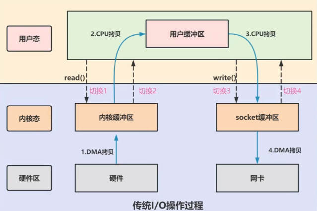


**以下是常见的零拷贝技术**：

+ mmap()+write()

  数据不从内核缓冲区拷贝到用户缓冲区了，所以减少了一次CPU拷贝，但是DMA拷贝和上下文切换次数不变。主要原理是将内核缓冲区的数据映射到虚拟内存中，让用户可以直接对数据进行操作

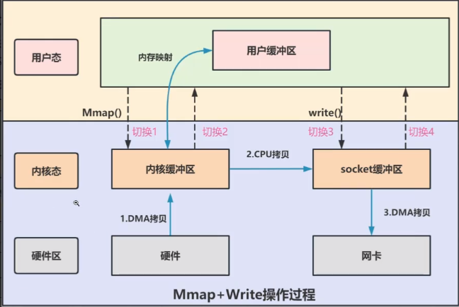


+ sendFile()

  用户程序调用sendFile切换到内核态执行数据的读写，在内核态完成读写后切换回用户态，并将sendFile返回给用户程序（通常是将读写了的长度返回）。

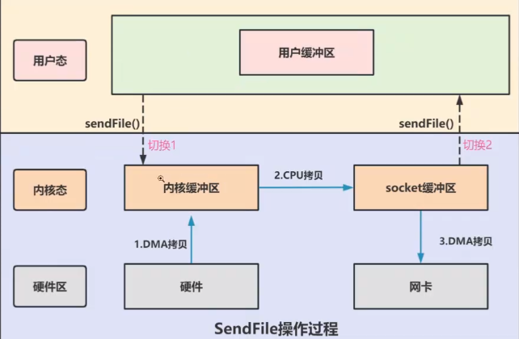

# 特殊文本文件和日志技术

## Properties

**特点**：

+ 存放的数据是键值对
+ 键不能重复
+ extends Hashtable
+ 文件后缀是.properties


**常用方法：**

+ getProperty：根据key值寻找特定的属性

+ setProperty：放入属性的键值对

+ list：打印属性列表

+ load：读取属性列表

+ loadFromXML：从XML文件读取属性

+ stringpropertyNames：返回所有属性名称

+ store：将属性列表写到一个输出流里去

  

**注意事项**：如果直接在方法的参数列表里new了一个管道，是可以不用自己关闭的，Properties会自己关闭


## XML文件

EXtensible Markup Language。在java编程过程中可以用Dom4j对其进行解析

```xml
<?xml version="1.0" encoding="" ?>
<!-- 以上声明必须放在第一行，也必须存在 -->
```

**应用场景：**

+ 系统配置文件
+ 作为传输数据的数据结构


**常用方法**：

+ public SAXReader()：构建Dom4j的解析器对象
+ public Document read(String url)：将XML文件读成Document对象
+ public Document read(InputStream is)：通过字节输入流读取XML文件
+ Element getRootElement()：获取根元素
+ public String getName()：获取元素名字
+ elements：获取当前元素下所有子元素
+ element：得到当前元素指定名字下的子元素，若有多个则返回第一个
+ attributeValue：通过属性名直接获得属性值
+ elementText：得到指定名称的子元素的文本
+ getText：得到文本


**XML文件生成：**

1. 创建一个StringBuilder对象

2. 调用append方法将数据进行拼接

3. 用输出流将内容写到文件里去

   

## 日志技术

 **日志框架：**第三方实现的代码

+ JUL(java.util.logging)
+ Log4j
+ Logback

**日志接口：**设计日志框架的标准，日志框架需要实现这些接口。

+ Commons Logging(JCL)
+ Simple Logging Facade for Java(SLF4J)


**Logback**

1. 将Logback框架导入项目中 
2. 将Logback核心配置文件logback.xml导入,核心配置文件中会声明日志文件的记录路径
3. 创建Logback框架提供的Logger对象，然后利用Logger对象调用提供的方法

```Java
public static final Logger LOGGER = LoggerFactory.getLogger("LogBackTest")
```


# 多线程


# 网络编程

**概念：**让设备中的程序与网络中其他设备中的程序进行数据交互

在java.net.*包下提供了网络编程的解决方案

**基本通信架构：**

+ Client客户端/Server服务端 架构：
  + 客户端：需要程序员开发，需要用户安装
  + 服务端：需要程序员开发
+ Browser浏览器/Server服务端 架构
  + 客户端：需要用户安装浏览器
  + 服务端：需要程序员开发


**网络通信的常见概念**

端口号：用于标记正在计算机设备上运行的应用程序，被规定为一个16位的二进制，范围是0~65535

+ 周知端口：0~1023；被预先定义的知名应用占用
+ 注册端口：1024~49151；分配给用户进程或某些应用程序（我们自己开发的程序一般使用注册端口）
+ 动态端口：49152~65535：不固定分配给某种进程，动态分配


## IP对象（InetAddress）

```Java
//获取本机IP
public static InetAddress getLocalHost()

//获取指定地址或域名的对象
public static InetAddress getByName(String host)

//获取主机名
public String getHostName()

//获取地址信息
public String getHostAddress()

//在指定毫秒内，判断主机与该ip对应的主机是否能连通
public boolean isReachable(int timeout)
```


## UDP通信

**UDP基本操作**

java.net.DatagramSocket

特点：无连接，不可靠

```Java
//创建客户端Socket对象
public DatagramSocket()

//创建服务端Socket对象
public DatagramSocket(int port)

//客户端创建数据包
public DatagramPacket(byte[] buf, int length, InetAddress address,int port)

//服务端创建数据包
public DatagramPacket(byte[] buf, int length)
```

```Java
//发送数据包
public void send(DatagramPacket dp)

//使用数据包接收数据
public void receive(DatagramPacket p)

//获取数据包
public int getLength()
```


**UDP多发多收**

```java
//用户端
while(true){
    System.out.println();
    String msg = sc.nextLine();
    if("exit".equals(msg)){
        System.out.println("退出");
        scoket.close();
        break;
    }
    byte[] bytes = msg.getBytes();
}
```

```java
//服务端
while(true){
	socket.receive(packet);
    //把socket关闭过程放在while循环外面
}
```


## TCP通信

**客户端实现：java.net.Socket**

1. 创建客户端的Socket对象，请求与服务端的连接
2. 使用Socket对象调用getOutputStream()方法得到字节输出流
3. 使用字节输出流完成数据的发送
4. 释放资源

```java
//根据指定的服务器ip和端口号请求和服务器建立连接
public Socket(String host, int port) 
    
//从Socket通信管道中获得一个字节输出流，用来发数据给服务端程序
public OutputStream getOutputStream()
```


**服务端实现：java.net.ServerSocket**

1. 创建ServerSocket对象为服务端注册端口
2. 调用ServerSocket对象的accept方法，等待客户端的连接并得到Socket对象
3. 通过Socket对象调用getInputStream方法得到字节输入流，完成数据的接收
4. 释放资源

```java
//为服务端注册端口
public ServerSocket(int port)

//阻塞等待客户端的连接请求，连接成功后返回服务端的Socket对象
public Socket accept()
```


**TCP多发多收**

基本实现方法和UDP差不多，需要额外添加异常捕获。因为TCP是可靠连接，当客户端离线了，服务端在监听时能检测到，此时会抛出异常。


**TCP实现与多个客户端同时通信：**（和UDP实现方式不同）

+ 在UDP通信中，服务端只需要实现一个循环，就能不断地接收客户端的多个消息，或是来个多个客户端的消息
+ 在TCP通信中，由于要维护连接，直接用两个循环实现多个客户端同时通信是不现实的（会一直等一个客户端释放连接后再和下一个客户端建立连接）。因此要引入**多线程**的概念，和多个客户端建立连接。

主线程负责不断监听连接，一旦出现连接，就将这个socket通信管道交给一个线程处理。

子线程负责不断接收消息


# Java高级

## 单元测试

针对最小的功能单元，编写测试代码对其进行正确性测试

<font size=5>**Junit**</font>

**优点：**

+ 可以灵活地编写测试代码，可以针对某个方法执行测试，也支持一键完成对所有方法的自动化测试

+ 不需要程序员去分析测试结果，会自动生成测试报告

  

**使用步骤：**

1. 导包

2. 为需要测试的业务类定义对应的测试类，为每个业务方法编写对应的测试方法（必须公共，无参，无返回值）

3. 测试方法上需要声明@Test注解

   

**Junit4.xxxx常用注解**

+ @Test：测试类中的方法必须用它进行修饰才能成为测试方法

+ @Before：用来修饰实例方法，该方法会在**每个测试方法执行前**执行一次
+ @After：用来修饰实例方法，该方法会在**每个测试方法执行后**执行一次
+ @BeforeClass：用来修饰静态方法，会在**所有测试方法执行前**执行一次
+ @AfterClass：用来修饰静态方法，会在**所有测试方法执行后**执行一次
+ 

**Junit5.xxxx常用注解**

+ @Test：测试类中的方法必须用它进行修饰才能成为测试方法

+ @BeforeEach：用来修饰实例方法，该方法会在**每个测试方法执行前**执行一次
+ @AfteEach：用来修饰实例方法，该方法会在**每个测试方法执行后**执行一次
+ @BeforeAll：用来修饰静态方法，会在**所有测试方法执行前**执行一次
+ @AfterAll：用来修饰静态方法，会在**所有测试方法执行后**执行一次

在测试方法执行前执行的方法常用于初始化资源

在测试方法执行后执行的方法常用于释放资源


## 反射

java.lang.reflect

反射 (Reflection) 是 Java 的特征之一，它允许运行中的 Java 程序获取自身的信息，允许以编程的方式解剖操作类或对象中的各种成分


<font size=5>**获取类对象**</font>

+ 方法一：Class c = 类名.class
+ 方法二：调用Class提供方法：public static Class forName(String package);
+ 方法三：Object提供的方法：public Class getClass()；Class c = 对象.getClass()


<font size=5>**获取构造函数**</font>

```Java
//获取全部public构造器
Constructor<?>[] getConstructors()

//获取全部构造器(无视权限修饰符)
Constructor<?>[] getDeclaredConstructors()

//获取某个public构造器
Constructor<T> getConstructor(Class<?>... parameterTypes)

//获取某个构造器(无视权限修饰符)
Constructor<T> getDeclaredConstructor(Class<?>... parameterTypes)
```


<font size=5>**获取成员变量**</font>

```Java
//获取全部public成员变量
public Filed[] getFields()

//获取全部成员变量(无视权限修饰符)
public Filed[] getDeclaredFields()

//获取某个public成员变量
public Filed getField(String name)

//获取某个成员变量(无视权限修饰符)
public Filed getDeclaredField(String name)
```

```Java
//赋值
void set(Object obj, Object value);

//取值
Object get(Object obj);

//设置为true时表示禁止检查访问权限（暴力反射
public void setAccessible(boolean flag);
```


<font size=5>**获取成员方法**</font>

```Java
//获取全部public成员方法
public Method[] getMethods()

//获取全部成员方法(无视权限修饰符)
public Method[] getDeclaredMethods()

//获取某个public成员方法
public Method getMethod(String name, Class<?>...parameterTypes)

//获取某个成员方法(无视权限修饰符)
public Method getDeclaredMethod(String name,Class<?>...parameterTypes)
```

```Java
//触发某个对象的该方法执行
public Object invoke (Object obj, Object...args)

//设置为true时表示禁止检查访问权限（暴力反射
public void setAccessible(boolean flag)
```


## 注解

###认识注解

Annotation

Java中的特殊标记，让其他程序可以根据注解信息来决定怎么执行该程序

- 注解本质是一个继承了Annotation接口的接口
- @注解（...）本质就是一个实现类对象

```Java
//自定义注解
public @interface 注解名称{
	public 属性类型 属性名() default 默认值;
}


//例子
public @interface MyTest1{
    String aaa();
    boolean bbb();
}
//反编译后的结果
public interface MyTest1 extends Annotation{
    public abstract String aaa();
    
    public abstract boolean bbb();
}

```

如果注解中只有一个value属性（或有多个其他属性，但都有默认值），则使用注解时，value名称可以不写


<font size=5>**元注解**</font>

修饰注解的注解

+ @Target

  + 声明被修饰的注解可以在哪些位置使用
    + TYPE：类，接口
    + FIELD：成员变量
    + METHOD：成员方法
    + PARAMETER：方法参数
    + CONSTRUCTOR：构造器
    + LOCAL_VARIABLE：局部变量
  + 用法例：@Target（ElementType.TYPE)

  

+ @Retention

  + 声明注解的保留周期
    + SOURCE：只作用在源码阶段，字节码文件中不存在
    + CLASS（默认值）：保留到字节码文件阶段，运行阶段不存在
    + RUNTIME（开发常用）：一直保留到运行阶段
  + 用法例：@Retention（RetentionPolicy.RUNTIME）


<font size=5>**注解的解析**</font>

**注解的解析：**判断类、方法、成员变量上是否存在注解，若存在则将内容解析出来

**解析步骤**：

+ 要解析谁上面的注解，就要先获取到谁的对象
+ Class、Method、Field、Constructor都实现了Annotatedelement接口，它们都拥有解析注解的能力

```Java
//获取当前对象上的注解
public Annotation[] getDeclaredAnnotations()

//获取指定的注解对象
public T getDeclaredAnnotation(Class<T> annotationClass)

//判断当前对象上是否存在某个注解
public boolean isAnnotationPresent(Class<Annotation> annotation)
```


## 动态代理


# 并发编程

## JMM

Java内存模型，是Java虚拟机规范中定义的关于内存访问、可见性、原子性和顺序性的规范。它定义了线程和主内存之间的抽象关系。

在Java中，每个线程都有自己的工作内存（本地内存），线程无法访问其他线程工作内存中的变量，也无法直接修改主内存中的共享变量，而是只能修改自己本地内存中的变量副本，再通过主内存实现变量的共享。

其主要特性包括：

+ 原子性
+ 可见性：一个线程修改了共享变量的值，其他线程能够立刻看到修改后的值
+ 有序性：程序执行的顺序和代码的先后顺序一致。


**happens-before规则：**

它定义了一系列规则，用于约束多线程间的内存访问和操作的顺序。抛开以下happens-before规则，JMM不能保证一个线程对共享变量的写，对于其他线程对该共享变量的读可见。

+ 线程解锁m之前对变量的写，对接下来对m加锁的其他线程对该变量的读可见。t1对x的赋值对t2可见。synchronized会强制线程从共享内存中获取共享变量的最新值。

  ```java
  static int x
  static Object m = new Object();
  new Thread(()->{
  	synchronized(m){
  		x = 10;
  	}
  },"t1").start();
  
  new Thread(()->{
  	synchronized(m){
  		System.out.println(m)
  	}
  },"t2").start();
  ```

+ 线程对volatile变量的写，对其他线程对该变量的读可见。【只能说明volatile能保证可见性，但并不说明volatile能保证原子性，只是说volatile关键字修饰的变量被修改后会被强制同步到内存中】

  ```java
  volatile static int x;
  new Thread(()->{
  	x = 10;
  	
  },"t1").start();
  
  new Thread(()->{
  	System.out.println(x);
  	
  },"t2").start();
  ```

+ 线程start前对变量的写，对该线程开始后对该变量的读可见

+ 线程结束时对变量的写，对其他线程得知它结束后的读可见

+ 线程t1打断t2前对变量的写，对其他线程得知t2被打断后对变量的读可见

+ 对变量默认值的写，对其他线程对该变量的读可见

+ 具有传递性


## 线程相关概念

**进程&线程&多线程：**

+ 进程：是计算机中正在运行的程序的实例，是**资源分配的最小单位**。进程之间是相互独立的，它们有各自独立的内存空间和资源，不会互相影响。

+ 线程：是操作系统**调度的最小单位**。每个线程有自己的程序计数器、虚拟机栈、本地方法栈，但多个线程共享进程的堆和方法区。

+ 多线程：从软件或者硬件上实现多个线程并发执行的技术。

  在单核时代，实现多线程能有效提高单个CPU的利用率，当一个线程因为IO被阻塞时，另外一个线程可以接手CPU运行。

  在多核时代，实现多线程可以有效利用多个CPU核心，提高任务执行的效率。

  

**线程的生命周期：**

+ new：初始状态。线程被创建了，但还没有开始执行
+ runnable：运行状态。分成运行中（running）和就绪（ready）状态。【操作系统层面是可以看到running和ready状态的，但是jvm层面只能看到runnable状态】
+ blocked：阻塞状态。正在等待某些资源，比如说IO操作完成，锁被释放等等。
+ waiting：等待状态。等待其他线程发出通知或者特定条件满足才会结束该状态。
+ time_waiting：类似于等待状态，但是一段时间后会自动恢复。
+ terminated：终止状态。线程一旦进入终止状态，就不能再次启动或执行任务。


**多线程一定会提高效率吗？**

不一定！！！

如果是CPU密集型任务，使用多线程需要在不同线程之间频繁地切换，而线程切换也是有开销的，这个时候使用多线程反而会降低效率

如果是IO密集型任务，使用多线程可以在一个线程被IO阻塞的时候充分利用CPU，此时会提高运行的效率


--------------

**死锁的必要条件：**

+ 互斥：该资源只能同时被一个线程占用
+ 请求与保持：线程获取资源后若被阻塞，不会释放已获得的资源
+ 不可剥夺：线程获取资源后不能被别的线程剥夺已获得的资源
+ 循环等待：若干个线程之间相互等待别的线程释放资源


**预防和避免死锁：**

+ 预防死锁：

  + 破坏请求与保持条件：一次性获取所有需要的资源

  + 破坏不可剥夺条件：占用资源的线程获取不到资源的时候，主动释放已经获取到的资源

  + 破坏循环等待：按顺序申请资源

    【线程A和线程B都需要获取资源1和资源2，如果不按顺序申请，线程A获取了资源1，线程B获取了资源2，然后他们就会陷入对对方持有资源的等待中。但如果按顺序申请资源，线程A和线程B都会先去申请资源1，假设线程A获取了资源1，线程B就会直接进入等待，而不会去申请资源2占用线程A需要的后续资源】

+ 避免死锁：

  + 银行家算法：在资源分配时，借助于算法对资源分配进行计算评估，使其进入安全状态。

--------------

**线程同步**

**线程安全：**在拥有**共享数据**的**多条线程**并行执行的程序中，线程安全的代码会通过同步机制保证各个线程都可以正常且正确的执行。

+ 多个线程同时执行
+ 访问同一资源
+ 对该资源存在修改

**线程同步：**解决线程安全的方法，即当有一个线程在对内存进行操作时，其他线程都不可以对这个内存地址进行操作。

+ 方式一：同步代码块：把访问共享资源的核心代码块上锁
+ 方式二：同步方法：把访问共享资源的核心方法上锁
+ 方式三：Lock锁：一个接口，通过它的实现类ReentrantLock来创建锁对象

```Java
//方式一
//实例方法
synchronized(this)
    
//静态方法
synchronized(类名.class)
```

```Java
//方式二
修饰符 synchronized 返回值类型 方法名称（形参列表）{
	操作共享资源的代码
}
```

```Java
//方法三
private final Lock lk = new ReentrantLock();

//加锁
lk.lock();
代码块
//解锁
lk.unlock();  //该操作最好放在finally里进行。确保无论是否正确实现功能都要对锁进行释放
```


**线程通信**

**概念：**当多个线程共同操作共享资源时，线程之间通过某种方式互相告知自己的状态，从而实现协同工作

```Java
//必须拿锁对象调用以下方法
//让当前线程等待并释放所占锁，直到另外一个线程调用notify()或notifyAll()
void wait()
    
//唤醒等待的某个对象
void notify()

//唤醒等待的所有对象
void notifyAll()
```


## Thread类

**构造器：**

```Java
//创建线程时直接为其取名
public Thread(String name);

public Thread(Runnable target);

public Thread(Runnable target, String name)
```


**常用方法：**

```Java
//要重写这个方法，但是调用的时候不能直接调用这个方法，否则就和调用一个普通方法没有区别
public void run();

//启动线程
public void start();

//获取线程名字
public String getName();

//设置获取线程名字。默认线程名称是Thread-x，主线程名字是main
public void setName(String name);

//获取当前执行的线程。
public static Thread currentThread();

//让当前执行的线程暂停一段时间
public static void sleep(long time);

//让当前调用这个方法的线程先执行完
public final void join();
```


## 线程创建方式

1. **基于Thread类【无返回值】**：继承Thread类，重写run方法【任务和线程是耦合的】

   + 缺点：由于Java是单继承的，继承了Thread类之后就不能继承其他类了。

   ```java
   //方法一
   public class MyThread extends Thread{
       @Override 
       public void run(){
           
       }
   }
   
   //主函数里写的内容
   MyThread myThread1 = new MyThread();
   MyThread myThread2 = new MyThread();
   myThread1.start();
   myThread2.start();
   ```

2. **基于Runnable接口【无返回值】**：实现Runnable接口作为任务类，实现run方法。创建Thread对象，填入任务类对象。【任务和线程是分开的，一个任务可以被多个线程执行】

   ```java
   //方法二
   public class MyRunnable implements Runnable{
       @Override //重写Runnable的run方法
       public void run(){
          
       }
   }
   //主函数里写的内容
   Runnable target = new MyRunnable();
   Thread t1 = new Thread(target);
   Thread t2 = new Thread(target);
   t1.start();
   t2.start();
   ```

3. **基于Callable接口【有返回值】**：实现Callable**泛型接口**，类型指定为需要的返回值类型，实现call()方法。传入的类型和接收的类型都是FutureTask<T>类型

   ```java
   //方法三
   public class MyCallable implements Callable<Integer> {    
       @Overrride
       public Integer call() throws Exception{
           int sum = 0;
           for(int i=0;i<100;i++){
               sum+=i;
           }
           return sum;
       }
   }
   
   MyCallable mc = new MyCallable();
   FutureTask<Integer> f1 = new FutureTask<>(mc);//封装成FutureTask对象
   Thread t1 = new Thread(f1);
   t1.start();
   Integer result = f1.get();
   ```

4. **基于线程池**：在后面详细解释

【不管哪种方法，其实归根结底都是通过new Thread().start()来创建；实现Runnable，Callable接口都是创建了线程体，然后提供给Thread运行。线程相当于容器，线程体是里面可以执行的任务】


## 线程池

**池化技术：**池化技术是一种资源管理策略，旨在提高资源的利用效率。其核心思想是在需要时动态地分配和重用资源，而不是频繁地创建和销毁它们。

**为什么要使用线程池：**用户每发起一个请求，后台就要创建一个新线程来处理，创建线程的开销很大，当请求过多时，会产生大量的线程，这样会严重影响系统的性能。

**如何获得线程池对象：**

+ 方式一：基于Executors(线程池的工具类)创建

+ 方式二：基于ThreadPoolExecutor创建一个线程池对象

<font size=5>**ExecutorService常用方法**</font>

```java
Runnable target = new MyRunnable();

//执行Runnable任务
void execute(Runnable Command)

//执行Callable任务，返回未来任务对象Java
Future<T> submit(Callable<T> task)

//等线程池的任务全部执行完毕后关闭线程池
void shutdown()

//不管任务是否执行完毕，立即关闭线程池
List<Runnable> shutdownNow()
```

-----------

<font size=5>**基于Executors获取线程池**</font>

【底层还是基于ThreadPoolExecutor实现的，只是给了默认的参数】

```Java
//创建一个线程数无上限的线程池【实际上是有的，不过值很大很大】。如果线程执行完毕且空闲了60s,会回收掉线程
public static ExecutorService newCachedThreadPool()

//创建一个线程数有上限的线程池。如果提交的任务数超过上限，任务就会进入队列等候
public static ExecutorService newFixedThreadPool(int nThreads)

//创建一个只有一个线程的线程池对象，若该线程出现异常，线程池会补充一个新线程。
public static ExecutorService newSingleThreadExecutor()

//创建一个线程池，可以在给定的延迟后运行任务会定期执行任务
public static Scheduled ExecutorService newScheduledThreadPool(int corePoolSize)
```


**注意事项：**尽量不要用Executors去创建线程池。CachedThreadPool()创建的线程池允许创建地线程数量是Integer.MAX_VALUE【线程积压】。FixedThreadPool和SingleThreadPool创建的线程池其阻塞队列是无界的LinkedBlockingQueue【任务队列积压】。ScheduledThreadPool和SingleThreadScheduledExecutor使用的是无界的延迟阻塞队列DelayedWorkQueue【延迟任务的积压】


---------------

<font size=5>**基于ThreadPoolExecutor获取线程池**</font>

```Java
public ThreadPoolExecutor(
    int corePoolSize, int maximumPoolSize, 
    long keepAliveTime, TimeUnit unit, 
    BlockingQueue<Runnable> workQueue,
    ThreadFactory threadFactory, 
    RejectedExecutionHandler handler)
```

+ corePoolSize：线程池的核心线程数量
+ maximumPoolSize：最大线程数量【最大线程数不能小于核心线程数，否则会报IllegalArgumentException】
+ keepAliveTime：临时线程存活时间
+ unit：临时线程存活时间的单位
+ workQueue：线程池任务队列。必须是BlockingQueue的实现类，比如说ArrayBlockingQueue（容量固定），LinkedBlockingQueue（不指定容量的话容量就是无限的）
+ threadFactory：线程工厂
+ handler：线程池拒绝策略


**阻塞队列**

+ LinkedBlockingQueue：一种基于链表的阻塞队列，支持无界和有界的形式，但在FixedThreadPool和SingleThreadExector中使用的是无界的。
+ SynchronousQueue：没有容量，不存储数据。CachedThreadPool中用的就是这种阻塞队列，但没有使用SynchronousQueue的阻塞操作。
+ DelayedWorkQueue：根据延迟时间长短对任务进行排序，添加元素满了会自动扩容。ScheduledThreadPool中用的就是这种。
+ ArrayBlockingQueue：基于数组实现的有界阻塞队列，用ThreadPoolExecutor创建线程池时比较推荐用这种。


**新任务拒绝策略**

+ ThreadPoolExecutor.AbortPolicy：默认策略，丢弃任务抛异常
+ ThreadPoolExecutor.DiscardPolicy：丢弃任务不抛异常
+ ThreadPoolExecutor.DiscardOldestPolicy：抛弃队列中等待最久的任务
+ ThreadPoolExecutor.CallerRunsPolicy：主线程调用任务的run方法，绕过线程池直接执行


**注意事项：**

1. **临时线程什么时候创建**

   新任务提交的时候发现核心线程都在忙，任务列表满了，并且还可以创建临时线程时会创建临时线程。也就是说，当一个新任务提交时

2. **什么时候会拒绝新任务**

   核心线程和临时线程都在忙，任务队列满了，新的任务来时会拒绝任务


**多线程注意事项**：

+ 启动线程是调用start方法而不是run方法，调用run方法的话会被当成普通的java对象（会先跑完子线程任务再执行主线程）
+ 不要把主线程任务放在启动子线程之前（会先跑完主线程任务再执行子线程）


**线程池越大越好吗？**

+ 资源分配：线程也会占用一定的系统资源，如果将线程池设置得过大会占用过多资源
+ 线程管理：线程池太大，管理的复杂度也会提高
+ 上下文切换：线程过多，上下文切换会比较频繁，在CPU密集型任务比较多的情况下会影响系统整体性能。


**如何设置线程池的大小：**

CPU密集型任务指的是利用CPU计算能力的任务，IO密集型指的是涉及到网络读取或者文件读取等操作的任务。

线程数比较严谨的计算方式是：最佳线程数=N(CPU核心数)*（1+WT(线程等待时间)/ST（线程计算时间））WT=线程运行总时间-ST

+ 对于CPU密集型，线程设置为N+1，其中N为CPU核心数
+ 对于IO密集型，线程设置为2N，其中N为CPU核心数


## Future

Java中的Future是一个接口，代表一个异步计算的结果，将任务提交给ExecutorService后，它会返回一个Future对象，这个对象就表示了任务的最终结果。Future接口定义了五个方法：

```java
public interface Future<V> {
    // 取消任务执行
    // 成功取消返回 true，否则返回 false
    boolean cancel(boolean mayInterruptIfRunning);
    // 判断任务是否被取消
    boolean isCancelled();
    // 判断任务是否已经执行完成
    boolean isDone();
    // 获取任务执行结果
    V get() throws InterruptedException, ExecutionException;
    // 指定时间内没有返回计算结果就抛出 TimeOutException 异常
    V get(long timeout, TimeUnit unit)

        throws InterruptedException, ExecutionException, TimeoutExceptio

}
```


FutureTask，CompletableFuture都是Future的实现类


## synchronized

**Java是如何实现线程安全的？**

关键字层面有synchronized，volatile关键字。接口层面有Java.util.concurrent.atomic，Java.util.concurrent.locks包里的工具以及并发容器【也就是Java.util.concurrent包里的类】可以用于实现线程安全。

synchronized是 Java 中的一个关键字，被它修饰的方法或者代码块在任意时刻只能有一个线程执行。它的使用方式主要有3种：

1. 修饰实例方法：获取当前实例对象的锁
2. 修饰静态方法：获取当前类对象的锁
3. 修饰代码块：获取指定对象的锁。


synchronized在早期版本中属于重量级锁，依靠Monitor实现。而Monitor依靠操作系统中的Mutex Lock实现，每次挂起线程时需要切换到内核态，时间成本较高。

synchronized在JDK1.6以后引入了轻量级锁、偏向锁等优化，提升了效率。

特别注意：偏向锁在JDK1.5中被默认关闭，JDK1.8之后被彻底废弃。


<font size=5>**synchronized底层原理**</font>

**重量级锁：**

JDK1.5版本之前，锁的状态只有”无锁“和”重量级锁“两种。在使用synchronized上重量级锁时，会使用到Monitor。

Monitor 是基于 C++实现的，Java中的每个对象中都内置了一个ObjectMonitor，也就是对象的监视器。

在Java中所有的对象都由**对象头**、实例数据、填充字节组成，而对象头又由Mark Word和Klass Word组成。对象头的Mark Word根据记录的内容的不同，表示不同的状态，Klass Word中存储的是类对象的地址,。

Normal状态下，Mark Word里存储的是hashcode，age，biased_lock，最末两位是01。而当使用synchronized去上重量级锁时，会在对象的mark word中用30位记录Monitor对象的地址，最后两位设置为10。Monitor中的Owner字段会被设置为加锁成功的线程的标志

当其他线程想要获取锁时，首先会查看对象头中的Mark Word，如果最后两位为10，说明此对象处于Heavyweight Locked状态，前30位存的是Monitor地址，于是就可以通过该地址找到Monitor。

找到Monitor后再查看Monitor中的owner，如果owner的线程标识和自身不同，就会进入Monitor中的EntryList，进入阻塞状态了。当持有锁的线程释放锁后，会唤醒阻塞在EntryList中的线程。

|                            对象头                            |                 Monitor                 |                     Mark Word的不同状态                      |
| :----------------------------------------------------------: | :-------------------------------------: | :----------------------------------------------------------: |
| 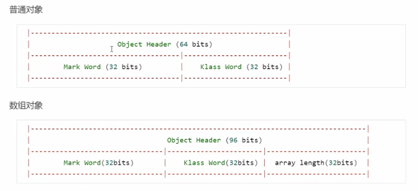 | 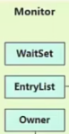 | 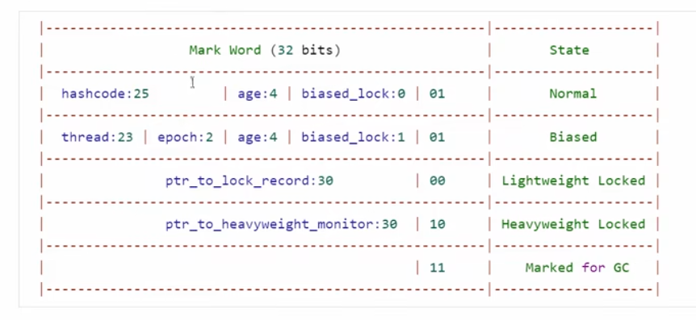 |

-----------

**轻量级锁：**

JDK1.5以后引入了轻量级锁的概念。轻量级锁对使用者是透明的，使用的关键词字依然是synchronized，只不过在上锁的时候默认先上轻量级锁。当另一个线程在本线程持有锁期间尝试获取同一个锁时，这个锁会膨胀为重量级锁。轻量级锁获取和释放的流程如下：

当线程要获取锁时，它会创建一个Lock Record，将Lock Record里的数据和对象头里的Mark Word进行交换，由于lock record交换过去的信息最后两位是00，所以object的状态就会从normal变为lightweight locked。替换成功就说明上锁成功了。

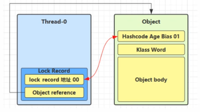

如果同一个线程中的其他方法也要获取该锁（锁重入），就会再创建一个lock record，用于对重入次数进行记录。

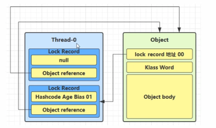

当要解锁时，如果有取值为null的锁记录，说明有重入锁，则释放一个lock record，表示重入计数减一。如果没有，则和mark word进行交换，将object head中的内容恢复。若恢复成功，则解锁成功。若恢复失败，说明锁被升级成重量级锁了，则开启重量级锁的解锁流程。

--------------

**锁膨胀：**

线程尝试加轻量级锁的过程中，CAS操作不成功（交换不成功）的时候，说明可能有其他线程加上了轻量级锁，此时就会进行锁膨胀，将轻量级锁变为重量级锁。

假设此时Thread0持有轻量级锁，Thread1想要获取锁失败，就会为Object申请Monitor，让Object指向Monitor，并且将Object中的lock record替换为Monitor的地址，自身进入EntryList阻塞。

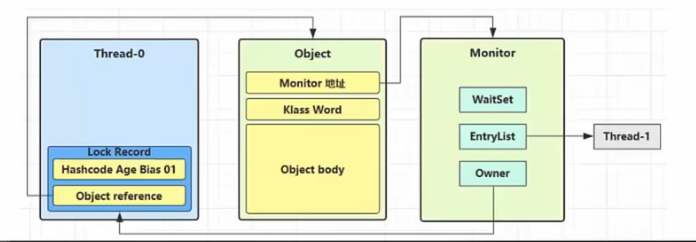


Thread0释放锁时，试图进行CAS，发现恢复信息失败后会进入重量级锁解锁流程。即根据Object中的Monitor地址找到Monitor，将Owner修改为null，唤醒EntryList中的阻塞线程。

-----------

**自旋优化：**

锁膨胀的过程实际上是将轻量级锁升级为重量级锁的过程

当线程发现Monitor中的owner不为null时，它不会立刻进入阻塞状态，而是会先进行若干次自旋，如果自旋期间锁的持有者释放了锁，线程就不进入阻塞状态了，而是去竞争锁。如果自旋期间锁的持有者仍然没有释放锁，线程再进入阻塞状态。

自旋对多核CPU才有意义。因为自旋会占用CPU时间，假设只有单个CPU，线程在自旋时占用了这个CPU，锁的持有者就无法继续执行后续代码并且释放锁，所以线程的自旋就没意义了。


**偏向锁：**

偏向锁（Biased Lock）是Java中用于提高**单线程访问**同步块性能的一种锁优化机制。它的设计初衷是针对仅有一个线程访问同步块的情况，通过减少同步操作的开销来提高性能。

当Thread0访问同步块时，会首先对对象头中的Mark Word进行判断。如果Mark Word的后三位是001，说明该对象处于Normal状态，此时线程就会在Mark Word中填入自己的线程id，并且将Mark Word的最后三位设置为101。如果Mark Word后三位是101，则检查Mark Word中的Thread id是否是自身的id，如果不是就会进行锁膨胀。

Thread0进行锁重入时只需要查看Mark Word中的Thread Id是否与自身的相同即可（在轻量级锁的情况下需要生成一个锁记录，然后尝试Swap锁记录的地址和Mark Word中的内容）。


注意：

+ 如果开启了偏向锁，对象创建后，mark word的最后三位会变为101（存在延时，程序刚启动的时候会保持001，过一段时间后才会变成101，可以通过设置参数取消延时）。

+ 当调用了一个可偏向对象的hashCode方法时，会自动取消偏向状态。因为在biased状态下mark word里存放的是thread id，只有在normal状态下存放的才是hashcode


## volatile

在多线程并发执行的情况下，多个线程共享的成员变量被修改后，可能不能立刻被其他线程看见。

这是因为不同的线程都拥有各自的工作内存，它们会将共享变量从主内存中拷贝进自己的工作内存，并在自己的工作内存上对共享变量进行操作。

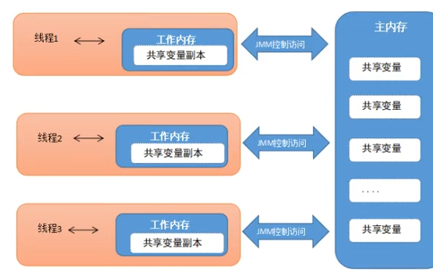


想要解决这个问题有两种方案：

+ 使用synchronized加锁：当线程进入synchronized代码块后，会先获得锁，然后清空工作内存，从主内存中将共享变量拷贝到工作内存，执行完代码后再将值刷新回内存。
+ 使用volatile关键字修饰变量：当一个线程修改了共享变量，其他线程内部的共享变量会被更改为失效状态，其他线程只能从主内存读取新值。


**volatile可以保证原子性吗？**

不能。对volatile修饰的字段进行修改时包括以下步骤：将主内存中的数据读取到工作内存，对数据进行修改操作，将修改后的数据写回主内存。这个过程是不加锁的，也就意味着在线程并发的情况下，线程A修改完数据后，如果发生线程调度，由于此时线程A还没有将数值写回内存，线程B获取到的数据依然是旧数据，线程B对数据进行修改写回内存后切换到线程A，线程A再将修改写回内存，线程B修改的内容就会被覆盖。

简单来说，就是volatile只能保证线程读取到的数据是线程请求获取数据的时候的最新值，但不能保证对数据操作的原子性。


**volatile的使用场景？**

+ 触发器：一个线程修改volatile变量后其他线程都可见，所以可以用来通知其他线程开始或停止某些操作
+ 纯赋值操作：就是无需查询数据的值，只对数据进行赋值的操作。


## atomic

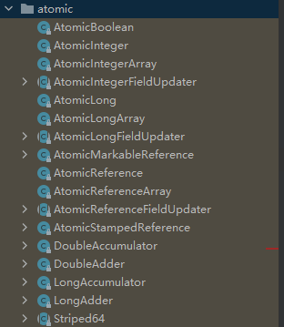

java.util.concurrent.atomic包下提供的类，它们都是具有原子/原子操作特征的类，即类中的操作都是不可中断的。即使是在多个线程一起执行的时候，一个操作一旦开始，就不会被其他线程干扰。大致可以分为四大类：

+ 基本类型
  + AtomicInteger
  + AtomicLong
  + AtomicBoolean
+ 引用类型
  + AtomicReference
  + AtomicMarkableReference
  + AtomicStampedReference
+ 数组类型
  + AtomicIntegerArray
  + AtomicLongArray
  + AtomicReferenceArray
+ 对象的属性修改类型（字段更新器）
  + AtomicIntegerFieldUpdater：原子更新整型字段
  + AtomicLongFieldUpdater：原子更新长整型字段
  + AtomicReferenceFieldUpdater：原子更新引用类型字段

在JDK1.8之后还引入了一些原子累加器

+ DoubleAdder
+ LongAdder


<font size=5>**基本类型**</font>

以AtomicInteger为例，包括以下方法（只列举部分：

+ get
+ set
+ lazySet

+ compareAndSet
+ getAndSet
+ getAndUpdate
+ updateAndGet
+ incrementAndGet
+ decrementAndGet


<font size=5>**引用类型**</font>

基本类型只能对一个元素进行操作，如果需要对多个元素同时进行操作，就需要用到引用类型

AtomicReference：基于CAS，存在ABA问题，无法判断共享变量是否被修改过。

AtomicStampedReference：带有版本号（stamp），可以知道变量被更改过多少次（stamp是int类型的），避免ABA 问题。

AtomicMarkableReference：带有标记（mark），可以知道变量是否被更改过（mark是boolean类型的）。


<font size=5>**数组类型**</font>

保护数组里的元素。对于数组来说，如果使用引用类型保护，那么保护的就是数组的地址而不是数字中的元素了，所以需要有数组类型。

以AtomicIntegerArray为例

```java
public final int get(int i) //获取 index=i 位置元素的值
public final int getAndSet(int i, int newValue)//返回 index=i 位置的当前的值，并将其设置为新值：newValue
public final int getAndIncrement(int i)//获取 index=i 位置元素的值，并让该位置的元素自增
public final int getAndDecrement(int i) //获取 index=i 位置元素的值，并让该位置的元素自减
public final int getAndAdd(int i, int delta) //获取 index=i 位置元素的值，并加上预期的值
boolean compareAndSet(int i, int expect, int update) //如果输入的数值等于预期值，则以原子方式将 index=i 位置的元素值设置为输入值（update）
public final void lazySet(int i, int newValue)//最终 将index=i 位置的元素设置为newValue,使用 lazySet 设置之后可能导致其他线程在之后的一小段时间内还是可以读到旧的值。

```


<font size=5>**字段更新器**</font>

保护对象中属性赋值的原子性。

每次使用前需要先用newUpdater()方法创建一个更新器，更新的对象属性必须用volatile修饰。创建需要修改字段的对象后，只需将对象作为参数传入更新器对应的方法即可。

```java
//构造器
public static <U> AtomicIntegerFieldUpdater<U> newUpdater(Class<U> tclass,String fieldName) {
        return new AtomicIntegerFieldUpdaterImpl<U>(tclass, fieldName, Reflection.getCallerClass());
}

//使用
public static void main(String[] args) {
    AtomicIntegerFieldUpdater<User> a = AtomicIntegerFieldUpdater.newUpdater(User.class, "age");

    User user = new User("Java", 22);
    System.out.println(a.getAndIncrement(user));// 22
    System.out.println(a.get(user));// 23
  }

```


<font size=5>**原子累加器**</font>


## ReentrantLock

ReentrantLock 是 Java 中的一种可重入锁（Reentrant Lock）实现，它提供了比 synchronized 更灵活和强大的锁机制。主要包含以下特点：

+ 等待可中断：正在等待的线程可以选择放弃等待，改为处理其他事情。【synchronized是不可中断的】

+ 可以设置为公平锁【synchronized是非公平的】

+ 可以设置超时时间【synchronized如果获取不到锁会一直等待】

+ 支持多个条件变量【synchronized只支持一个wait set】

+ 可实现选择性通知

+ 可重入

  

**可重入：**

可重入意味着同一个线程可以多次获得同一把锁。如果一个线程已经持有某个锁，再次请求这个锁时会立即成功


**可中断：lock.lockInterrutibly()**

通过lock.lockInterrutibly()方法获取锁，和lock.lock()方法的区别是，进入阻塞队列后可以被其他线程通过interrupt方法打断阻塞状态。


**可设置超时时间：lock.tryLock()**

lock.tryLock()方法设置超时时间和超时时间单位，超时时间内没有获取到


**公平锁：ReentrantLock(boolean fair)**

锁的分配按照线程等待的顺序进行，即“先来先服务”。可以使用在ReentrantLock(boolean fair)构造方法中指定是否公平，默认是非公平的。公平锁一般没有必要，会降低并发度。


**多个条件变量：lock.newCondition()**

通过lock.newCondition()方法获取条件变量condition，然后调用condition.wait()方法让线程在该等待队列中等待，用condition.signal()/condition.signalAll()唤醒该等待队列中的线程


## ThreadLocal

**为什么需要ThreadLocal**

为了实现变量共享。静态变量虽然是全局共享的，但是多个线程同时访问静态变量会出现并发问题。为了实现变量的共享，又为了实现线程间变量的隔离，就需要用到ThreadLocal


**ThreadLocal是什么**

每个Thread中都存在一个ThreadLocalMap，Map的key是ThreadLocal对象，Map的value为需要缓存的值。ThreadLocal可以被视为一个用于操作ThreadLocalMap的工具类


**ThreadLocal导致的内存泄漏了解吗？**

如果在线程池中使用ThradLocal会造成内存泄漏，因为ThreadLocal对象使用完后应该要将设置的key和value进行回收，但是线程池中的线程不会回收，所以就会造成内存泄露。解决方法是在使用了ThreadLocal对象之后，手动调用ThreadLocal的remove方法，手动清除Entry对象。


+ ThreadLocal.set(val)：获取当前线程对应的ThreadLocalMap，如果不存在就创建一个，如果存在就往其中存入val


ThreadLocalMap里的Entry都extends WeakReference<ThreadLocal<?>>


**应用场景：**

当一个变量需要共享，但是又需要每个线程之间互不影响，就可以使用ThreadLocal。

+ 跨层传递信息。每个方法都声明一个参数很麻烦，通过ThreadLocal共享变量更方便
+ 隔离线程。操作一些线程不安全的工具对象
+ 

## 线程安全集合类

+ 遗留的安全集合
  + HashTable
  + Vector
+ 修饰的安全集合（使用Collections装饰的集合，本质上依然是基于synchronized实现）
  + Synchronizedxxxxxx
+ JUC安全集合
  + Blocking类：阻塞队列
  + CopyOnWrite类：一般用于读多写少的场景，修改的代价比较高
  + Concurrent类：


<font size=5>**ConcurrentMap**</font>

```java
public class ConcurrentHashMap<K,V> extends AbstractMap<K,V>    implements ConcurrentMap<K,V>, Serializable {
    
}
```


=======
# Java基本知识

## JDK和JRE

JDK（Java Develoment Kit）：Java开发工具包

+ JRE（Java Runtime Enviroment）：Java的运行环境

  + JVM（Java Virtual Machine）：Java虚拟机，真正运行Java程序的地方

  + 核心类库：Java自己写好的程序，给程序员自己的程序调用的

+ 开发工具


1. 写好的程序test.java通过javac被编译成test.class
2. test.class被java送入JVM运行
3. JVM通过调用核心类库里的程序运行用户提供的程序


## Java跨平台的工作原理

不同平台有不同的JVM虚拟机，JAVA程序通过javac编译成Class文件后就可以在不同的虚拟机上运行


## IDEA快捷键

main/psvm，sout...:快捷输入相关代码

Ctrl + D：复制当前数据到下一行

Ctrl + Y：删除所在行，建议用Ctrl + X

Ctrl + ALT + L：格式化代码

ALT + SHIFT + 上，ALT + SHIFT + 下：上下移动当前代码


## Java内存分配

+ 方法区域
+ 栈：方法运行时进入的内存，变量也存储在这里
+ 堆：new出来的东西


# 面向对象

## 对象和类

**类：具备某些共同特征的实体的集合**


在一个类中可以包含以下类型的变量：

+ 局部变量：在方法、构造方法、或是语句块中定义的变量。方法结束后变量自动销毁。

+ 成员变量：在类中，但在方法外的变量。**在创建对象是被实例化**。
+ 类变量：在类中，但在方法外的变量，必须被生命为static类型。


每个类都有构造方法，可以有多个，如果没有显示提供，Java编译器会提供一个默认的构造方法。在创建对象时至少要调用一个构造方法，且构造方法必须与类同名。


**创建对象**

1. 声明：声明一个对象，包括其名称和类型
2. 实例化：用关键字new创建一个对象
3. 初始化：用new创建对象时调用构造方法初始化对象

```
public class Puppy{
   public Puppy(String name){
      System.out.println("小狗的名字是 : " + name ); 
   }
   public static void main(String[] args){
      // 下面的语句将创建一个Puppy对象
      Puppy myPuppy = new Puppy( "tommy" );
   }
}
```


**访问实例变量和方法**

```
/* 实例化对象 */
Object referenceVariable = new Constructor();
/* 访问类中的变量 */
referenceVariable.variableName;
/* 访问类中的方法 */
referenceVariable.methodName();
```


**源文件声明规则**

1. 一个源文件中只能有一个 public 类，且名称应与public 类的类名保持一致

2. 一个源文件可以有多个非 public 类

3. 如果一个类定义在某个包中，那么 package 语句应该在源文件的首行

4. 如果源文件包含 import 语句，那么应该放在 package 语句和类定义之间。如果没有 package 语句，那么 import 语句应该在源文件中最前面。

5. import 语句和 package 语句对源文件中定义的所有类都有效。在同一源文件中，不能给不同的类不同的包声明。

   ```
   #文件名 MyClass.java
   
   package com.example.mypackage;
   
   import java.util.List;
   
   public class MyClass{
   
   }
   
   class MyOtherClass1{
   
   }
   
   class MyOtherClass2{
   
   }
   ```

   

**this**

this就是一个对象，用在方法中来拿到当前对象。

用来解决对象的成员变量与方法内部变量名称一致所导致的访问冲突问题


## Java基本数据类型

<font size=5>**内置数据类型（6+1+1）**</font>

+ byte：8位、有符号、以二进制补码表示的整数；表示范围为（-128,127），默认值是0，用于大型数组中节约空间。
+ short：16位、有符号、以二进制补码表示的整数；表示范围为（-32768，32767），默认值是0，也可以像 byte 那样节省空间。
+ int：32位、有符号、以二进制补码表示的整数；表示范围为（-2147483648**，**2147483647），默认值是0
+ long：64 位、有符号、以二进制补码表示的整数；表示范围为（9223372036854775808，-9223372036854775807），默认值是 0L。
+ float：单精度、32位、符合IEEE 754标准的浮点数；**不能表示精确的值**
+ double：双精度、64 位、符合 IEEE 754 标准的浮点数；**浮点数的默认类型**，**不能表示精确的值**
+ boolean：默认值是false
+ char：16位Unicode字符

```
数据类型：Byte，Short，Integer，Long，Float，Double，Character
查看最小值：数据类型.MIN_VALUE
查看最大值：数据类型：MAX_VALUE
```


<font size=5>**引用数据类型**</font>

引用，数组，都是引用数据类型，其默认值都是null。一个引用变量可以用来引用任何与之兼容的类型

```
Site site = new Site("Runoob")
```


<font size=5>**Java常量**</font>

在java中用final关键字来修饰常量，声明方式与变量类似，常量名通常用大写字母表示


<font size=5>**自动类型转换**</font>

转换等级从低到高：

byte，short，char -> int -> long -> float -> double


数据类型转换满足以下转换规则：

- 不能对boolean类型进行类型转换。
- 不能把对象类型转换成不相关类的对象。
- 在把容量大的类型转换为容量小的类型时必须使用强制类型转换。
- 转换过程中可能导致溢出或损失精度
- **浮点数到整数的转换是通过舍弃小数得到，而不是四舍五入**


1. 自动类型转换

   转换前的数据类型的位数要低于转换后的数据类型

2. 强制类型转换

   转换的数据类型必须是兼容的

3. 隐含强制类型转换

   整数默认类型int；小数默认类型double，在定义float类型时必须在后面跟上f或者F


## Java变量类型

变量声明基本格式：

```
type identifier [ = value][, identifier [= value] ...] ;
```


+ 局部变量（Local Variables）：定义在方法、构造方法或语句块中的变量，作用域仅限于当前方法、构造方法或语句块。不能被访问修饰符修饰。**不能被访问修饰符修饰**。
+ 成员变量（Instance Variables）：定义在类中、方法之外的变量，作用域为整个类，可以被类中的任何方法、构造方法或语句块访问。**可以被访问修饰符修饰**。
+ 静态变量（Class Variables）：定义在类中、方法之外的变量，用static关键字修饰，作用域为整个类。**可以被访问修饰符修饰**。在程序运行期间只有一个副本
+ 参数变量（Parameters）：调用方法时传递给方法的值，作用域仅限于方法内部。


<font size=5>**局部变量**</font>

- 局部变量在方法、构造方法、或者语句块被执行的时候创建，当它们执行完成后，变量将会被销毁。
- 局部变量只在声明它的方法、构造方法或者语句块中可见，不能被其他方法或代码块访问。
- 局部变量没有默认值，声明后必须经过初始化才能使用。声明时如果没有初始化，变量会被赋予默认值。
- 局部变量是在**栈上**分配的

```
type variableName
```


<font size=5>**静态变量**</font>

+ 静态变量在类加载时被创建，在整个程序运行期间都存在。
+ 由于静态变量是与类相关的，因此可以通过类名来访问静态变量，也可以通过实例名来访问静态变量
+ 用来存储整个程序都需要使用的数据，如配置信息、全局变量等。
+ 和常量的区别：常量一旦被赋值就不能再修改，在编译时就已经确定了值，而静态变量在运行时可以改变。
+ 静态变量是属于类的，而不是对象的实例，在内存中只有一份拷贝，被所有实例共享。因此，当**多个线程同时访问一个包含静态变量的类时**，需要考虑其线程安全性。


<font size=5>**成员变量**</font>

+ 当一个对象被实例化之后，每个成员变量的值就跟着确定。
+ 成员变量的值应该至少被一个方法、构造方法或者语句块引用，使得外部能够通过这些方式获取实例变量信息。
+ 访问修饰符可以修饰成员变量，一般情况下应该把成员变量设为私有。通过使用访问修饰符可以使成员变量对子类可见。

```
accessModifier type variableName;
```


<font size=5>**参数变量**</font>

参数变量与局部变量类似，但它们只在方法或构造函数被调用时存在，并且只能在方法或构造函数内部使用。

参数传递方式：

	+ 值传递：传递的是实际参数的值的副本，参数变量被赋新值时只会修改副本的值不会影响原值，基本数据类型都采用值传递方式传递参数变量的值。基本数据类型都采用值传递方式传递参数变量的值。
	+ 引用传递：在方法调用时，传递的是实际参数的引用（即内存地址）。参数变量被赋予新的值时，会修改原始值的内容。对象类型采用引用传递方式传递参数变量的值。


## Java修饰符

<font size=5>**访问控制修饰符**</font>

| 访问权限  | 可见性                       | 适用对象             | 备注           |
| --------- | ---------------------------- | -------------------- | -------------- |
| default   | 同一包内可见                 | 类、接口、变量、方法 |                |
| private   | 同一类内可见                 | 变量、方法           | 不能修饰外部类 |
| public    | 对所有类可见                 | 类、接口、变量、方法 |                |
| protected | 对同一包内的类和所有子类可见 | 变量、方法           | 不能修饰外部类 |

<font size=5>**非访问修饰符**</font>

+ static

  静态变量：无论一个类实例化多少对象，它的静态对象只有一份拷贝

  静态方法：独立于对象的方法，不能使用类的非静态变量

+ final

  final变量：和static修饰符一起使用来创建类常量

  final方法：可以被子类继承，但不能被子类重写，可以有效防止方法中的内容被修改

  final类：不能被继承

+ abstract

  抽象类：声明抽象类的唯一目的就是为了将来对该类进行扩充，一个类不能同时被abstract和final修饰。如果一个类中包含了抽象方法，那么这个类一定要被声明为抽象类。抽象类中可以包含抽象方法和非抽象方法，也可以不包含抽象方法。

  抽象方法：没有任何实现的方法，不能被声明成final和static，任何继承抽象类的子类必须实现父类的所有抽象方法，除非该子类也是抽象类。抽象方法的声明以分号结尾，例如：**public abstract sample();**

+ synchronized

  该关键字声明的方法同一时间只能被一个线程访问

+ transient

  序列化的对象包含被 transient 修饰的实例变量时，java 虚拟机(JVM)跳过该特定的变量。该修饰符包含在定义变量的语句中，用来预处理类和变量的数据类型。

+ volatile

  每次被线程访问时，都强制从共享内存中重新读取该成员变量的值。当成员变量发生变化时，会强制线程将变化值回写到共享内存。


# 面向对象高级

## static 

**成员变量分类：**

+ 类变量：属于类，被static修饰，在计算机中只有一份，会被类的全部对象共享
+ 实例变量：属于每个对象


**成员方法分类：**

+ 类方法：有static修饰的成员方法，属于类
+ 实例方法：无static修饰的成员方法，属于对象

工具类中的方法用类方法创建，可以不用创建对象，从而节省了内存。最好对工具类的构造器进行私有化，防止从外部进行工具类对象的创建


**代码块分类：**

+ 静态代码块：类加载时自动执行；用于完成类的初始化
+ 实例代码块：每次创建对象时，会执行实例代码块，并且在构造器之前执行；用于完成对象的初始化


**static的注意事项：**

	1. 类方法中可以直接访问类成员，但不可以直接访问实例成员
 	2. 实例方法可以直接访问类成员和实例成员
 	3. 实例方法中可以出现this关键字，但类方法中不可以出现this关键字


**static的应用知识：单例设计模式**

设计模式：一个问题通常有很多种解法，其中最优的解法就是设计模式，设计模式有二十多种

单例设计模式：确保一个类只有一个对象


**单例设计模式写法：**

（饿汉式）

				1. 把类的构造器私有化
   				2. 定义一个类变量记住类的一个对象
                        				3. 定义一个类方法返回这个对象

```java
public class A{
    private static A a = new A();
    private A(){
        
    }
    public static A getObject(){
        return a;
    }
}
```


（懒汉式）

   				1. 把类的构造器私有化
                        				2. 定义一个类变量用于存储对象，但此时不new
                  				3. 定义一个类方法，通过if语句控制，确保只new一次对象，其余时候返回这个对象


```java
public class A{
    private static A a;
    private A(){
        
    }
    public static A getObject(){
        if(a == null){
            a = new A();
        }
        return a;
    }
}
```


## 继承

**继承的特点：**

 1. 子类可以继承父类的非私有成员（成员变量，成员方法）

 2. 子类的对象是由子类和父类共同完成的

    

<font size=5>**继承相关的注意事项**</font>

**权限修饰符**：用于限制类中成员能够被访问的范围


注意：protected是任意包下的子类里可以访问，如果在其他类里创建了子类对象，对象是没法访问protected成员的

**单继承**：Java不支持多继承，但支撑多层继承：A可以extends B，B extends C；但不可以A extends B，C；

**Object类**：Object是所有类的祖宗类

**方法重写**：

+ 当子类觉得父类中的某个方法无法满足自己的需求时，子类可以重写一个方法名称及参数列表一样的方法去覆盖父类的方法。重写后，方法的访问遵循就近原则。
+ 注意事项
  + 方法重写需要使用override进行注解，override可以帮助检查重写是否正确，提升代码可读性
  + 子类重写父类方法时，访问权限必须大于等于父类该方法的权限
  + 重写方法的返回值类型必须与被重写方法一样，或者范围更小
  + **私有方法，静态方法**不能被重写。
  + 在子类中访问其他成员是依照就近原则的，方法的局部变量>本类中的成员>父类中的成员，巧用this和super

**子类构造器：**

+ 子类的全部构造器都会先调用父类的构造器，再执行自己。（子类构造器的第一行默认有个super(),不写的时候也默认存在）
+ 如果父类没有无参构造器，那么不写super()就会报错，这个时候要手动写一个“super(参数)”来调用父类的有参构造器
+ 可以通过this（）调用兄弟构造器。this()和super()不能同时存在


## 多态

多态是在继承/实现情况下的一种现象。表现为：对象多态，行为多态。

+ 对象多态
+ 行为多态：编译看左边，运行看右边

**特别注意**：只强调对象和行为的多态性，不强调成员变量的多态性。

```
People p1 = new Teacher();
p1.run(); //编译的时候如果People里没有run方法，会报错（可以用抽象方法解决）。运行时运行的是Student的run方法
System.out.println(p1.name);//此处会打印People的name，而不是Student的name

Peopel p2 = new Teacher();
p2.run(); //编译的时候如果People里没有run方法，会报错（可以用抽象方法解决）。运行时运行的是Teacher的run方法
System.out.println(p2.name);//此处会打印People的name，而不是Teacher的name

Public class People{
	public String name = "人";
	public void run(){
		System.out.println("人都可以跑步");
	}
}

Public class Teacher extends People{
	Public String name="老师";
	public void run(){
		System.out.println("老师跑得慢");
	}
}

Public class Student extends People{
	Public String name="学生";
	public void run(){
		System.out.println("学生跑得快");
	}
}
```

**多态的前提**：

+ 有继承/实现的关系
+ 存在父类引用子类对象
+ **存在方法重写**


<font size=5>**多态的好处**</font>

+ 在多态形势下，右边对象是解耦合的，更便于扩展和维护

+ 使用父类类型的形参可以接收一切子类对象，扩展性更强更便利

  

  

  

**注意**：多态下是不能调用子类的独有功能的，此时需要进行强制类型转换，强制类型转换过程中如果发现对象的真实类型和强转的类型不同会报类型转换异常（ClassCastException）的错误，所以强转前一般建议用instanceof关键字判断类型后再进行强转


## final

+ final可以修饰（类，方法，变量）
+ 修饰类：不能被继承
+ 修饰方法：不能被重写
+ 修饰变量：只能被赋值一次

final如果修饰基本类型变量，变量存储的数据不能被改变；

final如果修饰引用类型的变量，变量存储的地址不能被改变，**但地址指向的内容是可以改变的**。


## 抽象类

抽象：用abstract修饰的类和方法称为抽象类和抽象方法，经常用来设计模板方法设计模式

**注意事项**：

+ 抽象类中不一定要有抽象方法，有抽象方法的类一定是抽象类
+ 抽象类不能创建对象，仅作为一种特殊的父类让子类继承并实现
+   一个类继承抽象类，必须重写完抽象类的全部抽象方法，否则这个类也必须定义成抽象类

***chy有话说：在父类里提前定义好抽象方法，更好地支持了多态。其实抽象方法并不是必须的，在父类里面可以直接写一个空方法体，子类中同样可以进行方法重写，但是这样就不会强制子类进行重写***


**模板方法设计模式**：解决方法中存在错误代码的问题

写法：

1. 定义一个抽象类
2. 在里面定义2个方法：模板方法（相同的代码），抽象方法（具体实现交给子类）

建议使用final关键字修饰模板方法，防止模板方法被子类重写


## 接口

接口：interface，接口里只能有成员变量和成员方法，不能有构造器等方法。


接口中定义的成员变量会被java默认为常量，所以可以直接写，不用加public static final修饰；同样，方法会被默认为抽象方法，不用加abstract修饰。接口是不能被创建对象的，接口是用来被类实现的，实现接口的类叫实现类。

***chy有话说：接口有点像抽象类，甚至比抽象类更抽象，抽象类不能创建对象，则接口同样不能创建对象***


**接口的好处**

+ 弥补了类单继承的不足（一个类可以实现多个
+ 让程序可以面向接口编程，方便切换业务实现


**JDK8开始，接口中新增的三种方法**

+ 默认方法：必须使用default修饰，默认会被public修饰（必须使用实现类的方法来调用，因为接口没有对象）
+ 私有方法：必须使用private修饰（JDK9开始支持）（只能在接口内部访问）
+ 静态方法：必须使用static修饰，默认会被public修饰

**为什么要新增方法**：增强了接口的能力，更便于项目的扩展和维护


**接口的多继承**

一个接口可以同时继承多个接口，便于实现类去实现

注意事项：

1. 一个接口继承多个接口，如果多个接口中存在方法签名冲突，此时不支持多继承

   ***chy有话说：也就是这个接口所继承的多个接口里有重名的方法***

2. 一个接口继承多个接口，如果多个接口中存在方法签名冲突，此时不支持多实现

   ***chy有话说：也就是这个接口所继承的多个接口里有重名的方法，并且这几个重名方法的返回值不同***

3. 一个类继承了父类，又实现了接口，父类和接口中有重名的默认方法，则实现类会优先使用父类的

4. 一个类实现了多个接口，多个接口中存在同名的默认方法，可以不冲突，这个类重写该方法即可


## 内部类

如果一个类定义在另一个类的内部，那这个类就是内部类

1. 成员内部类：类中的一个普通成员
2. 静态内部类
3. 局部内部类
4. 匿名内部类


**成员内部类**

**创建方式**：外部类名.内部类名  对象名 = new 外部类().内部类();

访问其他成员的方式：可以直接访问外部类的实例成员，静态成员；可以拿到当前外部类对象，格式是外部类名.this

***chy有话说：创建方式好像在新版本中已经修改成如下形式了***

```java
Outer.Inner inner = new Outer().new Inner();//若如课程所述，应该定义xxx = new Outer().Inner()
inner.show();
```


**静态内部类**

**创建方式：**外部类名.内部类名  对象名 = new 外部类.内部类();

**加载时机**：静态内部类的加载是在程序中调用静态内部类的时候加载的，和外部类的加载没有必然关系。在加载静态内部类时，如果发现外部类没有加载，那么会先加载外部类，加载完外部类（静态变量，静态代码块...）后再加载内部类。

静态内部类不能直接访问外部类的实例成员，但是可以访问外部类的静态成员


***chy有话说：就是有static修饰的内部类，访问方式和静态变量一样***


**匿名内部类**

继承了 父类/接口 并重写 父类/接口 的某方法，使用new创建出没有名字但继承父类的子类

使用场景：通常作为一个参数传输给方法

***chy有话说：匿名内部类的意思是，不额外再创建一个子类来继承父类/接口***

```Java
interface Swimming{
	void Swim();
}
```

```Java
//匿名内部类
Swimming s = new Swimming(){
	@Override
	public void Swim(){
		System.out.println("游得很快");
	}
}
```

```Java
//有名字的类——创建一个类去实现接口
class Student implements Swimming{
	@Override
	public void Swim(){
		System.out.println("游得很慢");
	}
}

```


## 枚举

枚举是一种特殊类


```java
public enum A{
    X,Y,Z;
    private String name;
    public String getName(){
        return name;
    }
    public void setName(String name)(){
        this.name = name;
    }
    
}
```

+ 枚举类的第一行只能罗列一些名称，这些名称实际上都是常量，记录的是枚举类的一个对象
+ 枚举类的构造器是**私有的**，对外不能创建对象
+ 枚举类是最终类，不能被继承
+ 枚举类中，从第二行开始，可以定义类的其他各种成员
+ 枚举类都是继承java.lang.Enum类的


***chy有话说：枚举类相当于提前创建好了几个对象给外部调用，所以外部不能再用枚举类的构造器创建对象了***


**抽象枚举**

在枚举类中定义了一个抽象方法，因此在第一行罗列对象的时候不能直接创建对象了，需要对抽象方法进行重写

```java
public enum A{
    X(){
        @Override
        public void go(){
            
        }
    },Y(){
        @Override
        public void go(){
            
        }
    };
    public abstract void go();
}
```


## 泛型

参考：https://www.cnblogs.com/XiiX/p/14719568.html

泛型是一种编程范式，它允许在定义类、接口和方法时不预先指定具体的类型，而在使用的时候再指定一个类型。编写泛型就相当于编写一个模板。按照官方的说法，泛型指的就是“参数化类型”。

ArrayList就是一个使用了泛型的典型案例：

​	public class ArrayList<E> extends AbstractList<E>

所以ArrayList中可以存各种类型的元素，如果不使用泛型来定义ArrayList类的话，就需要写出诸如StringArrayList，IntegerArrayList...等许许多多的类。这显然不是很现实。

```java
//泛型类例子
public class Info<T...>{
	//尖括号里的内容可以写一个类型变量（K），也可以写多个（E，T），也可以进行进一步限定（E extends T）
    private T first;
    public T getFirst() { 
    	return first;
    }
}

//泛型接口例子
public interface Info<K,T ...>{
	//尖括号里的内容可以写一个类型变量（E），也可以写多个（E，T），也可以进行进一步限定（E extends T）
    T text();
}

//泛型方法例子
//是否拥有泛型方法，与其所在的类是否是泛型没有关系。
public <T> T info(T Obj...){

}

```

---------

**类型通配符**：在使用泛型的时候可以代表一切类型

+ 无界通配符：？

+ 上界通配符：<？extends B1 & B2 & B3>
  + ？必须是B1的子类（或者实现类），且必须是B2，B3的实现类【因为单继承，所以不可能同时是三个类的子类】
+ 只能读，不能写【因为可以确定返回的类型的上界，所以可以读。但是写的时候无法确认是哪种类型】
  
+ 下界通配符：<？ super Car>
  + ？必须是Car或Car的父类
  + 只能写，不能读【因为可以确定写入元素的下界，所以可以写。但是读的时候无法确认是哪种类型】

------------

**泛型擦除：**虚拟机对泛型其实一无所知，所有的工作都是编译器做的。

Java中的泛型被称为“伪泛型”，这是因为在编译器中，泛型信息会被擦除（Type Erasure），从而在生成的字节码中不再包含泛型的类型信息。比如说，一个List<T> 泛型类在编译后会变成原始类List

泛型不支持基本数据类型，只能支持对象类型（引用数据类型）。如果要用基本数据类型，就要改成使用对应的对象类型。

泛型擦除分为无限制类型擦除和有限制类型擦除。无限制类型擦除会直接将类型擦除为Object，有限制类型擦除会将类型擦除为指定的类型边界。【无限制就是一下子擦到老祖宗，有限制就是擦到爹】


**为什么要使用泛型擦除？**

简单来说，就是为了简单。

引入泛型擦除机制之后，可以更好地实现代码兼容。同时也可以减少运行时的类型检查的复杂性和开销，降低生成字节码的复杂性，提高安全性。

如果不引入泛型擦除，那么老版本的Java代码就无法和新版本的兼容，比如说对于一个ArrayList<Integer>类型的类，如果不引入泛型擦除，它就会被编译成一个ArrayList<Integer>类，引入泛型擦除之后就是ArrayList类，和老版本保持一致。


**桥接方法**

当一个泛型类或接口继承或实现另一个泛型类或接口时，由于类型擦除的原因，可能会导致在子类或实现类中出现潜在的类型不匹配问题。为了解决这个问题，编译器会自动生成桥接方法来确保类型安全。

简单来说就是，按照接口的实现规则，实现类需要重写接口的方法，但是接口的方法被擦除了类型，变成了Object类型，此时实现类为了满足接口和实现类之间的规则，必须重写接口类型为Object的方法。

```java
//接口
public interface Info<T>{
	T info(T var);
}

//实现类
public class InfoImpl implements Info<Integer>{
	@Override //注意这个@Override
	public Integer info(Integer var){
		return var;
	}
}
```

```java
//类型擦除后
public interface Info{
	Object info(Object var);
}

//编译器自动为实现方法创建一个桥接方法，确保类型安全
public class InfoImpl implements Info{
	//！！！！！！！！@Override没有了！！！！！！
	public Integer info(Integer var){
		return var;
	}
	
	@Override//注意这个@Override
	public Object info(Object var){
		return info((Integer) var);
	}
}

```

-----------

**泛型的优点：**

+ **可以使用更通用的算法**。对于不同的数据类型可以使用模板方法，避免代码的重复编写
+ **编译时会有更强的类型检查**。Java编译器会对泛型进行强类型检查，如果类型和声明的类型不一致时会报错，如果不使用泛型，编译器可能就检查不到这个错误，要等运行时才能发现。
+ **消除类型转换**。当没有使用泛型时，对于List list = new ArrayList(); list.add("hello")；取出list中的元素的时候，需要将其进行一个强制类型转换，因为从静态类型List中取出元素时，它的类型被视作Object。如果给list指明了类型String，取出元素时就无需进行类型转换。


**泛型的缺点：**

+ 其他缺点
  + 不能直接使用泛型类型参数作为静态方法的类型或参数。因为泛型类型参数是在实例化时确定的，而静态方法不依赖于实例化对象。

+ 泛型擦除带来的缺点
  + 不能用基本数据类型。因为泛型会被擦除为Object，而基本数据类型的父类不是Object
  + 不能使用Instance of 和getClass()进行类型判断。得到的都是被擦除之后的类型。
  + 不能实现两个不同泛型参数的同一接口。如果实现了同一个接口，他们各自都会生成桥接方法，桥接方法之间会产生冲突。

# 常用API（二）

## Object类

Object类在java.lang中


Cloneable接口：是一个标记接口，它指示实现了这个接口的类具有能力进行克隆（即复制对象）的能力。标记接口本身没有定义任何方法，它仅仅是作为一个标记，告诉编译器该类具有某种能力。


**浅克隆**

浅克隆后的新对象和原始对象共享引用类型字段所指向的对象，对其中一个对象所做的修改会影响另一个对象

+ 对象中的基本类型数据直接拷贝
+ 对象中的**字符串数据**，复制其引用（也就是把地址拷贝过来）（字符串属于引用类型中的特例）
+ 对象中的引用类型，复制其引用（也就是把地址拷贝过来）

**浅克隆流程**：

1. 在类中重写Object类的clone方法（Object中的clone方法是protected的，protected修饰的方法只能在一个包下的类或者在子类中才可以访问）
2. 让类实现Cloneable接口


**深克隆**

深克隆后的新对象和原始对象完全独立，对任意一个对象的修改都不会影响另一个对象。

+ 对象中的基本类型数据直接拷贝
+ 对象中的**字符串数据**拷贝地址（也就是把地址拷贝过来）（字符串属于引用类型中的特例）
+ 对象中的引用类型，创建一个新的对象。

**深克隆流程：**

1. 在类中重写Object类的clone方法（Object中的clone方法是protected的，protected修饰的方法只能在一个包下的类或者在子类中才可以访问）
2. 在重写的clone方法中对引用类型调用一次clone();
3. 让类实现Cloneable接口

***chy有话说：这里蛮奇怪的，B类继承于Object，A类也继承于Object，在B类里创建了A类的对象，为什么不能调clone方法呢？实验过，如果把Object类换成另一个父类，clone方法换成随意一个protected的方法，都是可以调的***


## Objects

Objects类是java.util下的一个工具类

**Objects类的常见方法**

1. public static boolean equals(Object a,Object b);  //判断两个对象是否相等

   ```java
   String s1 = null;
   String s1 = "hahahahahaha";
   
   //方法一 
   s1.equals(s2); // s1是null，所以会无法比较,抛出一个错误
   
   //方法二
   Objects.(s1,s2); //返回false
   ```

   

   以下代码的运行结果会是true；false。原因是：对于Integer对象，当它们的值在-128到127之间时，它们会被缓存并重用。所以对于i和i2，它们的值都在这个范围内，所以它们在内存中是同一个对象，所以输出为true。

   ```java
   public static void main(String[] args) {
     Integer i = 100;
     Integer i2 = 100;
     System.out.println(i == i2);  
     Integer i3 = 200;
     Integer i4 = 200;
     System.out.println(i3 == i4);
   }
   ```

   

2. public static boolean isNull(Object obj);  //判断对象是否是null

3. public static boolean noneNull(Object obj); //判断对象是否非null


## 包装类

包装类就是把基本数据类型包装成对象，泛型和集合不支持基本数据类型，只能支持引用数据类型。

| 基本数据类型 | 对应的包装类（引用数据类型） |
| :----------: | :--------------------------: |
|     byte     |             Byte             |
|    short     |            Short             |
|     int      |           Integer            |
|     long     |             Long             |
|     char     |          Character           |
|    float     |            Float             |
|    double    |            Double            |
|   boolean    |           Boolean            |

```java
Integer a1 = Integer.valueOf(12);

//自动装箱机制，可以自动把基本类型的数据转换成对象
Integer a2 = 12;

//自动拆箱机制，可以自动把包装类型的对象转换成对应的基本数据类型
int a3 = a2;
```


**包装类的常见操作：**

+ 把基本类型的数据转换成字符串类型

```java
public static String toString(int i)
public String toString()

Integer a1 = 12;
String s1 = Integer.toString(a1);  //"12"
String s2 = i.toString();  //"12"
System.out.println(s1+1); //是"121"而不是"13"
```

+ 把字符串类型的数值转换成数值本身对应的数据类型

```java
public static int parseInt(String s)
public static Integer valueOf(String s)

String ageStr = "29";
int age1 = Integer.parseInt(ageStr);// 可以直接改成Integer.valueOf(ageStr),效果也是一样的
System.out.println(age1+1); //30
```


## StringBuilder&StringBuffer

**StringBuilder：**一个可变字符串容器，它里面装的字符串是可改变的，它比String更适合做字符串的修改操作，效率更高。如果需要对字符串进行频繁修改的操作，最好使用Stringbuilder。

**StringBuffer：**用法与StringBuilder是一模一样的，但StringBuilder不是线程安全的，StringBuffer是线程安全的。

```Java
//构造器
public StringBuilder()
public StringBuilder(String str)
    
//常见方法
public StringBuilder append（任意类型） 	//链式编程
public StringBuilder reverse()   		//内容反转
public int length    					//返回对象内容长度
public String toString()				//将StringBuilder转换成String
```


## StringJoiner

**StringJoiner：**JDK8开始才有，和StringBuilder一样，也是用来操作字符串的，不仅能提高字符串的操作效率，在有的场景下用它操作字符串，代码会更加简洁

```Java
//构造器
public StringJoiner(间隔符号)
public StringJoiner(间隔符号，开始符号，结束符号)

//常用方法
public StringJoiner add(添加的内容)
public int length()
public String toString()
```


## Math,System,Runtime工具类

**Math** 

```java
//取绝对值
public static double abs(double a);

//向上取整
public static double ceil(double a);

//向下取整
public static double floor(double a);

//四舍五入
public static long round(double a);

//取较大值
public static int max(int a, int b);

//取较小值
public static int min(int a, int b);

//取次方
public static double pow(double a, double b);

//取随机数[0.0, 1.0)
public static double random();
```


**System**

```java
//终止当前运行的java虚拟机，status用作状态码，非0表示异常终止。不要用这个代码，在系统里和删库跑路差不多
public static void exit(int status);

//取当前系统时间，返回的是long类型的时间毫秒值，表示从1970-1-1走到此刻的总的毫秒值，1s=1000ms
public static long currentTimeMillis();
```


**Runtime：单例类**

```
//返回与当前Java应用程序关联的运行时对象
public static Runtime getRuntime();

//终止当前运行的虚拟机，System.exit()的内部调用的实际上的Runtime的exit方法
public void exit(int status);   //别随便写！！！！！！！！！

//获取虚拟机能够使用的处理器数
public int availableProcessors();

//返回Java虚拟机中的内存总量，以B为单位 
public long totalMemory();

//返回Java虚拟机中的可用内存量
public long freeMemory();

//启动某个程序，返回代表该程序的对象
public Process exec(String command)； 
```


## BigDecimal

用于解决浮点型运算时，出现结果失真的问题

```Java
//构造器
public BigDecimal(double val); //不推荐这个，实际上还是double
public BigDecimal(String val);
```

```Java
//常见方法
//直接把double类型的变量自动转成字符串再包装成BigDecimal
public static BigDecimal valueOf(double val);

//加
public static BigDecimal add(BigDecimal b);

//减
public static BigDecimal subtract(BigDecimal b);

//乘
public static BigDecimal multiply(BigDecimal b);

//除

public static BigDecimal divide(BigDecimal b);

//确定精确位数的除
public static BigDecimal divide(BigDecimal b,精确位数，舍入模式);

//把类型转成double
public double doubleValue();
```


## JDK8之前的日期与时间

**Date**

```Java
//构造器
public Date();
public Date(long time);
```

```Java
//常见方法
//返回从1970-1-1到此刻的总毫秒数
pubic long getTime();

//设置时间
public void setTime(long time);
```


**SimpleDateFormat**

对日期对象和时间毫秒值进行格式化

```java
//构造器
//创建简单日期格式化对象，并封装时间格式
public SimpleDateFormat(String pattern)
```

```java
//常见方法
//格式化Date
public final String format(Date date)

//格式化时间毫秒值
public final String format(Object time)
    
//将字符串时间解析成日期对象
public Date parse(String source);
```


**Calendar**

Java中的Calendar是一个**抽象类**，它为操作日历字段（如年、月、日）提供了一种方式。

```java
//获取实例对象
Calendar now = Calendar.getInstance();
```

```Java
//获取当前日历对象
public static Calender getinstance();

//获取日历中的某个信息
public int get(int filed);   //例如now.get(Calendar.YEAR)

//获取日期对象
public final Date getTime();

//获取时间毫秒值
public long getTimeInMillis();

//修改日历的某个信息
public void set(int field, int value);

//为某个信息增加/减少指定的值，值可以是负值
public void add(int field, int amount);
```


## JDK8之后新增的日期和时间

**LocalDate，LocalTime，LocalDateTime，ZoneId, ZonedDateTime（用于代替Calendar）**

LocalDate：表示本地日期（年，月，日，星期）

LocalTime：表示本地时间（时，分，秒，纳秒）

LocalDateTime：表示本地日期，时间（年，月，日，星期，时，分，秒，纳秒）


```Java
//三者获取对象的方式：调用静态方法
LocalDate ld = LocalDate.now();
LocalTime lt = LocalTime.now();
LocalDateTime ldt = LocalDateTime.now();
```

获取到的对象是**不可变的对象**，如果修改了信息，返回的会是一个新的对象

+ 获取日期对象中的信息：getYear();  getMonthValue()
+ 直接修改某个信息: withYear();
+ 把某个信息加多少：plusYears();
+ 把某个信息减多少：minusYears();
+ 获取指定日期的LocalDate对象：LocalDate.of(year,month,dayOfMonth);
+ 判断两个日期对象是否相等，在前还是在后: equals(ld);  isAfter(ld);   isBefore(ld);


**ZoneId：代表时区Id**

+ 获取系统默认时区：public static ZoneId systemDefault();
+ 获取Java支持的全部时区id： public static Set<String> getAvailableZoneIds();
+ 把某个时区id封装成ZoneId对象：public static ZoneId of(String zoneId);


**ZoneDateTime：带时区的时间**

+ 获取某个时区的ZonedDateTime对象：public static ZonedDateTime now(ZoneId zoneId)

  注：获取世界标准时间： ZonedDateTime.now(Clock.systemUTC());

+ 获取系统默认时区的ZonedDateTime对象：public static ZonedDateTime now();


**Period**

可以计算两个LocalDate对象相差的年数，月数，天数

```Java
//传入2个日期对象，得到period对象
public static Period between(LocakDate start, LocalDate end);

//两个日期对象相差的年数
public int getYears();

//两个日期对象相差的月数
public int getMonths();

//两个日期对象相差的天数
public int getDays();
```


**Duration**

支持**LocalTime，LocalDateTime，Instant**。可以计算两个时间对象相差的天数，小时数，分数，秒数，毫秒数，纳秒数。

```Java
//得到Duration对象
public static Duration between(开始时间对象，截止事件对象);

//间隔多少天
public long toDays();

//间隔多少小时
public long toHours();

//间隔多少分
public long toMinutes();

//间隔多少秒
public long toSeconds();

//间隔多少毫秒
public long toMillis();

//间隔多少纳秒
public long toNanos();
```


**Instant（用于代替Date）**

获取从1970-01-01 00:00:00开始走到此刻的总秒数+不够1秒的纳秒数。

传统的Date只能精确到毫秒，是可变对象。

Instant可以精确到纳秒，是不可变对象，所以

```Java
//创建Instant对象。也是不可变对象。
public static Instany now();

//获取总秒数
public long getEpochSecond();

//不够1秒的纳秒数
public int getNano();
```


**DateTimeFormatter（用于代替SimpleDateFormat）**

SimpleDateFormat是线程不安全的

DateTimeFormatter是线程安全的

```Java
//获取格式化器对象
public static DateTimeFormatter ofPattern(时间格式);

//对时间进行格式化
public String format(时间对象)
```


## Arrays

```Java
//直接获得数组的内容（而不是数组的地址）
public static String toString(类型[] arr);

//拷贝数组的某个部分，索引值前闭后开 
public static int[] copyOfRange(类型[] arr, 起始索引，结束索引)

//拷贝数组。
public static copyOf(类型[] arr, int newLength);

//把数组中的原数据改为新数据又存进去
public static setAll(double[] array, IntToDoubleFunction generator);

//对数组进行升序排序
public static void sort(类型[] arr);
```


特别注意：sort方法的参数是普通数值，直接调用sort方法即可；如果sort方法的参数是对象，则需要自己指定排序规则：

+ 方法一：让该对象的类实现Comparable接口，重写compareTo方法

```Java
public class Student implements Comparator<Student>{
	
    //升序写法
	//约定1：认为左边对象 大于 右边对象，返回正整数
	//约定2：认为左边对象 小于 右边对象，返回负整数
	//约定3：认为左边对象 等于 右边对象，返回0整数
	@Override
	public int compareTo(Student o){
		return this.age - o.age;
	}
}
```


+ 方法二：使用如下方法，创建Comparator比较器接口的匿名内部类对象

```Java
public static <T> void sort(T[] arr, Comparator<? super T> c){

}

Arrays.sort(students, new Comparator<Student>(){
	@Override
	public int compare(Student o1, Student o2){
		return Double.compare(o1.getHeight(),o2.getHeight());
	}
})
```


## JDK8新特性

**Lambda表达式**

Lambda表达式是JDK8开始新增的一种语法形式，**用于简化匿名内部类的代码写法**。

Lambda表达式并不能简化全部匿名内部类的写法，**只能简化函数式接口**的匿名内部类

**函数式接口**：只包含一个抽象方法的接口，可以有默认方法和静态方法。在开发中，大部分函数式接口上面都会有一个@FunctionalInterface的注解

格式：

```
（被重写方法的形参列表） ->  {

	被重写方法的方法体代码

}
```


```Java
Swimming s = new Swimming(){
	@Override
	public void swim(){
		System.out.println("hahahahahah");
	}

}


Swimming s = () -> {
	System.out.println("hahahahahah");
}


interface Swimming{
	void swim();
}
```


**Lambda表达式的省略写法**：

+ 参数类型可以省略不写
+ 如果只有一个参数，参数类型可以省略，同时（）也可以省略
+ 如果Lambda表达式中的方法体代码只有一行代码，可以省略大括号不写，同时要省略分号。如果这行代码是return 语句，也必须去掉return不写


**方法引用**

+ **静态方法引用：**写一个比较类，把比较方法写成静态方法

  + 写法：类名::静态方法
  + 使用场景：如果某个Lambda表达式里只是调用一个静态方法，并且前后参数的形式一致，就可以用静态方法引用

  ```Java
  简化前：
  Arrays.sort(students, (o1,o2) -> o1.getAge() - o2.getAge());
  
  简化后：
  Arrays.sort(students, (o1,o2) -> CompareByData::compareByAge);
  ```

  

+ **实例方法引用：**创建一个比较类，把比较方法写成实例方法

  + 写法：对象名::实例方法
  + 使用场景：如果某个Lambda表达式里只是调用一个实例方法，并且前后参数的形式一致，就可以用实例方法引用

  ```
  简化前：
  Arrays.sort(students, (o1,o2) -> o1.getAge() - o2.getAge());
  
  简化后：
  CompareByData compare = new CompareByData();
  Arrays.sort(students, (o1,o2) -> compare::compareByAge);
  ```

  

+ **特定类型方法的引用**：

  + 写法：类型::方法
  + 使用场景：如果某个Lambda表达式里只是调用一个实例方法，并且前面参数列表中的第一个参数是作为方法的主调，后面的所有参数都是作为该实例方法的入参的，则此时就可以使用特定类型的方法引用。

  ```
  简化前：
  Arrays.sort(students, (o1,o2) -> o1.getAge() - o2.getAge());
  
  简化后：
  CompareByData compare = new CompareByData();
  Arrays.sort(students, String::compareByAge);  //这个String是compareByAge方法的返回类型
  ```

  

+ 构造器引用

  + 写法：类名::new
  + 使用场景：如果某个Lambda表达式里只是在创建对象，并且前后参数情况一直，就可以使用构造器引用

  ```
  简化前：
  CreateCar cc = (name, price) -> new Car(name, price);
  
  简化后：
  CreateCar cc = (name, price) -> Car::new;
  ```

  

# 正则表达式

+ 字符类

|                |                                 |
| -------------- | ------------------------------- |
| [abc]          | a或b或c                         |
| [^abc]         | 除abc之外的字符                 |
| [a-z A-Z]      | 所有的英文字符                  |
| [a-d[m-p]]     | a-d或m-p                        |
| [a-z&&[def]]   | d或e或f                         |
| [a-z&&[ ^bc]]  | a到z字母中除掉b和c              |
| [a-z&&[ ^m-p]] | a到z字母中出去m-p的区间中的字母 |

+ 元字符

|      |                                        |
| ---- | -------------------------------------- |
| \d   | 数字字符                               |
| \w   | 单词字符（所有英文字符，数字，下划线） |
| \s   | 空白符（Tab，换行符）                  |
| \D   | 非数字字符                             |
| \W   | 非单词字符                             |
| \S   | 非空白符                               |
| .    | 除换行符之外的任意字符                 |
| ^    | 行首                                   |
| $    | 行位                                   |

+ 限定符

|        |                   |
| ------ | ----------------- |
| X?     | X出现一次或不出现 |
| X*     | X出现0次或多次    |
| X+     | X出现一次或多次   |
| X{n}   | X出现n次          |
| X{n,}  | X出现至少n次      |
| X{n,m} | X出现n~m次        |


# 异常

异常就是程序出现的问题


+ Error：系统级别错误。
+ Exception：异常。程序出现的问题
  + 运行时异常：RuntimeException及其子类，编译阶段不会出现错误提醒
  + 编译时异常：编译阶段就会出现错误提醒的。


### 自定义异常

+ 自定义运行时异常：编译阶段不报错
  1. 定义一个继承于RuntimeException的异常类
  2. 重写构造器
  3. 通过throw new 异常类（xxx）来创建异常对象并抛出
+ 自定义编译时异常：编译阶段报错
  1. 定义于一个继承于Exception的异常类
  2. 重写构造器
  3. 通过throw new 异常类（xxx）来创建异常对象并抛出


### 异常处理方式

1. 在最外层捕获异常，记录异常并响应合适的信息给用户

   ***chy有话说：比如说A调用B，B调用C。当C出现一个异常的时候，直接在方法后面throws一个异常将问题抛给B，B也重复这样的操作，但是A就最好不要这样做了，A应该试图catch这个异常，在catch体里自定义响应信息。***

2. 捕获异常，尝试重新修复

   ***chy有话说：在上面那种处理方式的基础上，在外层用一个while循环不断提醒用户提供正确信息，一旦try成功，就break***


# 集合框架

## Collection集合体系

Collection（接口）

+ List（接口）：添加的元素是有序，可重复，有索引的

  + ArrayList（实现类）
  + LinkedList（实现类）

+ Set（接口）：添加的元素是无序，不重复，无索引的

  + HashSet（实现类）：

    + LinkedHashSet（实现类）：有序

  + TreeSet（实现类）：按照大小默认升序排序

    

**Collection常用方法：**

```Java
//添加元素
public boolean add(E e);

//清空集合元素
public void clear();

//判断集合是否为空
public boolean isEmpty();

//获取集合大小
public int size();

//判断集合中是否包含某个元素
public boolean contains(Object obj);

//删除某个元素：如果有多个重复元素默认删除第一个
public booelan remove(E e);

//把集合转成数组
public Object[] toArray();
```


**Collection的遍历方式**

+ 迭代器（iterator）

  ```Java
  Iterator<String> it = collection.iterator();
  ```

  

+ for循环

  ```Java
  for(元素数据类型 变量名：数组或者集合){
  
  }
  ```

+ Lambda表达式

  ```Java
  Collection<String> c = new ArrayList<>();
  
  c.add("123");
  c.add("321");
  
  c.forEach(new Consumer<String>(){
  	@Override
  	public void accept(String s){
  		System.out.println(s);
  	}
  });
  
  //简化版
  c.forEach((String s)->{
      System.out.println(s);
  });
      
  c.forEach(s-> System.out.println(s));
  
  c.forEach(System.out::println);
  ```

  

### List系列

**常用方法**

```Java
//在某个索引位置插入元素
public void add(int index, E e);

//根据索引删除元素
public E remove(int index);

//获取集合指定位置的元素
public E get(int index)

//修改索引位置处的元素，修改成功后会返回原来的数据
public E set(int index, E element);
```

--------------

<font size=5>**ArrayList**</font>

底层是数组队列，相当于动态数组，查询快，增删慢。**不是线程安全的**

```java
public class ArrayList<E> extends AbstractList<E>
        implements List<E>, RandomAccess, Cloneable,java.io.Serializable{

}

```

+ List：表示是一个列表，支持List中定义的基本操作
+ RandomAccess：支持随机快速访问
+ Cloneable：可以进行深拷贝浅拷贝
+ Serializable：可以进行序列化


**ArrayList的动态扩容机制：**

+ 利用无参构造器创建的ArrayList会在底层创建一个默认长度为0的数组，如果创建对象时指定了长度，则创建指定长度的数组。
+ 添加第一个元素的时候，会开始计算所需的容量，取size+1和默认容量的较大值。如果当前数组容量小于需要的容量时，调用grow方法进行扩容
+ 在grow方法中，先将数组扩容到1.5倍，如果够存，就将就数组复制到新数组中
+ 如果不够存，就以实际需要的容量作为新数组长度。
+ 如果新数组长度比MAX_ARRAY_SIZE（Integer.MAX_VALUE -8）还要大，就设置为Integer.MAX_VALUE。


**System.arraycopy()和Arrays.copyOf()**

**System.arraycopy():**

ArrayList在插入元素时，如果插入的元素不在末尾，就需要用到System.arraycopy这个native方法，将index及之后的位置挪到index+1及之后，再在index处插入元素

```java
/**
    *   复制数组
    * @param src 源数组
    * @param srcPos 源数组中的起始位置
    * @param dest 目标数组
    * @param destPos 目标数组中的起始位置
    * @param length 要复制的数组元素的数量
    */
    public static native void arraycopy(Object src,  int  srcPos,
                                        Object dest, int destPos,
                                        int length);

```


**Arrays.copyOf():**

在toArray()方法中用到了。Arrays.copyOf()底层调用的也是System.arraycopy方法，实际上是实现了数组的扩容

```java
public static int[] copyOf(int[] original, int newLength) {
      // 申请一个新的数组
        int[] copy = new int[newLength];
  // 调用System.arraycopy,将源数组中的数据进行拷贝,并返回新的数组
        System.arraycopy(original, 0, copy, 0,
                         Math.min(original.length, newLength));
        return copy;
    }

```


**ArrayList的应用场景：**

+ 适合：根据索引查询数据，比如根据随机索引取数据，或者数据量不是很大的时候
+ 不适合：数据量大的同时，又要频繁地进行增删操作

---------------

<font size=5>**LinkedList**</font>

基于双向链表实现，查询慢，增删快，对首尾元素进行增删改查速度快，**不是线程安全的**

```Java
public class LinkedList<E>
    extends AbstractSequentialList<E>
    implements List<E>, Deque<E>, Cloneable, java.io.Serializable
{
  //...
}

```


+ List：表示是一个列表，支持List中定义的基本操作
+ Deque：继承自Queue，具有双端队列的特性
+ Cloneable：可以进行深拷贝浅拷贝
+ Serializable：可以进行序列化


```java
private static class Node<E> {
    E item;// 节点值
    Node<E> next; // 指向的下一个节点（后继节点）
    Node<E> prev; // 指向的前一个节点（前驱结点）

    // 初始化参数顺序分别是：前驱结点、本身节点值、后继节点
    Node(Node<E> prev, E element, Node<E> next) {
        this.item = element;
        this.next = next;
        this.prev = prev;
    }
}

```


LinkedList获取元素的方法有getFirst(),getLast(),get(int index)，其中first元素和last元素都是在数据结构中保存的，所以取的时候速度很快。但是get(int index)的时候需要遍历链表。remove(int index)的时候同理。

为了加快查找速度，LinkedList会计算list的size/2，如果index小于这个值，就从first开始向后遍历，如果index大于这个值，就从last开始向前遍历。


**LinkedList的应用场景：**

+ 用于设计队列
+ 用于设计栈


### Set系列

Set

+ HashSet：无序，不重复，无索引

  + LinkedHashSet：有序，不重复，无索引

+ TreeSet：可排序（升序），不重复，无索引

  

**哈希值**

+ 一个int类型的数值，Java中的每个对象都有一个哈希值

+ Java中的所有对象，都可以调用Object类提供的hashCode()方法，返回该对象自己的哈希值

  ```
  public int hashCode();
  ```

+ 同一个对象多次调用hahsCode()返回的哈希值是相同的；不同的对象返回的哈希值大概率不同，极少情况下可能会相同（哈希碰撞）。


**HashSet**

**Hashset**：基于哈希表实现，哈希表是一种增删改查数据性能都较好的数据结构。JDK8之前，哈希表=数组+链表；JDK8之后，哈希表= 数组+链表+红黑树。HashSet默认不能对**两个内容一样的不同对象**进行去重复，如果需要实现对内容一样的对象的去重，需要重写hashCode()和equals()方法（让两个对象的哈希值一样，映射到数组中的一个位置，同时equals的比较结果也要是一样的）


**底层原理**：

+ 创建一个默认长度为16的数组，默认负载因子为0.75
+ 使用元素的哈希值对数组长度求余。如果数组对应索引是null，则直接存入；如果不是null，调用equals比较，如果equals结果相等就不存，如果不相等：
  + JDK8之前：新元素存入数组，老元素挂在下面
  + JDK8之后：新元素直接挂在老元素下面
+ 如果数组中的元素达到了（当前容量*负载因子）的长度，会对数组进行扩容到到原数组长度两倍左右的长度，并将原哈希表中的元素重新计算长度存入新哈希表，原哈希表丢弃。
  + JDK8之前：不会做特别的处理，所以一旦元素过多，查找的时间复杂度会提高，哈希表性能会下降
  + JDK8之后：链表长度超过8，数组长度>=64之后，自动将链表转换成红黑树


**LinkedHashSet**

**LinkedHashSet**：HashSet的子类，有序，不重复，无索引。基于哈希表实现，并且额外引入了一个双链表，这个双链表用于记录前后元素（添加的顺序，不是同一索引位置的前后顺序）的位置，所以是有序的。


**TreeSet**

**TreeSet**：可排序，不重复，无索引。基于红黑树实现

TreeSet自定义排序规则：

+ 让自定义的类implements Comparable接口，重写compareTo方法来指定比较规则
+ 通过调用TreeSet集合有参数的构造器（在参数列表里创建Comparator对象，然后重写compare方法）
+ 如果TreeSet和TreeSet中包含的类都实现了排序规则，那么就近使用TreeSet中实现的排序规则

### Queue系列


## Map集合体系

### Map系列

Map<K,V>(接口)

+ HashMap<K,V>（实现类)：无序，不重复，无索引
  + LinkedHashMap<K,V>（实现类)：有序，不重复，无索引
+ TreeMap<K,V>（实现类)：按照大小默认升序排序，不重复，无索引


**Map集合常用方法**

```Java
//获取Map大小
public int size();

//清空map集合
public void clear();

//判断Map是否为空
public boolean  isEmpty();

//根据键值获取对应值
public V get(Object obj);

//根据键值删除整个元素，并返回键值对应的元素
public V remove(Object key);

//判断是否包含某个键
public boolean containsKey(Object key)

//判断是否包含某个值
public boolean containsValue(Object value)

//获取Map集合的全部键，以Set的形式返回
public Set<K> keySet();

//获取Map集合的全部值，以Collection的形式返回
public Collection<V> values();

//把其他Map集合中的数据导入到自己的Map中来
//如果键值冲突，会被覆盖
//map1中的数据加入map2
map2.putAll(map1);
```


**Map集合的遍历方式**

+ 键找值
  1. public Set<K> keySet(); 获取键的集合
  2. public V get(Object obj); 根据键获得值
+ 键值对
  1. Set<Map.Entry<K,V>> entrySet(); 获取所有“键值对”的集合（）
  2. 增强for循环的时候，Map中的元素类型为Map.Entry<K,V>
  3. getKey()和getValue()获取值和键
+ Lambda：JDK8后新增的forEach方法，在参数中new一个BiConsumer的匿名内部类
  1.  map.forEach((k,v)->{System.out.println(k+"--------->"+v)});


**集合嵌套**

```Java
public static void main(String[] args){
	Map<String, List<String>> map = new HashMap<>();
    List<String> cities1 = new ArrayList<>();
    Collections.addAll(cities,"南京市","扬州市","苏州市","无锡市","常州市");
    amp.put("江苏省",cities1);
}
```


**集合并发修改异常**

使用迭代器遍历集合时，删除集合中的数据，程序会出现并发修改异常的错误（实际上用普通for循环也可能会出现问题，但是不会报错，只会返回一个错误的结果）

```Java
//错误代码
while(it.hasNext()){
	String name = it.next();
	if(name.contain("李")){
		list.remove(name);
	}
}

//正确代码
while(it.hasNext()){
	String name = it.next();
	if(name.contain("李")){
		it.remove();//删除迭代器遍历到的数据，并自动在底层进行了一个类似于i--的操作
	}
}
```

解决方法：

+ 如果用迭代器遍历，用it.remove（）方法

+ 如果用for循环遍历，则倒着遍历并删除；或者从前往后遍历，但每次删除都做i--操作


---------

<font size=5>**HashMap**</font>

JDK1.8之前由数组+链表组成，数组是主体，链表是为了解决哈希冲突。JDK1.8之后，在解决哈希冲突时引入了判断，链表长度大于等于阈值（默认为8）时，会转换成红黑树。【转成红黑树之前会判断数组长度，如果数组长度小于64，优先数组扩容】。

hashMap默认初始化大小是16，之后每次扩容都会变成原来的两倍，也就是说HashMap的大小总是2的幂

```java
public class HashMap<K,V> extends AbstractMap<K,V>
    implements Map<K,V>, Cloneable, Serializable {
}
```

+ Map<K,V>：表示存储的是键值对
+ Cloneable：可以进行深拷贝浅拷贝
+ Serializable：可以进行序列化


**解决哈希冲突**

hashMap中的哈希方法实际上是对key调用Object的hashCode方法，然后再加上一个扰动。具体做法是将哈希值无符号右移16位，再与原值异或

为什么要右移之后异或，而不是直接用原哈希值映射到哈希桶里呢？因为映射到哈希桶的过程实际上是一个按位与的过程，如果直接用原哈希值进行映射，并且恰巧哈希数组的长度比较小，而哈希值低位的变化比较小，就非常容易哈希冲突。所以在设计哈希函数的时候需要充分考虑高位和低位的影响。

```java
//1.8的哈希方法
    static final int hash(Object key) {
      int h;
      // key.hashCode()：返回散列值也就是hashcode
      // ^：按位异或
      // >>>:无符号右移，忽略符号位，空位都以0补齐
      return (key == null) ? 0 : (h = key.hashCode()) ^ (h >>> 16);
  }    

```


**负载因子**：哈希表中存放的数据数量/哈希表的容量，默认为0.75f。负载因子和哈希表容量的乘积叫threshold，当哈希表中的元素数量达到threshold，就会触发一次扩容


**HashMap将链表转换成红黑树 **

当链表长度大于阈值（默认为8）时，会调用treeifyBin()方法，在该方法内部会先检查哈希数组的长度，如果小于MIN_TREEIFY_CAPACITY（64），则调用resize方法扩容数组。否则就将其转为红黑树。

首先将链表中的元素都转化为TreeNode，然后调用treeify方法构建红黑树

```java
final void treeifyBin(Node<K,V>[] tab, int hash) {
        int n, index; Node<K,V> e;
        if (tab == null || (n = tab.length) < MIN_TREEIFY_CAPACITY)
            resize();
        else if ((e = tab[index = (n - 1) & hash]) != null) {
            TreeNode<K,V> hd = null, tl = null;
            do {
                TreeNode<K,V> p = replacementTreeNode(e, null);
                if (tl == null)
                    hd = p;
                else {
                    p.prev = tl;
                    tl.next = p;
                }
                tl = p;
            } while ((e = e.next) != null);
            if ((tab[index] = hd) != null)
                hd.treeify(tab);
        }
    }
```


**HashMap扩容机制：**

扩容的时机：

1. hashmap中的节点个数超过了数组长度*loadFactor会触发扩容。
2. hashMap的链表长度超过了8，并且数组长度小于64，会触发扩容。

由于hashMap每次扩容都是将容量变为两倍，再加上每次取模运算都是和mask按位与，扩容后mask和原mask的区别是在原mask之前增加了一个1。这也就意味着hash值和mask按位与的时候要多考虑一位，如果hash值在新增位上的值为0，则不移动位置，如果值为1，则位置变为原位置+原数组长度

扩容之后，相当于对哈希值的考虑多了一位，例如哈希值1101和哈希值0101，在数组长度为8的情况下会被映射到一个桶里（101），但是扩容之后就会被映射到不同的桶里（1101和0101），这样就降低了在链表上进行链式查询的次数。所以在hashMap的链表长度超过8后优先会考虑扩容，而不是立刻转化成红黑树。

 

**HashMap中有没有设计缩容机制？**

chy的回答是：

没有。和ArrayList比较。ArrayList之所以有缩容机制，是因为元素是按序存储的，可以确保最后一个元素之后的空间没有元素存在，缩容时只需要创建新数组，然后拷贝就可以了。HashMap如果要实现缩容，首先需要调整数组长度，然后计算每个元素映射到哈希桶里的位置，如果冲突比较大还要考虑创建链表甚至红黑树，整个rehash的过程非常复杂，为了节省一点空间去进行这么复杂的操作得不偿失。


**HashMap的get操作：**

根据提供的key值计算哈希值，在hash值映射到的位置查看是否存在元素，如果只存在一个元素就比对完key直接返回，否则就判断节点类型，根据类型调用相应数据结构的方法进行查找。 


**HashMap的remove操作**

根据提供的key值计算hash值，在hash值映射到的位置查看是否存在元素，如果只存在一个元素就比对完key直接删除，如果存在多个元素就判断节点类型（Node还是TreeNode），根据节点类型寻找对应的key值，找到了就根据节点类型执行删除


# 集合框架（二）

## 可变参数

一种特殊的形参，定义在方法和构造器的形参列表里，格式是：**数据类型...参数名称**

特点：可以不传数据给它，可以传一个或者同时传多个数据给它，也可以传一个数组给它。

优点：常常用来灵活地接收数据


```Java
public static void main(String[] args){
    test();							//可以不写参数
    test(10);						//可以写一个整数
    test(10,20,30);					//可以写多个整数
    test(new int[] {10,20,30});		//可以写一个数组
}


public static void test(int...nums){
    nums.length;					//说明nums本质上是一个数组
}
```


注意事项：

+ 对外是可变参数，对内是数组

+ 一个形参列表中，只能有一个可变参数
+ 可变参数必须放在形参列表的最后面


## Collections：不是Collection

是一个用来操作集合的工具类

```Java
//向Collection中批量添加数据
public static <T> boolean addAll(Collection<? super T> c, T...elements);

//打乱List集合中的元素数据（Set系列不需要打乱顺序，本来就是按照哈希值排的）
public static void shuffle(List<?> list);

//对List集合中的元素进行排序。如果要自定义排序，就在自定义类型中实现Comparable接口
public static <T> void sort(List<T> list);

//用比较器实现自定义方法排序
public static <T> void sort(List<T> list, Comparator<? super T> c);
```


# JDK8新特性：Stream

Stream流是JDK8新增的一套API，可以用于操作集合或者数组的数据。**流只能收集一次！！！**

```Java
List<String> list = name.stream().filter(s - > s.startsWith("张")).collect(Collectors.toList());
```

**Stream流的使用步骤：**

1. 通过数据源获取Stream流
2. 调用Stream流提供的各种方法对数据进行处理，计算
3. 获取处理的结果，将其收集到一个新集合中返回。


## Stream流常见方法

**创建Stream流：**

```Java
//获取集合的Stream流
default Stream<E> stream()

//获取当前数组的stream流
public static <T> Stream<T> stream(T[] array) 

//获取当前接收数据的stream流
public static <T> Stream<T> of(T...values) 
```


```Java
//单列集合
List<Author> authors = getAuthors();
Stream<Author> stream = authors.stream();

//数组
Integer[] arr = {1,2,3,4,5};
Stream<Integer> stream1 = Arrays.stream(arr);
Stream<Integer> stream2 = Stream.of(arr);

//双列集合
Map<String, Integer> map = new HashMap<>();
Stream<Map.Entry<String, Integer>> entrySet = map.entrySet();
Stream<Map.Entry<String, Integer>> stream = entrySet.stream();
```


**Stream流的中间方法**

```Java
//用于根据指定的条件过滤流中的元素
Stream<T> filter(Predicate <? super T> predicate);

//对流中元素进行排序
Stream<T> sorted();

//重载的sorted方法，基于自定义的比较规则
Stream<T> sorted(Coomparator<? super T> comparator);

//用于限制流中元素的数量
Stream<T> limit(long maxSize);

//用于跳过流中的元素
Stream<T> skip(long n);

//去除流中(地址不同)的重复元素，如果需要内容一样就认为重复要重写hashCode和equals
Stream<T> distinct();

//用于将流中的每个元素映射成另一个元素。
<R> Stream<R> map(Function<? super T, ? extends R> mapper);
    
//将两个流进行合并，如果流的数据类型不一样，默认合并成Object类型的流
static <T> Stream<T> concat(Stream a, Stream b);
```


**Stream流的终结方法**

```Java
//对流中的每个元素执行指定的操作
void forEach(Consumer action);

//用于统计流中元素的数量
long count();

//根据指定的比较规则找出值最大的对象
Optional<T> max(Comparator<? super T> comparator);

//根据指定的比较规则找出值最小的对象
Optional<T> min(Comparator<? super T> comparator);
    
//将元素收集到一个集合中
R collect(Collector collector);
List<Student> student1 = students.stream().filter(a -> a.getHeight() > 170).collect(Collectors.toList());

//将流中的元素转换为一个数组。
Object[] toArray();
```


# File

File类：File类只能对文件本身进行操作，不能读写文件里面存储的数据

```Java
//创建一个File对象
public File(String pathname);
File f1 = new File(D:/abc/123.txt);//File对象可以指向一个不存在的文件路径
File f2 = new File(D:\\abc\\123.txt);
File f3 = new File("D:"+File.separator+"abc"+File.separator+"123.txt");
int length = f1.length();//获取文件长度

//根据父路径和子路径名字创建文件对象
public File(String parent, String child);

//根据父路径对应文件对象和子路径名字创建文件对象
public File(File parent, String child);
```


## File类的常用方法

**判断文件类型，获取文件信息：**

```java
//判断当前文件对象，对应的文件路径是否存在，存在返回true
public boolean exists();

//判断当前文件对象指代的是否是文件
public boolean isFile();

//判断当前文件对象指代的是否是文件夹
public boolean isDirectory();

//获取文件名称
public String getName();
    
//获取文件大小,返回字节数
public long length();

//获取文件最后修改时间
public long lastModified();

//获取创建文件对象时，使用的路径
public String getPath();

//获取绝对路径
public String getAbsolutePath();
```


**创建文件，删除文件：**

```java
//创建一个新文件，若创建成功返回true。如果文件已存在也会视为创建失败
public boolean createNewFile();

//创建一级文件夹
public boolean mkdir();

//创建多级文件夹
public boolean mkdirs();

//删除文件，不能删除非空文件夹。删除后文件不会进入回收站。
public boolean delete()
```


**遍历文件夹：**

```java
//获取当前目录下所有的一级文件名称
public String[] list();

//获取当前目录下所有的一级文件对象
public File[] listFiles();
```

使用listFiles时的注意事项：

+ 当主调是文件，或路径不存在时，返回null
+ 当主调是空文件夹时，返回一个长度为0的数组
+ 当主调是一个有内容的文件夹时，将里面所有一级文件和文件夹的路径放在File数组中返回
+ 当主调是一个文件夹，且里面有隐藏文件时，将里面所有文件和文件夹的路径放在File数组中返回（包含隐藏文件）
+ 当主调是一个文件夹，但是没有权限访问该文件夹时，返回null


## 文件搜索

1. 把非法的情况进行拦截（路径为空，路径不存在，路径是文件）
2. 获取dir下的一级文件对象
3. 判断当前目录下是否存在一级文件对象，以及是否可以拿到一级文件对象
4. 遍历所有一级文件对象
5. 如果是文件，查看文件名是否匹配；如果是文件夹，递归调用查找文件方法


# IO流

## 常见IO流

IO 即 Input/Output，输入和输出。数据输入到计算机内存的过程即输入，反之输出到外部存储（比如数据库，文件，远程主机）的过程即输出。

IO流按**流的方向**分可分为输入流和输出流，按照流中数据的**最小单位**分可分为字节流和字符流。

Java IO 流的 40 多个类都是从如下 4 个抽象类基类中派生出来的。

- `InputStream`/`Reader`: 所有的输入流的基类，前者是字节输入流，后者是字符输入流。
- `OutputStream`/`Writer`: 所有输出流的基类，前者是字节输出流，后者是字符输出流。

---------------

<font size=5>**字符集**</font>

**标准ASCII字符集**：使用1个字节存储一个字符，首尾是0，总共可以表示128个字符

**GBK字符集**：GBK中一个中文字符编码成两个字节的形式存储，汉字的第一个字节的第一位必须是1，GBK兼容了ASCII字符集

**Unicode字符集**：统一码，容纳世界上所有文字、符号的字符集。

+ UTF-32，用四个字节表示一个字符。
+ UTF-8：采取可变长编码方案，共分四个长度区：1个字节，2个字节，3个字节，4个字节.英文字符、数字只占1个字节，汉字占用3个字节。


**编码与解码：**

```java
//将字符串转换成字节数组
byte[] getBytes();

//将字符串转换成指定字符集编码的字节数组
byte[] getBytes(String charsetName);

//将字节数组转换成字符串
String(byte[] bytes);

//将字符数组转换成指定字符集编码的字符串
String(byte[] bytes,String charsetName);
```

------------------

<font size=5>**InputStream**</font>

其重要实现类有：FileInputStream，BufferedInputStream，

**FileInputStream**

可以先创建一个文件对象，再创建文件输入流。也可以直接根据文件路径创建文件输入流

```Java
//构造器
public FileInputStream(File file);

public FileInputStream(String pathname);
```

第一种方法是一次读一个字节，需要频繁进行系统调用，性能不佳

第二种方法是从输入流中读取一些字节存储到buffer中，性能稍微比上面那种好一点。还可以实现读取整个文件，只需要把buffer数组的大小设置为文件大小即可。

第三种方法是JDK1.9开始才有的

```Java
//常用方法
public int read();

public int read(byte[] buffer);
//JDK1.9才引入
public byte[] readAllBytes() throws IOException
```


<font size=5>**OutputStream**</font>

其重要实现类有：FileOutputStream，BufferedOutputStream，PrintStream

**FileOutputStream**

```Java
//构造器
public FileOutputStream(File file);

public FileOutputStream(String filepath);

//创建一个追加数据管道
public FileOutputStream(File file, boolean append);

public FileOutputStream(String filepath, boolean append)
```

第一种方法是将特定字节写入输出流

第二种方法是将一个字节数组写入输出流

第三种方法是从buffer数组的第pos个字节开始，将len个字节写入输出流

```Java
//常用方法
public void write(int a);

//写一个字节数组出去
public void write(byte[] buffer);

//从字节数组buffer的第pos个字节开始，写len个字节
public void write(byte[] buffer,int pos,int len);
```


<font size=5>**Reader**</font>

其重要实现类有：FileReader，BufferedReader

**FileReader**

```java
//构造方法
public FileReader(File file);

public FileReader(String pathname);
```

```Java
//常用方法
public int read();

public int read(char[] buffer)
```


<font size=5>**Writer**</font>

其重要实现类有：FileWriter，BufferedWriter，PrintWriter


**FileWriter**

**字符输出流写出数据后，必须刷新流，或者关闭流，写出去的数据才能生效！！！！！！**这是因为为了提高性能，输出流会把数据先都写入缓冲区，最后再将缓冲区中的数据存入到文件中去，这样能减少系统调用的次数提高性能。只有进行filewriter.flush()或者filewriter.close()，才会自动将缓冲区中的内容写入文件。

```java
//构造方法
public FileWriter(File file);

public FileWriter(String filepath);

//创建一个追加数据管道
public FileWriter(File file, boolean append);

public FileWriter(String filepath, boolean append)
```

```Java
//常用方法
public void write();

public void write(String str);

public void write(String str, int pos, int len);

public void write(char[] buffer);

public void write(char[] buffer, int pos, int len)
```


<font size=5>**RandomAccessFile**</font>

随机访问流，支持随意跳转到文件的任意位置进行读写。可以指定其读写模式mode：

+ r：只读模式
+ rw：读写模式
+ rws：同步更新对“文件的内容”或“元数据”的修改到外部存储设备。
+ rwd：同步更新对“文件的内容”的修改到外部存储设备。

随机访问流的一个显著有点是可以帮助实现大文件的断点续传，简单来说就是上传文件中途暂停或失败（比如遇到网络问题）之后，不需要重新上传，只需要上传那些未成功上传的文件分片即可。而随机访问流可以帮忙合并文件分片

```java
public RandomAccessFile(File file, String mode)
    throws FileNotFoundException {
    this(file, mode, false);
}

```


--------------

<font size=5>**try-catch-finally**</font>

```
创建流
...
...
出现了异常
...
关闭流
```

在代码中间出现了异常时，创建的流得不到释放，会占用大量的资源，为了解决这个问题，采用try-catch-finally和try-


**try-catch-finally**：无论try中的程序是否正常执行，最后一定都会执行finally区(即使try区域里有return语句跳出方法的执行，finally中的代码还是会执行)，**除非JVM终止**！！！

作用：一般用于在程序执行完成后进行资源的释放


**try-with-resource**：和前一种方式相比代码更简洁。JDK7开始才提供

什么是资源：资源都是实现AutoCloseable接口的，都有一个close方法，资源放在try后的小括号里后，在被用完之后会自动调用close方法实现资源的释放。

```Java
try(定义资源1;定义资源2;...){
	可能出现异常的代码;
}catch(异常类名 变量名){
	异常的处理代码；
}

try(
	InputStream is = new FileInputStream("\\dahsdhoad\\sdas.txt");
    OutputStream is = new FileOutputStream("\\dahsdhoad\\sdas.txt");
){
    byte[] buffer..............
}
```


## Java IO 设计模式

<font size=5>**装饰器模式**</font>

在装饰器模式中，装饰器类会实现与被装饰对象相同的接口或继承相同的父类，并且内部持有一个被装饰对象的引用。这样，在调用装饰器对象的方法时，它会调用被装饰对象相同的方法，并可以在调用前后添加额外的行为。**也就是在不改变原有对象的基础上拓展其功能**


举个例子来说，BufferedInputStream和FileInputStream之间就存在装饰器模式，二者继承相同的父类InputStream，并且BufferedInputStream有一个构造函数：

```java
public BufferedInputStream(InputStream in) {
    this(in, DEFAULT_BUFFER_SIZE);
}
```

所以它可以调用FileInputStream的方法。同理BufferedInputStream和InputStream所有的实现类之间都存在这种关系。

和继承相比，装饰器可以有效避免类爆炸，比如说InputStream有很多个实现类，如果要用继承来为每个子类来扩展功能，那么就要创建很多很多个扩展功能类。可是装饰器可以很好的避免这一点，只需要一个装饰器类就可以对所有实现了InputStream的类进行扩展


<font size=5>**适配器模式**</font>


## IO模型


常见的IO 模型一共有 5 种：**同步阻塞 I/O**、**同步非阻塞 I/O**、**I/O 多路复用**、**信号驱动 I/O**和**异步 I/O** 。这个知识点在Redis的网络模型中也会提到，需要好好体会。


**BIO（Blocking IO）**

同步阻塞IO。应用程序发起 read 调用后，会一直阻塞，直到内核把数据拷贝到用户空间。

优点是比较简单。缺点是应用程序会因为等待IO而处于空闲状态，无法执行其他任务。并且线程阻塞设计上下文切换，会产生一定的开销。如果大量线程因为IO阻塞而处于等待状态，系统就会频繁进行调度，从而造成资源的浪费。


**NIO（Non-blocking IO）**

非阻塞IO。当线应用程序发起read调用时，如果数据尚未准备好或者没有就绪，应用程序不会被阻塞，而是不断进行系统调用，轮询数据是否已经准备好。在此过程中，CPU会一直空转。等内核把数据准备好了，将数据从内核空间拷贝到用户空间的这段时间里，应用程序才被阻塞。

优点是线程不会被阻塞，避免了CPU进行上下文切换的开销。缺点是会一直占用CPU，导致系统吞吐量下降。


**IO多路复用**

IO 多路复用模型中，应用程序首先发起 select/poll/epoll 调用，让系统同时监听多个文件描述符（FD，File Descriptor），然后应用程序会进入阻塞状态，直到系统发现某个FD处于可读或者可写状态时，就会通知应用程序。监听FD的方式有很多种，常见的有：

+ select：只会通知用户进程有FD就绪，需要用户进程逐个遍历FD来确认。
+ poll：只会通知用户进程有FD就绪，需要用户进程逐个遍历FD来确认。
+ epoll：epoll 是 Linux 特有的高性能 I/O 多路复用机制，它在通知用户进程FD就绪的同时，会把已经就绪的FD写入用户空间

简单来说就是线程发起一个系统调用查询数据状态，内核准备数据就绪后会通知。【实际上也是阻塞IO吧，只不过从一次监听一个文件变成了一次监听多个文件】


**信号驱动IO**

应用程序会通过系统调用（如sigaction）**注册一个信号处理函数**，并在发起IO操作后**继续执行其他任务**，当数据就绪后，内核会发送一个信号通知应用程序，然后应用程序调用注册的信号处理函数来处理完成的IO操作。**数据拷贝阶段用户进程仍然需要等待**。

优点是在系统进程准备数据的过程中用户进程无需阻塞等待，缺点是需要在用户空间和内核空间之间进行频繁的信号交互。


**AIO（Asynchronous IO）**

异步IO。异步IO在整个过程中都是非阻塞的，用户进程调用完异步IO之后会去处理其他任务，内核等待数据就绪并将数据拷贝完成后才会递交信号，通知用户进程。**即便是数据拷贝阶段，也不会阻塞！！！**

优点是吞吐量比较高，可以在数据准备时做其他任务，提高了系统的吞吐能力。缺点是实现比较复杂，如果没有做好限流工作，会导致内核中积累的数据准备任务过多，可能会出现内存占用过多导致崩溃现象。


## NIO

**Buffer（缓冲区）**：NIO 读写数据都是通过缓冲区进行操作的。读操作的时候将 Channel 中的数据填充到 Buffer 中，而写操作时将 Buffer 中的数据写入到 Channel 中。在Java NIO中是一个抽象类。

+ capacity：缓冲区的容量，不能为负，并且创建后不能修改
+ limit：可以读/写数据的边界。在写模式下，通常等于capacity，表示最多可以写到capacity的位置；在读模式下，通常等于缓冲区中已经存在的数据的大小，下一个位置就为空了。
+ position：下一个可以被读写的数据的位置。
+ mark：用于在buffer中进行标记，后续可以通过调用reset方法重新回到mark的地方进行读写

Buffer中最核心的方法有两个，一个是get()，用于读取缓冲区中的数据；另一个是put()，用于向缓冲区中写入数据。除此之外还有两个重要方法： 

+ flip：将缓冲区从写模式切换为读模式，此时limit的值会设置为position的值，position的值会设置为0
+ clear：将缓冲区从读模式切换为写模式，缓冲区中的内容会清空，limit的值会设置为capacity的值，position的值会设置为0


**Channel（通道）：**Channel 是一个通道，它建立了与数据源（如文件、网络套接字等）之间的连接。区别于流，流是单向的，而通道是双向的。通道也可以进行异步读写数据。在Java NIO中是一个接口。通道接口本身只声明了两个方法，一个是isOpen(),另外一个是close()。其常见的实现类有FileChannel，SocketChannel，ServerSocketChannel，DatagramChannel


**Selector（选择器）：**基于事件驱动的 I/O 多路复用模型，会不断轮询注册在其上的Channel，一旦Channel处于就绪状态，Selector就会将其加入就绪集合。【非阻塞IO的精髓所在】

【此处要特别注意Java NIO中IO多路复用和普通IO多路复用的区别，普通IO多路复用模型中，应用程序会调用select/poll/epoll等系统调用进行轮询，从而导致自身的阻塞。而Java NIO的IO多路复用中，是基于Selector类实现对Channel的监听，主线程并不会调用系统调用，所以就相应的不会阻塞自身了】

epoll为什么比select高效？？？？？？？？？？？？？

epoll是基于事件驱动的，它会在文件描述符上注册事件，并在事件发生时通知应用程序，而select需要轮询。并且由于在select系统调用后，内核需要获取到文件描述符才能对文件进行轮询，所以会出现将文件描述符集合从用户态复制到内核态的过程，一旦文件描述符数量增加，遍历的成本就提高了，性能就会下降。


**selector可以监听的事件类型**：

+ SelectionKey.OP_ACCEPT：当关联的服务器通道（ServerSocketChannel）接受到新的客户端连接时，会触发接受连接事件。
+ SelectionKey.OP_CONNECT:当关联的客户端通道（SocketChannel）建立连接完成时，会触发连接就绪事件。
+ SelectionKey.OP_READ:当关联的通道上有数据可读时，会触发读事件。
+ SelectionKey.OP_WRITE: 当关联的通道可以写入数据时，会触发写事件。


**selector的SelectionKey集合**：有三个

+ 所有的SelectionKey集合：包含所有注册在该Selector上的Channel
+ 被选择的SelectionKey集合：包含所有可以通过select()方法获取的，需要进行IO处理的Channel，也就是就绪的SelectionKey集合
+ 被取消的SelectionKey集合：包含所有被取消注册关系的Channel，下次执行select方法时，这些SelectionKey会被彻底删除


## 零拷贝

计算机执行 IO 操作时，CPU减少将数据从一个存储区域复制到另一个存储区域的操作。【并不是真正意义上的完全不存在拷贝操作】

在传统IO模型当中，当要读取数据时会先发起系统调用read，随即切换到内核态，切换后内核负责进行数据的读取，然后将数据返回给应用程序。要写数据时也是同理。每次读过程或者写过程**各会涉及两次数据拷贝**，一次是DMA拷贝，还有一次是数据在内核缓冲区（或者socket缓冲区）以及用户缓冲区间的拷贝。除此之外还会涉及两次上下文切换。这个过程会消耗额外的CPU和内存资源。


**以下是常见的零拷贝技术**：

+ mmap()+write()

  数据不从内核缓冲区拷贝到用户缓冲区了，所以减少了一次CPU拷贝，但是DMA拷贝和上下文切换次数不变。主要原理是将内核缓冲区的数据映射到虚拟内存中，让用户可以直接对数据进行操作


+ sendFile()

  用户程序调用sendFile切换到内核态执行数据的读写，在内核态完成读写后切换回用户态，并将sendFile返回给用户程序（通常是将读写了的长度返回）。


# 特殊文本文件和日志技术

## Properties

**特点**：

+ 存放的数据是键值对
+ 键不能重复
+ extends Hashtable
+ 文件后缀是.properties


**常用方法：**

+ getProperty：根据key值寻找特定的属性

+ setProperty：放入属性的键值对

+ list：打印属性列表

+ load：读取属性列表

+ loadFromXML：从XML文件读取属性

+ stringpropertyNames：返回所有属性名称

+ store：将属性列表写到一个输出流里去

  

**注意事项**：如果直接在方法的参数列表里new了一个管道，是可以不用自己关闭的，Properties会自己关闭


## XML文件

EXtensible Markup Language。在java编程过程中可以用Dom4j对其进行解析

```xml
<?xml version="1.0" encoding="" ?>
<!-- 以上声明必须放在第一行，也必须存在 -->
```

**应用场景：**

+ 系统配置文件
+ 作为传输数据的数据结构


**常用方法**：

+ public SAXReader()：构建Dom4j的解析器对象
+ public Document read(String url)：将XML文件读成Document对象
+ public Document read(InputStream is)：通过字节输入流读取XML文件
+ Element getRootElement()：获取根元素
+ public String getName()：获取元素名字
+ elements：获取当前元素下所有子元素
+ element：得到当前元素指定名字下的子元素，若有多个则返回第一个
+ attributeValue：通过属性名直接获得属性值
+ elementText：得到指定名称的子元素的文本
+ getText：得到文本


**XML文件生成：**

1. 创建一个StringBuilder对象

2. 调用append方法将数据进行拼接

3. 用输出流将内容写到文件里去

   

## 日志技术

 **日志框架：**第三方实现的代码

+ JUL(java.util.logging)
+ Log4j
+ Logback

**日志接口：**设计日志框架的标准，日志框架需要实现这些接口。

+ Commons Logging(JCL)
+ Simple Logging Facade for Java(SLF4J)


**Logback**

1. 将Logback框架导入项目中 
2. 将Logback核心配置文件logback.xml导入,核心配置文件中会声明日志文件的记录路径
3. 创建Logback框架提供的Logger对象，然后利用Logger对象调用提供的方法

```Java
public static final Logger LOGGER = LoggerFactory.getLogger("LogBackTest")
```


# 多线程

## 基本概念

**进程&线程&多线程：**

+ 进程：是计算机中正在运行的程序的实例，是**资源分配的最小单位**。进程之间是相互独立的，它们有各自独立的内存空间和资源，不会互相影响。
+ 线程：是操作系统**调度的最小单位**。每个线程有自己的程序计数器、虚拟机栈、本地方法栈，但多个线程共享进程的堆和方法区。

+ 多线程：从软件或者硬件上实现多个线程并发执行的技术。

  在单核时代，实现多线程能有效提高单个CPU的利用率，当一个线程因为IO被阻塞时，另外一个线程可以接手CPU运行。

  在多核时代，实现多线程可以有效利用多个CPU核心，提高任务执行的效率。

  

**线程的生命周期：**

+ new：初始状态。线程被创建了，但还没有开始执行
+ runnable：运行状态。分成运行中（running）和就绪（ready）状态。【操作系统层面是可以看到running和ready状态的，但是jvm层面只能看到runnable状态】
+ blocked：阻塞状态。正在等待某些资源，比如说IO操作完成，锁被释放等等。
+ waiting：等待状态。等待其他线程发出通知或者特定条件满足才会结束该状态。
+ time_waiting：类似于等待状态，但是一段时间后会自动恢复。
+ terminated：终止状态。线程一旦进入终止状态，就不能再次启动或执行任务。


**多线程一定会提高效率吗？**

不一定！！！

如果是CPU密集型任务，使用多线程需要在不同线程之间频繁地切换，而线程切换也是有开销的，这个时候使用多线程反而会降低效率

如果是IO密集型任务，使用多线程可以在一个线程被IO阻塞的时候充分利用CPU，此时会提高运行的效率


--------------

**死锁的必要条件：**

+ 互斥：该资源只能同时被一个线程占用
+ 请求与保持：线程获取资源后若被阻塞，不会释放已获得的资源
+ 不可剥夺：线程获取资源后不能被别的线程剥夺已获得的资源
+ 循环等待：若干个线程之间相互等待别的线程释放资源


**预防和避免死锁：**

+ 预防死锁：

  + 破坏请求与保持条件：一次性获取所有需要的资源

  + 破坏不可剥夺条件：占用资源的线程获取不到资源的时候，主动释放已经获取到的资源

  + 破坏循环等待：按顺序申请资源

    【线程A和线程B都需要获取资源1和资源2，如果不按顺序申请，线程A获取了资源1，线程B获取了资源2，然后他们就会陷入对对方持有资源的等待中。但如果按顺序申请资源，线程A和线程B都会先去申请资源1，假设线程A获取了资源1，线程B就会直接进入等待，而不会去申请资源2占用线程A需要的后续资源】

+ 避免死锁：

  + 银行家算法：在资源分配时，借助于算法对资源分配进行计算评估，使其进入安全状态。

--------------

**线程同步**

**线程安全：**在拥有**共享数据**的**多条线程**并行执行的程序中，线程安全的代码会通过同步机制保证各个线程都可以正常且正确的执行。

+ 多个线程同时执行
+ 访问同一资源
+ 对该资源存在修改

**线程同步：**解决线程安全的方法，即当有一个线程在对内存进行操作时，其他线程都不可以对这个内存地址进行操作。

+ 方式一：同步代码块：把访问共享资源的核心代码块上锁
+ 方式二：同步方法：把访问共享资源的核心方法上锁
+ 方式三：Lock锁：一个接口，通过它的实现类ReentrantLock来创建锁对象

```Java
//方式一
//实例方法
synchronized(this)
    
//静态方法
synchronized(类名.class)
```

```Java
//方式二
修饰符 synchronized 返回值类型 方法名称（形参列表）{
	操作共享资源的代码
}
```

```Java
//方法三
private final Lock lk = new ReentrantLock();

//加锁
lk.lock();
代码块
//解锁
lk.unlock();  //该操作最好放在finally里进行。确保无论是否正确实现功能都要对锁进行释放
```


**线程通信**

**概念：**当多个线程共同操作共享资源时，线程之间通过某种方式互相告知自己的状态，从而实现协同工作

```Java
//必须拿锁对象调用以下方法
//让当前线程等待并释放所占锁，直到另外一个线程调用notify()或notifyAll()
void wait()
    
//唤醒等待的某个对象
void notify()

//唤醒等待的所有对象
void notifyAll()
```


## Thread类

**构造器：**

```Java
//创建线程时直接为其取名
public Thread(String name);

public Thread(Runnable target);

public Thread(Runnable target, String name)
```


**常用方法：**

```Java
//要重写这个方法，但是调用的时候不能直接调用这个方法，否则就和调用一个普通方法没有区别
public void run();

//启动线程
public void start();

//获取线程名字
public String getName();

//设置获取线程名字。默认线程名称是Thread-x，主线程名字是main
public void setName(String name);

//获取当前执行的线程。
public static Thread currentThread();

//让当前执行的线程暂停一段时间
public static void sleep(long time);

//让当前调用这个方法的线程先执行完
public final void join();
```


## 线程创建方式

1. **基于Thread类【无返回值】**：继承Thread类，重写run方法【任务和线程是耦合的】
  
   + 缺点：由于Java是单继承的，继承了Thread类之后就不能继承其他类了。
   
   ```java
   //方法一
   public class MyThread extends Thread{
       @Override 
       public void run(){
           
       }
   }
   
   //主函数里写的内容
   MyThread myThread1 = new MyThread();
   MyThread myThread2 = new MyThread();
   myThread1.start();
   myThread2.start();
   ```
   
2. **基于Runnable接口【无返回值】**：实现Runnable接口作为任务类，实现run方法。创建Thread对象，填入任务类对象。【任务和线程是分开的，一个任务可以被多个线程执行】

   ```java
   //方法二
   public class MyRunnable implements Runnable{
       @Override //重写Runnable的run方法
       public void run(){
          
       }
   }
   //主函数里写的内容
   Runnable target = new MyRunnable();
   Thread t1 = new Thread(target);
   Thread t2 = new Thread(target);
   t1.start();
   t2.start();
   ```

3. **基于Callable接口【有返回值】**：实现Callable**泛型接口**，类型指定为需要的返回值类型，实现call()方法。传入的类型和接收的类型都是FutureTask<T>类型

   ```java
   //方法三
   public class MyCallable implements Callable<Integer> {    
       @Overrride
       public Integer call() throws Exception{
           int sum = 0;
           for(int i=0;i<100;i++){
               sum+=i;
           }
           return sum;
       }
   }
   
   MyCallable mc = new MyCallable();
   FutureTask<Integer> f1 = new FutureTask<>(mc);//封装成FutureTask对象
   Thread t1 = new Thread(f1);
   t1.start();
   Integer result = f1.get();
   ```

4. **基于线程池**：在后面详细解释

【不管哪种方法，其实归根结底都是通过new Thread().start()来创建；实现Runnable，Callable接口都是创建了线程体，然后提供给Thread运行。线程相当于容器，线程体是里面可以执行的任务】


## 线程池

**概念：**一种复用线程的技术

**为什么要使用线程池：**用户每发起一个请求，后台就要创建一个新线程来处理，创建线程的开销很大，当请求过多时，会产生大量的线程，这样会严重影响系统的性能。

**如何获得线程池对象：**

+ 方式一：基于Executors(线程池的工具类)创建

+ 方式二：基于ExecutorService的实现类ThreadPoolExecutor创建一个线程池对象

<font size=5>**ExecutorService常用方法**</font>

```java
Runnable target = new MyRunnable();

//执行Runnable任务
void execute(Runnable Command)

//执行Callable任务，返回未来任务对象Java
Future<T> submit(Callable<T> task)

//等线程池的任务全部执行完毕后关闭线程池
void shutdown()

//不管任务是否执行完毕，立即关闭线程池
List<Runnable> shutdownNow()
```

-----------

<font size=5>**基于Executors获取线程池**</font>

【底层还是基于ThreadPoolExecutor实现的，只是给了默认的参数】

```Java
//创建一个线程数无上限的线程池【实际上是有的，不过值很大很大】。如果线程执行完毕且空闲了60s,会回收掉线程
public static ExecutorService newCachedThreadPool()

//创建一个线程数有上限的线程池。如果提交的任务数超过上限，任务就会进入队列等候
public static ExecutorService newFixedThreadPool(int nThreads)

//创建一个只有一个线程的线程池对象，若该线程出现异常，线程池会补充一个新线程。
public static ExecutorService newSingleThreadExecutor()

//创建一个线程池，可以在给定的延迟后运行任务会定期执行任务
public static Scheduled ExecutorService newScheduledThreadPool(int corePoolSize)
```


**注意事项：**尽量不要用Executors去创建线程池。CachedThreadPool()创建的线程池允许创建地线程数量是Integer.MAX_VALUE【线程积压】。FixedThreadPool和SingleThreadPool创建的线程池其阻塞队列是无界的LinkedBlockingQueue【任务队列积压】。ScheduledThreadPool和SingleThreadScheduledExecutor使用的是无界的延迟阻塞队列DelayedWorkQueue【延迟任务的积压】


---------------

<font size=5>**基于ThreadPoolExecutor获取线程池**</font>

```Java
public ThreadPoolExecutor(
    int corePoolSize, int maximumPoolSize, 
    long keepAliveTime, TimeUnit unit, 
    BlockingQueue<Runnable> workQueue,
    ThreadFactory threadFactory, 
    RejectedExecutionHandler handler)
```

+ corePoolSize：线程池的核心线程数量
+ maximumPoolSize：最大线程数量
+ keepAliveTime：临时线程存活时间
+ unit：临时线程存活时间的单位
+ workQueue：线程池任务队列。必须是BlockingQueue的实现类，比如说ArrayBlockingQueue（容量固定），LinkedBlockingQueue（不指定容量的话容量就是无限的）
+ threadFactory：线程工厂
+ handler：线程池拒绝策略


**阻塞队列**

+ LinkedBlockingQueue：一种基于链表的阻塞队列，支持无界和有界的形式，但在FixedThreadPool和SingleThreadExector中使用的是无界的。
+ SynchronousQueue：没有容量，不存储数据。CachedThreadPool中用的就是这种阻塞队列，但没有使用SynchronousQueue的阻塞操作。
+ DelayedWorkQueue：根据延迟时间长短对任务进行排序，添加元素满了会自动扩容。ScheduledThreadPool中用的就是这种。
+ ArrayBlockingQueue：基于数组实现的有界阻塞队列，用ThreadPoolExecutor创建线程池时比较推荐用这种。


**新任务拒绝策略**

+ ThreadPoolExecutor.AbortPolicy：默认策略，丢弃任务抛异常
+ ThreadPoolExecutor.DiscardPolicy：丢弃任务不抛异常
+ ThreadPoolExecutor.DiscardOldestPolicy：抛弃队列中等待最久的任务
+ ThreadPoolExecutor.CallerRunsPolicy：主线程调用任务的run方法，绕过线程池直接执行


**注意事项：**

1. **临时线程什么时候创建**

   新任务提交的时候发现核心线程都在忙，任务列表满了，并且还可以创建临时线程时会创建临时线程。也就是说，当一个新任务提交时

2. 什么时候会拒绝新任务

   核心线程和临时线程都在忙，任务队列满了，新的任务来时会拒绝任务


**多线程注意事项**：

+ 启动线程是调用start方法而不是run方法，调用run方法的话会被当成普通的java对象（会先跑完子线程任务再执行主线程）
+ 不要把主线程任务放在启动子线程之前（会先跑完主线程任务再执行子线程）


# 网络编程

**概念：**让设备中的程序与网络中其他设备中的程序进行数据交互

在java.net.*包下提供了网络编程的解决方案

**基本通信架构：**

+ Client客户端/Server服务端 架构：
  + 客户端：需要程序员开发，需要用户安装
  + 服务端：需要程序员开发
+ Browser浏览器/Server服务端 架构
  + 客户端：需要用户安装浏览器
  + 服务端：需要程序员开发


**网络通信的常见概念**

端口号：用于标记正在计算机设备上运行的应用程序，被规定为一个16位的二进制，范围是0~65535

+ 周知端口：0~1023；被预先定义的知名应用占用
+ 注册端口：1024~49151；分配给用户进程或某些应用程序（我们自己开发的程序一般使用注册端口）
+ 动态端口：49152~65535：不固定分配给某种进程，动态分配


## IP对象（InetAddress）

```Java
//获取本机IP
public static InetAddress getLocalHost()

//获取指定地址或域名的对象
public static InetAddress getByName(String host)

//获取主机名
public String getHostName()

//获取地址信息
public String getHostAddress()

//在指定毫秒内，判断主机与该ip对应的主机是否能连通
public boolean isReachable(int timeout)
```


## UDP通信

**UDP基本操作**

java.net.DatagramSocket

特点：无连接，不可靠

```Java
//创建客户端Socket对象
public DatagramSocket()

//创建服务端Socket对象
public DatagramSocket(int port)

//客户端创建数据包
public DatagramPacket(byte[] buf, int length, InetAddress address,int port)

//服务端创建数据包
public DatagramPacket(byte[] buf, int length)
```

```Java
//发送数据包
public void send(DatagramPacket dp)

//使用数据包接收数据
public void receive(DatagramPacket p)

//获取数据包
public int getLength()
```


**UDP多发多收**

```java
//用户端
while(true){
    System.out.println();
    String msg = sc.nextLine();
    if("exit".equals(msg)){
        System.out.println("退出");
        scoket.close();
        break;
    }
    byte[] bytes = msg.getBytes();
}
```

```java
//服务端
while(true){
	socket.receive(packet);
    //把socket关闭过程放在while循环外面
}
```


## TCP通信

**客户端实现：java.net.Socket**

1. 创建客户端的Socket对象，请求与服务端的连接
2. 使用Socket对象调用getOutputStream()方法得到字节输出流
3. 使用字节输出流完成数据的发送
4. 释放资源

```java
//根据指定的服务器ip和端口号请求和服务器建立连接
public Socket(String host, int port) 
    
//从Socket通信管道中获得一个字节输出流，用来发数据给服务端程序
public OutputStream getOutputStream()
```


**服务端实现：java.net.ServerSocket**

1. 创建ServerSocket对象为服务端注册端口
2. 调用ServerSocket对象的accept方法，等待客户端的连接并得到Socket对象
3. 通过Socket对象调用getInputStream方法得到字节输入流，完成数据的接收
4. 释放资源

```java
//为服务端注册端口
public ServerSocket(int port)

//阻塞等待客户端的连接请求，连接成功后返回服务端的Socket对象
public Socket accept()
```


**TCP多发多收**

基本实现方法和UDP差不多，需要额外添加异常捕获。因为TCP是可靠连接，当客户端离线了，服务端在监听时能检测到，此时会抛出异常。


**TCP实现与多个客户端同时通信：**（和UDP实现方式不同）

+ 在UDP通信中，服务端只需要实现一个循环，就能不断地接收客户端的多个消息，或是来个多个客户端的消息
+ 在TCP通信中，由于要维护连接，直接用两个循环实现多个客户端同时通信是不现实的（会一直等一个客户端释放连接后再和下一个客户端建立连接）。因此要引入**多线程**的概念，和多个客户端建立连接。

主线程负责不断监听连接，一旦出现连接，就将这个socket通信管道交给一个线程处理。

子线程负责不断接收消息


# Java高级

## 单元测试

针对最小的功能单元，编写测试代码对其进行正确性测试

<font size=5>**Junit**</font>

**优点：**

+ 可以灵活地编写测试代码，可以针对某个方法执行测试，也支持一键完成对所有方法的自动化测试

+ 不需要程序员去分析测试结果，会自动生成测试报告

  

**使用步骤：**

1. 导包

2. 为需要测试的业务类定义对应的测试类，为每个业务方法编写对应的测试方法（必须公共，无参，无返回值）

3. 测试方法上需要声明@Test注解

   

**Junit4.xxxx常用注解**

+ @Test：测试类中的方法必须用它进行修饰才能成为测试方法

+ @Before：用来修饰实例方法，该方法会在**每个测试方法执行前**执行一次
+ @After：用来修饰实例方法，该方法会在**每个测试方法执行后**执行一次
+ @BeforeClass：用来修饰静态方法，会在**所有测试方法执行前**执行一次
+ @AfterClass：用来修饰静态方法，会在**所有测试方法执行后**执行一次
+ 

**Junit5.xxxx常用注解**

+ @Test：测试类中的方法必须用它进行修饰才能成为测试方法

+ @BeforeEach：用来修饰实例方法，该方法会在**每个测试方法执行前**执行一次
+ @AfteEach：用来修饰实例方法，该方法会在**每个测试方法执行后**执行一次
+ @BeforeAll：用来修饰静态方法，会在**所有测试方法执行前**执行一次
+ @AfterAll：用来修饰静态方法，会在**所有测试方法执行后**执行一次

在测试方法执行前执行的方法常用于初始化资源

在测试方法执行后执行的方法常用于释放资源


## 反射

java.lang.reflect

反射 (Reflection) 是 Java 的特征之一，它允许运行中的 Java 程序获取自身的信息，允许以编程的方式解剖操作类或对象中的各种成分


<font size=5>**获取类对象**</font>

+ 方法一：Class c = 类名.class
+ 方法二：调用Class提供方法：public static Class forName(String package);
+ 方法三：Object提供的方法：public Class getClass()；Class c = 对象.getClass()


<font size=5>**获取构造函数**</font>

```Java
//获取全部public构造器
Constructor<?>[] getConstructors()

//获取全部构造器(无视权限修饰符)
Constructor<?>[] getDeclaredConstructors()

//获取某个public构造器
Constructor<T> getConstructor(Class<?>... parameterTypes)

//获取某个构造器(无视权限修饰符)
Constructor<T> getDeclaredConstructor(Class<?>... parameterTypes)
```


<font size=5>**获取成员变量**</font>

```Java
//获取全部public成员变量
public Filed[] getFields()

//获取全部成员变量(无视权限修饰符)
public Filed[] getDeclaredFields()

//获取某个public成员变量
public Filed getField(String name)

//获取某个成员变量(无视权限修饰符)
public Filed getDeclaredField(String name)
```

```Java
//赋值
void set(Object obj, Object value);

//取值
Object get(Object obj);

//设置为true时表示禁止检查访问权限（暴力反射
public void setAccessible(boolean flag);
```


<font size=5>**获取成员方法**</font>

```Java
//获取全部public成员方法
public Method[] getMethods()

//获取全部成员方法(无视权限修饰符)
public Method[] getDeclaredMethods()

//获取某个public成员方法
public Method getMethod(String name, Class<?>...parameterTypes)

//获取某个成员方法(无视权限修饰符)
public Method getDeclaredMethod(String name,Class<?>...parameterTypes)
```

```Java
//触发某个对象的该方法执行
public Object invoke (Object obj, Object...args)

//设置为true时表示禁止检查访问权限（暴力反射
public void setAccessible(boolean flag)
```


## 注解

###认识注解

Annotation

Java中的特殊标记，让其他程序可以根据注解信息来决定怎么执行该程序

- 注解本质是一个继承了Annotation接口的接口
- @注解（...）本质就是一个实现类对象

```Java
//自定义注解
public @interface 注解名称{
	public 属性类型 属性名() default 默认值;
}


//例子
public @interface MyTest1{
    String aaa();
    boolean bbb();
}
//反编译后的结果
public interface MyTest1 extends Annotation{
    public abstract String aaa();
    
    public abstract boolean bbb();
}

```

如果注解中只有一个value属性（或有多个其他属性，但都有默认值），则使用注解时，value名称可以不写


<font size=5>**元注解**</font>

修饰注解的注解

+ @Target

  + 声明被修饰的注解可以在哪些位置使用
    + TYPE：类，接口
    + FIELD：成员变量
    + METHOD：成员方法
    + PARAMETER：方法参数
    + CONSTRUCTOR：构造器
    + LOCAL_VARIABLE：局部变量
  + 用法例：@Target（ElementType.TYPE)

  

+ @Retention

  + 声明注解的保留周期
    + SOURCE：只作用在源码阶段，字节码文件中不存在
    + CLASS（默认值）：保留到字节码文件阶段，运行阶段不存在
    + RUNTIME（开发常用）：一直保留到运行阶段
  + 用法例：@Retention（RetentionPolicy.RUNTIME）


<font size=5>**注解的解析**</font>

**注解的解析：**判断类、方法、成员变量上是否存在注解，若存在则将内容解析出来

**解析步骤**：

+ 要解析谁上面的注解，就要先获取到谁的对象
+ Class、Method、Field、Constructor都实现了Annotatedelement接口，它们都拥有解析注解的能力

```Java
//获取当前对象上的注解
public Annotation[] getDeclaredAnnotations()

//获取指定的注解对象
public T getDeclaredAnnotation(Class<T> annotationClass)

//判断当前对象上是否存在某个注解
public boolean isAnnotationPresent(Class<Annotation> annotation)
```


## 动态代理


# 并发编程

**Java是如何实现线程安全的？**

关键字层面有synchronized，volatile关键字。接口层面有Java.util.concurrent.atomic，Java.util.concurrent.locks包里的工具以及并发容器【也就是Java.util.concurrent包里的类】可以用于实现线程安全。


## synchronized

synchronized是 Java 中的一个关键字，被它修饰的方法或者代码块在任意时刻只能有一个线程执行。它的使用方式主要有3种：

1. 修饰实例方法：获取当前实例对象的锁
2. 修饰静态方法：获取当前类对象的锁
3. 修饰代码块：获取指定对象的锁。


**重量级锁：**

JDK1.5版本之前，锁的状态只有”无锁“和”重量级锁“两种。

在Java中所有的对象都由**对象头**、实例数据、填充字节组成，上锁的过程和对象头紧密相关。对象头的Mark Word根据记录的内容的不同，表示不同的状态，Klass Word中存储的是类对象的地址,。

当使用synchronized去上锁时，在jdk1.5之前默认会在对象的mark word中用30位记录Monitor对象（Monitor是操作系统层面的对象）的地址，最后两位设置为10。Monitor中的Owner字段会被设置为加锁成功的线程的标志

当其他线程想要获取锁时，可以通过对象头中的mark word字段找到monitor，再查看monitor中的owner，然后进入Monitor中的EntryList，此时就处于阻塞状态了。一旦Owner释放了锁，就会去EntryList中唤醒阻塞的线程。


**轻量级锁：**

JDK1.5以后引入了轻量级锁的概念。轻量级锁对使用者是透明的，使用的关键词字依然是synchronized，只不过在上锁的时候默认先上轻量级锁，当有另一个线程尝试获取同一个锁时，如果锁已经被其他线程持有时，那么这个锁会膨胀为重量级锁。轻量级锁获取和释放的流程如下：

当线程要获取锁时，它会创建一个Lock Record，将Lock Record里的数据和对象头里的Mark Word进行交换，由于lock record交换过去的信息最后两位是00，所以object的状态就会从normal变为lightweight locked。替换成功就说明上锁成功了。


如果同一个线程中的其他方法也要获取该锁（锁重入），就会再创建一个lock record，用于对重入次数进行记录。


当要解锁时，如果有取值为null的锁记录，说明有重入锁，则释放一个lock record，表示重入计数减一。如果没有，则和mark word进行交换，将object head中的内容恢复。若恢复成功，则解锁成功。若恢复失败，说明锁被升级成重量级锁了，则开启重量级锁的解锁流程。


**锁膨胀：**

线程尝试加轻量级锁的过程中，CAS操作不成功（交换不成功）的时候，说明可能有其他线程加上了轻量级锁，此时就会进行锁膨胀，将轻量级锁变为重量级锁。

假设此时Thread0持有轻量级锁，Thread1想要获取锁失败，就会为Object申请Monitor，让Object指向Monitor，并且将Object中的lock record替换为Monitor的地址，自身进入EntryList阻塞。


Thread0释放锁时，试图CAS，恢复信息失败，进入重量级锁解锁流程。根据Object中的Monitor地址找到Monitor，将Owner修改为null，唤醒EntryList中的阻塞线程。


**自旋优化：**

锁膨胀的过程实际上是将轻量级锁升级为重量级锁的过程

当线程发现Monitor中的owner不为null时，它不会立刻进入阻塞状态，而是会先进行若干次自旋，如果自旋期间锁的持有者释放了锁，线程就不进入阻塞状态了，而是去竞争锁。如果自旋期间锁的持有者仍然没有释放锁，线程再进入阻塞状态。

自旋对多核CPU才有意义。因为自旋会占用CPU时间，假设只有单个CPU，线程在自旋时占用了这个CPU，锁的持有者就无法继续执行后续代码并且释放锁，所以线程的自旋就没意义了。


**偏向锁：**

偏向锁（Biased Lock）是Java中用于提高**单线程访问**同步块性能的一种锁优化机制。它的设计初衷是针对仅有一个线程访问同步块的情况，通过减少同步操作的开销来提高性能。

当一个线程访问同步块时，如果同步块没有被其他线程持有，那么该线程会尝试获取锁，并将对象头中的锁标志位设置为偏向锁。同时，当前线程的ID会记录在对象头中。这样，如果在接下来的一段时间内，没有其他线程尝试获取同步块中的锁，那么该线程可以连续进入同步块，而无需进行额外的同步操作（也就是无需多次用lock record中的内容去和object的mark word中的内容进行比较）

注意：如果开启了偏向锁，对象创建后，mark word的最后三位会变为101（存在延时，程序刚启动的时候会保持001，过一段时间后才会变成101，可以通过设置参数取消延时）。

当调用了一个可偏向对象的hashCode方法时，会自动取消偏向状态。因为在biased状态下mark word里存放的是thread id，只有在normal状态下存放的才是hashcode


## volatile

在多线程并发执行的情况下，多个线程共享的成员变量被修改后，可能不能立刻被其他线程看见。

这是因为不同的线程都拥有各自的工作内存，它们会将共享变量从主内存中拷贝进自己的工作内存，并在自己的工作内存上对共享变量进行操作。


想要解决这个问题有两种方案：

+ 使用synchronized加锁：当线程进入synchronized代码块后，会先获得锁，然后清空工作内存，从主内存中将共享变量拷贝到工作内存，执行完代码后再将值刷新回内存。
+ 使用volatile关键字修饰变量：当一个线程修改了共享变量，其他线程内部的共享变量会被更改为失效状态，其他线程只能从主内存读取新值。


**volatile可以保证原子性吗？**

不能。对volatile修饰的字段进行修改时包括以下步骤：将主内存中的数据读取到工作内存，对数据进行修改操作，将修改后的数据写回主内存。这个过程是不加锁的，也就意味着在线程并发的情况下，线程A修改完数据后，如果发生线程调度，由于此时线程A还没有将数值写回内存，线程B获取到的数据依然是旧数据，线程B对数据进行修改写回内存后切换到线程A，线程A再将修改写回内存，线程B修改的内容就会被覆盖。

简单来说，就是volatile只能保证线程读取到的数据是线程请求获取数据的时候的最新值，但不能保证对数据操作的原子性。


**volatile的使用场景？**

+ 触发器：一个线程修改volatile变量后其他线程都可见，所以可以用来通知其他线程开始或停止某些操作
+ 纯赋值操作：就是无需查询数据的值，只对数据进行赋值的操作。


## atomic


java.util.concurrent.atomic包下提供的类，它们都是具有原子/原子操作特征的类，即类中的操作都是不可中断的。即使是在多个线程一起执行的时候，一个操作一旦开始，就不会被其他线程干扰。大致可以分为四大类：

+ 基本类型
  + AtomicInteger
  + AtomicLong
  + AtomicBoolean
+ 引用类型
  + AtomicReference
  + AtomicMarkableReference
  + AtomicStampedReference
+ 数组类型
  + AtomicIntegerArray
  + AtomicLongArray
  + AtomicReferenceArray
+ 对象的属性修改类型（字段更新器）
  + AtomicIntegerFieldUpdater：原子更新整型字段
  + AtomicLongFieldUpdater：原子更新长整型字段
  + AtomicReferenceFieldUpdater：原子更新引用类型字段

在JDK1.8之后还引入了一些原子累加器

+ DoubleAdder
+ LongAdder


<font size=5>**基本类型**</font>

以AtomicInteger为例，包括以下方法（只列举部分：

+ get
+ set
+ lazySet

+ compareAndSet
+ getAndSet
+ getAndUpdate
+ updateAndGet
+ incrementAndGet
+ decrementAndGet


<font size=5>**引用类型**</font>

基本类型只能对一个元素进行操作，如果需要对多个元素同时进行操作，就需要用到引用类型

AtomicReference：基于CAS，存在ABA问题，无法判断共享变量是否被修改过。

AtomicStampedReference：带有版本号（stamp），可以知道变量被更改过多少次（stamp是int类型的），避免ABA 问题。

AtomicMarkableReference：带有标记（mark），可以知道变量是否被更改过（mark是boolean类型的）。


<font size=5>**数组类型**</font>

保护数组里的元素。对于数组来说，如果使用引用类型保护，那么保护的就是数组的地址而不是数字中的元素了，所以需要有数组类型。

以AtomicIntegerArray为例

```java
public final int get(int i) //获取 index=i 位置元素的值
public final int getAndSet(int i, int newValue)//返回 index=i 位置的当前的值，并将其设置为新值：newValue
public final int getAndIncrement(int i)//获取 index=i 位置元素的值，并让该位置的元素自增
public final int getAndDecrement(int i) //获取 index=i 位置元素的值，并让该位置的元素自减
public final int getAndAdd(int i, int delta) //获取 index=i 位置元素的值，并加上预期的值
boolean compareAndSet(int i, int expect, int update) //如果输入的数值等于预期值，则以原子方式将 index=i 位置的元素值设置为输入值（update）
public final void lazySet(int i, int newValue)//最终 将index=i 位置的元素设置为newValue,使用 lazySet 设置之后可能导致其他线程在之后的一小段时间内还是可以读到旧的值。

```


<font size=5>**字段更新器**</font>

保护对象中属性赋值的原子性。

每次使用前需要先用newUpdater()方法创建一个更新器，更新的对象属性必须用volatile修饰。创建需要修改字段的对象后，只需将对象作为参数传入更新器对应的方法即可。

```java
//构造器
public static <U> AtomicIntegerFieldUpdater<U> newUpdater(Class<U> tclass,String fieldName) {
        return new AtomicIntegerFieldUpdaterImpl<U>(tclass, fieldName, Reflection.getCallerClass());
}

//使用
public static void main(String[] args) {
    AtomicIntegerFieldUpdater<User> a = AtomicIntegerFieldUpdater.newUpdater(User.class, "age");

    User user = new User("Java", 22);
    System.out.println(a.getAndIncrement(user));// 22
    System.out.println(a.get(user));// 23
  }

```


<font size=5>**原子累加器**</font>


## ReentrantLock

ReentrantLock 是 Java 中的一种可重入锁（Reentrant Lock）实现，它提供了比 synchronized 更灵活和强大的锁机制。主要包含以下特点：

+ 可中断
+ 可重入
+ 可以设置超时时间
+ 可以设置为公平锁（synchronized是非公平锁）
+ 支持多个条件变量


**可中断：**

通过lock.lockInterrutibly()方法获取锁，和lock.lock()方法的区别是，进入阻塞队列后可以被其他线程通过interrupt方法打断阻塞状态。


**可重入：**

 可重入意味着同一个线程可以多次获得同一把锁。如果一个线程已经持有某个锁，再次请求这个锁时会立即成功


**设置超时时间：**

lock.tryLock()方法设置超时时间和超时时间单位，超时时间内没有获取到


**公平锁：**

锁的分配按照线程等待的顺序进行，即“先来先服务”。可以使用在ReentrantLock(boolean fair)构造方法中指定是否公平，默认是非公平的。公平锁一般没有必要，会降低并发度。


**支持多个条件变量：**


## ThreadLocal

**为什么需要ThreadLocal**

为了实现变量共享。静态变量虽然是全局共享的，但是多个线程同时访问静态变量会出现并发问题。为了实现变量的共享，又为了实现线程间变量的隔离，就需要用到ThreadLocal


**ThreadLocal是什么**

每个Thread中都存在一个ThreadLocalMap，Map的key是ThreadLocal对象，Map的value为需要缓存的值。ThreadLocal可以被视为一个用于操作ThreadLocalMap的工具类


**ThreadLocal导致的内存泄漏了解吗？**

如果在线程池中使用ThradLocal会造成内存泄漏，因为ThreadLocal对象使用完后应该要将设置的key和value进行回收，但是线程池中的线程不会回收，所以就会造成内存泄露。解决方法是在使用了ThreadLocal对象之后，手动调用ThreadLocal的remove方法，手动清除Entry对象。


+ ThreadLocal.set(val)：获取当前线程对应的ThreadLocalMap，如果不存在就创建一个，如果存在就往其中存入val


ThreadLocalMap里的Entry都extends WeakReference<ThreadLocal<?>>


**应用场景：**

当一个变量需要共享，但是又需要每个线程之间互不影响，就可以使用ThreadLocal。

+ 跨层传递信息。每个方法都声明一个参数很麻烦，通过ThreadLocal共享变量更方便
+ 隔离线程。操作一些线程不安全的工具对象
+ 

## 线程安全集合类

+ 遗留的安全集合
  + HashTable
  + Vector
+ 修饰的安全集合（使用Collections装饰的集合，本质上依然是基于synchronized实现）
  + Synchronizedxxxxxx
+ JUC安全集合
  + Blocking类：阻塞队列
  + CopyOnWrite类：一般用于读多写少的场景，修改的代价比较高
  + Concurrent类：


<font size=5>**ConcurrentMap**</font>

```java
public class ConcurrentHashMap<K,V> extends AbstractMap<K,V>    implements ConcurrentMap<K,V>, Serializable {
    
}
```


>>>>>>> 4946b734fc13901746bf11eb09423f98a2e7691d
