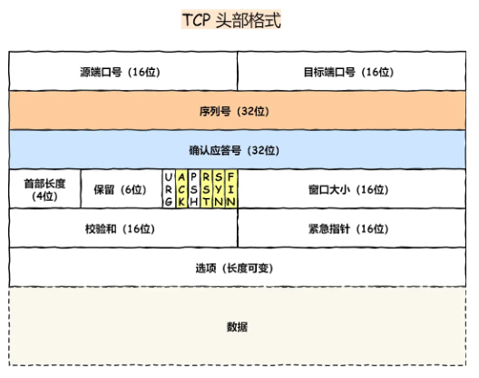
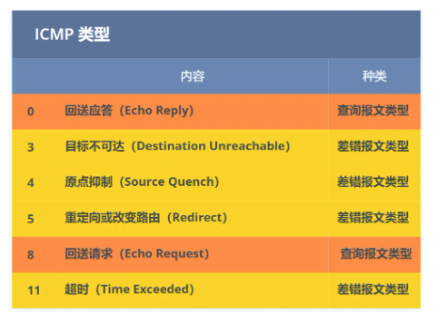

# HTTP

## 基本概念

## HTTP缓存技术

HTTP有两种常见的缓存技术，强制缓存和协商缓存。当强制缓存无法获得缓存的时候才会启动协商缓存。

**强制缓存：**

**协商缓存：**

## HTTPS

HTTP+SSL/TLS

**HTTP存在的问题：**

+ 明文传输。容易被窃听
+ 没有内容校验机制。不知道内容有没有被篡改。
+ 没有身份校验。不会确认通信的另一方的身份合法性。

**HTTPS的改进：**

+ 混合加密。使信息不会再裸奔。
+ 摘要算法+数字签名。为信息生成指纹，如果信息被篡改就会被发现。
+ 数字证书。将公钥放入数字证书，证明自身合法性。

**混合加密：**

信息安全领域的一种加密方法，同时使用了对称加密和非对称加密。

【什么是对称加密】对称加密是通信双方使用同一把密钥对信息进行加密和解密，加密解密速度比较快，但一旦密钥被拦截，信息就能被第三方破解。

【什么是非对称加密】非对称加密使用两把密钥，私钥仅自己持有，公钥可以任意分发。解密速度比较慢，但是很安全。公钥和私钥都可以对数据进行加密，但是目的不同。公钥加密，私钥解密，是为了确保所传输信息的安全性。私钥加密，公钥解密，是为了确认信息的发送者是私钥的持有者。

【什么是混合加密】混合加密一开始采用非对称加密的方式运送对称加密的密钥，防止其被第三方拦截，安全到达对面。然后接下来的通信就使用对称加密的方法进行了。

**摘要算法**

【摘要算法是什么】发送方利用摘要算法为信息计算一个哈希值，连同着信息一起发送给接收方。接收方收到信息和哈希值后，通过信息计算一个哈希值，如果和发送方提供的哈希值一致，就说明信息没有被篡改。

【为什么要用数字签名】这么做相当于利用哈希值保护信息不被篡改，但哈希值没有被保护，一旦信息+哈希值一起被替换，就检查不出来了。所以要用非对称加密算法保护哈希值。这种通过非对称加密的方法**保护哈希值**的手段就叫做数字签名算法。

**数字证书：**

【数字证书是什么】以上的两种方法都需要基于非对称加密算法实现，所以需要确保获取到的公钥是安全的，是来自通信方的，也就是需要一个身份验证的环节。所以服务器会通过一个权威的机构来对自己进行认证，这个权威的机构会为服务器提供一个证书，也就是数字证书。

【数字证书的怎么证明身份的】服务器会将公钥注册到数字证书认证机构（CA），CA用自己的私钥来保护服务器的公钥，也就是进行数字签名形成一个数字证书，并把这个数字证书提供给服务器。服务器会将这个数字证书发送给客户端，客户端通过CA的公钥对数字证书进行解密以确保数字证书的真实性，然后从中获取到公钥。再利用公钥来加密信息发送给服务器，表明自己已经收到了。

这个地方我是有点疑惑的，因为CA也是用数字签名的方法对服务器的公钥进行加密，也就是说客户端也需要获取到CA的公钥才能对CA用私钥加密过的信息进行解密，那这个获取CA公钥的过程不就和获取服务器端公钥的过程变成一类问题了吗（套娃???？)实际上这里有一个小小的区别，就是CA会提前将公钥内置于服务器中，所以就**不会有CA将公钥传给客户端的过程了**。

【数字证书签发&校验流程】

+ CA将服务器端的各种信息进行打包，并且计算哈希值
+ 用私钥加密哈希值，生成数字签名
+ 将数字签名和服务器端的信息进行打包，形成数字证书

+ 通过哈希算法计算信息部分的哈希值
+ 通过内置在浏览器或者操作系统中的公钥对数字签名部分进行解密，获取CA端计算出的哈希值
+ 比对两个哈希值，如果相同就说明可以信赖。

【数字证书链】客户端持有的公钥是有限的，不可能持有全世界所有CA的公钥，只会持有一部分Root CA的公钥。当客户端收到某个网站的证书时，很有可能发现自己没有这个证书对应的CA的公钥，所以需要查看为CA颁布证书的上一级CA的证书，如果还是很不巧，依然不持有它的公钥，那么就一层一层往上找，一直找到Root CA，再通过Root CA层层往下传递信任。

【为什么要搞数字证书链】如果不搞成这样的链式结构，无非就两种选择。一种是RootCA负责签发所有的证书，这种情况下就会出现”单点故障“，也就是一旦RootCA失守，整个体系就崩盘了。还有一种选择是让客户端存储所有CA的公钥，这显然很不现实，而且扩展性也不好。

----------

TLS 在实现上分为**握手协议**和**记录协议**两层。握手协议用于协商加密算法和生成对称密钥。记录协议负责保护应用程序数据并验证其来源和完整性

**TLS握手协议**

+ 客户端向服务器索要并验证服务器的公钥
+ 双方协商生产会话密钥（也就是对称加密的密钥）
+ 双方采用会话密钥进行通信

TLS 的「握手阶段」涉及**四次**通信，使用不同的密钥交换算法，TLS 握手流程也会不一样。常用的密钥交换算法有RSA和ECDHE，以下以RSA算法为例。

+ Client Hello：客户端发送其支持的TLS版本，以及随机数（Client Random），还有它支持的密码套件列表（比如RSA）

+ Server Hello：服务器确认TLS版本，服务器生成的随机数（Server Random），确认密码套件列表，服务器的数字证书

+ 客户端回应：客户端确认过证书的有效性，从整数中获取到服务器的公钥。然后生成一个随机数（pre-master key），加密算法改变通知（表示接下来的通信要用会话密钥加密了），握手结束通知。将以上三个东西通过摘要算法计算哈希值，用公钥加密，发送给服务器端

  【客户端发送完随机数后，双方此时都持有了三个随机数，就可以用协商的加密算法和这三个随机数生成会话密钥了】

+ 服务器算出了会话密钥，发送加密算法改变通知，握手结束通知

基于 RSA 算法的 HTTPS 存在「前向安全」的问题：如果服务端的私钥泄漏了，过去被第三方截获的所有 TLS 通讯密文都会被破解。为了解决这个问题，后面就出现了 ECDHE 密钥协商算法，我们现在大多数网站使用的是 ECDHE 密钥协商算法

**TLS记录协议**

# TCP

## TCP基本认识

1. SYN (Synchronize)：用于建立连接时，表明请求建立连接。
2. ACK (Acknowledgment)：确认号的有效性标志，表明确认号字段包含有效的确认号数据。
3. FIN (Finish)：用于释放连接时，表明请求释放连接。
4. RST (Reset)：用于复位连接时，表明请求重新建立连接。
5. PSH (Push)：表示要求立即传送数据，而不用等待缓冲区装满。
6. URG (Urgent)：紧急指针字段的有效性标志，表明紧急指针字段包含有效数据。

**如何估算一个服务器支持的最大TCP连接数呢？**

+ TCP连接四元组：一个TCP连接由一个四元组唯一标识（源ip，目的ip，源端口，目的端口），理论上说，一个服务器在确定ip的确定端口下监听tcp连接，可变的就只有源ip和源端口，所以TCP连接的数量=客户端ip数*客户端端口数

+ 文件描述符限制：linux系统对系统、进程、用户允许打开的进程数都进行了限制
+ 内存限制：每个TCP连接建立都会占用一定的内存，而操作系统的内存是有限的

## TCP三次握手

基本流程不做赘述。

**为什么不是两次握手：**

+ 告知对方自己有收发能力

  第一次握手，相当于客户端告知服务端，自己有发的能力

  第二次握手，相当于服务端告知客户端自己有收和发的能力

  第三次握手，相当于客户端告知服务端自己有收的能力

  如果只有两次握手，服务端就无法确认客户端是否有收的能力了。

+ 避免历史连接

  如果是两次握手，正常情况下客户端发送一次连接请求，服务器响应请求，连接建立了。但考虑这么一个情况：

  客户端发送了一次连接请求，然后突然宕机了，恢复后重新请求建立连接（注意不是重传，新连接会用不一样的syn，重传不会）。

  服务器端收到旧的syn后连接建立成功了，回复ack，并且开始传输数据。

  客户端收到ack后发现序号小于自己之前发送的syn，发送一个rst。终止连接。

  在这个情况下，服务器端发送的数据全都白白发送了，相当于浪费了资源。

**第一次握手丢失了会怎么样？**

会重传，一直达到重传上限。重传上限在linux系统中由tcp_syn_retires参数控制。

**第二次握手丢失了会怎么样？**

客户端：误以为自己的syn没有传到，触发重传机制。

服务器端：没收到第三次握手，所以重传第二次握手，重传上限在linux系统中由tcp_synack_retires参数控制。

**第三次握手丢失了会怎么样？**

服务器端：误以为第二次握手丢失了，触发重传。

客户端不会重传了，因为ACK报文都是不会重传的，第二次握手中服务器之所以重传是因为那也是个syn，不单单是个ack

**什么是syn攻击**

恶意攻击频繁发起syn请求，但是不进行第三次握手，会导致syn报文一直存在于服务器端的syn队列中，时间长了，队列占满后，再收到syn报文就会丢弃。

常见的解决方法有：调大版syn队列的长度，减少syn-ack重传次数，调大netdev_max_backlog参数

## TCP四次挥手

过程不作赘述，有一点要注意，**主动关闭连接的，才有 TIME_WAIT 状态。**

**第一次挥手丢失了会怎么样？**

主动方（客户端）：重传fin报文，达到重传上限后会等待一段时间（上一次超时时间的两倍），然后直接进入close状态

**第二次挥手丢失了会怎么样？**

主动方（客户端）：重传fin报文，达到重传上限后会等待一段时间（上一次超时时间的两倍），然后直接进入close状态

**第三次挥手丢失了会怎么样？**

被动方（服务端）：重传fin报文，达到重传上限后会等待一段时间（上一次超时时间的两倍），然后直接断开连接。

**第四次挥手丢失了会怎么样？**

被动方（服务端）：重传fin报文，达到重传上限后会等待一段时间（上一次超时时间的两倍），然后直接断开连接。

主动方（客户端）：每次收到fin会重置2MSL的定时器

如果主动方是通过close函数关闭连接的，则fin_wait_2是有时长限制的，如果没在规定时间内收到服务端第三次挥手，就直接断开连接。断开连接后被动方发送fin是不可能收到ack的。但如果主动方是通过shutdown来关闭连接的，它的fin_wait_2就没有时长上限，才会给服务端回复ack。

**为什么time_wait等待时间设置为2MSL？**

MSL是报文最大生存时间，一来一回就是2MSL，这样可以确保旧连接的状态在网络中消失，避免了与后续新连接的状态发生冲突。

2MSL 的时间是从**客户端接收到 FIN 后发送 ACK 开始计时的**。如果服务端还有数据要发，在2MSL内肯定也到达了，如果没到达就认为没数据要发了，就断开连接。

## 重传、拥塞控制

**RTO:**

超时重传时间，一般会略大于2RTT（往返时延）。由于RTT会随着网络状态的波动而改变，所以RTO也是一个动态变化的值。RTO的计算会综合考量当前计算出的RTT和之前计算出的RTT，进行加权求和。

每当遇到一次超时重传的时候，都会将下一次超时时间间隔设为先前值的两倍。两次超时，就说明网络环境差，不宜频繁反复发送。

**快速重传：**

当接收方收到一个乱序的TCP数据段时（即接收到的TCP数据段的序号不连续），接收方会立即发送一个ACK响应，并且在ACK中确认已经收到的连续数据段的最高序号。如果发送方连续收到**3个相同的**重复ACK（即接收方重复发送相同的ACK），发送方就会认为最后一个确认的数据段之后的数据段丢失了。

此时发送方会重传数据。但面临两个问题，到底是重传ACK之后的所有数据段呢？还是重传一个数据段就可以了呢？在传统TCP连接中，发送方会重传所有已发送但未确认的数据段，但是在启用SACK（选择性确认）机制的情况下，接收方可以指定未正确接受的数据的范围，从而减少发送方发送的数据。

例如：发送方发送了100~199，200 ~299，300 ~399，400 ~499四个数据段，200 ~299丢失，另外三个数据段正确接收。在传统TCP的情况下，接收方发送连续三个ACK=200，发送方就会重传200 ~299，300 ~399，400 ~499。在启用了SACK的情况下，接收方发送连续三个ACK=200，但这三个ACK报文头部的“选项”字段中会携带SACK，随着时间的推移，这三个报文的SACK可能为100 ~199（300 报文还没传到），300 ~399（300报文传到了），300 ~499（400报文传到了）。发送方通过查看ACK和SACK，就会发现200 ~300之间的报文丢失了

**滑动窗口：**

窗口大小就是指**无需等待确认应答，而可以继续发送数据的最大值**。实际上是操作系统开辟的一个缓存空间，发送方主机在等到确认应答返回之前，必须在缓冲区中保留已发送的数据。如果按期收到确认应答，此时数据就可以从缓存区清除。

窗口大小由接收方决定。发送方发送的数据大小不能超过接收方的窗口大小，否则接收方就无法正常接收到数据。

## 是否可以使用同一个端口？

**TCP和UDP可以同时绑定一个端口吗？**

可以。这种叫做端口复用技术，允许在同一个端口上**同时运行不同协议**的应用程序。

**多个 TCP 服务进程可以同时绑定同一个端口吗？**

如果两个 TCP 服务进程同时绑定的 IP 地址和端口都相同，那么执行 bind() 时候就会出错，错误是“Address already in use。但如果两个TCP服务的ip不同，只是端口相同，那就可以绑定到一个端口。

**客户端的端口是否可以重复使用？**

TCP 连接是由四元组（源IP地址，源端口，目的IP地址，目的端口）唯一确认的，那么只要四元组中其中一个元素发生了变化，**那么就表示不同的 TCP 连接**。

所以如果客户端已使用端口 64992 与服务端 A 建立了连接，那么客户端要与服务端 B 建立连接，还是可以使用端口 64992 的，因为内核是通过四元祖信息来定位一个 TCP 连接的，并不会因为客户端的端口号相同，而导致连接冲突的问题。

**多个客户端可以bind同一个端口吗？**

客户端是在调用 connect 函数的时候，由内核随机选取一个端口作为连接的端口。如果我们想自己指定连接的端口，就可以用 bind 函数来实现，这样调用 connect 函数就会跳过端口选择的过程了。

如果多个客户端绑定的ip+port都相同，就会出错；如果ip和port里有一个不同，就没事。

总结：能不能绑定同一个端口取决于服务器或者客户端可不可以进行区分。服务器端TCP和UDP共用一个端口，是因为协议不同，可以区分。服务端不同TCP连接共用一个端口，是因为ip不同，可以通过ip+port区分。客户端可以共用端口，是因为目的ip或者目的port不同，或者客户端本身有多个网卡，ip不同。

# IP

## IP地址

早期ip地址是要进行分类的，可以分成以下几类：

+ A类：0【7位网络号】【24位主机号】。10.0.0.0·10.255.255.255是私有ip
+ B类：10【14位网络号】【16位主机号】。172.16.0.0~172.31.255.255是私有ip
+ C类：110【21位网络号】【8位主机号】。192.168.0.0~192.168.255.255是私有ip
+ D类：1110【28位组播地址】
+ E类：1111【28位留后待用】

后来开始使用无分类地址CIDR，不再区分网络的类别，而是直接将地址分成网络号和主机号两部分。

**IPv6**

地址长度是 128 位，是以每 16 位作为一组，每组用冒号 「:」 隔开。

IPv6和IPv4相比，在首部上做出了下列改进：

- **取消了首部校验和字段。** 因为在数据链路层和传输层都会校验，因此 IPv6 直接取消了 IP 的校验。
- **取消了分片/重新组装相关字段。** 分片与重组是耗时的过程，IPv6 不允许在中间路由器进行分片与重组，这种操作只能在源与目标主机，这将大大提高了路由器转发的速度。
- **取消选项字段。** 选项字段不再是标准 IP 首部的一部分了，但它并没有消失，而是可能出现在 IPv6 首部中的「下一个首部」指出的位置上。删除该选项字段使的 IPv6 的首部成为固定长度的 `40` 字节。

## DNS

动态域名解析。

**域名解析过程**：

+ 客户端询问本地域名服务器域名对应的ip
+ 本地域名服务器如果存储了缓存就直接返回给客户端，如果没有，则开始用迭代或者递归的方法查询。（以下以迭代的方式为例）
+ 本地域名服务器从根域名服务器开始，逐级询问服务器，直到获取对应的ip地址，再返回给客户端。

递归方法就是如果服务器没有保存用户所查询的信息，服务器就会负责整个查询过程，最后把解析结果返回给用户。

递归方法对用户来说比较简单，但是会提升服务器的压力。迭代方式对用户来说比较复杂，需要多次查询，但是对服务器来说比较容易

## **ARP**

一种解决地址问题的协议，以目标IP为线索，定位下一个应该接收数据包的网络设备的MAC地址。只适用于IPv4，在IPv6中用ICMPv6来代替ARP了。

ARP协议是通过“ARP”请求和“ARP响应”这两种类型的包来确定MAC地址的。假设主机A和主机B在同一条链路上，主机A只知道主机B的IP，却不知道它的MAC地址。主机A就会向链路上广播主机B的IP地址，其他主机收到该ARP请求包，比对IP地址后发现和自身的IP不匹配，就会丢弃，最终只有主机B会将MAC地址填入ARP响应包中，并回复给主机A。

**为什么有了MAC地址还需要IP地址？MAC地址不是可以唯一定位一个物理设备吗？**

假设主机A和主机B之间被路由器隔开了，主机A哪怕知道主机B的MAC地址，发送的帧也会被路由器拦截。所以必须先用MAC地址把帧发送给路由器，再由路由器根据IP地址进行转发。

换一个角度考虑。IP地址是可以进行网段合并的，路由器根据网络号，可以判断向哪个接口转发数据。但是MAC地址就没有这种特点，假设路由器可以转发MAC帧，就需要学习所有MAC地址和接口的映射关系，从而需要维护一张巨大的转发表。除此之外，在习得这张表之前还需要在大规模的网络上进行广播，会造成超级巨大的流量。

## RARP

通过MAC地址获取IP地址的协议。当一些嵌入式的设备需要连入网络时，需要用到RARP协议。

通常这需要架设一台RARP服务器，在这个服务器上注册设备的 MAC 地址及其 IP 地址。然后再将这个设备接入到网络，接着：

- 该设备会发送一条「我的 MAC 地址是XXXX，请告诉我，我的IP地址应该是什么」的请求信息。
- RARP 服务器接到这个消息后返回「MAC地址为 XXXX 的设备，IP地址为 XXXX」的信息给这个设备。

最后，设备就根据从 RARP 服务器所收到的应答信息设置自己的 IP 地址。

## DHCP

动态主机配置协议。用于实现ip地址的统一管理和分配。

架设DHCP服务器之后，管理员会在DHCP服务器上设置可分配的IP地址、子网掩码、以及默认路由。

+ 当主机想要获取IP地址时，会广播DHCP发现包（DHCP DISCOVER）

+ DHCP接收到包后将可用的IP地址以及相关的网络配置发送给主机（DHCP OFFER）

+ 由于一个网络中可能存在多个DHCP服务器，主机会选择其中一个服务器提供的IP，然后广播它所接受的IP（DHCP REQUEST）
+ 最后由发布该IP的DHCP服务器返回确认信息（DHCP REQUEST）。

DHCP是基于广播实现的，这意味着只能为一个网段内的主机分配IP，但是一个子网中往往有多个网段，如果为每个网段都配置一个DHCP服务器，那么成本就太高了。为此，就出现了中继代理。

在使用中继代理的情况下，只需要为网段配置一个中继代理即可，用户和中继代理在本网段之间仍然是通过广播的方式进行通信，但是中继代理和DHCP服务器之间会以单播的方式进行通信。

## NAT

网络地址转换。将私有地址转换为公有地址的方法，多个主机在内部拥有不同的IP，但是对外用同样的IP，这个转换过程由NAT路由器实现。一般转换都是需要结合具体的端口实现的。

不同的私有地址在NAT路由器中会被映射成不同的端口，NAT路由器接收到响应时，再将端口映射给不同的私有地址即可，这种技术就叫做NAPT。

NAT在一定程度上可以缓解IPv4地址消耗的速度，但是仍然存在一些问题：

+ 外部无法主动和NAT内部的服务器建立连接
+ NAT转换表的生成和转换都会产生额外开销
+ 如果NAT路由器重启了，转换信息就丢失了，所有的连接都必须被重制。

为了解决上述的问题就需要使用到NAT穿透技术，使用这种技术后，主机可以发现自己位于NAT设备之后，会主动获得NAT设备的公有IP为自己建立端口映射条目

## ICMP

互联网控制信息协议。包装在IP数据包中发送，但仍然属于网络层的协议。

ICMP 大致可以分为两大类：

- 一类是用于诊断的查询消息，也就是「**查询报文类型**」
- 另一类是通知出错原因的错误消息，也就是「**差错报文类型**」

查询报文：

+ 回送请求：向对端主机发送回送请求，判断所发送的数据包是否已经成功到达对端
+ 回送应答：收到回送请求报文的主机回复的报文

差错报文：

+ 目标不可达：路由器无法把IP数据包发送给目标地址
+ 源点抑制：路由器转发速度跟不上接收数据包的速度，请求主机发慢一点
+ 重定向：告知主机一个更好的路由信息
+ 超时：告知主机发送超时，该包已经被丢弃

在IPv4中，即使没有ICMP，还是可以正常通信的。但在IPv6中，ICMP的作用被扩大了，如果没有ICMPv6，IPv6就无法进行正常通信了。因为在IPv6中，通过IP地址获取MAC地址的协议从ARP转为ICMPv6中的邻居探索消息。

