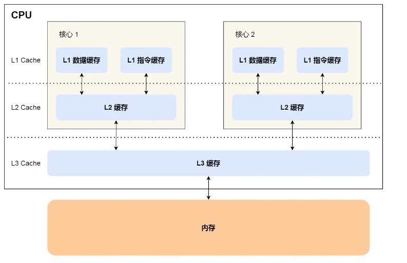
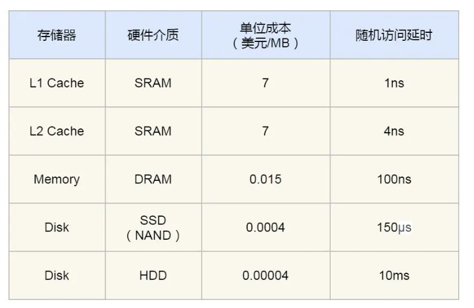
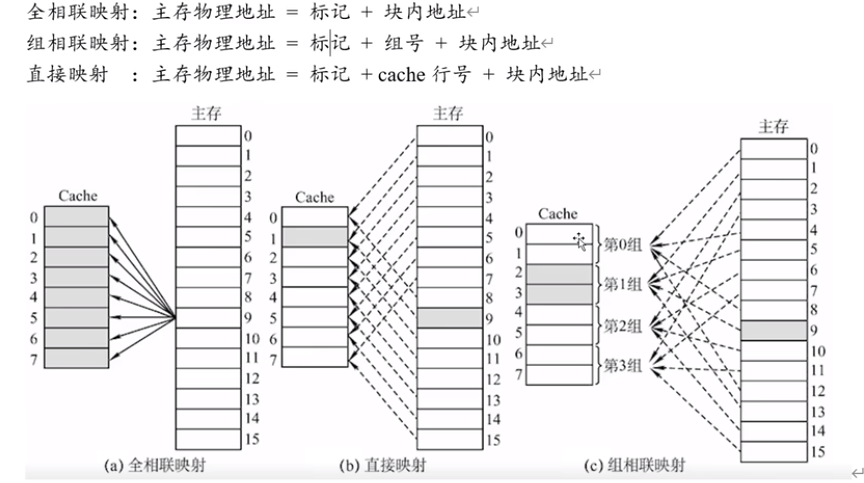
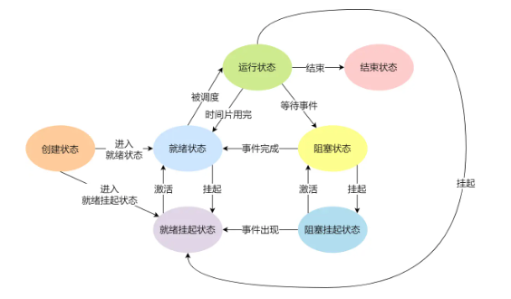
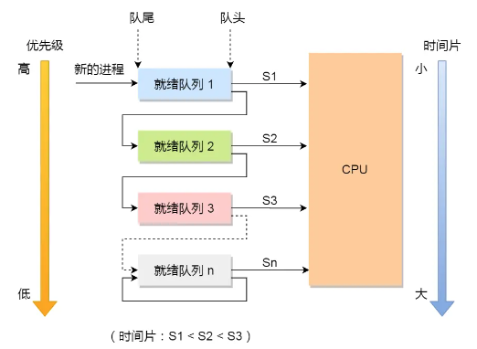

# 硬件结构

## CPU是如何进行工作的

## 从磁盘到寄存器

离CPU越近，速度越快，价格越贵：

磁盘<内存<L3 Cache<L2 Cache<L1 Cache<寄存器

**寄存器：**

速度最快，一般要求在半个时钟周期内完成读写，也就是0.x纳秒的级别

**Cache：**

一般用SRAM（Static Random-Access Memory, 静态随机存储器）实现，掉电后数据会丢失。

L1 Cache：每个CPU核心都有，通常分成指令缓存和数据缓存，2~4个时钟周期内完成读写，大小几十KB~几百KB

L2 Cache：每个CPU核心都有，10~20个时钟周期内完成读写，大小在几百 KB 到几 MB

L3 Cache：多个CPU共用，20~60个时钟周期内完成读写，大小几MB~几十MB

**内存：**

一般用DRAM（Dynamic Random-Access Memory, 静态随机存储器）实现。数据会被存储在电容里，电容会不断漏电，所以需要「定时刷新」电容。速度大概在200~300时钟周期。

**硬盘：**

断电后数据不会丢失，固态硬盘叫SSD，机械硬盘叫HDD

内存比SSD快10~100倍，内存比HDD快10w倍

**Cache存取原理**

提升数据缓存命中率：按照内存中的存储顺序读写元素

提升指令缓存命中率：不要在分支之内进行频繁跳跃

提升多核CPU的缓存命中率：将线程绑定在某个CPU核心上运行

## 缓存内存的数据一致性

**Cache和内存的一致性**

**写直达（write through）**

+ 判断数据在不在缓存
  + 不在，直接写回内存
+ 在，先写回缓存，再写回内存

每次写都要写回内存，速度变慢了

**写回（write back）**

一种延迟写策略，写完缓存不立刻写回内存，只在不得不写回内存的时候才写

+ 判断数据在不在缓存
  + 在，直接写缓存
+ 不在，查看block里存放的别的内存地址的数据是不是脏的
  + 脏的，将数据写回内存
+ 不是脏的，从内存中读取自己要写的数据到cache
+ 写cache并且标记为脏的

**不同核心内Cache的一致性**

两个原则。一个是CPU核心对共享的值进行修改之后，需要让别的CPU知道自己修改了（**写传播**）。第二个原则是不同 CPU 核心里对数据的操作顺序，必须在其他核心看起来顺序是一样的（**事务的串行化**）

**MESI协议**

**总线嗅探**：当某个 CPU 核心更新了 Cache 中的数据，要把该事件广播通知到其他核心。（需要CPU一直监听别的CPU的消息，CPU每次更新都要广播，无法实现事务串行化）

MESI协议通过四个状态：已修改（Modified），独占（Exclusive），共享（Shared），已失效（Invalidated）来为Cache标记状态，设计了一个有限状态自动机来满足写传播和事务串行化。

# 内存管理

# 进程管理

## 进程

**进程状态：**

- 创建状态（*new*）：进程正在被创建时的状态；
- 运行状态（*Running*）：该时刻进程占用 CPU；
- 就绪状态（*Ready*）：可运行，由于其他进程处于运行状态而暂时停止运行；
- 阻塞状态（*Blocked*）：该进程正在等待某一事件发生（如等待输入/输出操作的完成）而暂时停止运行，这时，即使给它CPU控制权，它也无法运行；

- 结束状态（*Exit*）：进程正在从系统中消失时的状态；

- 阻塞挂起状态：进程在外存（硬盘）并等待某个事件的出现；
- 就绪挂起状态：进程在外存（硬盘），但只要进入内存，即刻立刻运行；

【阻塞状态和挂起状态的区别是，阻塞状态是在等待某个事件完成，进程还是在内存中的。挂起状态时，进程被暂时换出到硬盘里了。】

**进程上下文切换：**

发生时机：

+ 进程用完了当前时间片
+ 被更高优先级的进程抢占
+ 硬件中断
+ 系统资源不足时
+ 进程通过sleep（）把自己挂起

【看状态转换图就可以了，无非就是时间片用完进入就绪态，或者挂起，或者阻塞】

**进程通信方式**

+ 管道：一种半双工的通信方式，通信数据都遵循**先进先出**原则，生命周期随进程
+ 消息队列：保存在内核中的消息链表，支持进程根据类型读取（不同类型串在不同链表中），但仍然遵循先进先出，不支持随机读取，生命周期随操作系统
+ 共享内存：不同进程各自拿出一块虚拟地址空间，映射到相同的物理内存中。可以随机访问，但需要额外的同步机制。
+ 信号量：其实不是为了让进程之间交换数据，而是为了实现进程同步和互斥，也就是用于管理对共享资源的访问
+ 信号：用于进程间通信和处理异步事件的机制
+ Socket：不同主机上的进程，同一主机上的不同进程都可以用socket通信。本地socket通信时只需要绑定一个本地文件即可

## 线程

把一个大任务拆分成若干个小任务执行，但是这些小任务之间又需要共享一些数据。如果为每个小任务都创建一个进程，那需要解决共享数据的问题，比较复杂，而且进程创建和撤销，以及切换的时候代价太大。所以需要引入线程的概念，它们既可以分别执行各自的小任务，又可以共享存储空间。

【也就是控制上是独立的，数据上是共享的】

用户级线程和内核级线程的区别其实在于，用户级线程管理线程的指令，以及所管理的数据结构都存储在用户空间，而内核级线程则存储在内核空间。

**用户线程：**通过用户级线程库实现。线程切换的代价比较小，无需在用户态和核心态之间进行转换。【无需切换到核心态执行指令，以及存取核心空间的数据】。

**内核线程：**操作系统真正调度的单位

## 进程调度

+ 先来先服务（FCFS）：对短作业不利
+ 最短作业优先（SJF）：对长作业不利，可能会导致饥饿
+ 高响应比优先（HRRN）：优先权 = （等待时间+要求服务时间）/要求服务时间。等待时间一样，短作业优先。要求服务时间一样，等待时间长的优先。【理想型算法，进程要求服务的时间是未知的】
+ 时间片轮转：每个作业分配一个时间片【时间片长度不好设置】
+ 最高优先级调度（HPF）：分成静态优先级（创建时分配优先级）和动态优先级（根据进程变化动态调整）。还分成抢占式和非抢占式。
+ 多级反馈队列：

## 同步互斥

同步：多个线程之间按照一定的顺序协调执行

互斥：用于保护共享资源不被多个线程同时访问或修改

## 锁

**死锁：**多个线程/进程在获取共享资源时陷入循环等待

-----------

**<悲观锁>**

**自旋锁**：当获取不到锁的时候就会一直while循环，不做任何事情。除非他主动放弃CPU，或者其他线程可以抢占CPU，否则将一直自旋下去。（因为线程A得不到CPU，不会执行后续代码释放锁，线程B一直请求不到锁，就一直自选不放弃CPU，陷入了死锁状态）。注意：自旋锁是基于CAS+while的，CAS本身是乐观锁

**互斥锁**：获取不到锁的时候，不用自旋，操作系统会被线程进行休眠，等锁释放了再唤醒该线程，不过这个过程需要切换两次上下文【休眠线程的时候一次，唤醒线程让它成为就绪态了以后还会有一次】，每次切换大概要几十纳秒到几微秒，如果可以确定获取锁的线程执行时间很短，可以直接使用自旋锁，减少上下文切换带来的成本。

**读写锁：**包括读锁和写锁。根据实现不同可以分为读优先锁，写优先锁，公平读写锁。**读优先锁**指的是，当读线程A持有锁时，写线程B获取锁会被阻塞，但后续来的读线程C可以获取读锁。**写优先锁是**，当读线程A持有锁时，写线程B获取锁会被阻塞，但后续来的读线程C不能获取读锁，要等写线程写完之后才能获取读锁。**公平读写锁是**，不管读线程还是写线程，都按先进先出的原则获取锁

****

**<乐观锁>**

乐观锁的工作方式是：先修改完共享资源，再验证这段时间内有没有发生冲突，如果没有其他线程在修改资源，那么操作完成，如果发现有其他线程已经修改过这个资源，就放弃本次操作。

由于全程并没有加锁，所以它也叫无锁编程。乐观锁虽然去除了加锁解锁的操作，但是一旦发生冲突，重试的成本非常高，所以**只有在冲突概率非常低，且加锁成本非常高的场景时，才考虑使用乐观锁。**

## 一个进程可以创建多少个线程

+ 从线程占用的空间考虑：每创建一个线程就要分配一定的空间，所以线程的数量取决于进程的空间大小
+ 从linux系统的系统参数考虑：linux有系统级别的参数来控制整个系统的最大线程数。比如“系统支持的最大线程数”“系统全局pid号的限制”“一个进程允许拥有的虚拟内存的大小”

## 线程崩溃了，进程一定会崩溃吗

在进程中，**各个线程的地址空间是共享的**，既然是共享，那么某个线程对地址的非法访问就会导致内存的不确定性

操作系统为了保证系统安全，所以针对非法内存访问会发送一个 SIGSEGV 信号。如果进程没有注册信号处理函数，操作系统会根据信号类型执行对应的信号处理函数（一般会让相关的进程崩溃）。如果进程注册了信号处理函数，则会根据进程自己注册的处理函数逻辑进行处理。

虚拟机内部定义了信号处理函数，而在信号处理函数中对这两者做了额外的处理让 JVM 不崩溃

# 文件系统

