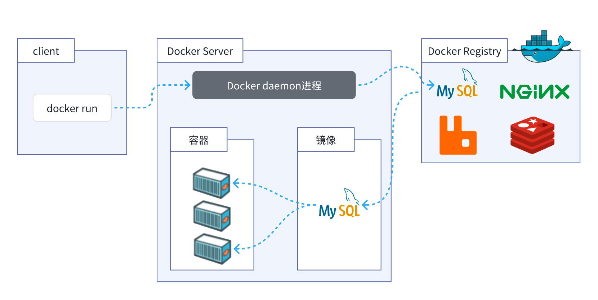

# Docker基础

## 配置MySQL



利用Docker快速的安装了MySQL，非常的方便，不过我们执行的命令到底是什么意思呢？

```
docker run -d \
  --name mysql \
  -p 3306:3306 \
  -e TZ=Asia/Shanghai \
  -e MYSQL_ROOT_PASSWORD=123 \
  mysql
```

- docker run -d ：创建并运行一个容器，-d则是让容器以后台进程运行
- --name mysql  : 给容器起个名字叫mysql，你可以叫别的
- -p 3306:3306 : 设置端口映射。（宿主机端口：容器内端口）
  - 容器是隔离环境，外界不可访问。但是可以将宿主机端口映射容器内到端口，当访问宿主机指定端口时，就是在访问容器内的端口了。
  - 容器内端口往往是由容器内的进程决定，例如MySQL进程默认端口是3306，因此容器内端口一定是3306；而宿主机端口则可以任意指定，一般与容器内保持一致。
  - 格式： -p 宿主机端口:容器内端口，示例中就是将宿主机的3306映射到容器内的3306端口
- -e TZ=Asia/Shanghai : 配置容器内进程的环境变量
  - 格式：-e KEY=VALUE，KEY和VALUE都由容器内进程决定
  - 案例中，TZ=Asia/Shanghai是设置时区；MYSQL_ROOT_PASSWORD=123是设置MySQL默认密码
- mysql : 设置镜像名称，Docker会根据这个名字搜索并下载镜像
  - 格式：REPOSITORY:TAG，例如mysql:8.0，其中REPOSITORY可以理解为镜像名，TAG是版本号
  - 在未指定TAG的情况下，默认是最新版本，也就是mysql:latest


## 常见命令

