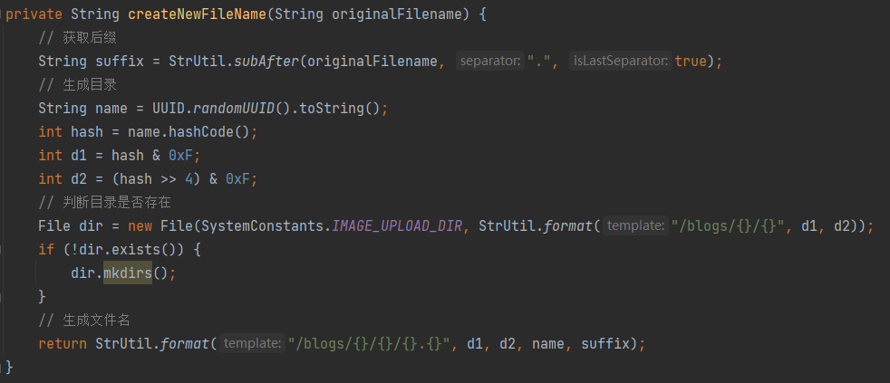

# 登录、校验、退出登录

## 个人总结

登录过程相当于为用户下发凭证的过程，用户登录成功后，每次提供凭证让服务器去获取用户的相关信息。

cookie，session，令牌都是实现用户登录鉴权的有效方法。它们最主要的区别在于：cookie将信息存放在用户端，用户发起请求时携带cookie。session将信息存放在服务器端，用户提供session id。令牌将信息包含在token中。

基于cookie的方式：最重要的缺点是不安全，因为存在用户端。

基于session的方式：最重要的缺点是对分布式系统来说不友好，不利于扩展。且需要在服务器端存储session信息，浪费存储空间。

基于令牌的方式：基于JWT令牌的方式最大的缺点是一旦生成传输给客户端，服务器端就无法撤销或者废除令牌。

**为什么不用JWT:** JWT存在一个比较致命的问题，就是一旦令牌下发，在有效期内无法撤销。所以一般会把它的有效期设置得比较短，或者引入一些复杂的机制来处理这个问题。

## 可能会被问到的点

**JWT**

对head和payload分别用base64加密，然后使用头部声明的加密算法生成signature，把三个部分拼接在一起。

**JWT组成：**

+ Header：头部。包含使用的算法和令牌类型，算法默认是HS256

+ Payload：荷载。包括到期时间，发布时间，用户id等字段，还可以自定义字段

+ Signature：签名。对Header和Payload的数据签名，确保数据不被篡改

**存在的问题**：

+ 服务器不会保存会话状态，在jwt到期时间之前无法强制下线
+ jwt是不加密的，虽然不能篡改，但是payload的内容是可以被解析的
+ 数据需要基于base64进行编码，占用的长度会变长

**UUID和雪花算法**

+ UUID：基于时间戳和计算机MAC地址生成，有128位（32位的16进制数，8-4-4-4-12），生成的ID是**无序的**。
+ 雪花算法：（需要依赖于时间戳，如果发生时钟回拨会发生错误）
  + 符号位：1位，固定为0
  + 时间戳：41位，当前时间减去固定的起始时间戳
  + 工作机器id：10位
  + 序列号：12位，表示一毫秒之内可以生成的序列号

**拦截器获取到Redis中的用户信息后如何传给controller？**

+ 将用户信息存储到ThreadLocal中
+ 通过setAttribute存储到request当中

**为什么要用ThreadLocal不用request**

**如果不用拦截器链的话怎么进行token校验**

通过AOP来实现，每次收到请求之前通过Aspect来校验。

不过基于AOP的实现方式需要写切入点，基于拦截器的方式可以在配置中写排除的接口。具体用哪种方式取决于具体业务要求。

## 业务流程

**生成短信验证码**

+ 获取用户提交的手机号
+ 校验手机号合法性
+ 生成验证码
+ 将手机号作key，校验码作为value，存入Redis。并将验证码发送给用户

**短信验证码登录与注册**

+ 获取用户提交的手机号和验证码
+ 校验手机号合法性
+ 从Redis中查询验证码和手机号是否匹配
+ 如果匹配就根据用户的手机号去数据库中查找对应的用户
  + 如果用户不存在，就创建一个用户，并且为其设置一些初始化信息，将用户保存到数据库中。
+ 基于**数据传输对象模式**隐藏用户的隐私信息，将User对象转换成UserDTO对象后再转换成HashMap类型
+ 通过**UUID算法**生成随机token作为key，userMap作为value，存储到Redis上，设置token有效期。
+ 将token返回给用户

**校验登录状态**

+ 获取请求头中的token
  + 如果为空，说明用户还没有登录，直接放行
+ 如果不为空，从Redis中获取对应的用户信息。
+ 将获取到的用户信息保存在ThreadLocal中
+ 刷新Redis中token的有效期
+ 放行

----------

+ 获取ThreadLocal中的用户信息
  + 如果用户信息为空，说明没有登录，拦截
  + 如果用户信息不为空，则放行。

**退出登录**

+ 获取请求头中的token
+ 将token从Redis中删除

# 数据缓存+解决缓存穿透

## 个人总结

需要考虑数据一致性问题；以及缓存失效后，大量请求落到数据库上之后，对数据库造成冲击的问题。

【数据不一致】缓存虽然可以提高查询速度，但是和数据库之间可能会存在数据不一致的情况。如果不给缓存设置过期时间，缓存会长时间存在，用户的请求会一直落在缓存上，就无法获取数据库中更新后的最新数据了。

为了解决这一点，可以在数据库每次进行数据修改的时候都主动删除相应的缓存，等到用户再次发起请求的时候，再写入缓存。同时为缓存中的数据设置过期时间作为兜底方案。

【缓存穿透】缓存穿透指的是用户请求的对象在缓存和数据库中都不存在的时候，请求会不停地落在数据库上，数据库承受太大压力从而崩掉。解决方法包括：接口层**增强对用户的鉴权校验**，如果用户身份不合法，直接对请求进行拦截。还可以**缓存空对象**，但是如何设置空对象的过期时间也是个问题。还可以使用**布隆过滤器**，

【缓存雪崩】大量key集中过期。给不同的key设置随机的失效时间。

【缓存击穿】也就是热点key问题，缓存中的某个热点数据突然失效，而重建的时间又很久，导致对这个热点数据的请求都落在了数据库上。可以**不设置过期时间**（针对一些可以预料到的热点key），或者在访问数据的时候对数据过期时间进行**续期**。或者**通过锁**解决，允许让一个线程重建缓存，其他线程不停重试等待，或者返回旧数据（具体怎么做还是取决于业务场景，如果对数据一致性要求高就等待，要求不高就返回旧数据）

## 可能会被问到的点

**布隆过滤器**

用于判断一个元素是否存在于一个集合中。由一个很长的二进制向量以及一系列随机映射函数组成，可以设置黑名单或者白名单。

将存在的数据通过哈希函数映射到向量中，当有请求进来的时候，也通过哈希函数对其进行映射，如果映射到的位置存在元素，说明这个请求的对象存在

布隆过滤器存在一些问题

+ 可能误判，不同的对象有可能映射到一个位置，也就是哈希碰撞。当布隆过滤器的存储快满的时候，哈希碰撞的概率也会提高，误判率相应的也会提高。要解决哈希碰撞问题可以使用多个哈希函数，校对每次计算的结果，但是会提高拦截成本。
+ 不可删除，从数据库中删除一个对象之后不能删除它在布隆过滤器中对应的位置，因为有可能别的对象也映射到了这个位置。

**重建缓存怎么实现的**

为了避免过多重建缓存的请求同时落到数据库上给数据库造成太大压力，采用了逻辑过期+setnx简易分布式锁的方式重建缓存。

主要的实现流程就是每次从redis中取对象的时候获取一下逻辑过期时间，并且和当前时间进行比较，如果过期了就尝试获取互斥锁重建缓存，获取锁失败的话就返回旧值。【项目中采用的方案】

还有一种解决方案就是仍然沿用redis本身的expire time，不用逻辑过期时间，如果没能从redis中获取到对象就尝试获取互斥锁重建缓存，获取失败的话就thread.sleep一段时间，再次尝试查询redis。

## 业务流程

**基于缓存空对象解决缓存穿透：**

+ 根据店铺id，从redis中查询店铺
  + 如果店铺存在，则返回店铺信息
+ 如果店铺不存在，则从数据库中获取店铺信息。
  + 如果数据库中店铺也不存在，则创建一个空对象，写入缓存中
+ 如果数据库中店铺存在，就店铺信息返回给用户，并将店铺信息写入缓存中，设置过期时间。

**基于逻辑过期解决缓存击穿：**

+ 存入缓存时不设置expire time，而是增加一个逻辑过期时间字段
+ 请求对象时先从缓存中取出对象的逻辑过期时间和当前时间进行比较
  + 如果没过期，直接返回对象
+ 如果过期了，尝试获取互斥锁
  + 如果获取互斥锁失败，直接返回旧值
+ 如果获取互斥锁成功，则开启一个独立线程
+ 查询数据库结果，写入缓存
+ 释放锁

# 解决超卖&一人一单

## 个人总结

超卖的本质是，多线程的情况下对共享资源进行读写，查询和修改的操作没有保证原子性。

要解决这个问题有两个方案：

+ 使用并发控制机制，确保查询和库存扣减的原子性（单体架构下用同步锁，分布式架构下用分布式锁）
  + 会影响性能
+ 将库存数据预热到Redis缓存里，只针对Redis进行库存扣减
+ 把库存数据进行拆分，将其放入不同库，再用锁来保证原子性

在我的项目中，扣减库存采用了乐观锁的方式来解决超卖问题，但在高并发的场景下，这种实现方式的性能不会很好。因为虽然从业务层面看使用的是乐观锁而不是悲观锁，但是在数据库层面，调用update语句会加锁。所以实际上还是串行扣减的。

所以比较好的解决方式就是把数据提前预热到Redis缓存里，通过Lua脚本来实现库存的扣减。

在我的项目中，解决一人一单问题是通过分布式锁实现的，锁的key是业务前缀+用户id。不过实现的时候还是会有点问题，因为锁是在finally中释放的，所以会出现事务没提交锁就释放的情况。

所以比较好的解决方式就是用AOP来实现上锁+释放锁的操作。

## 可能会被问到的点

**Redisson**

实现可重入：

+ 获取锁时判断当前锁是否为自己持有，并且要判断自己是本线程中第几个获得锁的
+ 释放锁时要判断当前锁是否为自己持有，并且要判断可重入次数是否为0

实现可重试：【总的来说就是第一次获取失败后，就会在持有锁的线程释放后再进行重试，而不是持续重试】

+ 当线程获取锁失败后，会使用最大等待时间减去获取锁所消耗的时间，判断剩余时间是否大于零。如果剩余时间小于零，就直接返回错误信息
+ 如果剩余时间大于0，说明还有剩余时间，就通过subscribe订阅获取锁的线程释放的通知
+ 如果在等待期间最大等待时间的剩余时间耗尽了，就会调用unsubscribe方法取消订阅，并且返回获取锁失败的结果
+ 如果在剩余时间之内等到了通知，就更新剩余时间。如果剩余时间小于等于零，返回获取失败的信息
+ 如果剩余时间大于零，重新尝试获取锁

解决超时释放：【总的来说就是通过设置定时任务不断刷新有效期】

+ 默认锁的超时释放时间leaseTime为30秒，也可以根据自己的需要进行设置

+ 当线程获取锁之后，Redisson会启动一个Timeout定时任务来监控锁的有效期
+ 任务设置的delay时间是internalLockleaseTime/3（如果没有手动设置，那就是看门狗时间/3，也就是10秒），delay时间到时调用更新有效期的方法
+ 更新完有效期后再次调用定时任务，以此来重置锁的有效期
+ 在锁释放的时候取消定时任务

解决主从一致性：【使用Redis集群或者哨兵模式，而不是Redis主从结构】

+ Redis集群中有多个主节点，要求每次获取锁的时候，只有从每个结点都获取锁成功了才视为获取结点成功

## 业务流程

+ 从ThreadLocal中获取用户id，并创建RLock锁对象
+ 尝试获取锁
  + 获取失败，说明已经有一个线程在下单了，直接返回失败
+ 获取锁成功则查询兑换订单中是否存在对应的用户id
  + 如果发现了用户id对应的订单，则返回错误信息
+ 如果没有发现订单，则扣减库存（逻辑过期+互斥锁）
  + 如果扣减失败则返回错误信息
+ 扣减成功则创建订单
+ 在finally中释放锁

# 静态数据存取

## 个人总结

静态数据可以选择存储到本地磁盘中或者云OSS（Object Storage Service）中，但是存储在本地磁盘的时候存在容量限制，文件数量过多的时候容易导致存储空间不足。除此之外，如果磁盘出现故障，就容易导致数据的丢失和泄漏（单点故障）。如果采用分布式的存储结构，就需要考虑自己维护分布式存储系统中的数据一致性问题。

云存储服务提供了高度的可扩展的存储空间，存取比较灵活，安全性也有保障，对于静态数据来说是一个存储的优秀解决方案。

## 可能会被问到的点

**使用云服务要考虑哪些问题**

+ 安全性：在使用网络传输数据过程中是否会发生内容泄漏或者篡改
+ 高可用：能不能满足业务的并发要求，有没有流量限制

**文件名怎么设置**

1. 获取原始文件后缀
2. 随机生成UUID作为文件名
3. 获取文件名的hash值进行扰动运算，获取目录名
4. 生成最终的存储目录

**客户端直传了解过吗**

通过业务服务器传输的话，一份数据需要在互联网中传两次，会造成网络资源的浪费，也会增加服务器的资源开销，所以可以考虑客户端直传，无需经过服务器中转。

客户端直传就是客户端请求服务器获取上传所需的相关参数，服务器将参数返回给客户端后，客户端直接向OSS服务发起上传文件请求。

阿里云为客户端直传提供了三种授权模式：

+ **服务端生成STS临时访问凭证**。

  客户端被视为RAM角色，不具有确定的登录密码或访问密钥，只能获取临时的安全令牌（STS）。不过频繁的调用会引起限流，服务端可以考虑用缓存存储，然后定时刷新。

+ **服务端生成PostObject所需的签名和Post Policy**

  

+ **服务端生成PutObject所需的签名URL**

## 业务流程

**上传功能实现：**

+ 基于UUID生成文件存储路径
+ 调用工具类的方法，传入文件和新的文件名
+ 获取工具类返回的url返回给前端用于回显

**工具类实现：**

+ 根据云OSS的要求提供上传所需要的信息，一般包括域名，accessKey，secretKey，还有bucket的名字
+ 上传文件后获取返回的response
+ 从response的body中获取到存储的url